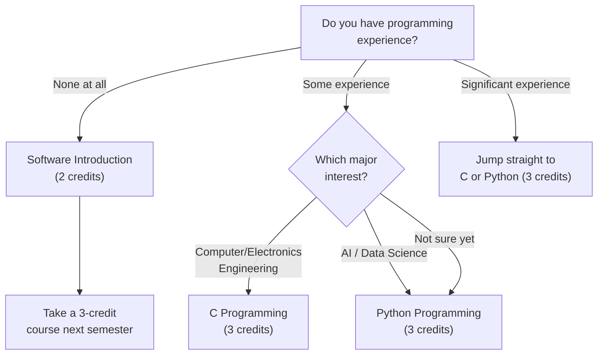

# Required Courses

> Every freshman at Handong Global University must complete a fixed set of required courses before anything else. Regardless of your intended major, your nationality, or whether you lean toward STEM or humanities, these courses form the non-negotiable foundation of your degree. Build your timetable around these first, then fill in electives and major exploration courses around them.

---

## ⛪ Chapel 1 (0 credits, every semester)

Chapel carries zero credits but is **mandatory every semester**. You must complete Chapel 1 through Chapel 6 over six semesters, and failure to do so will prevent you from graduating.

Here is the most common freshman mistake with Chapel: many students assume they can simply show up without registering. **You must register for Chapel in the course registration system.** Every year, students attend Chapel faithfully for an entire semester only to discover at the end that they never registered — and their attendance does not count. This mistake is extremely difficult to reverse.

Chapel attendance uses a **QR code tagging system**. You must arrive on time and scan the QR code. If you miss the scan, retroactive corrections are nearly impossible. Do not be late.

> **Spring 2026:** Chapel 1 (GEK10001), Section 01 — Wed periods 4, 5, 6 (Hyoam Main Building) / Language: Korean (0% English)

---

## 🤝 Community Leadership Training 1 (0.5 credits, every semester)

Like Chapel, this course is required every semester. It focuses on leadership and teamwork within your residential community. **The same registration mistake happens here** — students participate in weekly team meetings all semester without actually registering in the system. Register it.

> **Spring 2026:** Community Leadership Training 1 (GEK10008), Section 01 — Time TBA (announced later)

---

## 💎 Handong Character Education (1 credit, one-time requirement)

This is a core course in Handong's character education philosophy. Multiple sections are available. **Section 01 is taught 100% in English**, making it the ideal choice for international students.

> **Spring 2026 Sections:**

| Section | Professor | Time | English % | Note |
|---------|-----------|------|-----------|------|
| **01** | **Shushan Marie Richardson** | **Mon 5** | **100%** | **Recommended for international students** |
| 02 | 이상산 | Wed 2 | 0% | Korean |
| 03 | 최희열 | Wed 2 | 0% | Korean |
| 04 | 손화철 | Wed 2 | 0% | Korean |
| 05 | 최혜봉 | Wed 2 | 0% | Korean |
| 06 | 윤상헌 | Wed 2 | 0% | Korean |

Sections 02 through 06 all meet on Wednesday period 2, so they differ only by professor. If you are comfortable in Korean, ask your 섬김이 (student mentor) about each professor's teaching style before choosing.

---

## ✝️ Christian Faith Foundation (CF1) — 2 credits

You must complete one course from this category: Understanding the Bible, Bible and Life, or Bible and Spiritual Growth. These are treated as equivalent courses, so you only need to take one.

### 📖 Understanding the Bible (GEK20058) — 15 Sections

This is the most widely offered course, with 15 sections available, making it the easiest to fit into any timetable.

| Section | Professor | Time | English % | Note |
|---------|-----------|------|-----------|------|
| 01 | 김완진 | Mon 2, Thu 2 | 0% | |
| 02 | 김완진 | Mon 3, Thu 3 | 0% | |
| 03 | 김완진 | Mon 4, Thu 4 | 0% | |
| 04 | 이재현 | Tue 2, Fri 2 | 0% | |
| 05 | 이재현 | Tue 3, Fri 3 | 0% | |
| 06 | 이재현 | Tue 5, Fri 5 | 0% | |
| **07** | **Joshua Kim** | **Tue 1, Fri 1** | **100%** | **English section** |
| 08 | Joshua Kim | Tue 2, Fri 2 | 0% | |
| 09 | Joshua Kim | Tue 3, Fri 3 | 0% | |
| 10 | 최성호 | Tue 2, Fri 2 | 0% | |
| **11** | **최성호** | **Tue 3, Fri 3** | **100%** | **English section** |
| **12** | **최성호** | **Tue 5, Fri 5** | **100%** | **English section** |
| 13 | 한은선 | Mon 1, Thu 1 | 0% | |
| 14 | 한은선 | Mon 2, Thu 2 | 0% | |
| 15 | 한은선 | Mon 3, Thu 3 | 0% | |

**For international students**: Choose Section 07 (Joshua Kim, 100% English), Section 11 (최성호, 100% English), or Section 12 (최성호, 100% English). Be aware that English sections are popular and may fill up quickly during pre-registration — always have a backup plan.

### 📖 Understanding Christianity (GEK20059)

| Section | Professor | Time | English % | Note |
|---------|-----------|------|-----------|------|
| **01** | **Gregory T. Brown** | **Mon 2, Thu 2** | **100%** | **English** |
| **02** | **Gregory T. Brown** | **Mon 3, Thu 3** | **100%** | **English** |

Both sections are taught entirely in English. This is an excellent alternative if the English sections of Understanding the Bible are full.

---

## 🌐 Worldview — 2 credits

You must take one course from this category: Creation and Evolution, Christians and Mission, or Christian Worldview. Each has both Korean and English sections available.

| Course | Section | Professor | Time | English % |
|--------|---------|-----------|------|-----------|
| Creation and Evolution (GEK10011) | 01 | 김광 et al. | Wed 2, 3 | 0% |
| **Creation and Evolution (GEK10011)** | **02** | **Holzapfel Wilhelm et al.** | **Wed 2, 3** | **100%** |
| Christians and Mission (GEK20069) | 01 | 조혜신 et al. | Mon 6, 7 | 0% |
| **Christians and Mission (GEK20069)** | **02** | **진기영** | **Wed 2, 3** | **100%** |
| Christian Worldview (GEK20011) | 01 | 최용준 | Mon 3, Thu 3 | 0% |
| **Christian Worldview (GEK20011)** | **02** | **최용준** | **Tue 2, Fri 2** | **100%** |

**Watch for time conflicts:** Several courses cluster in the Wed 2-3 time slot. If you are taking Character Education sections 02-06 (Wed 2), you cannot also take a Worldview course at Wed 2-3. Plan accordingly.

---

## 🫶 Social Service (1 credit x 2 courses total)

You must complete two Social Service courses (out of Social Service 1-4) before graduation. Taking one per semester is recommended.

> **Spring 2026:** Social Service 1 (GEK10046) Section 01, Social Service 2 (GEK20046) Section 01 — No fixed class time (practice-based)

---

## 💻 ICT Requirement (7 credits for ALL students)

Every Handong student, regardless of major, must complete **7 credits of ICT Convergence courses**: 5 credits of Programming + 2 credits of Application. This is not optional, and it applies equally to humanities and social science students.

### Recommended English-Taught ICT Courses for International Students

| Course | Code | Credits | Section | Professor | Time | English % |
|--------|------|---------|---------|-----------|------|-----------|
| **Python Programming** | GCS10004 | 3 | **05** | 박지현 | Mon 5, Thu 5 | **100%** |
| **Frontend Introduction** | GCS10081 | 3 | **04** | 박지현 | Tue 6, Fri 6 | **100%** |

**A useful note:** The OIA (Office of International Admissions) sometimes reserves seats in programming courses specifically for international freshmen. If you are an international student, ask OIA about this — it could save you a registration battle.

### Choosing Your Path: C, Python, or Software Introduction?

If you have no coding background and feel intimidated, Software Introduction (GCS10001, 2 credits) is a gentle starting point. However, if you are seriously considering any STEM major, challenge yourself to take Python or C directly — it saves you a full semester.

---

*Last updated: 2026-02-21*
