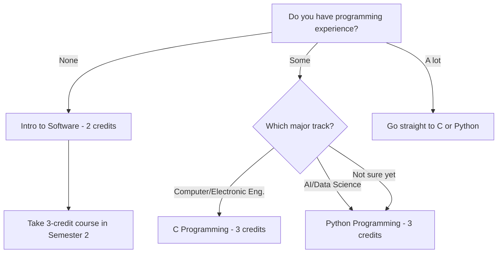
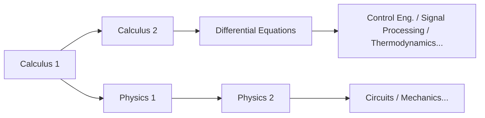

# STEM Freshman Course Guide

> Course strategy for freshmen interested in Engineering, Computer Science, AI, and Natural Sciences
> Main guide: [[Spring 2026 Freshman Registration Guide]]

---

## 🎯 1. Who Is This Guide For?

This guide is written for **Class of 2026 freshmen** considering the following majors:

- **AI & Computer Engineering**: Software, Artificial Intelligence, Data Science, Cybersecurity
- **Computer & Electronic Engineering**: Computer Engineering, Electronic Engineering, Embedded Systems
- **Mechanical & Control Engineering**: Mechanical Engineering, Robotics, Control Systems
- **Spatial Environment & Systems Engineering**: Construction, Environmental, Urban Engineering
- **Life Sciences**: Biology, Biotechnology, Bioengineering

Even if you're thinking "I'm not sure about my exact major, but I know I'm a STEM person" — this guide is for you. At Handong, you don't declare your major in your first year. That means the core strategy is to **fill your first year with foundational courses that will serve you no matter which STEM major you eventually choose.**

### 💡 Why Your First-Year Foundation Matters So Much

STEM courses are built like a **staircase**. You can't take Differential Equations without Calculus. You can't understand Control Engineering without Differential Equations. You can't follow a Machine Learning lecture when matrix operations come up if you haven't taken Linear Algebra. You can't grasp why Kirchhoff's laws take the form they do in Circuit Theory without Physics.

In other words, if you skip your math and science foundations in Year 1, your major courses will **collapse like dominoes** starting in Year 2. In STEM, "I'll take it later" is just another way of saying "I'll suffer later."

### 🏷️ How to Read Course Codes: Don't Skip This

Handong course codes contain hidden but important information. For example, in `GCS10058`:

- **GCS**: Department/area code (GCS = Global Creative Software)
- **1**0058: The leading digit indicates the **year level**

Why does this matter? **Courses starting with 1 are meant for first-years; courses starting with 3 or 4 are for upperclassmen.** Some freshmen get ambitious and try to register for 3xxx or 4xxx courses — this is like building a house without a foundation. Even if the registration system doesn't block you, **stick to 1xxx courses in your first year.**

Likewise, it's risky to take advanced major-specific courses before your major is confirmed. It's far wiser to first fill up on **universally applicable courses** like Calculus, Physics, Programming, and Linear Algebra.

---

## 📚 2. Courses You Must Take in Year 1

### 🔢 2.1 Calculus 1 — The Starting Point for All STEM

Calculus is the **common language** of nearly every field: engineering, physics, computer science, even economics. Differentiation deals with "rates of change," and integration deals with "accumulated quantities" — without these two concepts, no advanced STEM course is accessible.

Think of Calculus as the **alphabet** of learning a foreign language. Without the alphabet you can't read words, and without words you can't understand sentences. It doesn't matter whether you were good or bad at math in high school — university Calculus is a fundamentally different level of depth. You'll train in rigorous mathematical thinking, starting from the epsilon-delta definition.

**Ideal roadmap**: Semester 1 Calculus 1 → Semester 2 Calculus 2 → Semester 3 Differential Equations. If this sequence slips by even one semester, your entry into major courses gets delayed.

> **2026 Spring — Calculus 1 (GEK10095) Sections:**

| Section | Professor | Time | English % | Notes |
|---------|-----------|------|-----------|-------|
| 01 | Lee Hanjin | Mon P4, Thu P4 | 0% | Korean instruction |
| 02 | Lee Hanjin | Mon P6, Thu P6 | 0% | Korean instruction, later time slot |
| **03** | **Kim Minjae** | **Mon P4, Thu P4** | **100%** | **English instruction** |
| **04** | **Cho Janghwan** | **Mon P1, Thu P1** | **100%** | **English instruction, Period 1** |

*Period system: P1 = 9:00–10:00, P2 = 10:00–11:00, P3 = 11:00–12:00, P4 = 12:00–13:00, P5 = 13:00–14:00, P6 = 14:00–15:00, P7 = 15:00–16:00*

**How to choose your section:**

- **If you're comfortable in Korean**: Section 01 (Lee Hanjin, Mon P4 / Thu P4) or Section 02 (Lee Hanjin, Mon P6 / Thu P6). Same professor, just different time slots.
- **If you need English instruction**: **Section 03 (Kim Minjae) or Section 04 (Cho Janghwan)**. However, Section 04 is at **Period 1 (9:00 AM)**. During your first semester while you're still adjusting, avoiding Period 1 is wise if you have a choice. Of course, if it's the only option for a required course, you take it — but when you have alternatives, schedule Period 2 or later.

> **⚠️ "English Lecture" Pitfall**: Even for the same professor, different sections may be taught in different languages. Always verify the lecture language for each section. If your Korean isn't strong enough and you end up in a Korean section, you'll be fighting both the math and the language barrier simultaneously. The same applies in reverse — check before you register.

### 🔢 2.2 Calculus 2 — Take It in Semester 1 If You Can

Normally Calculus 2 is taken in Semester 2, but if you have a solid calculus foundation from high school, it's possible to take Calculus 1 and 2 simultaneously in Semester 1. This lets you take Differential Equations as early as Semester 2, accelerating your entry into major courses by a full semester.

However, this is **only recommended if you're truly confident in your math skills**. It's better to nail one course solidly than to overextend and lose both.

> **2026 Spring — Calculus 2 (GEK10096) Sections:**

| Section | Professor | Time | English % | Notes |
|---------|-----------|------|-----------|-------|
| **01** | **Lee Hanjin** | **Mon P2, Thu P2** | **100%** | **English instruction** |
| 02 | Kim Taehee | Mon P1, Thu P1 | 0% | Period 1 |
| 03 | Kim Taehee | Mon P2, Thu P2 | 0% | Korean instruction |

### ⚛️ 2.3 Physics — The Language of Engineers

If you're heading toward engineering tracks (Computer & Electronic, Mechanical & Control, Spatial Environment), Physics is **not optional — it's mandatory**. Physics 1 covers mechanics and thermodynamics, teaching you to handle forces, energy, and momentum with mathematical rigor. This feeds into Physics 2 (electromagnetism) in Semester 2, which is the direct foundation of Electronic Engineering.

Think of Physics as **nature's programming language**. To design anything as an engineer, you need to understand the laws of nature — and those laws are Physics.

> **2026 Spring — Physics 1 (GEK10055):**

| Section | Professor | Time | English % |
|---------|-----------|------|-----------|
| 01 | Cho Hyunji | Mon P2, Thu P2 | 0% |
| 02 | Cho Hyunji | Mon P3, Thu P3 | 0% |

**Physics 1 vs. Introduction to Physics**: If you're considering Computer Science or AI, you may substitute "Introduction to Physics" (물리학 개론) instead. It covers a broader range than Physics 1 but at a shallower depth — sufficient for building engineering intuition. However, if you're seriously considering Electronic Engineering or Mechanical Engineering, where physics is deeply intertwined with the major, **take Physics 1 without question.**

> **Introduction to Physics (GEK10090) — Alternative to Physics 1:**

| Section | Professor | Time | English % |
|---------|-----------|------|-----------|
| 01 | Cho Hyunji | Tue P2, Fri P2 | 0% |
| 02 | Cho Hyunji | Tue P3, Fri P3 | 0% |

### 📊 2.4 Linear Algebra — Essential Math for the AI Era

Linear Algebra is one of the **two great pillars** of STEM mathematics alongside Calculus. It covers vectors, matrices, eigenvalues, and linear transformations — and it is the **mathematical heart** of AI and machine learning.

Why? In machine learning, data is represented as matrices, and model training is carried out through matrix operations. Even backpropagation in deep learning is ultimately matrix differentiation. Without Linear Algebra, you can't understand *why* things work in AI courses — you'll just be copying code without comprehension.

I strongly recommend taking it alongside Calculus 1 in Semester 1. It'll be demanding, but finishing both in your first semester will **explosively expand** your options from Semester 2 onward.

> **2026 Spring — Linear Algebra (GEK10082):**

| Section | Professor | Time | English % | Notes |
|---------|-----------|------|-----------|-------|
| **01** | **Cho Janghwan** | **Mon P3, Thu P3** | **100%** | **English instruction** |
| **02** | **Cho Janghwan** | **Mon P5, Thu P5** | **100%** | **English instruction** |
| 03 | Kim Hyunsu | Tue P2, Fri P2 | 0% | Korean instruction |
| 04 | Kim Hyunsu | Tue P3, Fri P3 | 0% | Korean instruction |

### 💻 2.5 ICT Programming — Your First Step in Coding

At Handong, all students must complete **7 credits of ICT Convergence Fundamentals**: 5 credits of programming + 2 credits of applied ICT. For STEM students, programming isn't just a liberal arts requirement — it's a **tool of your major.**

**Why you must finish programming in Year 1**: Starting in Year 2, programming assignments will pour in from your major courses. If you're still taking a basic programming course at that point, the time waste is severe. Ideally, take a 3-credit programming course (Python/C) in Semester 1, and complete the rest in Semester 2.

> **💡 OIA (Office of International Admissions) Reserved Seats**: Programming courses sometimes have **seats specifically reserved by OIA for incoming international students.** If you're an international student, be sure to take advantage of this — it significantly improves your chances of getting into popular sections.

#### 🌳 Choosing Your Path: Where to Start



#### 💡 C vs. Python: Which First?

If you're considering Computer Engineering or Electronic Engineering, **C is overwhelmingly advantageous**. C is the foundation of operating systems, embedded systems, and hardware control — low-level programming essentials. If you learn C first, you can pick up Python in about a week. Conversely, if you only know Python, you'll hit a massive wall with memory management and pointers when you eventually learn C.

If AI or Data Science is your track, starting with Python is perfectly fine. It's the most widely used language in practice, and its low barrier to entry lets you experience the joy of programming first.

> **Intro to Software (GCS10001) — 2 credits, for absolute beginners:**

| Section | Professor | Time | English % |
|---------|-----------|------|-----------|
| 01 | Kim Heonju | Mon P1, Thu P1 | 0% |
| 02 | Lee Sanghun | Mon P5, Thu P5 | 0% |
| 03 | Lee Sanghun | Mon P6, Thu P6 | 0% |
| 04 | Kim Hyunsuk | Tue P2, Fri P2 | 0% |
| 05 | Kim Hyunsuk | Tue P4, Fri P4 | 0% |
| 06 | Kim Hyunsuk | Tue P6, Fri P6 | 0% |

> **C Programming (GCS10058) — 3 credits, for Computer/Electronic Eng. track:**

| Section | Professor | Time | English % |
|---------|-----------|------|-----------|
| 01 | Kim Kwang | Tue P2, Fri P2 | 0% |

⚠️ C Programming has **only 1 section**. Competition may be fierce, so register quickly during course enrollment.

> **Python Programming (GCS10004) — 3 credits, for AI/Data Science track:**

| Section | Professor | Time | English % |
|---------|-----------|------|-----------|
| 01 | Kim Kyungmi | Mon P2, Thu P2 | 0% |
| 02 | Kim Kyungmi | Tue P2, Fri P2 | 0% |
| 03 | Kim Kyungmi | Tue P3, Fri P3 | 0% |
| 04 | Park Jihyun | Mon P3, Thu P3 | 0% |
| **05** | **Park Jihyun** | **Mon P5, Thu P5** | **100%** |
| 06 | Yong Hwangi | Tue P3, Fri P3 | 0% |

> **Intro to Frontend (GCS10081) — 3 credits, for those interested in web development:**

| Section | Professor | Time | English % |
|---------|-----------|------|-----------|
| 01 | Kim Guno | Mon P2, Thu P2 | 0% |
| 02 | Kim Guno | Mon P3, Thu P3 | 0% |
| 03 | Park Jihyun | Tue P5, Fri P5 | 0% |
| **04** | **Park Jihyun** | **Tue P6, Fri P6** | **100%** |
| 05 | Yang Jihye | Mon P3, Thu P3 | 0% |
| 06 | Yang Jihye | Mon P4, Thu P4 | 0% |

Intro to Frontend covers the basics of web development — HTML, CSS, JavaScript. It can count toward your 2-credit ICT applied requirement, or it can be recognized as a 3-credit programming course. Worth considering if web development interests you.

### 🧪 2.6 General Chemistry — Required for Life Sciences/Chemistry Tracks

If you're considering Life Sciences or chemistry-related majors, General Chemistry is essential. It covers atomic structure, chemical bonding, reaction kinetics, and other chemistry fundamentals, and serves as the prerequisite for Biochemistry and Organic Chemistry.

> **2026 Spring — General Chemistry (GEK10058):**

| Section | Professor | Time | English % | Notes |
|---------|-----------|------|-----------|-------|
| 01 | Kim Minkyung | Thu P3, P4 (consecutive) | 0% | 2 consecutive hours on Thursday |
| **02** | **Yu Taejun** | **Mon P2, Thu P2** | **100%** | **English instruction** |

### 🧬 2.7 General Biology — A Course That Requires Honest Advice

General Biology is needed for entry into Life Sciences, but there is one **honest reality** you need to hear.

**⚠️ General Biology competition is extreme.** There are few sections, and retaking students and upperclassmen often fill the seats first, making it **very difficult for freshmen to enroll in Semester 1.** Rather than stubbornly insisting "I MUST take it in Semester 1" and missing the registration window for other critical courses, the **far wiser strategy** is to be flexible: take it if a seat opens up, and defer to Semester 2 if it doesn't.

In Semester 1, secure your spots in Calculus, Linear Algebra, and Programming — **courses that are useful no matter what** — instead of gambling everything on General Biology. It's offered in Semester 2 as well.

> **2026 Spring — General Biology (GEK10057):**

| Section | Professor | Time | English % |
|---------|-----------|------|-----------|
| 01 | Hyun Changgi et al. | Mon P5, Thu P5 | 0% |
| **02** | **Holzapfel Wilhelm et al.** | **Mon P2, Thu P2** | **100%** |
| 03 | Hyun Changgi et al. | Mon P6, Thu P6 | 0% |

### 🤖 2.8 Introduction to AI, Computer & Electronic Engineering — A Taste of the Major

If you're interested in the AI & Computer Engineering or Computer & Electronic Engineering departments, this introductory course gives you the big picture of the field. It's a great way to figure out whether "this field is right for me" before committing to full major courses.

> **2026 Spring — Intro to AI, Computer & Electronic Eng. (ECE10006):**

| Section | Professor | Time | English % | Notes |
|---------|-----------|------|-----------|-------|
| 01 | Hwang Sungsu et al. | Mon P6, P7 (consecutive) | 0% | Monday late time slot |

### 📐 2.9 Differential Equations and Applications — If Your Math Is Strong

If you've already completed Calculus 1 & 2, or if you finished AP Calculus BC in high school, taking Differential Equations in Semester 1 is possible. However, this is **only recommended if your math foundation is truly solid.**

> **2026 Spring — Differential Equations and Applications (GEK10053):**

| Section | Professor | Time | English % |
|---------|-----------|------|-----------|
| 01 | Kim Taehee | Mon P3, Thu P3 | 0% |

---

## 🗓️ 3. Recommended Schedules

Below are **sample schedules** built from actual 2026 Spring course offerings. These are reference examples only — adjust according to your EPT (English Placement Test) results, areas of interest, and stamina.

**Core principle: It's better to register for more courses and drop some than to register for fewer and regret it.** Register generously, attend classes in the first week, and drop what you can't handle. The reverse — trying to add popular courses during the add/drop period — is nearly impossible because open seats are rare.

### 📋 Schedule A: Computer Science / AI Track

**Strategy**: Calculus + Linear Algebra + Python to build math and coding foundations simultaneously

```
Period │  Mon              │  Tue              │  Wed     │  Thu              │  Fri
──────┼───────────────────┼───────────────────┼──────────┼───────────────────┼───────────────────
  1   │                   │                   │          │                   │
  2   │                   │ Python(Sec.02)    │          │                   │ Python(Sec.02)
  3   │ Linear Alg(Sec.01)│                   │          │ Linear Alg(Sec.01)│
  4   │ Calc 1(Sec.01)    │                   │  Chapel  │ Calc 1(Sec.01)    │
  5   │                   │                   │  Chapel  │                   │
  6   │                   │                   │  Chapel  │                   │
```

| Course | Code | Credits | Professor | Notes |
|--------|------|---------|-----------|-------|
| Calculus 1 (Sec. 01) | GEK10095 | 3 | Lee Hanjin | Korean |
| Linear Algebra (Sec. 01) | GEK10082 | 3 | Cho Janghwan | **English 100%** |
| Python Programming (Sec. 02) | GCS10004 | 3 | Kim Kyungmi | Korean |
| Understanding the Bible | GEK20058 | 2 | Choose section | |
| Handong Character Education | GEK10015 | 1 | Choose section | |
| Chapel 1 | GEK10001 | 0 | Wed P4,5,6 | |
| Community Leadership Training 1 | GEK10008 | 0.5 | Separate schedule | |
| Social Service 1 | GEK10046 | 1 | Separate | |
| + English (per EPT result) | - | 3 | TBD | Likely placed on Tue/Fri |
| **Total** | | **16.5 + English 3** | | |

> **Why this combination?** Taking Calculus and Linear Algebra simultaneously creates mathematical synergy. Vector and matrix concepts connect directly to multivariable functions in Calculus. Python is placed on Tue/Fri to balance the week: Mon/Thu for math, Tue/Fri for coding + English. Once this rhythm clicks, building study habits becomes much easier.

### 📋 Schedule B: Electronic / Mechanical Engineering Track

**Strategy**: Calculus + Physics + C Programming to build a rock-solid engineering foundation

```
Period │  Mon              │  Tue              │  Wed     │  Thu              │  Fri
──────┼───────────────────┼───────────────────┼──────────┼───────────────────┼───────────────────
  1   │                   │                   │          │                   │
  2   │ Physics 1(Sec.01) │ C Prog.(Sec.01)   │          │ Physics 1(Sec.01) │ C Prog.(Sec.01)
  3   │                   │                   │          │                   │
  4   │ Calc 1(Sec.01)    │                   │  Chapel  │ Calc 1(Sec.01)    │
  5   │                   │                   │  Chapel  │                   │
  6   │                   │                   │  Chapel  │                   │
```

| Course | Code | Credits | Professor | Notes |
|--------|------|---------|-----------|-------|
| Calculus 1 (Sec. 01) | GEK10095 | 3 | Lee Hanjin | Korean |
| Physics 1 (Sec. 01) | GEK10055 | 3 | Cho Hyunji | Korean |
| C Programming (Sec. 01) | GCS10058 | 3 | Kim Kwang | Korean, only section available |
| Understanding the Bible | GEK20058 | 2 | Choose section | |
| Handong Character Education | GEK10015 | 1 | Choose section | |
| Chapel 1 | GEK10001 | 0 | Wed P4,5,6 | |
| Community Leadership Training 1 | GEK10008 | 0.5 | Separate schedule | |
| Social Service 1 | GEK10046 | 1 | Separate | |
| + English (per EPT result) | - | 3 | TBD | Likely placed on Tue/Fri |
| **Total** | | **16.5 + English 3** | | |

> **Why this combination?** Electronic and Mechanical Engineering are built on a physics foundation. Taking Calculus + Physics simultaneously means the differentiation concepts you learn in Calculus are immediately applied to velocity and acceleration problems in Physics — a powerful **mutual reinforcement effect**. C Programming is the foundation of embedded systems and hardware control, making it the ideal choice for Electronic/Mechanical Engineering aspirants.

---

## ⚠️ 4. Common Mistakes STEM Students Make

### ❌ Mistake 1: "I'll take math later"

This is the **most fatal mistake**. The course structure in STEM is best understood as dominoes:



Delay Calculus 1 to Semester 2 → Calculus 2 pushes to Semester 3 → Differential Equations to Semester 4 → Core major courses become accessible only from Semester 5 onward. This can delay your graduation by a full year. **Start math in Semester 1, no exceptions.**

### ❌ Mistake 2: "I've never coded, so I'll just take Intro to Software"

Intro to Software is a 2-credit sampler course. If you're seriously considering Computer Science or AI, skip it and go straight for Python or C. Yes, it'll be harder — but avoiding difficulty means avoiding growth. If you take Intro to Software in Semester 1 and Python in Semester 2, you'll have spent an entire year just on programming basics.

### ❌ Mistake 3: Going all-in on General Biology

As mentioned above, General Biology is **extremely difficult for freshmen to enroll in during Semester 1** because retaking students and upperclassmen claim the seats first. Every semester, there are students who fixate on General Biology and miss the registration window for critical courses like Calculus or Programming. Stay flexible.

### ❌ Mistake 4: Taking advanced major courses before your major is decided

"I'm interested in AI, so maybe I'll try Machine Learning" — this thinking is dangerous. Advanced major courses (3xxx, 4xxx codes) only make sense **after you've laid the groundwork.** If you take Machine Learning without Linear Algebra, you won't understand half the lecture.

In Year 1, focus on **foundational courses that apply to any major** (Calculus, Physics, Linear Algebra, Programming). Major-specific courses starting in Year 2 is perfectly on time.

### ❌ Mistake 5: Not checking the lecture language

Even for the same course and the same professor, **the lecture language can differ by section.** For example, Professor Cho Janghwan's Calculus 1 is 100% English, while Professor Lee Hanjin's sections are in Korean. Always verify the lecture language for each section before registering. If your Korean isn't strong and you end up in a Korean section, you'll be fighting both the subject and the language simultaneously — a double burden.

### ❌ Mistake 6: Registering for too few credits

"I'm worried it'll be too hard, so I'll just register for 15 credits" — this strategy actually hurts you. **It's far easier to register for more and drop than to register for fewer and try to add.** Getting an open seat in a popular course during the add/drop period is practically a miracle. Start with 18–20 credits, attend classes in the first week, and drop what you can't handle. That is the wise approach.

---

## 🔭 5. Looking Ahead to Semester 2

If you successfully complete the courses above in Semester 1, here's what to consider for Semester 2:

| Course | Target | Why It Matters |
|--------|--------|----------------|
| **Calculus 2** | All STEM | Continuation of Calculus 1. Covers series, multivariable calculus, and is the prerequisite for Differential Equations |
| **Physics 2** | Electronic/Mechanical tracks | Covers electromagnetism — the direct foundation of Electronic Engineering |
| **Data Structures** | Computer Science/AI tracks | Arrays, lists, trees, graphs — core programming concepts and perennial coding interview favorites |
| **General Chemistry** | Life Sciences/Chemistry | If you couldn't take it in Semester 1, it's a must in Semester 2 |
| **General Biology** | Life Sciences | If you couldn't get a seat in Semester 1, try again in Semester 2 |
| **Differential Equations** | Calc 1 & 2 completers | A core mathematical tool for engineering majors |

The key to Semester 2 is **building one more layer on top of the foundation you laid in Semester 1.** If you completed Calculus 1 well, you naturally move to Calculus 2. If you finished programming basics, you advance to Data Structures. Maintaining this flow is what determines the trajectory of your entire four years at university.

---

*This guide is the STEM detailed document of the [[Spring 2026 Freshman Registration Guide]].*
*For the Korean version, see [[이공계 신입생 가이드]].*
*See also: [[Registration Schedule]]*
*Last updated: 2026-02-21*