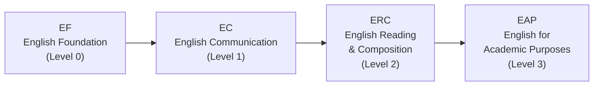

# Course Design Tips

> Picking the right courses is only half the battle. This page covers the English course placement track, the Korean language requirement for international students, practical timetable design principles, and sample schedules built entirely from English-taught sections. Read this before you finalize your course list — it'll save you a lot of headaches!

---

## 🗣️ English Course Track (EPT)

During HanST orientation, all freshmen take the **EPT (English Placement Test)**. Your result determines which level of the English course sequence you start at.

If you score well on the EPT, you can skip lower levels. You may also be exempt from certain levels if you have qualifying scores on standardized tests like TOEFL, IELTS, or TOEIC. Nice shortcut, right?

**Don't put off your English courses.** Seriously — in recent semesters, professors have gotten strict about enforcing capacity limits. Students who think "eh, I'll take it next semester" often find that all seats are gone. Take your assigned English level **immediately in your first semester**. Seats fill fast, and waiting gets you absolutely nothing. Just do it now.

---

## 🇰🇷 Korean Language Requirement

This applies to **students with a foreign passport** as well as **Korean nationals who've lived abroad for a long time** and might struggle with Korean-medium courses. You'll need to complete the Practical Korean course sequence. During orientation, you'll take a Korean language placement test that determines your starting level.

**Here's a really important tip:** Don't guess on the placement test trying to place into a higher level. Here's why this backfires:

- If you start at **Korean 1** (the lowest level), you earn easy, secure credits while building a solid foundation. The coursework is manageable, and you build real confidence.
- If you guess your way into **Korean 3**, you now have to fill the credits that Korean 1 and Korean 2 would've given you with other courses. Plus, you're facing harder Korean coursework that might be way beyond your actual ability. Ouch.

**Answer honestly.** Starting lower and working your way up is so much smarter in the long run than struggling in a level that's above your real proficiency. This isn't about pride — it's about strategy. Trust us on this one.

---

## 🎯 Course Design Tips

Even great course choices can lead to a miserable semester if your timetable design is bad. These principles will help you build a schedule that's both academically strong and actually livable.

### The Overload Strategy: Register More, Drop Later

You can register for up to **22 credits** (overload). Here's the golden rule: **it's always better to register for more courses and drop after the first week than to register for fewer and try to add later.** Popular courses don't magically have open seats during the adjustment period. If you start light and try to add a competitive course later, you'll almost certainly strike out. Register generously, attend everything in week one, then trim.

### Credit Targets

- **Graduation requirement**: 130 credits over 8 semesters = roughly 16.25 credits per semester
- **Recommended target**: 17-18 credits per semester gives you comfortable breathing room
- **Scholarship students**: You must maintain at least **15.5 credits**. Be super careful not to drop below this when removing courses during the adjustment period — that's a mistake you really don't want to make.

### How to Read Course Codes

The **first digit** of a Handong course code tells you the recommended year level:

- **1**xxx: Freshman-level courses (this is your zone!)
- **2**xxx: Sophomore-level courses
- **3**xxx: Junior-level courses
- **4**xxx: Senior-level courses

As a freshman, **stick to 1xxx courses**. Courses coded 3xxx or 4xxx typically have prerequisites, and even if the system lets you register, the content will be way over your head. Taking upper-level courses without the foundation isn't brave — it's just asking for trouble.

### Keep Your Lunch Break Free

Periods 4 (12:00-13:00) and 5 (13:00-14:00) span the lunch window. If you schedule classes through this block, you'll be skipping lunch. Once or twice is survivable, but doing it daily? That'll wreck your energy and concentration. **Don't stack more than three consecutive classes.** Your brain needs breaks between sessions to actually absorb what you've learned.

### Ask Your Seniors About Professors

Here's the thing — the same course taught by different professors can feel like a *completely* different class. Different workloads, different exam styles, different grading curves, different teaching vibes. The course catalog won't tell you any of this. **Ask your 섬김이 (student mentor) and upperclassmen**: "Has anyone taken this course? What was it like?" This is hands-down your best source of intel.

### Check the Language of Instruction Per Section

We can't stress this enough for international students. **The same professor may teach one section in Korean and another in English.** Always verify the "English %" column for each specific section before registering. Every semester, someone accidentally enrolls in the wrong language section. Don't let that be you!

---

## 🗓️ Recommended Schedules (International Student)

Below are sample timetables built exclusively from **100% English sections**. These are just starting points — adjust them based on your EPT results, interests, and energy levels. And remember the golden rule: register for more courses than you need and drop after the first week!

### Schedule A: Humanities/Social Science Focus (All English)

| Period | Mon | Tue | Wed | Thu | Fri |
|--------|-----|-----|-----|-----|-----|
| 1 | | Bible (07) | | | Bible (07) |
| 2 | | Intl Relations | CharEd* | | Intl Relations |
| 3 | | Psychology | | | Psychology |
| 4 | D&P | | Chapel | D&P | |
| 5 | Python (05) | Python (05) | Chapel | Python (05) | |
| 6 | | | Chapel | | |

> **⚠️ CharEd conflict:** Character Education Sec 01 (Mon 5, English) conflicts with Python Sec 05 (Mon 5). **Resolution:** Take CharEd Sec 02-06 (Wed 2, Korean) instead, or swap Python to a non-Mon 5 section.

| Course | Code | Credits | Professor | Note |
|--------|------|---------|-----------|------|
| Understanding the Bible (07) | GEK20058 | 2 | Joshua Kim | Tue 1, Fri 1, 100% English |
| International Relations Intro (01) | ISE10052 | 3 | 정모니카 | Tue 2, Fri 2, 100% English |
| Psychology Intro (02) | CSW10003 | 3 | 지원근 | Tue 3, Fri 3, 100% English |
| Discussion & Presentation (01) | GCS10013 | 3 | Richardson | Mon 4, Thu 4, 100% English |
| Character Education (02-06) | GEK10015 | 1 | Various | **Wed 2, Korean** (Sec 01 Mon 5 conflicts with Python) |
| Python Programming (05) | GCS10004 | 3 | 박지현 | Mon 5, Thu 5, 100% English |
| Chapel 1 | GEK10001 | 0 | — | Wed 4, 5, 6 |
| Community Leadership Training 1 | GEK10008 | 0.5 | TBA | Time TBA |
| Social Service 1 | GEK10046 | 1 | — | Separate schedule |
| + Korean Language Course | — | 3 | TBA | Required for international students |
| **Total** | | **19.5 + Korean (3)** | | |

**Why this schedule rocks:** Tuesday and Friday carry the intellectual heavy lifting with three back-to-back English courses (Bible, International Relations, Psychology), while Monday and Thursday are lighter with afternoon courses only. Wednesday is reserved for Chapel and personal study time — perfect for catching up on readings. You get to explore two completely different fields while building programming skills and English academic presentation ability at the same time. That's a well-rounded semester right there!

**CharEd conflict resolved above:** Character Education Sec 01 (Mon 5) conflicts with Python Sec 05 (Mon 5). This schedule uses CharEd Sec 02-06 (Wed 2, Korean) to avoid the overlap. If your Korean isn't strong enough for that, swap Python to a non-Mon 5 section instead.

### Schedule B: STEM Focus (All English)

| Period | Mon | Tue | Wed | Thu | Fri |
|--------|-----|-----|-----|-----|-----|
| 1 | | Bible (07) | | | Bible (07) |
| 2 | | Worldview (02) | | | Worldview (02) |
| 3 | Linear Alg (01) | | | Linear Alg (01) | |
| 4 | Calculus 1 (03) | | Chapel | Calculus 1 (03) | |
| 5 | Python (05) | Python (05) | Chapel | Python (05) | |
| 6 | | | Chapel | | |

> **⚠️ CharEd conflict:** Character Education Sec 01 (Mon 5, English) conflicts with Python Sec 05 (Mon 5). **Resolution:** Take CharEd Sec 02-06 (Wed 2, Korean) instead, or swap Python to a non-Mon 5 section.

| Course | Code | Credits | Professor | Note |
|--------|------|---------|-----------|------|
| Understanding the Bible (07) | GEK20058 | 2 | Joshua Kim | Tue 1, Fri 1, 100% English |
| Christian Worldview (02) | GEK20011 | 2 | 최용준 | Tue 2, Fri 2, 100% English |
| Linear Algebra (01) | GEK10082 | 3 | 조장환 | Mon 3, Thu 3, 100% English |
| Calculus 1 (03) | GEK10095 | 3 | 김민재 | Mon 4, Thu 4, 100% English |
| Character Education (02-06) | GEK10015 | 1 | Various | **Wed 2, Korean** (Sec 01 Mon 5 conflicts with Python) |
| Python Programming (05) | GCS10004 | 3 | 박지현 | Mon 5, Thu 5, 100% English |
| Chapel 1 | GEK10001 | 0 | — | Wed 4, 5, 6 |
| Community Leadership Training 1 | GEK10008 | 0.5 | TBA | Time TBA |
| Social Service 1 | GEK10046 | 1 | — | Separate schedule |
| + Korean Language Course | — | 3 | TBA | Required for international students |
| **Total** | | **18.5 + Korean (3)** | | |

**Why this schedule rocks:** Taking Calculus 1 and Linear Algebra at the same time creates awesome synergy — the vector and matrix concepts from Linear Algebra connect directly with the multivariable ideas you'll encounter in Calculus. Python gives you your programming foundation. Tuesday and Friday are lighter days (just Bible + Worldview), giving you solid time to work on those math problem sets. And trust us, you'll need that time!

**CharEd conflict resolved above:** Character Education Sec 01 (Mon 5) conflicts with Python Sec 05 (Mon 5). This schedule uses CharEd Sec 02-06 (Wed 2, Korean) to avoid the overlap. If your Korean isn't strong enough for that, swap Python to a non-Mon 5 section instead.

---

*Last updated: 2026-02-21*