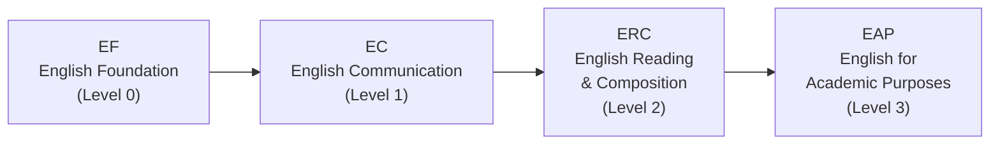

# Course Design Tips

> Choosing the right courses is only half the challenge. This page covers the English course placement track, the Korean language requirement for international students, practical timetable design principles, and sample schedules built entirely from English-taught sections. Read this before you finalize your course list.

---

## 🗣️ English Course Track (EPT)

During HanST orientation, all freshmen take the **EPT (English Placement Test)**. Your result determines which level of the English course sequence you enter.



If you pass the EPT at a higher level, you can skip lower levels. You may also be exempt from certain levels if you have qualifying scores on standardized tests such as TOEFL, IELTS, or TOEIC.

**Do NOT delay your English courses.** In recent semesters, professors have become strict about enforcing capacity limits. Students who postpone their English courses thinking "I'll take it next semester" often find that all seats are taken. Take your assigned English level **immediately in your first semester**. Seats fill fast, and waiting gains you nothing.

---

## 🇰🇷 Korean Language Requirement

This requirement applies to **students with a foreign passport** as well as **Korean nationals who have lived abroad for an extended period** and may struggle with Korean-medium courses. You must complete the Practical Korean course sequence. During orientation, you will take a Korean language placement test that determines your starting level.

**A critically important tip:** Do NOT guess on the placement test in an attempt to place into a higher level. Here is why:

- If you start at **Korean 1** (the lowest level), you earn easy, secure credits while building a solid foundation. The coursework is manageable, and you build confidence.
- If you guess your way into **Korean 3**, you must now fill the credits that Korean 1 and Korean 2 would have provided with other courses. You also face more difficult Korean coursework that may be beyond your actual ability.

**Answer honestly.** Starting at a lower level and working your way up is far more advantageous in the long run than struggling in a level above your true proficiency. This is not about pride — it is about strategy.

---

## 🎯 Course Design Tips

Even excellent course choices can lead to a miserable semester if the timetable design is poor. The following principles help you build a schedule that is both academically strong and humanly sustainable.

### The Overload Strategy: Register More, Drop Later

You can register for up to **22 credits** (overload). The golden rule is: **it is always better to register for more courses and drop after the first week than to register for fewer and try to add later.** Popular courses do not have open seats during the adjustment period. If you start light and try to add a competitive course later, you will almost certainly fail.

### Credit Targets

- **Graduation requirement**: 130 credits over 8 semesters = approximately 16.25 credits per semester
- **Recommended target**: 17-18 credits per semester gives you comfortable breathing room
- **Scholarship students**: You must maintain a minimum of **15.5 credits**. Be very careful not to drop below this threshold when removing courses during the adjustment period.

### How to Read Course Codes

The **first digit** of a Handong course code indicates the recommended year level:

- **1**xxx: Freshman-level courses (what you should be taking)
- **2**xxx: Sophomore-level courses
- **3**xxx: Junior-level courses
- **4**xxx: Senior-level courses

As a freshman, **focus on 1xxx courses**. Courses coded 3xxx or 4xxx typically have prerequisites, and even if the system allows you to register, the content will be far beyond your preparation. Attempting upper-level courses without the foundation is not brave — it is reckless.

### Keep Your Lunch Break Free

Periods 4 (12:00-13:00) and 5 (13:00-14:00) span the lunch window. If you schedule classes through this block, you will skip lunch. Once or twice is tolerable, but doing it daily will destroy your energy and concentration. **Do not stack more than three consecutive classes.** You need breaks between sessions to digest what you have learned.

### Ask Your Seniors About Professors

The same course taught by different professors can be a completely different experience — in workload, exam difficulty, grading style, and teaching method. The course catalog does not tell you any of this. **Ask your 섬김이 (student mentor) and upperclassmen**: "Has anyone taken this course? What was it like?" This is your single best source of information.

### Check the Language of Instruction Per Section

This cannot be emphasized enough for international students. **The same professor may teach one section in Korean and another in English.** Always verify the "English %" column for each specific section before registering. An international student accidentally enrolling in a Korean-medium section — or a Korean student accidentally enrolling in an English section — happens every semester.

---

## 🗓️ Recommended Schedules (International Student)

Below are sample timetables built exclusively from **100% English sections**. These are reference examples — adjust them based on your EPT results, interests, and energy levels. Remember the golden rule: register for more courses than you need and drop after the first week.

### Schedule A: Humanities/Social Science Focus (All English)

```
Period | Mon            | Tue              | Wed        | Thu            | Fri
-------|----------------|------------------|------------|----------------|------------------
  1    |                | Bible (07)       |            |                | Bible (07)
  2    |                | Intl Relations   | CharEd*    |                | Intl Relations
  3    |                | Psychology       |            |                | Psychology
  4    | D&P            |                  | Chapel     | D&P            |
  5    | Python (05)    | Python (05)      | Chapel     | Python (05)    |
  6    |                |                  | Chapel     |                |
```

> **⚠️ CharEd conflict:** Character Education Sec 01 (Mon 5, English) conflicts with Python Sec 05 (Mon 5). **Resolution:** Take CharEd Sec 02-06 (Wed 2, Korean) instead, or swap Python to a non-Mon 5 section.

| Course | Code | Credits | Professor | Note |
|--------|------|---------|-----------|------|
| Understanding the Bible (07) | GEK20058 | 2 | Joshua Kim | Tue 1, Fri 1, 100% English |
| International Relations Intro (01) | ISE10052 | 3 | 정모니카 | Tue 2, Fri 2, 100% English |
| Psychology Intro (02) | CSW10003 | 3 | 지원근 | Tue 3, Fri 3, 100% English |
| Discussion & Presentation (01) | GCS10013 | 3 | Richardson | Mon 4, Thu 4, 100% English |
| Character Education (02-06) | GEK10015 | 1 | Various | **Wed 2, Korean** (Sec 01 Mon 5 conflicts with Python) |
| Python Programming (05) | GCS10004 | 3 | 박지현 | Mon 5, Thu 5, 100% English |
| Chapel 1 | GEK10001 | 0 | — | Wed 4, 5, 6 |
| Community Leadership Training 1 | GEK10008 | 0.5 | TBA | Time TBA |
| Social Service 1 | GEK10046 | 1 | — | Separate schedule |
| + Korean Language Course | — | 3 | TBA | Required for international students |
| **Total** | | **19.5 + Korean (3)** | | |

**Why this schedule works:** Tuesday and Friday carry the intellectual heavy lifting with three consecutive English courses (Bible, International Relations, Psychology), while Monday and Thursday are lighter with afternoon courses only. Wednesday is reserved for Chapel and personal study time. You explore two completely different fields (international relations and psychology) while building programming skills and English academic presentation ability simultaneously.

**CharEd conflict resolved above:** Character Education Sec 01 (Mon 5) conflicts with Python Sec 05 (Mon 5). This schedule uses CharEd Sec 02-06 (Wed 2, Korean) to avoid the overlap. If your Korean is not sufficient, swap Python to a non-Mon 5 section instead.

### Schedule B: STEM Focus (All English)

```
Period | Mon              | Tue              | Wed        | Thu              | Fri
-------|------------------|------------------|------------|------------------|------------------
  1    |                  | Bible (07)       |            |                  | Bible (07)
  2    |                  | Worldview (02)   |            |                  | Worldview (02)
  3    | Linear Alg (01)  |                  |            | Linear Alg (01)  |
  4    | Calculus 1 (03)  |                  | Chapel     | Calculus 1 (03)  |
  5    | Python (05)      | Python (05)      | Chapel     | Python (05)      |
  6    |                  |                  | Chapel     |                  |
```

> **⚠️ CharEd conflict:** Character Education Sec 01 (Mon 5, English) conflicts with Python Sec 05 (Mon 5). **Resolution:** Take CharEd Sec 02-06 (Wed 2, Korean) instead, or swap Python to a non-Mon 5 section.

| Course | Code | Credits | Professor | Note |
|--------|------|---------|-----------|------|
| Understanding the Bible (07) | GEK20058 | 2 | Joshua Kim | Tue 1, Fri 1, 100% English |
| Christian Worldview (02) | GEK20011 | 2 | 최용준 | Tue 2, Fri 2, 100% English |
| Linear Algebra (01) | GEK10082 | 3 | 조장환 | Mon 3, Thu 3, 100% English |
| Calculus 1 (03) | GEK10095 | 3 | 김민재 | Mon 4, Thu 4, 100% English |
| Character Education (02-06) | GEK10015 | 1 | Various | **Wed 2, Korean** (Sec 01 Mon 5 conflicts with Python) |
| Python Programming (05) | GCS10004 | 3 | 박지현 | Mon 5, Thu 5, 100% English |
| Chapel 1 | GEK10001 | 0 | — | Wed 4, 5, 6 |
| Community Leadership Training 1 | GEK10008 | 0.5 | TBA | Time TBA |
| Social Service 1 | GEK10046 | 1 | — | Separate schedule |
| + Korean Language Course | — | 3 | TBA | Required for international students |
| **Total** | | **18.5 + Korean (3)** | | |

**Why this schedule works:** Calculus 1 and Linear Algebra taken simultaneously create powerful synergy — vector and matrix concepts from Linear Algebra connect directly with multivariable ideas you encounter in Calculus. Python provides your programming foundation. Tuesday and Friday are lighter days (Bible + Worldview only), giving you time to work on math problem sets.

**CharEd conflict resolved above:** Character Education Sec 01 (Mon 5) conflicts with Python Sec 05 (Mon 5). This schedule uses CharEd Sec 02-06 (Wed 2, Korean) to avoid the overlap. If your Korean is not sufficient, swap Python to a non-Mon 5 section instead.

---

*Last updated: 2026-02-21*
