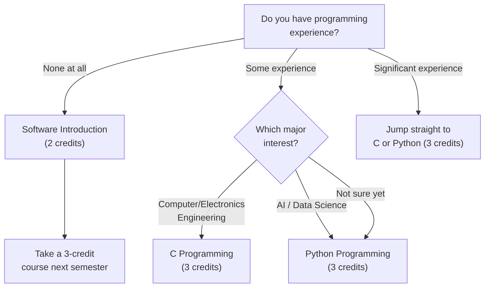

# Mata Kuliah Wajib untuk Mahasiswa Baru

Terlepas dari jurusan yang Anda tuju, apakah Anda cenderung ke STEM atau humaniora, dan terlepas dari kewarganegaraan Anda, **setiap mahasiswa baru wajib menyelesaikan** mata kuliah berikut. Susun jadwal Anda berdasarkan mata kuliah ini terlebih dahulu, lalu isi sisanya.

---

## Chapel 1 (0 SKS, setiap semester)

Chapel tidak memiliki SKS tetapi **wajib setiap semester**. Anda harus menyelesaikan Chapel 1 sampai Chapel 6 selama enam semester, dan kegagalan melakukannya akan mencegah Anda lulus.

Kesalahan mahasiswa baru paling umum dengan Chapel: banyak yang mengira mereka cukup hadir tanpa mendaftar. **Anda harus mendaftarkan Chapel di sistem pendaftaran mata kuliah.** Setiap tahun, ada mahasiswa yang hadir Chapel dengan setia selama satu semester penuh, hanya untuk mengetahui di akhir bahwa mereka tidak pernah mendaftar — dan kehadiran mereka tidak dihitung. Kesalahan ini sangat sulit diperbaiki.

Kehadiran Chapel menggunakan **sistem tag kode QR**. Anda harus datang tepat waktu dan memindai kode QR. Jika Anda melewatkan pemindaian, koreksi retroaktif hampir mustahil. Jangan terlambat.

> **Semester Genap 2026:** Chapel 1 (GEK10001), Section 01 — Wed periods 4, 5, 6 (Hyoam Main Building) / Bahasa: Korean (0% English)

---

## Community Leadership Training 1 (0.5 SKS, setiap semester)

Seperti Chapel, mata kuliah ini wajib setiap semester. Fokusnya pada kepemimpinan dan kerja tim dalam komunitas tempat tinggal Anda. **Kesalahan pendaftaran yang sama terjadi di sini** — mahasiswa berpartisipasi dalam pertemuan tim mingguan sepanjang semester tanpa benar-benar mendaftar di sistem. Daftarkan!

> **Semester Genap 2026:** Community Leadership Training 1 (GEK10008), Section 01 — Waktu TBA (diumumkan kemudian)

---

## Handong Character Education (1 SKS, satu kali)

Ini adalah mata kuliah inti dalam filosofi pendidikan karakter Handong. Tersedia beberapa kelas. **Section 01 diajarkan 100% dalam Bahasa Inggris**, menjadikannya pilihan ideal untuk mahasiswa internasional.

> **Kelas Semester Genap 2026:**

| Section | Professor | Time | English % | Note |
|---------|-----------|------|-----------|------|
| **01** | **Shushan Marie Richardson** | **Mon 5** | **100%** | **Direkomendasikan untuk mahasiswa internasional** |
| 02 | 이상산 | Wed 2 | 0% | Korean |
| 03 | 최희열 | Wed 2 | 0% | Korean |
| 04 | 손화철 | Wed 2 | 0% | Korean |
| 05 | 최혜봉 | Wed 2 | 0% | Korean |
| 06 | 윤상헌 | Wed 2 | 0% | Korean |

Section 02 sampai 06 semua berlangsung pada Wednesday period 2, jadi perbedaannya hanya pada dosen. Jika Anda nyaman dengan Bahasa Korea, tanyakan kepada 섬김이 (mentor mahasiswa) Anda tentang gaya mengajar masing-masing dosen sebelum memilih.

---

## Christian Faith Foundation (CF1) — 2 SKS

Anda harus menyelesaikan satu mata kuliah dari kategori ini: Understanding the Bible, Bible and Life, atau Bible and Spiritual Growth. Mata kuliah ini dianggap setara, jadi Anda hanya perlu mengambil satu.

### Understanding the Bible (GEK20058) — 15 Kelas

Ini adalah mata kuliah yang paling banyak ditawarkan, dengan 15 kelas tersedia, sehingga paling mudah dimasukkan ke jadwal apa pun.

| Section | Professor | Time | English % | Note |
|---------|-----------|------|-----------|------|
| 01 | 김완진 | Mon 2, Thu 2 | 0% | |
| 02 | 김완진 | Mon 3, Thu 3 | 0% | |
| 03 | 김완진 | Mon 4, Thu 4 | 0% | |
| 04 | 이재현 | Tue 2, Fri 2 | 0% | |
| 05 | 이재현 | Tue 3, Fri 3 | 0% | |
| 06 | 이재현 | Tue 5, Fri 5 | 0% | |
| **07** | **Joshua Kim** | **Tue 1, Fri 1** | **100%** | **English section** |
| 08 | Joshua Kim | Tue 2, Fri 2 | 0% | |
| 09 | Joshua Kim | Tue 3, Fri 3 | 0% | |
| 10 | 최성호 | Tue 2, Fri 2 | 0% | |
| **11** | **최성호** | **Tue 3, Fri 3** | **100%** | **English section** |
| **12** | **최성호** | **Tue 5, Fri 5** | **100%** | **English section** |
| 13 | 한은선 | Mon 1, Thu 1 | 0% | |
| 14 | 한은선 | Mon 2, Thu 2 | 0% | |
| 15 | 한은선 | Mon 3, Thu 3 | 0% | |

**Untuk mahasiswa internasional**: Pilih Section 07 (Joshua Kim, 100% English), Section 11 (최성호, 100% English), atau Section 12 (최성호, 100% English). Perlu diketahui bahwa kelas berbahasa Inggris populer dan bisa penuh dengan cepat saat pra-pendaftaran — selalu siapkan rencana cadangan.

### Understanding Christianity (GEK20059)

| Section | Professor | Time | English % | Note |
|---------|-----------|------|-----------|------|
| **01** | **Gregory T. Brown** | **Mon 2, Thu 2** | **100%** | **English** |
| **02** | **Gregory T. Brown** | **Mon 3, Thu 3** | **100%** | **English** |

Kedua kelas diajarkan sepenuhnya dalam Bahasa Inggris. Ini adalah alternatif yang sangat baik jika kelas Understanding the Bible berbahasa Inggris sudah penuh.

---

## Worldview — 2 SKS

Anda harus mengambil satu mata kuliah dari kategori ini: Creation and Evolution, Christians and Mission, atau Christian Worldview. Masing-masing memiliki kelas berbahasa Korea dan Inggris.

| Course | Section | Professor | Time | English % |
|--------|---------|-----------|------|-----------|
| Creation and Evolution (GEK10011) | 01 | 김광 et al. | Wed 2, 3 | 0% |
| **Creation and Evolution (GEK10011)** | **02** | **Holzapfel Wilhelm et al.** | **Wed 2, 3** | **100%** |
| Christians and Mission (GEK20069) | 01 | 조혜신 et al. | Mon 6, 7 | 0% |
| **Christians and Mission (GEK20069)** | **02** | **진기영** | **Wed 2, 3** | **100%** |
| Christian Worldview (GEK20011) | 01 | 최용준 | Mon 3, Thu 3 | 0% |
| **Christian Worldview (GEK20011)** | **02** | **최용준** | **Tue 2, Fri 2** | **100%** |

**Perhatikan konflik waktu:** Beberapa mata kuliah berkumpul di slot Wed 2-3. Jika Anda mengambil Character Education kelas 02-06 (Wed 2), Anda tidak bisa juga mengambil mata kuliah Worldview di Wed 2-3. Rencanakan dengan matang.

---

## Social Service (1 SKS x 2 mata kuliah total)

Anda harus menyelesaikan dua mata kuliah Social Service (dari Social Service 1-4) sebelum lulus. Disarankan mengambil satu per semester.

> **Semester Genap 2026:** Social Service 1 (GEK10046) Section 01, Social Service 2 (GEK20046) Section 01 — Tidak ada waktu kelas tetap (berbasis praktik)

---

## Persyaratan ICT (7 SKS untuk SEMUA mahasiswa)

Setiap mahasiswa Handong, terlepas dari jurusan, harus menyelesaikan **7 SKS mata kuliah ICT Convergence**: 5 SKS Pemrograman + 2 SKS Aplikasi. Ini tidak opsional, dan berlaku sama untuk mahasiswa humaniora dan ilmu sosial.

### Mata Kuliah ICT Berbahasa Inggris yang Direkomendasikan untuk Mahasiswa Internasional

| Course | Code | Credits | Section | Professor | Time | English % |
|--------|------|---------|---------|-----------|------|-----------|
| **Python Programming** | GCS10004 | 3 | **05** | 박지현 | Mon 5, Thu 5 | **100%** |
| **Frontend Introduction** | GCS10081 | 3 | **04** | 박지현 | Tue 6, Fri 6 | **100%** |

**Catatan berguna:** OIA (Office of International Admissions) terkadang menyediakan kursi di mata kuliah pemrograman khusus untuk mahasiswa baru internasional. Jika Anda mahasiswa internasional, tanyakan OIA tentang ini — bisa menyelamatkan Anda dari pertempuran pendaftaran.

### Memilih Jalur Anda: C, Python, atau Software Introduction?

Jika Anda tidak memiliki latar belakang coding dan merasa terintimidasi, Software Introduction (GCS10001, 2 SKS) adalah titik awal yang lembut. Namun, jika Anda serius mempertimbangkan jurusan STEM apa pun, tantang diri Anda untuk mengambil Python atau C langsung — ini menghemat satu semester penuh.

---

*Last updated: 2026-02-21*
