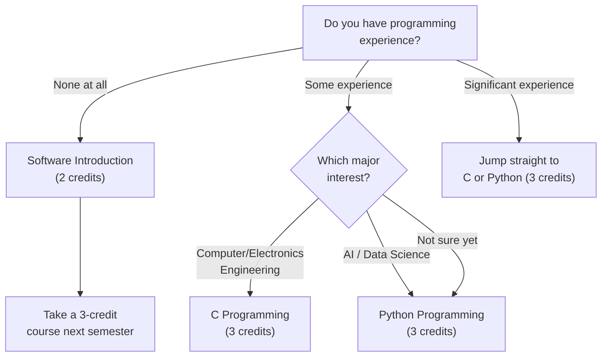

# Mata Kuliah Wajib untuk Mahasiswa Baru

Apapun jurusan yang kamu tuju — STEM atau humaniora — dan dari negara manapun kamu berasal, **setiap mahasiswa baru wajib menyelesaikan** mata kuliah berikut. Susun jadwalmu berdasarkan mata kuliah ini dulu, baru isi sisanya.

---

## Chapel 1 (0 SKS, setiap semester)

Chapel tidak ada SKS-nya, tapi **wajib setiap semester**. Kamu harus menyelesaikan Chapel 1 sampai Chapel 6 selama enam semester — kalau tidak, kamu tidak bisa lulus.

Kesalahan paling umum mahasiswa baru soal Chapel: banyak yang kira cukup datang hadir tanpa perlu daftar. **Salah besar — kamu harus mendaftarkan Chapel di sistem pendaftaran mata kuliah.** Setiap tahun ada mahasiswa yang rajin hadir Chapel selama satu semester penuh, tapi di akhir semester baru sadar mereka tidak pernah mendaftar — dan kehadirannya tidak dihitung. Kesalahan ini sangat susah diperbaiki.

Kehadiran Chapel menggunakan **sistem scan kode QR**. Kamu harus datang tepat waktu dan scan kode QR-nya. Kalau terlewat, koreksi retroaktif hampir mustahil dilakukan. Jangan telat.

> **Semester Genap 2026:** Chapel 1 (GEK10001), Section 01 — Wed periods 4, 5, 6 (Hyoam Main Building) / Bahasa: Korean (0% English)

---

## Community Leadership Training 1 (0.5 SKS, setiap semester)

Sama seperti Chapel, mata kuliah ini wajib setiap semester. Fokusnya pada kepemimpinan dan kerja tim di komunitas asramamu. **Kesalahan pendaftaran yang sama juga sering terjadi di sini** — mahasiswa ikut pertemuan tim mingguan sepanjang semester tanpa benar-benar mendaftar di sistem. Jangan sampai kamu melakukan hal yang sama — daftar sekarang!

> **Semester Genap 2026:** Community Leadership Training 1 (GEK10008), Section 01 — Waktu TBA (diumumkan kemudian)

---

## Handong Character Education (1 SKS, satu kali)

Ini adalah mata kuliah inti dalam filosofi pendidikan karakter Handong. Ada beberapa pilihan kelas. **Section 01 diajarkan 100% dalam Bahasa Inggris**, sehingga jadi pilihan ideal untuk mahasiswa internasional.

> **Kelas Semester Genap 2026:**

| Section | Professor | Time | English % | Note |
|---------|-----------|------|-----------|------|
| **01** | **Shushan Marie Richardson** | **Mon 5** | **100%** | **Direkomendasikan untuk mahasiswa internasional** |
| 02 | 이상산 | Wed 2 | 0% | Korean |
| 03 | 최희열 | Wed 2 | 0% | Korean |
| 04 | 손화철 | Wed 2 | 0% | Korean |
| 05 | 최혜봉 | Wed 2 | 0% | Korean |
| 06 | 윤상헌 | Wed 2 | 0% | Korean |

Section 02 sampai 06 semuanya di Wednesday period 2, jadi perbedaannya hanya pada dosen. Kalau kamu sudah nyaman berbahasa Korea, coba tanyakan ke 섬김이 (student mentor) kamu tentang gaya mengajar masing-masing dosen sebelum memilih.

---

## Christian Faith Foundation (CF1) — 2 SKS

Kamu harus menyelesaikan satu mata kuliah dari kategori ini: Understanding the Bible, Bible and Life, atau Bible and Spiritual Growth. Mata kuliah-mata kuliah ini setara, jadi kamu hanya perlu ambil salah satu.

### Understanding the Bible (GEK20058) — 15 Kelas

Ini mata kuliah yang paling banyak ditawarkan — ada 15 kelas — sehingga paling gampang masuk ke jadwal apapun.

| Section | Professor | Time | English % | Note |
|---------|-----------|------|-----------|------|
| 01 | 김완진 | Mon 2, Thu 2 | 0% | |
| 02 | 김완진 | Mon 3, Thu 3 | 0% | |
| 03 | 김완진 | Mon 4, Thu 4 | 0% | |
| 04 | 이재현 | Tue 2, Fri 2 | 0% | |
| 05 | 이재현 | Tue 3, Fri 3 | 0% | |
| 06 | 이재현 | Tue 5, Fri 5 | 0% | |
| **07** | **Joshua Kim** | **Tue 1, Fri 1** | **100%** | **English section** |
| 08 | Joshua Kim | Tue 2, Fri 2 | 0% | |
| 09 | Joshua Kim | Tue 3, Fri 3 | 0% | |
| 10 | 최성호 | Tue 2, Fri 2 | 0% | |
| **11** | **최성호** | **Tue 3, Fri 3** | **100%** | **English section** |
| **12** | **최성호** | **Tue 5, Fri 5** | **100%** | **English section** |
| 13 | 한은선 | Mon 1, Thu 1 | 0% | |
| 14 | 한은선 | Mon 2, Thu 2 | 0% | |
| 15 | 한은선 | Mon 3, Thu 3 | 0% | |

**Untuk mahasiswa internasional**: Pilih Section 07 (Joshua Kim, 100% English), Section 11 (최성호, 100% English), atau Section 12 (최성호, 100% English). Perlu diingat bahwa kelas berbahasa Inggris ini populer dan bisa cepat penuh saat pra-pendaftaran — selalu siapkan rencana cadangan.

### Understanding Christianity (GEK20059)

| Section | Professor | Time | English % | Note |
|---------|-----------|------|-----------|------|
| **01** | **Gregory T. Brown** | **Mon 2, Thu 2** | **100%** | **English** |
| **02** | **Gregory T. Brown** | **Mon 3, Thu 3** | **100%** | **English** |

Kedua kelas diajarkan sepenuhnya dalam Bahasa Inggris. Ini alternatif yang sangat bagus kalau kelas Understanding the Bible berbahasa Inggris sudah penuh.

---

## Worldview — 2 SKS

Kamu harus mengambil satu mata kuliah dari kategori ini: Creation and Evolution, Christians and Mission, atau Christian Worldview. Masing-masing punya kelas berbahasa Korea dan Inggris.

| Course | Section | Professor | Time | English % |
|--------|---------|-----------|------|-----------|
| Creation and Evolution (GEK10011) | 01 | 김광 et al. | Wed 2, 3 | 0% |
| **Creation and Evolution (GEK10011)** | **02** | **Holzapfel Wilhelm et al.** | **Wed 2, 3** | **100%** |
| Christians and Mission (GEK20069) | 01 | 조혜신 et al. | Mon 6, 7 | 0% |
| **Christians and Mission (GEK20069)** | **02** | **진기영** | **Wed 2, 3** | **100%** |
| Christian Worldview (GEK20011) | 01 | 최용준 | Mon 3, Thu 3 | 0% |
| **Christian Worldview (GEK20011)** | **02** | **최용준** | **Tue 2, Fri 2** | **100%** |

**Perhatikan konflik waktu:** Beberapa mata kuliah menumpuk di slot Wed 2-3. Kalau kamu ambil Character Education kelas 02-06 (Wed 2), kamu tidak bisa ambil mata kuliah Worldview yang juga di Wed 2-3 secara bersamaan. Rencanakan dengan matang.

---

## Social Service (1 SKS x 2 mata kuliah)

Kamu harus menyelesaikan dua mata kuliah Social Service (dari Social Service 1-4) sebelum lulus. Disarankan ambil satu per semester.

> **Semester Genap 2026:** Social Service 1 (GEK10046) Section 01, Social Service 2 (GEK20046) Section 01 — Tidak ada waktu kelas tetap (berbasis praktik)

---

## Persyaratan ICT (7 SKS untuk SEMUA mahasiswa)

Setiap mahasiswa Handong, apapun jurusannya, wajib menyelesaikan **7 SKS mata kuliah ICT Convergence**: 5 SKS pemrograman + 2 SKS aplikasi. Ini bukan opsional — berlaku sama untuk mahasiswa humaniora dan ilmu sosial.

### Mata Kuliah ICT Berbahasa Inggris yang Direkomendasikan untuk Mahasiswa Internasional

| Course | Code | Credits | Section | Professor | Time | English % |
|--------|------|---------|---------|-----------|------|-----------|
| **Python Programming** | GCS10004 | 3 | **05** | 박지현 | Mon 5, Thu 5 | **100%** |
| **Frontend Introduction** | GCS10081 | 3 | **04** | 박지현 | Tue 6, Fri 6 | **100%** |

**Info berguna:** OIA (Office of International Admissions) terkadang menyediakan kursi khusus di mata kuliah pemrograman untuk mahasiswa baru internasional. Kalau kamu mahasiswa internasional, tanyakan OIA soal ini — bisa menyelamatkan kamu dari perebutan kursi yang ketat.

### Pilih Jalurmu: C, Python, atau Software Introduction?

Kalau kamu sama sekali tidak punya background coding dan merasa gentar, Software Introduction (GCS10001, 2 SKS) bisa jadi titik awal yang lebih nyaman. Tapi kalau kamu serius mempertimbangkan jurusan STEM apapun, tantang dirimu untuk langsung ambil Python atau C — ini menghemat satu semester penuh.

---

*Last updated: 2026-02-21*
