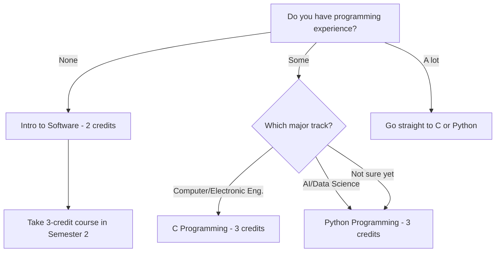
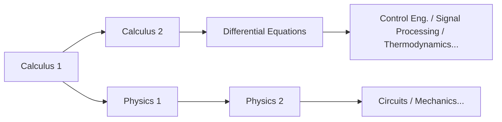

# Panduan Mata Kuliah STEM untuk Mahasiswa Baru

> Strategi mata kuliah untuk mahasiswa baru yang tertarik dengan Teknik, Ilmu Komputer, AI, dan Ilmu Pengetahuan Alam
> Panduan utama: [[Spring 2026 Freshman Registration Guide]]

---

## 1. Untuk Siapa Panduan Ini?

Panduan ini ditulis untuk **mahasiswa baru Angkatan 2026** yang mempertimbangkan jurusan-jurusan berikut:

- **School of AI Computer & Electronic Engineering (CSEE)**: Computer Engineering, Electronic Engineering, AI, Software, Embedded Systems
- **Mechanical & Control Engineering**: Mechanical Engineering, Electronic Control Engineering, Energy Engineering
- **Spatial Environment & Systems Engineering**: Construction Engineering, Urban & Environmental Engineering
- **Life Sciences**: Life Science, Food Science

Bahkan kalau kamu berpikir "Saya belum yakin jurusan pastinya, tapi tahu saya orang STEM" — tenang, panduan ini memang untuk kamu. Di Handong, kamu tidak mendeklarasikan jurusan di tahun pertama. Artinya strategi intinya adalah **mengisi tahun pertama dengan mata kuliah dasar yang akan berguna apapun jurusan STEM yang akhirnya kamu pilih.**

### Kenapa Fondasi Tahun Pertama Sangat Penting

Mata kuliah STEM dibangun seperti **tangga**. Kamu tidak bisa ambil Differential Equations tanpa Calculus. Kamu tidak bisa pahami Control Engineering tanpa Differential Equations. Kamu tidak bisa mengikuti kuliah Machine Learning ketika operasi matriks muncul kalau belum ambil Linear Algebra. Kamu tidak bisa pahami kenapa hukum Kirchhoff berbentuk demikian di Circuit Theory tanpa Physics.

Dengan kata lain, kalau kamu skip fondasi matematika dan sains di Tahun 1, mata kuliah jurusanmu akan **runtuh seperti domino** mulai Tahun 2. Di STEM, "nanti saja" hanyalah cara lain untuk bilang "saya akan menderita nanti."

### Cara Membaca Kode Mata Kuliah: Jangan Lewati Ini

Kode mata kuliah Handong mengandung info tersembunyi tapi penting. Misalnya, dalam `GCS10058`:

- **GCS**: Kode departemen/bidang (GCS = Global Creative Software)
- **1**0058: Digit pertama menunjukkan **level tahun**

Kenapa ini penting? **Mata kuliah yang dimulai dengan 1 ditujukan untuk tahun pertama; yang dimulai dengan 3 atau 4 untuk mahasiswa senior.** Beberapa mahasiswa baru terlalu ambisius dan coba daftar mata kuliah 3xxx atau 4xxx — ini seperti membangun rumah tanpa fondasi. Meski sistem pendaftaran tidak memblokir kamu, **tetap pada mata kuliah 1xxx di tahun pertama.**

Demikian pula, ambil mata kuliah jurusan lanjutan sebelum jurusanmu dikonfirmasi itu berisiko. Jauh lebih bijak untuk mengisi jadwal dengan **mata kuliah yang berlaku universal** seperti Calculus, Physics, Programming, dan Linear Algebra.

---

## 2. Mata Kuliah yang Harus Kamu Ambil di Tahun 1

### 2.1 Calculus 1 — Titik Awal untuk Semua STEM

Calculus adalah **bahasa umum** dari hampir setiap bidang: teknik, fisika, ilmu komputer, bahkan ekonomi. Diferensiasi berkaitan dengan "laju perubahan," dan integrasi berkaitan dengan "kuantitas terakumulasi" — tanpa kedua konsep ini, tidak ada mata kuliah STEM tingkat lanjut yang bisa diakses.

Bayangkan Calculus sebagai **alfabet** dari belajar bahasa asing. Tanpa alfabet kamu tidak bisa baca kata, dan tanpa kata kamu tidak bisa pahami kalimat. Tidak peduli apakah kamu jago atau tidak jago matematika di SMA — Calculus universitas berada di kedalaman yang berbeda secara fundamental. Kamu akan melatih pemikiran matematis yang ketat, dimulai dari definisi epsilon-delta.

**Peta jalan ideal**: Semester 1 Calculus 1 → Semester 2 Calculus 2 → Semester 3 Differential Equations. Kalau urutan ini bergeser bahkan satu semester, masukmu ke mata kuliah jurusan ikut tertunda.

> **2026 Spring — Calculus 1 (GEK10095) Sections:**

| Section | Professor | Time | English % | Notes |
|---------|-----------|------|-----------|-------|
| 01 | Lee Hanjin | Mon P4, Thu P4 | 0% | Korean instruction |
| 02 | Lee Hanjin | Mon P6, Thu P6 | 0% | Korean instruction, later time slot |
| **03** | **Kim Minjae** | **Mon P4, Thu P4** | **100%** | **English instruction** |
| **04** | **Cho Janghwan** | **Mon P1, Thu P1** | **100%** | **English instruction, Period 1** |

*Period system: P1 = 9:00–10:00, P2 = 10:00–11:00, P3 = 11:00–12:00, P4 = 12:00–13:00, P5 = 13:00–14:00, P6 = 14:00–15:00, P7 = 15:00–16:00*

**Cara memilih kelasmu:**

- **Kalau kamu nyaman berbahasa Korea**: Section 01 (Lee Hanjin, Mon P4 / Thu P4) atau Section 02 (Lee Hanjin, Mon P6 / Thu P6). Dosen yang sama, beda waktu saja.
- **Kalau kamu butuh instruksi Bahasa Inggris**: **Section 03 (Kim Minjae) atau Section 04 (Cho Janghwan)**. Tapi, Section 04 ada di **Period 1 (jam 9 pagi)**. Di semester pertama saat kamu masih beradaptasi, menghindari Period 1 adalah keputusan bijak kalau ada pilihan lain. Kalau itu satu-satunya opsi untuk mata kuliah wajib, ambil saja — tapi kalau ada alternatif, jadwalkan Period 2 atau lebih.

> **Jebakan "Kelas Bahasa Inggris"**: Bahkan untuk dosen yang sama, kelas yang berbeda mungkin diajarkan dalam bahasa berbeda. Selalu verifikasi bahasa kuliah untuk setiap kelas. Kalau kemampuan Bahasa Koreamu tidak cukup kuat dan kamu masuk ke kelas berbahasa Korea, kamu akan berjuang melawan matematika dan bahasa sekaligus. Hal yang sama berlaku sebaliknya — cek sebelum daftar.

### 2.2 Calculus 2 — Ambil di Semester 1 Kalau Bisa

Biasanya Calculus 2 diambil di Semester 2, tapi kalau kamu punya fondasi Calculus SMA yang kuat, kamu bisa ambil Calculus 1 dan 2 bersamaan di Semester 1. Ini memungkinkan kamu ambil Differential Equations paling cepat di Semester 2, mempercepat masuk ke mata kuliah jurusan satu semester penuh.

Tapi ini **hanya direkomendasikan kalau kamu benar-benar yakin dengan kemampuan matematikamu**. Lebih baik kuasai satu mata kuliah dengan solid daripada memaksakan diri dan kehilangan keduanya.

> **2026 Spring — Calculus 2 (GEK10096) Sections:**

| Section | Professor | Time | English % | Notes |
|---------|-----------|------|-----------|-------|
| **01** | **Lee Hanjin** | **Mon P2, Thu P2** | **100%** | **English instruction** |
| 02 | Kim Taehee | Mon P1, Thu P1 | 0% | Period 1 |
| 03 | Kim Taehee | Mon P2, Thu P2 | 0% | Korean instruction |

### 2.3 Physics — Bahasa Para Insinyur

Kalau kamu mengarah ke jalur teknik (Computer & Electronic, Mechanical & Control, Spatial Environment), Physics **bukan opsional — wajib**. Physics 1 mencakup mekanika dan termodinamika, mengajarkan cara menangani gaya, energi, dan momentum dengan ketelitian matematis. Ini berujung ke Physics 2 (elektromagnetisme) di Semester 2, yang merupakan fondasi langsung Electronic Engineering.

Bayangkan Physics sebagai **bahasa pemrograman alam**. Untuk merancang apapun sebagai insinyur, kamu perlu pahami hukum alam — dan hukum-hukum itu adalah Physics.

> **2026 Spring — Physics 1 (GEK10055):**

| Section | Professor | Time | English % |
|---------|-----------|------|-----------|
| 01 | Cho Hyunji | Mon P2, Thu P2 | 0% |
| 02 | Cho Hyunji | Mon P3, Thu P3 | 0% |

**Physics 1 vs. Introduction to Physics**: Kalau kamu mempertimbangkan Computer Science atau AI, kamu bisa ganti dengan "Introduction to Physics" (물리학 개론). Cakupannya lebih luas dari Physics 1 tapi dengan kedalaman yang lebih dangkal — cukup untuk membangun intuisi teknik. Tapi kalau kamu serius mempertimbangkan Electronic Engineering atau Mechanical Engineering, di mana Physics sangat erat kaitannya dengan jurusan, **ambil Physics 1 tanpa pikir panjang.**

> **Introduction to Physics (GEK10090) — Alternatif untuk Physics 1:**

| Section | Professor | Time | English % |
|---------|-----------|------|-----------|
| 01 | Cho Hyunji | Tue P2, Fri P2 | 0% |
| 02 | Cho Hyunji | Tue P3, Fri P3 | 0% |

### 2.4 Linear Algebra — Matematika Esensial untuk Era AI

Linear Algebra adalah salah satu **dua pilar besar** matematika STEM bersama Calculus. Ini mencakup vektor, matriks, eigenvalue, dan transformasi linear — dan merupakan **jantung matematis** dari AI dan machine learning.

Kenapa? Dalam machine learning, data direpresentasikan sebagai matriks, dan pelatihan model dilakukan melalui operasi matriks. Bahkan backpropagation dalam deep learning pada akhirnya adalah diferensiasi matriks. Tanpa Linear Algebra, kamu tidak bisa pahami *kenapa* hal-hal bekerja dalam mata kuliah AI — kamu hanya akan menyalin kode tanpa pengertian.

Sangat direkomendasikan untuk ambil bersamaan dengan Calculus 1 di Semester 1. Memang berat, tapi menyelesaikan keduanya di semester pertama akan **membuka opsi kamu secara eksplosif** mulai Semester 2 dan seterusnya.

> **2026 Spring — Linear Algebra (GEK10082):**

| Section | Professor | Time | English % | Notes |
|---------|-----------|------|-----------|-------|
| **01** | **Cho Janghwan** | **Mon P3, Thu P3** | **100%** | **English instruction** |
| **02** | **Cho Janghwan** | **Mon P5, Thu P5** | **100%** | **English instruction** |
| 03 | Kim Hyunsu | Tue P2, Fri P2 | 0% | Korean instruction |
| 04 | Kim Hyunsu | Tue P3, Fri P3 | 0% | Korean instruction |

### 2.5 ICT Programming — Langkah Pertama dalam Coding

Di Handong, semua mahasiswa harus menyelesaikan **7 SKS ICT Convergence Fundamentals**: 5 SKS pemrograman + 2 SKS ICT terapan. Untuk mahasiswa STEM, pemrograman bukan sekadar persyaratan pendidikan umum — ini adalah **alat jurusanmu.**

**Kenapa kamu harus selesaikan pemrograman di Tahun 1**: Mulai Tahun 2, tugas-tugas pemrograman akan mengalir dari mata kuliah jurusanmu. Kalau kamu masih ambil mata kuliah pemrograman dasar di titik itu, pemborosan waktunya parah. Idealnya, ambil mata kuliah pemrograman 3 SKS (Python/C) di Semester 1, dan selesaikan sisanya di Semester 2.

> **OIA (Office of International Admissions) Reserved Seats**: Mata kuliah pemrograman terkadang punya **kursi yang khusus disediakan OIA untuk mahasiswa baru internasional.** Kalau kamu mahasiswa internasional, pastikan manfaatkan ini — ini secara signifikan meningkatkan peluangmu masuk ke kelas populer.

#### Pilih Jalurmu: Mulai dari Mana

#### C vs. Python: Mana Dulu?

Kalau kamu mempertimbangkan Computer Engineering atau Electronic Engineering, **C jauh lebih menguntungkan**. C adalah fondasi dari operating system, embedded system, dan kontrol hardware — inti pemrograman tingkat rendah. Kalau belajar C dulu, kamu bisa kuasai Python dalam sekitar seminggu. Sebaliknya, kalau kamu hanya kenal Python, kamu akan mentok saat akhirnya belajar C dan bertemu manajemen memori dan pointer.

Kalau AI atau Data Science adalah jalurmu, mulai dengan Python tidak masalah. Ini bahasa yang paling banyak dipakai dalam praktik, dan hambatan masuknya yang rendah memungkinkan kamu merasakan kesenangan programming lebih cepat.

> **Intro to Software (GCS10001) — 2 credits, untuk pemula total:**

| Section | Professor | Time | English % |
|---------|-----------|------|-----------|
| 01 | Kim Heonju | Mon P1, Thu P1 | 0% |
| 02 | Lee Sanghun | Mon P5, Thu P5 | 0% |
| 03 | Lee Sanghun | Mon P6, Thu P6 | 0% |
| 04 | Kim Hyunsuk | Tue P2, Fri P2 | 0% |
| 05 | Kim Hyunsuk | Tue P4, Fri P4 | 0% |
| 06 | Kim Hyunsuk | Tue P6, Fri P6 | 0% |

> **C Programming (GCS10058) — 3 credits, untuk jalur Computer/Electronic Eng.:**

| Section | Professor | Time | English % |
|---------|-----------|------|-----------|
| 01 | Kim Kwang | Tue P2, Fri P2 | 0% |

C Programming hanya punya **1 kelas**. Persaingan mungkin ketat, jadi daftar segera saat pendaftaran mata kuliah.

> **Python Programming (GCS10004) — 3 credits, untuk jalur AI/Data Science:**

| Section | Professor | Time | English % |
|---------|-----------|------|-----------|
| 01 | Kim Kyungmi | Mon P2, Thu P2 | 0% |
| 02 | Kim Kyungmi | Tue P2, Fri P2 | 0% |
| 03 | Kim Kyungmi | Tue P3, Fri P3 | 0% |
| 04 | Park Jihyun | Mon P3, Thu P3 | 0% |
| **05** | **Park Jihyun** | **Mon P5, Thu P5** | **100%** |
| 06 | Yong Hwangi | Tue P3, Fri P3 | 0% |

> **Intro to Frontend (GCS10081) — 2 credits, bagi yang tertarik web development:**

| Section | Professor | Time | English % |
|---------|-----------|------|-----------|
| 01 | Kim Guno | Mon P2, Thu P2 | 0% |
| 02 | Kim Guno | Mon P3, Thu P3 | 0% |
| 03 | Park Jihyun | Tue P5, Fri P5 | 0% |
| **04** | **Park Jihyun** | **Tue P6, Fri P6** | **100%** |
| 05 | Yang Jihye | Mon P3, Thu P3 | 0% |
| 06 | Yang Jihye | Mon P4, Thu P4 | 0% |

Intro to Frontend mencakup dasar-dasar web development — HTML, CSS, JavaScript. Bisa dihitung untuk persyaratan ICT terapan 2 SKS, atau diakui sebagai mata kuliah pemrograman 2 SKS. Layak dipertimbangkan kalau web development menarik minatmu.

### 2.6 General Chemistry — Wajib untuk Jalur Life Sciences/Kimia

Kalau kamu mempertimbangkan Life Sciences atau jurusan terkait kimia, General Chemistry sangat penting. Ini mencakup struktur atom, ikatan kimia, kinetika reaksi, dan dasar-dasar kimia lainnya, serta jadi prasyarat untuk Biochemistry dan Organic Chemistry.

> **2026 Spring — General Chemistry (GEK10058):**

| Section | Professor | Time | English % | Notes |
|---------|-----------|------|-----------|-------|
| 01 | Kim Minkyung | Thu P3, P4 (consecutive) | 0% | 2 consecutive hours on Thursday |
| **02** | **Yu Taejun** | **Mon P2, Thu P2** | **100%** | **English instruction** |

### 2.7 General Biology — Mata Kuliah yang Butuh Kejujuran

General Biology dibutuhkan untuk masuk Life Sciences, tapi ada **satu kenyataan jujur** yang perlu kamu dengar.

**Persaingan General Biology sangat ketat.** Hanya ada sedikit kelas, dan mahasiswa yang mengulang serta kakak tingkat sering mengisi kursi lebih dulu, sehingga **sangat susah bagi mahasiswa baru untuk masuk di Semester 1.** Daripada ngotot "Saya HARUS ambil di Semester 1" dan melewatkan jendela pendaftaran untuk mata kuliah penting lain, **strategi yang jauh lebih bijak** adalah tetap fleksibel: ambil kalau kursi terbuka, dan tunda ke Semester 2 kalau tidak.

Di Semester 1, amankan tempatmu di Calculus, Linear Algebra, dan Programming — **mata kuliah yang berguna apapun yang terjadi** — daripada taruhkan segalanya pada General Biology. Mata kuliah ini juga ditawarkan di Semester 2.

> **2026 Spring — General Biology (GEK10057):**

| Section | Professor | Time | English % |
|---------|-----------|------|-----------|
| 01 | Hyun Changgi et al. | Mon P5, Thu P5 | 0% |
| **02** | **Holzapfel Wilhelm et al.** | **Mon P2, Thu P2** | **100%** |
| 03 | Hyun Changgi et al. | Mon P6, Thu P6 | 0% |

### 2.8 Introduction to AI, Computer & Electronic Engineering — Mencicipi Jurusan

Kalau kamu tertarik dengan School of AI Computer & Electronic Engineering (CSEE), mata kuliah pengantar ini memberikan gambaran besar bidangnya. Cara yang bagus untuk tahu apakah "bidang ini cocok buat saya" sebelum berkomitmen pada mata kuliah jurusan penuh.

> **2026 Spring — Intro to AI, Computer & Electronic Eng. (ECE10006):**

| Section | Professor | Time | English % | Notes |
|---------|-----------|------|-----------|-------|
| 01 | Hwang Sungsu et al. | Mon P6, P7 (consecutive) | 0% | Monday late time slot |

### 2.9 Differential Equations and Applications — Kalau Matematikamu Kuat

Kalau kamu sudah selesaikan Calculus 1 & 2, atau kalau kamu sudah ambil AP Calculus BC di SMA, mengambil Differential Equations di Semester 1 dimungkinkan. Tapi ini **hanya direkomendasikan kalau fondasi matematikamu benar-benar kuat.**

> **2026 Spring — Differential Equations and Applications (GEK10053):**

| Section | Professor | Time | English % |
|---------|-----------|------|-----------|
| 01 | Kim Taehee | Mon P3, Thu P3 | 0% |

---

## 3. Jadwal yang Direkomendasikan

Berikut **contoh jadwal** yang dibangun dari mata kuliah nyata yang ditawarkan di Spring 2026. Ini hanya contoh referensi — sesuaikan berdasarkan hasil EPT (English Placement Test), bidang minat, dan staminamu.

**Prinsip inti: Lebih baik daftar lebih banyak mata kuliah dan drop beberapa daripada daftar sedikit dan menyesal.** Daftar banyak, hadiri kelas di minggu pertama, dan drop yang tidak bisa kamu tangani. Sebaliknya — coba tambah mata kuliah populer selama periode penyesuaian — hampir mustahil karena kursi kosong sangat langka.

### Schedule A: Jalur Computer Science / AI

**Strategi**: Calculus + Linear Algebra + Python untuk membangun fondasi matematika dan coding secara bersamaan

| Period | Mon | Tue | Wed | Thu | Fri |
|--------|-----|-----|-----|-----|-----|
| 1 | | | | | |
| 2 | | Python(Sec.02) | | | Python(Sec.02) |
| 3 | Linear Alg(Sec.01) | | | Linear Alg(Sec.01) | |
| 4 | Calc 1(Sec.01) | | Chapel | Calc 1(Sec.01) | |
| 5 | | | Chapel | | |
| 6 | | | Chapel | | |

| Course | Code | Credits | Professor | Notes |
|--------|------|---------|-----------|-------|
| Calculus 1 (Sec. 01) | GEK10095 | 3 | Lee Hanjin | Korean |
| Linear Algebra (Sec. 01) | GEK10082 | 3 | Cho Janghwan | **English 100%** |
| Python Programming (Sec. 02) | GCS10004 | 3 | Kim Kyungmi | Korean |
| Understanding the Bible | GEK20058 | 2 | Choose section | |
| Handong Character Education | GEK10015 | 1 | Choose section | |
| Chapel 1 | GEK10001 | 0 | Wed P4,5,6 | |
| Community Leadership Training 1 | GEK10008 | 0.5 | Separate schedule | |
| Social Service 1 | GEK10046 | 1 | Separate | |
| + English (per EPT result) | - | 3 | TBD | Likely placed on Tue/Fri |
| **Total** | | **16.5 + English 3** | | |

> **Kenapa kombinasi ini?** Mengambil Calculus dan Linear Algebra bersamaan menciptakan sinergi matematis. Konsep vektor dan matriks terhubung langsung dengan fungsi multivariabel di Calculus. Python ditempatkan di Sel/Jum untuk menyeimbangkan minggu: Sen/Kam untuk matematika, Sel/Jum untuk coding + English. Begitu ritme ini jalan, membangun kebiasaan belajar jadi jauh lebih mudah.

### Schedule B: Jalur Electronic / Mechanical Engineering

**Strategi**: Calculus + Physics + C Programming untuk membangun fondasi teknik yang kokoh

| Period | Mon | Tue | Wed | Thu | Fri |
|--------|-----|-----|-----|-----|-----|
| 1 | | | | | |
| 2 | Physics 1(Sec.01) | C Prog.(Sec.01) | | Physics 1(Sec.01) | C Prog.(Sec.01) |
| 3 | | | | | |
| 4 | Calc 1(Sec.01) | | Chapel | Calc 1(Sec.01) | |
| 5 | | | Chapel | | |
| 6 | | | Chapel | | |

| Course | Code | Credits | Professor | Notes |
|--------|------|---------|-----------|-------|
| Calculus 1 (Sec. 01) | GEK10095 | 3 | Lee Hanjin | Korean |
| Physics 1 (Sec. 01) | GEK10055 | 3 | Cho Hyunji | Korean |
| C Programming (Sec. 01) | GCS10058 | 3 | Kim Kwang | Korean, only section available |
| Understanding the Bible | GEK20058 | 2 | Choose section | |
| Handong Character Education | GEK10015 | 1 | Choose section | |
| Chapel 1 | GEK10001 | 0 | Wed P4,5,6 | |
| Community Leadership Training 1 | GEK10008 | 0.5 | Separate schedule | |
| Social Service 1 | GEK10046 | 1 | Separate | |
| + English (per EPT result) | - | 3 | TBD | Likely placed on Tue/Fri |
| **Total** | | **16.5 + English 3** | | |

> **Kenapa kombinasi ini?** Electronic dan Mechanical Engineering dibangun di atas fondasi Physics. Mengambil Calculus + Physics bersamaan berarti konsep diferensiasi yang kamu pelajari di Calculus langsung diterapkan pada masalah kecepatan dan percepatan di Physics — efek **saling memperkuat** yang kuat. C Programming adalah fondasi embedded system dan kontrol hardware, menjadikannya pilihan ideal untuk calon mahasiswa Electronic/Mechanical Engineering.

---

## 4. Kesalahan Umum yang Dilakukan Mahasiswa STEM

### "Saya akan ambil matematika nanti"

Ini **kesalahan yang paling sering bikin menyesal**. Struktur mata kuliah di STEM paling tepat dipahami sebagai domino:

Menunda Calculus 1 ke Semester 2 → Calculus 2 terdorong ke Semester 3 → Differential Equations ke Semester 4 → Mata kuliah inti jurusan baru bisa diakses mulai Semester 5 dan seterusnya. Ini bisa menunda kelulusanmu satu tahun penuh. **Mulai matematika di Semester 1, tanpa pengecualian.**

### "Saya belum pernah coding, jadi cukup ambil Intro to Software saja"

Intro to Software adalah mata kuliah 2 SKS yang bersifat pengenalan. Kalau kamu serius mempertimbangkan Computer Science atau AI, skip dan langsung ambil Python atau C. Ya, ini akan lebih susah — tapi percaya deh, tantangan ini worth it untuk pertumbuhanmu. Kalau kamu ambil Intro to Software di Semester 1 dan Python di Semester 2, kamu habiskan satu tahun penuh hanya untuk dasar-dasar programming.

### Ngotot soal General Biology

Seperti sudah disebutkan, General Biology **sangat susah bagi mahasiswa baru untuk daftar di Semester 1** karena mahasiswa yang mengulang dan kakak tingkat mengklaim kursi lebih dulu. Setiap semester, ada mahasiswa yang terpaku pada General Biology dan melewatkan jendela pendaftaran untuk mata kuliah penting seperti Calculus atau Programming. Tetap fleksibel.

### Ambil mata kuliah jurusan lanjutan sebelum jurusan ditentukan

"Saya tertarik AI, jadi mungkin coba Machine Learning" — pemikiran ini berbahaya. Mata kuliah jurusan lanjutan (kode 3xxx, 4xxx) hanya masuk akal **setelah kamu membangun fondasi.** Kalau kamu ambil Machine Learning tanpa Linear Algebra, kamu tidak akan mengerti separuh kuliah.

Di Tahun 1, fokus pada **mata kuliah dasar yang berlaku untuk jurusan apapun** (Calculus, Physics, Linear Algebra, Programming). Mata kuliah spesifik jurusan mulai Tahun 2 sudah tepat waktu.

### Tidak cek bahasa kuliah

Bahkan untuk mata kuliah dan dosen yang sama, **bahasa kuliah bisa berbeda per kelas.** Misalnya, Calculus 1 Professor Cho Janghwan adalah 100% English, sementara kelas Professor Lee Hanjin dalam Korean. Selalu verifikasi bahasa kuliah untuk setiap kelas sebelum daftar. Kalau kemampuan Bahasa Koreamu tidak kuat dan kamu masuk ke kelas berbahasa Korea, kamu akan berjuang melawan mata pelajaran dan bahasa secara bersamaan — beban ganda.

### Daftar terlalu sedikit SKS

"Saya khawatir terlalu berat, jadi daftar 15 SKS saja" — strategi ini justru merugikanmu. **Jauh lebih mudah daftar lebih banyak dan drop daripada daftar sedikit dan coba tambah.** Mendapat kursi kosong di mata kuliah populer selama periode penyesuaian hampir mujizat. Mulai dengan 18-20 SKS, hadiri kelas di minggu pertama, dan drop yang tidak bisa kamu tangani. Itu pendekatan yang bijak.

---

## 5. Melihat ke Depan: Semester 2

Kalau kamu berhasil selesaikan mata kuliah di atas di Semester 1, inilah yang perlu dipertimbangkan untuk Semester 2:

| Course | Target | Why It Matters |
|--------|--------|----------------|
| **Calculus 2** | All STEM | Kelanjutan Calculus 1. Mencakup deret, Calculus multivariabel, dan prasyarat untuk Differential Equations |
| **Physics 2** | Electronic/Mechanical tracks | Mencakup elektromagnetisme — fondasi langsung Electronic Engineering |
| **Data Structures** | Computer Science/AI tracks | Array, list, tree, graph — konsep programming inti dan favorit wawancara coding |
| **General Chemistry** | Life Sciences/Chemistry | Kalau tidak bisa ambil di Semester 1, wajib di Semester 2 |
| **General Biology** | Life Sciences | Kalau tidak dapat kursi di Semester 1, coba lagi di Semester 2 |
| **Differential Equations** | Calc 1 & 2 completers | Alat matematis inti untuk jurusan teknik |

Kunci Semester 2 adalah **membangun satu lapisan lagi di atas fondasi yang kamu letakkan di Semester 1.** Kalau kamu selesaikan Calculus 1 dengan baik, secara alami lanjut ke Calculus 2. Kalau kamu selesaikan dasar-dasar programming, maju ke Data Structures. Menjaga alur ini yang menentukan lintasan empat tahunmu di universitas.

---

*Panduan ini adalah dokumen detail STEM dari [[Spring 2026 Freshman Registration Guide]].*
*Untuk versi Bahasa Korea, lihat [[이공계 신입생 가이드]].*
*Lihat juga: [[Registration Schedule]]*
> ⚠️ This guide was translated by **Claude Opus 4.6**. Translations other than Korean and English may contain inaccuracies. If something seems off, please refer to the [English](/en) or [한국어](/ko) version.

*Terakhir diperbarui: 2026-02-21*
