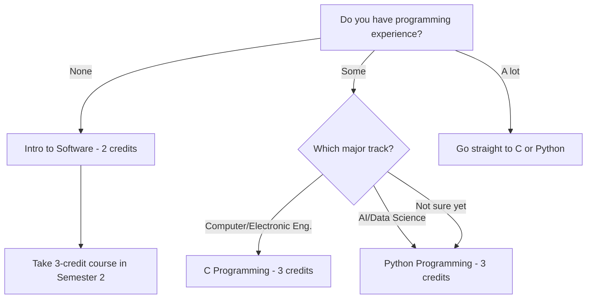
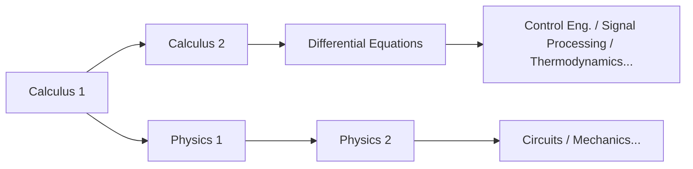

# Panduan Mata Kuliah STEM untuk Mahasiswa Baru

> Strategi mata kuliah untuk mahasiswa baru yang tertarik dengan Teknik, Ilmu Komputer, AI, dan Ilmu Pengetahuan Alam
> Panduan utama: [[Spring 2026 Freshman Registration Guide]]

---

## 🎯 1. Untuk Siapa Panduan Ini?

Panduan ini ditulis untuk **mahasiswa baru Angkatan 2026** yang mempertimbangkan jurusan-jurusan berikut:

- **AI & Computer Engineering**: Software, Artificial Intelligence, Data Science, Cybersecurity
- **Computer & Electronic Engineering**: Computer Engineering, Electronic Engineering, Embedded Systems
- **Mechanical & Control Engineering**: Mechanical Engineering, Robotics, Control Systems
- **Spatial Environment & Systems Engineering**: Construction, Environmental, Urban Engineering
- **Life Sciences**: Biology, Biotechnology, Bioengineering

Bahkan jika Anda berpikir "Saya belum yakin jurusan pastinya, tapi saya tahu saya orang STEM" — panduan ini untuk Anda. Di Handong, Anda tidak mendeklarasikan jurusan di tahun pertama. Itu berarti strategi intinya adalah **mengisi tahun pertama Anda dengan mata kuliah dasar yang akan berguna apa pun jurusan STEM yang akhirnya Anda pilih.**

### 💡 Mengapa Fondasi Tahun Pertama Anda Sangat Penting

Mata kuliah STEM dibangun seperti **tangga**. Anda tidak bisa mengambil Differential Equations tanpa Calculus. Anda tidak bisa memahami Control Engineering tanpa Differential Equations. Anda tidak bisa mengikuti kuliah Machine Learning ketika operasi matriks muncul jika Anda belum mengambil Linear Algebra. Anda tidak bisa memahami mengapa hukum Kirchhoff berbentuk demikian di Circuit Theory tanpa Physics.

Dengan kata lain, jika Anda melewatkan fondasi matematika dan sains di Tahun 1, mata kuliah jurusan Anda akan **runtuh seperti domino** mulai Tahun 2. Dalam STEM, "Saya akan ambil nanti" hanyalah cara lain untuk mengatakan "Saya akan menderita nanti."

### 🏷️ Cara Membaca Kode Mata Kuliah: Jangan Lewati Ini

Kode mata kuliah Handong mengandung informasi tersembunyi tapi penting. Misalnya, dalam `GCS10058`:

- **GCS**: Kode departemen/bidang (GCS = Global Creative Software)
- **1**0058: Digit pertama menunjukkan **level tahun**

Mengapa ini penting? **Mata kuliah yang dimulai dengan 1 ditujukan untuk tahun pertama; mata kuliah yang dimulai dengan 3 atau 4 untuk mahasiswa senior.** Beberapa mahasiswa baru terlalu ambisius dan mencoba mendaftar mata kuliah 3xxx atau 4xxx — ini seperti membangun rumah tanpa fondasi. Meskipun sistem pendaftaran tidak memblokir Anda, **tetaplah pada mata kuliah 1xxx di tahun pertama Anda.**

Demikian pula, mengambil mata kuliah jurusan lanjutan sebelum jurusan Anda dikonfirmasi itu berisiko. Jauh lebih bijak untuk terlebih dahulu mengisi jadwal dengan **mata kuliah yang berlaku universal** seperti Calculus, Physics, Programming, dan Linear Algebra.

---

## 📚 2. Mata Kuliah yang Harus Anda Ambil di Tahun 1

### 🔢 2.1 Calculus 1 — Titik Awal untuk Semua STEM

Kalkulus adalah **bahasa umum** dari hampir setiap bidang: teknik, fisika, ilmu komputer, bahkan ekonomi. Diferensiasi berkaitan dengan "laju perubahan," dan integrasi berkaitan dengan "kuantitas terakumulasi" — tanpa kedua konsep ini, tidak ada mata kuliah STEM tingkat lanjut yang bisa diakses.

Bayangkan Kalkulus sebagai **alfabet** dari mempelajari bahasa asing. Tanpa alfabet Anda tidak bisa membaca kata, dan tanpa kata Anda tidak bisa memahami kalimat. Tidak masalah apakah Anda bagus atau buruk dalam matematika di SMA — Kalkulus universitas berada pada kedalaman yang berbeda secara fundamental. Anda akan melatih pemikiran matematis yang ketat, dimulai dari definisi epsilon-delta.

**Peta jalan ideal**: Semester 1 Calculus 1 → Semester 2 Calculus 2 → Semester 3 Differential Equations. Jika urutan ini bergeser bahkan satu semester, masuk Anda ke mata kuliah jurusan tertunda.

> **2026 Spring — Calculus 1 (GEK10095) Sections:**

| Section | Professor | Time | English % | Notes |
|---------|-----------|------|-----------|-------|
| 01 | Lee Hanjin | Mon P4, Thu P4 | 0% | Korean instruction |
| 02 | Lee Hanjin | Mon P6, Thu P6 | 0% | Korean instruction, later time slot |
| **03** | **Kim Minjae** | **Mon P4, Thu P4** | **100%** | **English instruction** |
| **04** | **Cho Janghwan** | **Mon P1, Thu P1** | **100%** | **English instruction, Period 1** |

*Period system: P1 = 9:00–10:00, P2 = 10:00–11:00, P3 = 11:00–12:00, P4 = 12:00–13:00, P5 = 13:00–14:00, P6 = 14:00–15:00, P7 = 15:00–16:00*

**Cara memilih kelas Anda:**

- **Jika Anda nyaman dengan Bahasa Korea**: Section 01 (Lee Hanjin, Mon P4 / Thu P4) atau Section 02 (Lee Hanjin, Mon P6 / Thu P6). Dosen yang sama, hanya beda waktu.
- **Jika Anda membutuhkan instruksi Bahasa Inggris**: **Section 03 (Kim Minjae) atau Section 04 (Cho Janghwan)**. Namun, Section 04 pada **Period 1 (9:00 AM)**. Selama semester pertama saat Anda masih beradaptasi, menghindari Period 1 adalah keputusan bijak jika Anda punya pilihan lain. Tentu saja, jika itu satu-satunya opsi untuk mata kuliah wajib, ambillah — tapi ketika ada alternatif, jadwalkan Period 2 atau lebih.

> **⚠️ Perangkap "Kuliah Bahasa Inggris"**: Bahkan untuk dosen yang sama, kelas yang berbeda mungkin diajarkan dalam bahasa yang berbeda. Selalu verifikasi bahasa kuliah untuk setiap kelas. Jika Bahasa Korea Anda tidak cukup kuat dan Anda masuk ke kelas berbahasa Korea, Anda akan berjuang melawan matematika dan bahasa secara bersamaan. Hal yang sama berlaku sebaliknya — periksa sebelum Anda mendaftar.

### 🔢 2.2 Calculus 2 — Ambil di Semester 1 Jika Anda Bisa

Biasanya Calculus 2 diambil di Semester 2, tetapi jika Anda memiliki fondasi kalkulus yang kuat dari SMA, dimungkinkan untuk mengambil Calculus 1 dan 2 secara bersamaan di Semester 1. Ini memungkinkan Anda mengambil Differential Equations sedini Semester 2, mempercepat masuk Anda ke mata kuliah jurusan satu semester penuh.

Namun, ini **hanya direkomendasikan jika Anda benar-benar yakin dengan kemampuan matematika Anda**. Lebih baik menguasai satu mata kuliah dengan solid daripada memaksakan diri dan kehilangan keduanya.

> **2026 Spring — Calculus 2 (GEK10096) Sections:**

| Section | Professor | Time | English % | Notes |
|---------|-----------|------|-----------|-------|
| **01** | **Lee Hanjin** | **Mon P2, Thu P2** | **100%** | **English instruction** |
| 02 | Kim Taehee | Mon P1, Thu P1 | 0% | Period 1 |
| 03 | Kim Taehee | Mon P2, Thu P2 | 0% | Korean instruction |

### ⚛️ 2.3 Physics — Bahasa Para Insinyur

Jika Anda mengarah ke jalur teknik (Computer & Electronic, Mechanical & Control, Spatial Environment), Physics **bukan opsional — wajib**. Physics 1 mencakup mekanika dan termodinamika, mengajarkan Anda menangani gaya, energi, dan momentum dengan ketelitian matematis. Ini mengarah ke Physics 2 (elektromagnetisme) di Semester 2, yang merupakan fondasi langsung Electronic Engineering.

Bayangkan Fisika sebagai **bahasa pemrograman alam**. Untuk merancang apa pun sebagai insinyur, Anda perlu memahami hukum alam — dan hukum-hukum itu adalah Fisika.

> **2026 Spring — Physics 1 (GEK10055):**

| Section | Professor | Time | English % |
|---------|-----------|------|-----------|
| 01 | Cho Hyunji | Mon P2, Thu P2 | 0% |
| 02 | Cho Hyunji | Mon P3, Thu P3 | 0% |

**Physics 1 vs. Introduction to Physics**: Jika Anda mempertimbangkan Computer Science atau AI, Anda bisa mengganti dengan "Introduction to Physics" (물리학 개론). Ini mencakup cakupan yang lebih luas dari Physics 1 tetapi dengan kedalaman yang lebih dangkal — cukup untuk membangun intuisi teknik. Namun, jika Anda serius mempertimbangkan Electronic Engineering atau Mechanical Engineering, di mana fisika terkait erat dengan jurusan, **ambil Physics 1 tanpa pertanyaan.**

> **Introduction to Physics (GEK10090) — Alternatif untuk Physics 1:**

| Section | Professor | Time | English % |
|---------|-----------|------|-----------|
| 01 | Cho Hyunji | Tue P2, Fri P2 | 0% |
| 02 | Cho Hyunji | Tue P3, Fri P3 | 0% |

### 📊 2.4 Linear Algebra — Matematika Esensial untuk Era AI

Linear Algebra adalah salah satu **dua pilar besar** matematika STEM bersama Kalkulus. Ini mencakup vektor, matriks, eigenvalue, dan transformasi linear — dan merupakan **jantung matematis** dari AI dan machine learning.

Mengapa? Dalam machine learning, data direpresentasikan sebagai matriks, dan pelatihan model dilakukan melalui operasi matriks. Bahkan backpropagation dalam deep learning pada akhirnya adalah diferensiasi matriks. Tanpa Linear Algebra, Anda tidak bisa memahami *mengapa* hal-hal bekerja dalam mata kuliah AI — Anda hanya akan menyalin kode tanpa pemahaman.

Saya sangat merekomendasikan untuk mengambilnya bersamaan dengan Calculus 1 di Semester 1. Ini akan berat, tetapi menyelesaikan keduanya di semester pertama akan **memperluas opsi Anda secara eksplosif** mulai Semester 2 dan seterusnya.

> **2026 Spring — Linear Algebra (GEK10082):**

| Section | Professor | Time | English % | Notes |
|---------|-----------|------|-----------|-------|
| **01** | **Cho Janghwan** | **Mon P3, Thu P3** | **100%** | **English instruction** |
| **02** | **Cho Janghwan** | **Mon P5, Thu P5** | **100%** | **English instruction** |
| 03 | Kim Hyunsu | Tue P2, Fri P2 | 0% | Korean instruction |
| 04 | Kim Hyunsu | Tue P3, Fri P3 | 0% | Korean instruction |

### 💻 2.5 ICT Programming — Langkah Pertama Anda dalam Coding

Di Handong, semua mahasiswa harus menyelesaikan **7 SKS ICT Convergence Fundamentals**: 5 SKS pemrograman + 2 SKS ICT terapan. Untuk mahasiswa STEM, pemrograman bukan sekadar persyaratan pendidikan umum — ini adalah **alat jurusan Anda.**

**Mengapa Anda harus menyelesaikan pemrograman di Tahun 1**: Mulai Tahun 2, tugas-tugas pemrograman akan mengalir dari mata kuliah jurusan Anda. Jika Anda masih mengambil mata kuliah pemrograman dasar di titik itu, pemborosan waktu sangat parah. Idealnya, ambil mata kuliah pemrograman 3 SKS (Python/C) di Semester 1, dan selesaikan sisanya di Semester 2.

> **💡 OIA (Office of International Admissions) Reserved Seats**: Mata kuliah pemrograman terkadang memiliki **kursi yang secara khusus disediakan oleh OIA untuk mahasiswa baru internasional.** Jika Anda mahasiswa internasional, pastikan untuk memanfaatkan ini — ini secara signifikan meningkatkan peluang Anda masuk ke kelas populer.

#### 🌳 Memilih Jalur Anda: Dari Mana Memulai



#### 💡 C vs. Python: Mana Dulu?

Jika Anda mempertimbangkan Computer Engineering atau Electronic Engineering, **C jauh lebih menguntungkan**. C adalah fondasi dari operating system, embedded system, dan kontrol hardware — esensial pemrograman tingkat rendah. Jika Anda belajar C dulu, Anda bisa menguasai Python dalam sekitar seminggu. Sebaliknya, jika Anda hanya mengenal Python, Anda akan menabrak dinding besar dengan manajemen memori dan pointer saat akhirnya belajar C.

Jika AI atau Data Science adalah jalur Anda, memulai dengan Python tidak masalah. Ini bahasa yang paling banyak digunakan dalam praktik, dan hambatan masuknya yang rendah memungkinkan Anda merasakan kesenangan pemrograman terlebih dahulu.

> **Intro to Software (GCS10001) — 2 credits, untuk pemula total:**

| Section | Professor | Time | English % |
|---------|-----------|------|-----------|
| 01 | Kim Heonju | Mon P1, Thu P1 | 0% |
| 02 | Lee Sanghun | Mon P5, Thu P5 | 0% |
| 03 | Lee Sanghun | Mon P6, Thu P6 | 0% |
| 04 | Kim Hyunsuk | Tue P2, Fri P2 | 0% |
| 05 | Kim Hyunsuk | Tue P4, Fri P4 | 0% |
| 06 | Kim Hyunsuk | Tue P6, Fri P6 | 0% |

> **C Programming (GCS10058) — 3 credits, untuk jalur Computer/Electronic Eng.:**

| Section | Professor | Time | English % |
|---------|-----------|------|-----------|
| 01 | Kim Kwang | Tue P2, Fri P2 | 0% |

⚠️ C Programming hanya memiliki **1 kelas**. Persaingan mungkin ketat, jadi daftarkan segera saat pendaftaran mata kuliah.

> **Python Programming (GCS10004) — 3 credits, untuk jalur AI/Data Science:**

| Section | Professor | Time | English % |
|---------|-----------|------|-----------|
| 01 | Kim Kyungmi | Mon P2, Thu P2 | 0% |
| 02 | Kim Kyungmi | Tue P2, Fri P2 | 0% |
| 03 | Kim Kyungmi | Tue P3, Fri P3 | 0% |
| 04 | Park Jihyun | Mon P3, Thu P3 | 0% |
| **05** | **Park Jihyun** | **Mon P5, Thu P5** | **100%** |
| 06 | Yong Hwangi | Tue P3, Fri P3 | 0% |

> **Intro to Frontend (GCS10081) — 3 credits, bagi yang tertarik web development:**

| Section | Professor | Time | English % |
|---------|-----------|------|-----------|
| 01 | Kim Guno | Mon P2, Thu P2 | 0% |
| 02 | Kim Guno | Mon P3, Thu P3 | 0% |
| 03 | Park Jihyun | Tue P5, Fri P5 | 0% |
| **04** | **Park Jihyun** | **Tue P6, Fri P6** | **100%** |
| 05 | Yang Jihye | Mon P3, Thu P3 | 0% |
| 06 | Yang Jihye | Mon P4, Thu P4 | 0% |

Intro to Frontend mencakup dasar-dasar web development — HTML, CSS, JavaScript. Bisa dihitung untuk persyaratan ICT terapan 2 SKS, atau diakui sebagai mata kuliah pemrograman 3 SKS. Layak dipertimbangkan jika web development menarik minat Anda.

### 🧪 2.6 General Chemistry — Wajib untuk Jalur Life Sciences/Kimia

Jika Anda mempertimbangkan Life Sciences atau jurusan terkait kimia, General Chemistry sangat penting. Ini mencakup struktur atom, ikatan kimia, kinetika reaksi, dan dasar-dasar kimia lainnya, serta menjadi prasyarat untuk Biochemistry dan Organic Chemistry.

> **2026 Spring — General Chemistry (GEK10058):**

| Section | Professor | Time | English % | Notes |
|---------|-----------|------|-----------|-------|
| 01 | Kim Minkyung | Thu P3, P4 (consecutive) | 0% | 2 consecutive hours on Thursday |
| **02** | **Yu Taejun** | **Mon P2, Thu P2** | **100%** | **English instruction** |

### 🧬 2.7 General Biology — Mata Kuliah yang Membutuhkan Saran Jujur

General Biology dibutuhkan untuk masuk Life Sciences, tetapi ada satu **kenyataan jujur** yang perlu Anda dengar.

**⚠️ Persaingan General Biology sangat ketat.** Hanya ada sedikit kelas, dan mahasiswa yang mengulang serta kakak tingkat sering mengisi kursi lebih dulu, sehingga **sangat sulit bagi mahasiswa baru untuk mendaftar di Semester 1.** Daripada keras kepala bersikeras "Saya HARUS mengambilnya di Semester 1" dan melewatkan jendela pendaftaran untuk mata kuliah penting lainnya, **strategi yang jauh lebih bijak** adalah bersikap fleksibel: ambil jika kursi terbuka, dan tunda ke Semester 2 jika tidak.

Di Semester 1, amankan tempat Anda di Calculus, Linear Algebra, dan Programming — **mata kuliah yang berguna apa pun yang terjadi** — daripada mempertaruhkan segalanya pada General Biology. Mata kuliah ini juga ditawarkan di Semester 2.

> **2026 Spring — General Biology (GEK10057):**

| Section | Professor | Time | English % |
|---------|-----------|------|-----------|
| 01 | Hyun Changgi et al. | Mon P5, Thu P5 | 0% |
| **02** | **Holzapfel Wilhelm et al.** | **Mon P2, Thu P2** | **100%** |
| 03 | Hyun Changgi et al. | Mon P6, Thu P6 | 0% |

### 🤖 2.8 Introduction to AI, Computer & Electronic Engineering — Mencicipi Jurusan

Jika Anda tertarik dengan departemen AI & Computer Engineering atau Computer & Electronic Engineering, mata kuliah pengantar ini memberikan gambaran besar bidang tersebut. Ini cara yang bagus untuk mengetahui apakah "bidang ini cocok untuk saya" sebelum berkomitmen pada mata kuliah jurusan penuh.

> **2026 Spring — Intro to AI, Computer & Electronic Eng. (ECE10006):**

| Section | Professor | Time | English % | Notes |
|---------|-----------|------|-----------|-------|
| 01 | Hwang Sungsu et al. | Mon P6, P7 (consecutive) | 0% | Monday late time slot |

### 📐 2.9 Differential Equations and Applications — Jika Matematika Anda Kuat

Jika Anda sudah menyelesaikan Calculus 1 & 2, atau jika Anda menyelesaikan AP Calculus BC di SMA, mengambil Differential Equations di Semester 1 dimungkinkan. Namun, ini **hanya direkomendasikan jika fondasi matematika Anda benar-benar kuat.**

> **2026 Spring — Differential Equations and Applications (GEK10053):**

| Section | Professor | Time | English % |
|---------|-----------|------|-----------|
| 01 | Kim Taehee | Mon P3, Thu P3 | 0% |

---

## 🗓️ 3. Jadwal yang Direkomendasikan

Di bawah ini adalah **contoh jadwal** yang dibangun dari mata kuliah nyata yang ditawarkan di Spring 2026. Ini hanya contoh referensi — sesuaikan berdasarkan hasil EPT (English Placement Test), bidang minat, dan stamina Anda.

**Prinsip inti: Lebih baik mendaftar lebih banyak mata kuliah dan drop beberapa daripada mendaftar sedikit dan menyesal.** Daftar secara banyak, hadiri kelas di minggu pertama, dan drop yang tidak bisa Anda tangani. Sebaliknya — mencoba menambah mata kuliah populer selama periode penyesuaian — hampir mustahil karena kursi kosong sangat langka.

### 📋 Schedule A: Jalur Computer Science / AI

**Strategi**: Calculus + Linear Algebra + Python untuk membangun fondasi matematika dan coding secara bersamaan

```
Period │  Mon              │  Tue              │  Wed     │  Thu              │  Fri
──────┼───────────────────┼───────────────────┼──────────┼───────────────────┼───────────────────
  1   │                   │                   │          │                   │
  2   │                   │ Python(Sec.02)    │          │                   │ Python(Sec.02)
  3   │ Linear Alg(Sec.01)│                   │          │ Linear Alg(Sec.01)│
  4   │ Calc 1(Sec.01)    │                   │  Chapel  │ Calc 1(Sec.01)    │
  5   │                   │                   │  Chapel  │                   │
  6   │                   │                   │  Chapel  │                   │
```

| Course | Code | Credits | Professor | Notes |
|--------|------|---------|-----------|-------|
| Calculus 1 (Sec. 01) | GEK10095 | 3 | Lee Hanjin | Korean |
| Linear Algebra (Sec. 01) | GEK10082 | 3 | Cho Janghwan | **English 100%** |
| Python Programming (Sec. 02) | GCS10004 | 3 | Kim Kyungmi | Korean |
| Understanding the Bible | GEK20058 | 2 | Choose section | |
| Handong Character Education | GEK10015 | 1 | Choose section | |
| Chapel 1 | GEK10001 | 0 | Wed P4,5,6 | |
| Community Leadership Training 1 | GEK10008 | 0.5 | Separate schedule | |
| Social Service 1 | GEK10046 | 1 | Separate | |
| + English (per EPT result) | - | 3 | TBD | Likely placed on Tue/Fri |
| **Total** | | **16.5 + English 3** | | |

> **Mengapa kombinasi ini?** Mengambil Calculus dan Linear Algebra secara bersamaan menciptakan sinergi matematis. Konsep vektor dan matriks terhubung langsung dengan fungsi multivariabel di Calculus. Python ditempatkan di Sel/Jum untuk menyeimbangkan minggu: Sen/Kam untuk matematika, Sel/Jum untuk coding + English. Begitu ritme ini berhasil, membangun kebiasaan belajar menjadi jauh lebih mudah.

### 📋 Schedule B: Jalur Electronic / Mechanical Engineering

**Strategi**: Calculus + Physics + C Programming untuk membangun fondasi teknik yang kokoh

```
Period │  Mon              │  Tue              │  Wed     │  Thu              │  Fri
──────┼───────────────────┼───────────────────┼──────────┼───────────────────┼───────────────────
  1   │                   │                   │          │                   │
  2   │ Physics 1(Sec.01) │ C Prog.(Sec.01)   │          │ Physics 1(Sec.01) │ C Prog.(Sec.01)
  3   │                   │                   │          │                   │
  4   │ Calc 1(Sec.01)    │                   │  Chapel  │ Calc 1(Sec.01)    │
  5   │                   │                   │  Chapel  │                   │
  6   │                   │                   │  Chapel  │                   │
```

| Course | Code | Credits | Professor | Notes |
|--------|------|---------|-----------|-------|
| Calculus 1 (Sec. 01) | GEK10095 | 3 | Lee Hanjin | Korean |
| Physics 1 (Sec. 01) | GEK10055 | 3 | Cho Hyunji | Korean |
| C Programming (Sec. 01) | GCS10058 | 3 | Kim Kwang | Korean, only section available |
| Understanding the Bible | GEK20058 | 2 | Choose section | |
| Handong Character Education | GEK10015 | 1 | Choose section | |
| Chapel 1 | GEK10001 | 0 | Wed P4,5,6 | |
| Community Leadership Training 1 | GEK10008 | 0.5 | Separate schedule | |
| Social Service 1 | GEK10046 | 1 | Separate | |
| + English (per EPT result) | - | 3 | TBD | Likely placed on Tue/Fri |
| **Total** | | **16.5 + English 3** | | |

> **Mengapa kombinasi ini?** Electronic dan Mechanical Engineering dibangun di atas fondasi fisika. Mengambil Calculus + Physics secara bersamaan berarti konsep diferensiasi yang Anda pelajari di Calculus langsung diterapkan pada masalah kecepatan dan percepatan di Physics — efek **penguatan timbal balik** yang kuat. C Programming adalah fondasi embedded system dan kontrol hardware, menjadikannya pilihan ideal untuk calon mahasiswa Electronic/Mechanical Engineering.

---

## ⚠️ 4. Kesalahan Umum yang Dilakukan Mahasiswa STEM

### ❌ Kesalahan 1: "Saya akan ambil matematika nanti"

Ini adalah **kesalahan paling fatal**. Struktur mata kuliah di STEM paling tepat dipahami sebagai domino:



Menunda Calculus 1 ke Semester 2 → Calculus 2 terdorong ke Semester 3 → Differential Equations ke Semester 4 → Mata kuliah inti jurusan baru bisa diakses mulai Semester 5 dan seterusnya. Ini bisa menunda kelulusan Anda satu tahun penuh. **Mulai matematika di Semester 1, tanpa pengecualian.**

### ❌ Kesalahan 2: "Saya belum pernah coding, jadi saya akan ambil Intro to Software saja"

Intro to Software adalah mata kuliah 2 SKS yang bersifat pengenalan. Jika Anda serius mempertimbangkan Computer Science atau AI, lewati dan langsung ambil Python atau C. Ya, ini akan lebih sulit — tapi menghindari kesulitan berarti menghindari pertumbuhan. Jika Anda mengambil Intro to Software di Semester 1 dan Python di Semester 2, Anda akan menghabiskan satu tahun penuh hanya untuk dasar-dasar pemrograman.

### ❌ Kesalahan 3: Memaksakan diri untuk General Biology

Seperti disebutkan di atas, General Biology **sangat sulit bagi mahasiswa baru untuk mendaftar di Semester 1** karena mahasiswa yang mengulang dan kakak tingkat mengklaim kursi lebih dulu. Setiap semester, ada mahasiswa yang terpaku pada General Biology dan melewatkan jendela pendaftaran untuk mata kuliah penting seperti Calculus atau Programming. Tetap fleksibel.

### ❌ Kesalahan 4: Mengambil mata kuliah jurusan lanjutan sebelum jurusan ditentukan

"Saya tertarik AI, jadi mungkin saya coba Machine Learning" — pemikiran ini berbahaya. Mata kuliah jurusan lanjutan (kode 3xxx, 4xxx) hanya masuk akal **setelah Anda membangun fondasi.** Jika Anda mengambil Machine Learning tanpa Linear Algebra, Anda tidak akan memahami separuh kuliah.

Di Tahun 1, fokus pada **mata kuliah dasar yang berlaku untuk jurusan apa pun** (Calculus, Physics, Linear Algebra, Programming). Mata kuliah spesifik jurusan mulai Tahun 2 sudah tepat waktu.

### ❌ Kesalahan 5: Tidak memeriksa bahasa kuliah

Bahkan untuk mata kuliah dan dosen yang sama, **bahasa kuliah bisa berbeda per kelas.** Misalnya, Calculus 1 Professor Cho Janghwan adalah 100% English, sementara kelas Professor Lee Hanjin dalam Korean. Selalu verifikasi bahasa kuliah untuk setiap kelas sebelum mendaftar. Jika Bahasa Korea Anda tidak kuat dan Anda masuk ke kelas berbahasa Korea, Anda akan berjuang melawan mata pelajaran dan bahasa secara bersamaan — beban ganda.

### ❌ Kesalahan 6: Mendaftar terlalu sedikit SKS

"Saya khawatir terlalu berat, jadi saya daftar 15 SKS saja" — strategi ini justru merugikan Anda. **Jauh lebih mudah mendaftar lebih banyak dan drop daripada mendaftar sedikit dan mencoba menambah.** Mendapatkan kursi kosong di mata kuliah populer selama periode penyesuaian praktis keajaiban. Mulai dengan 18-20 SKS, hadiri kelas di minggu pertama, dan drop yang tidak bisa Anda tangani. Itu adalah pendekatan yang bijak.

---

## 🔭 5. Melihat ke Depan: Semester 2

Jika Anda berhasil menyelesaikan mata kuliah di atas di Semester 1, inilah yang perlu dipertimbangkan untuk Semester 2:

| Course | Target | Why It Matters |
|--------|--------|----------------|
| **Calculus 2** | All STEM | Kelanjutan Calculus 1. Mencakup deret, kalkulus multivariabel, dan prasyarat untuk Differential Equations |
| **Physics 2** | Electronic/Mechanical tracks | Mencakup elektromagnetisme — fondasi langsung Electronic Engineering |
| **Data Structures** | Computer Science/AI tracks | Array, list, tree, graph — konsep pemrograman inti dan favorit wawancara coding |
| **General Chemistry** | Life Sciences/Chemistry | Jika tidak bisa mengambil di Semester 1, wajib di Semester 2 |
| **General Biology** | Life Sciences | Jika tidak dapat kursi di Semester 1, coba lagi di Semester 2 |
| **Differential Equations** | Calc 1 & 2 completers | Alat matematis inti untuk jurusan teknik |

Kunci Semester 2 adalah **membangun satu lapisan lagi di atas fondasi yang Anda letakkan di Semester 1.** Jika Anda menyelesaikan Calculus 1 dengan baik, secara alami Anda melanjutkan ke Calculus 2. Jika Anda menyelesaikan dasar-dasar pemrograman, Anda maju ke Data Structures. Menjaga alur ini adalah yang menentukan lintasan empat tahun Anda di universitas.

---

*Panduan ini adalah dokumen detail STEM dari [[Spring 2026 Freshman Registration Guide]].*
*Untuk versi Bahasa Korea, lihat [[이공계 신입생 가이드]].*
*Lihat juga: [[Registration Schedule]]*
*Terakhir diperbarui: 2026-02-21*
