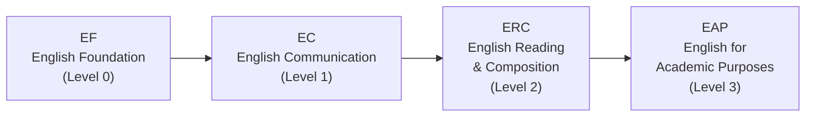

# Tips Menyusun Jadwal dan Memilih Mata Kuliah

Memilih mata kuliah yang tepat baru separuh tantangan. Cara kamu menyusunnya dalam jadwal, berapa SKS yang diambil, dan mata kuliah apa yang dipilih berdasarkan minat — semuanya sama pentingnya. Tapi tenang aja, panduan ini akan bantu kamu langkah demi langkah. Pilihan mata kuliah yang bagus pun bisa menghasilkan semester yang menderita kalau penyusunannya asal-asalan.

---

## Jalur Kursus Bahasa Inggris (EPT)

Selama orientasi HanST, semua mahasiswa baru mengikuti **EPT (English Placement Test)**. Hasilnya menentukan levelmu di urutan kursus Bahasa Inggris.

Kalau kamu lulus EPT di level yang lebih tinggi, kamu bisa skip level yang lebih rendah. Kamu juga bisa dibebaskan dari level tertentu kalau punya skor yang memenuhi syarat dari tes standar seperti TOEFL, IELTS, atau TOEIC.

**Jangan tunda kursus Bahasa Inggrismu ya.** Beberapa semester terakhir, dosen semakin ketat menerapkan batas kapasitas. Mahasiswa yang menunda dengan pikiran "nanti saja semester depan" sering kali menemukan semua kursi sudah terisi. Ambil level Bahasa Inggris yang ditugaskan **langsung di semester pertama**. Kursi cepat habis, dan menunggu tidak menguntungkan kamu sama sekali.

---

## Persyaratan Bahasa Korea

Persyaratan ini berlaku untuk **mahasiswa dengan paspor asing** serta **warga negara Korea yang lama tinggal di luar negeri** dan mungkin kesulitan mengikuti kuliah berbahasa Korea. Kamu harus menyelesaikan urutan kursus Practical Korean. Saat orientasi, kamu akan mengikuti tes penempatan Bahasa Korea yang menentukan level awalmu.

**Tips yang sangat penting:** JANGAN menebak-nebak saat tes penempatan untuk coba masuk ke level yang lebih tinggi. Alasannya:

- Kalau kamu mulai dari **Korean 1** (level terendah), kamu dapat SKS yang mudah dan aman sambil membangun fondasi yang kuat. Beban kuliah lebih ringan, dan kamu bisa membangun kepercayaan diri.
- Kalau kamu ngasal sampai masuk **Korean 3**, sekarang kamu harus mengisi SKS yang seharusnya diisi Korean 1 dan Korean 2 dengan mata kuliah lain. Plus kamu harus menghadapi materi Bahasa Korea yang lebih susah dari kemampuan aktualmu.

**Jawab dengan jujur ya.** Mulai dari level lebih rendah dan naik bertahap jauh lebih menguntungkan jangka panjang daripada berjuang di level yang melampaui kemampuanmu. Ini bukan soal gengsi — ini soal strategi, dan percaya deh, kakak-kakak tingkat yang sudah lewat proses ini pasti setuju.

---

## Strategi: Daftar Lebih Banyak, Drop Kemudian

Kamu bisa daftar hingga **18 SKS**. Aturan emasnya: **selalu lebih baik daftar lebih banyak mata kuliah dan drop setelah minggu pertama daripada daftar sedikit dan coba tambah belakangan.** Mata kuliah populer tidak punya kursi kosong saat periode penyesuaian. Kalau kamu mulai dengan sedikit mata kuliah lalu coba tambah yang kompetitif, hampir dipastikan gagal.

---

## Target SKS

- **Syarat kelulusan**: 130 SKS selama 8 semester = sekitar 16,25 SKS per semester
- **Target yang direkomendasikan**: 17-18 SKS per semester memberi ruang yang nyaman
- **Mahasiswa beasiswa**: Kamu wajib mempertahankan minimal **15,5 SKS**. Hati-hati agar tidak jatuh di bawah ambang ini saat drop mata kuliah selama periode penyesuaian.

---

## Cara Membaca Kode Mata Kuliah

**Digit pertama** kode mata kuliah Handong menunjukkan level tahun yang direkomendasikan:

- **1**xxx: Mata kuliah level mahasiswa baru (yang seharusnya kamu ambil)
- **2**xxx: Mata kuliah level tahun kedua
- **3**xxx: Mata kuliah level tahun ketiga
- **4**xxx: Mata kuliah level tahun keempat

Sebagai mahasiswa baru, **fokus pada mata kuliah 1xxx**. Mata kuliah berkode 3xxx atau 4xxx biasanya punya prasyarat, dan meski sistem memungkinkan kamu daftar, materinya akan jauh melampaui persiapanmu. Mencoba mata kuliah tingkat atas tanpa fondasi bukan keberanian — itu kecerobohan.

---

## Jaga Slot Makan Siang Tetap Kosong

Period 4 (12:00-13:00) dan 5 (13:00-14:00) adalah jendela makan siang. Kalau kamu jadwalkan kelas di blok ini, kamu akan melewatkan makan siang. Sekali dua kali masih oke, tapi kalau setiap hari begitu, energi dan konsentrasimu akan jeblok. **Jangan tumpuk lebih dari tiga kelas berturut-turut.** Kamu butuh jeda antar sesi untuk mencerna apa yang sudah dipelajari.

---

## Tanyakan Senior soal Dosen

Mata kuliah yang sama tapi diajarkan dosen berbeda bisa jadi pengalaman yang sama sekali berbeda — dari sisi beban kerja, tingkat kesulitan ujian, cara penilaian, sampai gaya mengajar. Course catalog tidak cerita soal ini. **Tanyakan 섬김이 (student mentor) dan kakak tingkatmu**: "Ada yang pernah ambil mata kuliah ini? Gimana pengalamannya?" Ini sumber informasi terbaik yang bisa kamu dapat.

---

## Cek Bahasa Pengantar Per Kelas

Ini tidak bisa cukup ditekankan untuk mahasiswa internasional. **Dosen yang sama mungkin mengajar satu kelas dalam Bahasa Korea dan kelas lain dalam Bahasa Inggris.** Selalu verifikasi kolom "English %" untuk setiap kelas spesifik sebelum daftar. Mahasiswa internasional yang tidak sengaja masuk kelas berbahasa Korea — atau mahasiswa Korea yang tidak sengaja masuk kelas berbahasa Inggris — terjadi setiap semester.

---

## Mata Kuliah yang Direkomendasikan Berdasarkan Minat

### Untuk Mahasiswa yang Tertarik STEM

Kalau kamu mempertimbangkan teknik, ilmu komputer, AI, sains, atau matematika, berikut mata kuliah dasar yang harus diprioritaskan. Kelas berbahasa Inggris disorot untuk mahasiswa internasional.

#### Calculus 1 (GEK10095) — 3 SKS

Calculus adalah bahasa universal STEM. Tanpanya, kamu tidak bisa lanjut ke Calculus 2, Differential Equations, atau mata kuliah inti teknik apapun. Anggap saja sebagai alfabet dari pemikiran ilmiah — tanpanya, kamu tidak bisa baca satu kalimat pun dalam bahasa teknik dan sains.

| Section | Professor | Time | English % | Note |
|---------|-----------|------|-----------|------|
| 01 | 이한진 | Mon 4, Thu 4 | 0% | Korean |
| 02 | 이한진 | Mon 6, Thu 6 | 0% | Korean, late time slot |
| **03** | **김민재** | **Mon 4, Thu 4** | **100%** | **English** |
| **04** | **조장환** | **Mon 1, Thu 1** | **100%** | **English, period 1 (early morning)** |

Untuk mahasiswa internasional, Section 03 (김민재) atau Section 04 (조장환) adalah pilihanmu. Perhatikan bahwa Section 04 adalah period 1 (jam 9 pagi). Kalau kamu bukan tipe morning person, Section 03 di period 4 jauh lebih manageable.

#### Calculus 2 (GEK10096) — 3 SKS

Biasanya diambil di semester 2, tapi mahasiswa dengan fondasi Calculus SMA yang kuat bisa ambil Calculus 1 dan 2 bersamaan untuk mempercepat progres.

| Section | Professor | Time | English % | Note |
|---------|-----------|------|-----------|------|
| **01** | **이한진** | **Mon 2, Thu 2** | **100%** | **English** |
| 02 | 김태희 | Mon 1, Thu 1 | 0% | Period 1 |
| 03 | 김태희 | Mon 2, Thu 2 | 0% | Korean |

#### Linear Algebra (GEK10082) — 3 SKS

Linear Algebra adalah jantung matematis dari AI dan machine learning. Vektor, matriks, eigenvalue, dan transformasi linear adalah blok bangunan dari hampir semua algoritma AI modern. Kalau kamu berencana belajar apapun yang berkaitan dengan ilmu komputer, data science, atau teknik, ambil mata kuliah ini di semester pertama bersamaan dengan Calculus 1.

| Section | Professor | Time | English % | Note |
|---------|-----------|------|-----------|------|
| **01** | **조장환** | **Mon 3, Thu 3** | **100%** | **English** |
| **02** | **조장환** | **Mon 5, Thu 5** | **100%** | **English** |
| 03 | 김현수 | Tue 2, Fri 2 | 0% | Korean |
| 04 | 김현수 | Tue 3, Fri 3 | 0% | Korean |

Baik Section 01 maupun 02 diajarkan 100% dalam Bahasa Inggris oleh Professor 조장환.

#### Physics 1 (GEK10055) — 3 SKS

Penting untuk teknik elektro, teknik mesin, dan bidang terkait. Mencakup mekanika, termodinamika, dan gaya-gaya fundamental.

| Section | Professor | Time | English % | Note |
|---------|-----------|------|-----------|------|
| 01 | 조현지 | Mon 2, Thu 2 | 0% | Korean only |
| 02 | 조현지 | Mon 3, Thu 3 | 0% | Korean only |

**Sayangnya, tidak ada kelas berbahasa Inggris untuk Physics 1 semester ini.** Mahasiswa internasional yang butuh Physics perlu kemampuan Bahasa Korea yang cukup, atau bisa pertimbangkan menundanya ke semester depan kalau ada kelas berbahasa Inggris.

#### General Chemistry (GEK10058) — 3 SKS

Wajib untuk ilmu hayat, kimia, dan bidang terkait.

| Section | Professor | Time | English % | Note |
|---------|-----------|------|-----------|------|
| 01 | 김민경 | Thu 3, 4 (back-to-back) | 0% | Korean |
| **02** | **유태준** | **Mon 2, Thu 2** | **100%** | **English** |

Section 02 adalah pilihan berbahasa Inggrismu.

#### General Biology (GEK10057) — 3 SKS

| Section | Professor | Time | English % | Note |
|---------|-----------|------|-----------|------|
| 01 | 현창기 et al. | Mon 5, Thu 5 | 0% | Korean |
| **02** | **Holzapfel Wilhelm et al.** | **Mon 2, Thu 2** | **100%** | **English** |
| 03 | 현창기 et al. | Mon 6, Thu 6 | 0% | Korean |

**PERINGATAN: General Biology SANGAT kompetitif.** Hanya ada 3 kelas, dan kakak tingkat serta mahasiswa yang mengulang sudah mengisi kursi sebelum mahasiswa baru sempat daftar. Banyak mahasiswa baru merasa hampir mustahil masuk di semester pertama. **Jangan taruhkan seluruh strategi pendaftaranmu di mata kuliah ini.** Kalau tidak dapat kursi, ambil Calculus, Linear Algebra, atau pemrograman dan coba lagi di semester 2. Fleksibel di sini jauh lebih bijak daripada ngotot.

---

### Untuk Mahasiswa yang Tertarik Humaniora/Ilmu Sosial

Kalau kamu mempertimbangkan bisnis, ekonomi, hukum, hubungan internasional, psikologi, komunikasi, atau kesejahteraan sosial, mata kuliah pengantar berikut akan membantumu mengeksplorasi bidang-bidang ini. Kelas berbahasa Inggris disorot.

#### Economics Introduction (MEC10001) — 3 SKS

| Section | Professor | Time | English % |
|---------|-----------|------|-----------|
| **01** | **김선태** | **Mon 3, Thu 3** | **100%** |
| 02 | 안진원 | Tue 2, Fri 2 | 0% |

#### Business Introduction (MEC10002) — 3 SKS

| Section | Professor | Time | English % |
|---------|-----------|------|-----------|
| **01** | **이유진** | **Tue 3, Fri 3** | **100%** |
| 02 | 이혜규 | Mon 2, Thu 2 | 0% |
| 03 | 김은석 | Mon 5, Thu 5 | 0% |

#### Psychology Introduction (CSW10003) — 3 SKS

| Section | Professor | Time | English % |
|---------|-----------|------|-----------|
| 01 | 신성만 | Mon 3, Thu 3 | 0% |
| **02** | **지원근** | **Tue 2, Fri 2** | **100%** |
| 03 | 김윤희 | Mon 4, Thu 4 | 0% |

#### International Relations Introduction (ISE10052) — 3 SKS

| Section | Professor | Time | English % |
|---------|-----------|------|-----------|
| **01** | **정모니카** | **Tue 2, Fri 2** | **100%** |
| 02 | 김지현 | Tue 4, Fri 4 | 0% |

#### Philosophy Introduction (GEK10030) — 3 SKS

| Section | Professor | Time | English % |
|---------|-----------|------|-----------|
| **01** | **손화철** | **Mon 5, Thu 5** | **100%** |
| 02 | 김광현 | Thu 6, 7 | 0% |

#### Discussion and Presentation (GCS10013) — 3 SKS

| Section | Professor | Time | English % |
|---------|-----------|------|-----------|
| **01** | **Shushan Marie Richardson** | **Mon 4, Thu 4** | **100%** |

Mata kuliah yang sangat bagus untuk mengembangkan kemampuan diskusi dan presentasi akademik dalam Bahasa Inggris. Professor Richardson dikenal aktif melibatkan mahasiswa dalam pembelajaran partisipatif.

#### Eastern History and Culture (GEK10087) — 3 SKS

| Section | Professor | Time | English % |
|---------|-----------|------|-----------|
| **01** | **신승엽** | **Mon 3, Thu 3** | **100%** |

#### Globalization and Korean Pop Culture (GEK10104) — 3 SKS

| Section | Professor | Time | English % |
|---------|-----------|------|-----------|
| **01** | **김창욱** | **Tue 2, Fri 2** | **100%** |

Eksplorasi akademis K-pop, K-drama, sinema Korea, dan fenomena Korean Wave. Diajarkan sepenuhnya dalam Bahasa Inggris — mudah diakses dan menarik bagi mahasiswa internasional yang tertarik dengan kajian budaya.

---

### 학생설계융합전공 (Student-Designed Convergence Studies)

학생설계융합전공 memungkinkan kamu **merancang jurusan sendiri** dengan menggabungkan mata kuliah dari berbagai departemen. Misalnya, kamu bisa buat jurusan kustom "Global Policy Analysis" dengan menggabungkan mata kuliah International Relations + Economics + Data Analysis.

Untuk masuk 학생설계융합전공, kamu harus terlebih dulu ambil **"Vision, Work, and Calling"** (비전, 일, 소명). Mata kuliah ini adalah prasyarat program 학생설계융합전공.

**Kenapa 학생설계융합전공 sangat cocok untuk mahasiswa internasional:** Kamu bisa bebas menggabungkan mata kuliah berbahasa Inggris dari departemen manapun, sehingga tidak dibatasi oleh keterbatasan bahasa satu departemen. Kalau tidak ada departemen yang cocok dengan minatmu, 학생설계융합전공 memberi kebebasan untuk membangun persis apa yang kamu mau.

---

## Jadwal yang Direkomendasikan (Mahasiswa Internasional)

Berikut contoh jadwal yang disusun eksklusif dari **kelas 100% berbahasa Inggris**. Ini hanya contoh referensi — sesuaikan berdasarkan hasil EPT, minat, dan energimu. Ingat aturan emas: daftar lebih banyak mata kuliah dari yang kamu butuhkan dan drop setelah minggu pertama.

### Schedule A: Fokus Humaniora/Ilmu Sosial (Semua Berbahasa Inggris)

| Period | Mon | Tue | Wed | Thu | Fri |
|--------|-----|-----|-----|-----|-----|
| 1 | | Bible (07) | | | Bible (07) |
| 2 | | Intl Relations | CharEd* | | Intl Relations |
| 3 | | Business (01) | | | Business (01) |
| 4 | D&P | | Chapel | D&P | |
| 5 | Python (05) | Python (05) | Chapel | Python (05) | |
| 6 | | | Chapel | | |

> **⚠️ Konflik CharEd:** Character Education Sec 01 (Mon 5, English) bentrok dengan Python Sec 05 (Mon 5). **Solusi:** Ambil CharEd Sec 02-06 (Wed 2, Korean) sebagai gantinya, atau pindahkan Python ke kelas yang bukan Mon 5.

| Course | Code | Credits | Professor | Note |
|--------|------|---------|-----------|------|
| Understanding the Bible (07) | GEK20058 | 2 | Joshua Kim | Tue 1, Fri 1, 100% English |
| International Relations Intro (01) | ISE10052 | 3 | 정모니카 | Tue 2, Fri 2, 100% English |
| Business Intro (01) | MEC10002 | 3 | 이유진 | Tue 3, Fri 3, 100% English |
| Discussion & Presentation (01) | GCS10013 | 3 | Richardson | Mon 4, Thu 4, 100% English |
| Character Education (02-06) | GEK10015 | 1 | Various | **Wed 2, Korean** (Sec 01 Mon 5 bentrok dengan Python) |
| Python Programming (05) | GCS10004 | 3 | 박지현 | Mon 5, Thu 5, 100% English |
| Chapel 1 | GEK10001 | 0 | — | Wed 4, 5, 6 |
| Community Leadership Training 1 | GEK10008 | 0.5 | TBA | Time TBA |
| Social Service 1 | GEK10046 | 1 | — | Separate schedule |
| + Korean Language Course | — | 3 | TBA | Wajib untuk mahasiswa internasional |
| **Total** | | **19.5 + Korean (3)** | | |

**Kenapa jadwal ini bisa jalan:** Selasa dan Jumat membawa beban intelektual berat dengan tiga mata kuliah berturut-turut berbahasa Inggris (Bible, International Relations, Business), sementara Senin dan Kamis lebih ringan dengan kelas sore saja. Rabu dicadangkan untuk Chapel dan belajar mandiri. Kamu mengeksplorasi dua bidang yang sangat berbeda (hubungan internasional dan administrasi bisnis) sambil sekaligus membangun kemampuan programming dan presentasi akademik dalam Bahasa Inggris.

**Konflik CharEd diselesaikan di atas:** Character Education Sec 01 (Mon 5) bentrok dengan Python Sec 05 (Mon 5). Jadwal ini memakai CharEd Sec 02-06 (Wed 2, Korean) untuk menghindari tumpang tindih. Kalau kemampuan Bahasa Koreamu belum cukup, pindahkan Python ke kelas yang bukan Mon 5.

### Schedule B: Fokus STEM (Semua Berbahasa Inggris)

| Period | Mon | Tue | Wed | Thu | Fri |
|--------|-----|-----|-----|-----|-----|
| 1 | | Bible (07) | | | Bible (07) |
| 2 | | Worldview (02) | | | Worldview (02) |
| 3 | Linear Alg (01) | | | Linear Alg (01) | |
| 4 | Calculus 1 (03) | | Chapel | Calculus 1 (03) | |
| 5 | Python (05) | Python (05) | Chapel | Python (05) | |
| 6 | | | Chapel | | |

> **⚠️ Konflik CharEd:** Character Education Sec 01 (Mon 5, English) bentrok dengan Python Sec 05 (Mon 5). **Solusi:** Ambil CharEd Sec 02-06 (Wed 2, Korean) sebagai gantinya, atau pindahkan Python ke kelas yang bukan Mon 5.

| Course | Code | Credits | Professor | Note |
|--------|------|---------|-----------|------|
| Understanding the Bible (07) | GEK20058 | 2 | Joshua Kim | Tue 1, Fri 1, 100% English |
| Christian Worldview (02) | GEK20011 | 2 | 최용준 | Tue 2, Fri 2, 100% English |
| Linear Algebra (01) | GEK10082 | 3 | 조장환 | Mon 3, Thu 3, 100% English |
| Calculus 1 (03) | GEK10095 | 3 | 김민재 | Mon 4, Thu 4, 100% English |
| Character Education (02-06) | GEK10015 | 1 | Various | **Wed 2, Korean** (Sec 01 Mon 5 bentrok dengan Python) |
| Python Programming (05) | GCS10004 | 3 | 박지현 | Mon 5, Thu 5, 100% English |
| Chapel 1 | GEK10001 | 0 | — | Wed 4, 5, 6 |
| Community Leadership Training 1 | GEK10008 | 0.5 | TBA | Time TBA |
| Social Service 1 | GEK10046 | 1 | — | Separate schedule |
| + Korean Language Course | — | 3 | TBA | Wajib untuk mahasiswa internasional |
| **Total** | | **18.5 + Korean (3)** | | |

**Kenapa jadwal ini bisa jalan:** Mengambil Calculus 1 dan Linear Algebra bersamaan menciptakan sinergi yang kuat — konsep vektor dan matriks dari Linear Algebra langsung terhubung dengan ide multivariabel yang kamu temui di Calculus. Python membangun fondasi programming. Selasa dan Jumat lebih ringan (hanya Bible + Worldview), memberi waktu untuk mengerjakan soal-soal matematika.

**Konflik CharEd diselesaikan di atas:** Character Education Sec 01 (Mon 5) bentrok dengan Python Sec 05 (Mon 5). Jadwal ini memakai CharEd Sec 02-06 (Wed 2, Korean) untuk menghindari tumpang tindih. Kalau kemampuan Bahasa Koreamu belum cukup, pindahkan Python ke kelas yang bukan Mon 5.

---

*Last updated: 2026-02-21*
