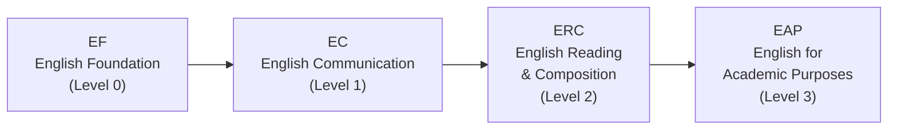

# Tips Menyusun Jadwal dan Memilih Mata Kuliah

Memilih mata kuliah yang tepat hanya separuh tantangan. Bagaimana Anda menyusunnya dalam jadwal, berapa banyak SKS yang Anda ambil, dan mata kuliah mana yang dipilih berdasarkan minat — semuanya sama pentingnya. Bahkan pilihan mata kuliah yang bagus bisa menghasilkan semester yang menderita jika penyusunannya buruk.

---

## Jalur Kursus Bahasa Inggris (EPT)

Selama orientasi HanST, semua mahasiswa baru mengikuti **EPT (English Placement Test)**. Hasilnya menentukan level Anda dalam urutan kursus Bahasa Inggris.



Jika Anda lulus EPT di level yang lebih tinggi, Anda bisa melewati level yang lebih rendah. Anda juga mungkin dibebaskan dari level tertentu jika memiliki skor yang memenuhi syarat pada tes standar seperti TOEFL, IELTS, atau TOEIC.

**JANGAN menunda kursus Bahasa Inggris Anda.** Dalam beberapa semester terakhir, dosen menjadi ketat dalam menerapkan batas kapasitas. Mahasiswa yang menunda kursus Bahasa Inggris dengan berpikir "Saya akan ambil semester depan" sering menemukan semua kursi terisi. Ambil level Bahasa Inggris yang ditugaskan **segera di semester pertama Anda**. Kursi cepat penuh, dan menunggu tidak menguntungkan Anda sama sekali.

---

## Persyaratan Bahasa Korea

Persyaratan ini berlaku untuk **mahasiswa dengan paspor asing** serta **warga negara Korea yang telah tinggal di luar negeri dalam waktu lama** dan mungkin kesulitan dengan perkuliahan berbahasa Korea. Anda harus menyelesaikan urutan kursus Practical Korean. Selama orientasi, Anda akan mengikuti tes penempatan Bahasa Korea yang menentukan level awal Anda.

**Tips yang sangat penting:** JANGAN menebak-nebak pada tes penempatan untuk mencoba masuk ke level yang lebih tinggi. Inilah alasannya:

- Jika Anda memulai dari **Korean 1** (level terendah), Anda mendapatkan SKS yang mudah dan aman sambil membangun fondasi yang kuat. Beban kuliah mudah dikelola, dan Anda membangun kepercayaan diri.
- Jika Anda menebak-nebak sampai masuk **Korean 3**, Anda sekarang harus mengisi SKS yang seharusnya diberikan Korean 1 dan Korean 2 dengan mata kuliah lain. Anda juga menghadapi materi Bahasa Korea yang lebih sulit yang mungkin melampaui kemampuan aktual Anda.

**Jawab dengan jujur.** Memulai dari level lebih rendah dan naik secara bertahap jauh lebih menguntungkan dalam jangka panjang daripada berjuang di level yang melampaui kemampuan sebenarnya. Ini bukan soal gengsi — ini soal strategi.

---

## Strategi Overload: Daftar Lebih Banyak, Drop Kemudian

Anda bisa mendaftar hingga **22 SKS** (overload). Aturan emasnya adalah: **selalu lebih baik mendaftar lebih banyak mata kuliah dan drop setelah minggu pertama daripada mendaftar sedikit dan mencoba menambah nanti.** Mata kuliah populer tidak memiliki kursi kosong saat periode penyesuaian. Jika Anda mulai ringan dan mencoba menambah mata kuliah kompetitif nanti, Anda hampir pasti gagal.

---

## Target SKS

- **Persyaratan kelulusan**: 130 SKS selama 8 semester = sekitar 16,25 SKS per semester
- **Target yang direkomendasikan**: 17-18 SKS per semester memberi Anda ruang bernapas yang nyaman
- **Mahasiswa beasiswa**: Anda harus mempertahankan minimal **15,5 SKS**. Berhati-hatilah agar tidak turun di bawah ambang ini saat menghapus mata kuliah selama periode penyesuaian.

---

## Cara Membaca Kode Mata Kuliah

**Digit pertama** kode mata kuliah Handong menunjukkan level tahun yang direkomendasikan:

- **1**xxx: Mata kuliah level mahasiswa baru (yang seharusnya Anda ambil)
- **2**xxx: Mata kuliah level tahun kedua
- **3**xxx: Mata kuliah level tahun ketiga
- **4**xxx: Mata kuliah level tahun keempat

Sebagai mahasiswa baru, **fokus pada mata kuliah 1xxx**. Mata kuliah berkode 3xxx atau 4xxx biasanya memiliki prasyarat, dan meskipun sistem memungkinkan Anda mendaftar, materinya akan jauh melampaui persiapan Anda. Mencoba mata kuliah tingkat atas tanpa fondasi bukanlah keberanian — itu kecerobohan.

---

## Jaga Waktu Makan Siang Anda Tetap Kosong

Period 4 (12:00-13:00) dan 5 (13:00-14:00) mencakup jendela makan siang. Jika Anda menjadwalkan kelas di blok ini, Anda akan melewatkan makan siang. Sekali dua kali masih bisa ditoleransi, tetapi melakukannya setiap hari akan menghancurkan energi dan konsentrasi Anda. **Jangan menumpuk lebih dari tiga kelas berturut-turut.** Anda butuh istirahat antar sesi untuk mencerna apa yang telah Anda pelajari.

---

## Tanyakan Senior Anda Tentang Dosen

Mata kuliah yang sama diajarkan oleh dosen berbeda bisa menjadi pengalaman yang sama sekali berbeda — dalam beban kerja, tingkat kesulitan ujian, gaya penilaian, dan metode pengajaran. Katalog mata kuliah tidak menceritakan hal ini. **Tanyakan 섬김이 (mentor mahasiswa) dan kakak tingkat Anda**: "Apakah ada yang pernah mengambil mata kuliah ini? Bagaimana pengalamannya?" Ini adalah sumber informasi terbaik Anda.

---

## Periksa Bahasa Pengantar Per Kelas

Ini tidak bisa cukup ditekankan untuk mahasiswa internasional. **Dosen yang sama mungkin mengajar satu kelas dalam Bahasa Korea dan kelas lainnya dalam Bahasa Inggris.** Selalu verifikasi kolom "English %" untuk setiap kelas spesifik sebelum mendaftar. Mahasiswa internasional yang secara tidak sengaja mendaftar di kelas berbahasa Korea — atau mahasiswa Korea yang secara tidak sengaja mendaftar di kelas berbahasa Inggris — terjadi setiap semester.

---

## Mata Kuliah yang Direkomendasikan Berdasarkan Minat

### Untuk Mahasiswa yang Tertarik STEM

Jika Anda mempertimbangkan teknik, ilmu komputer, AI, ilmu pengetahuan alam, atau matematika, ini adalah mata kuliah dasar yang harus Anda prioritaskan. Mata kuliah dengan kelas berbahasa Inggris disorot untuk mahasiswa internasional.

#### Calculus 1 (GEK10095) — 3 SKS

Kalkulus adalah bahasa universal STEM. Tanpanya, Anda tidak bisa melanjutkan ke Calculus 2, Differential Equations, atau mata kuliah inti teknik apa pun. Anggap saja sebagai alfabet dari pemikiran ilmiah — tanpanya, Anda tidak bisa membaca satu kalimat pun dalam bahasa teknik dan sains.

| Section | Professor | Time | English % | Note |
|---------|-----------|------|-----------|------|
| 01 | 이한진 | Mon 4, Thu 4 | 0% | Korean |
| 02 | 이한진 | Mon 6, Thu 6 | 0% | Korean, late time slot |
| **03** | **김민재** | **Mon 4, Thu 4** | **100%** | **English** |
| **04** | **조장환** | **Mon 1, Thu 1** | **100%** | **English, period 1 (early morning)** |

Untuk mahasiswa internasional, Section 03 (김민재) atau Section 04 (조장환) adalah pilihan Anda. Perhatikan bahwa Section 04 adalah kelas period 1 (9:00 AM). Jika Anda bukan orang yang suka bangun pagi, Section 03 di period 4 jauh lebih mudah dikelola.

#### Calculus 2 (GEK10096) — 3 SKS

Biasanya diambil di semester 2, tetapi mahasiswa dengan latar belakang kalkulus SMA yang kuat bisa mengambil Calculus 1 dan 2 secara bersamaan untuk mempercepat progres.

| Section | Professor | Time | English % | Note |
|---------|-----------|------|-----------|------|
| **01** | **이한진** | **Mon 2, Thu 2** | **100%** | **English** |
| 02 | 김태희 | Mon 1, Thu 1 | 0% | Period 1 |
| 03 | 김태희 | Mon 2, Thu 2 | 0% | Korean |

#### Linear Algebra (GEK10082) — 3 SKS

Linear Algebra adalah jantung matematis dari AI dan machine learning. Vektor, matriks, eigenvalue, dan transformasi linear adalah blok bangunan dari hampir setiap algoritma AI modern. Jika Anda berencana mempelajari apa pun yang terkait dengan ilmu komputer, data science, atau teknik, ambil mata kuliah ini di semester pertama bersamaan dengan Calculus 1.

| Section | Professor | Time | English % | Note |
|---------|-----------|------|-----------|------|
| **01** | **조장환** | **Mon 3, Thu 3** | **100%** | **English** |
| **02** | **조장환** | **Mon 5, Thu 5** | **100%** | **English** |
| 03 | 김현수 | Tue 2, Fri 2 | 0% | Korean |
| 04 | 김현수 | Tue 3, Fri 3 | 0% | Korean |

Baik Section 01 maupun 02 diajarkan 100% dalam Bahasa Inggris oleh Professor 조장환.

#### Physics 1 (GEK10055) — 3 SKS

Penting untuk teknik elektro, teknik mesin, dan bidang terkait. Mencakup mekanika, termodinamika, dan gaya-gaya fundamental.

| Section | Professor | Time | English % | Note |
|---------|-----------|------|-----------|------|
| 01 | 조현지 | Mon 2, Thu 2 | 0% | Korean only |
| 02 | 조현지 | Mon 3, Thu 3 | 0% | Korean only |

**Sayangnya, tidak ada kelas berbahasa Inggris untuk Physics 1 semester ini.** Mahasiswa internasional yang membutuhkan fisika perlu kemampuan Bahasa Korea yang cukup, atau bisa mempertimbangkan menundanya ke semester depan jika kelas berbahasa Inggris tersedia.

#### General Chemistry (GEK10058) — 3 SKS

Wajib untuk ilmu hayat, kimia, dan bidang terkait.

| Section | Professor | Time | English % | Note |
|---------|-----------|------|-----------|------|
| 01 | 김민경 | Thu 3, 4 (back-to-back) | 0% | Korean |
| **02** | **유태준** | **Mon 2, Thu 2** | **100%** | **English** |

Section 02 adalah pilihan berbahasa Inggris Anda.

#### General Biology (GEK10057) — 3 SKS

| Section | Professor | Time | English % | Note |
|---------|-----------|------|-----------|------|
| 01 | 현창기 et al. | Mon 5, Thu 5 | 0% | Korean |
| **02** | **Holzapfel Wilhelm et al.** | **Mon 2, Thu 2** | **100%** | **English** |
| 03 | 현창기 et al. | Mon 6, Thu 6 | 0% | Korean |

**PERINGATAN: General Biology SANGAT kompetitif.** Hanya ada 3 kelas, dan kakak tingkat serta mahasiswa yang mengulang mengisi kursi sebelum mahasiswa baru. Banyak mahasiswa baru merasa mustahil untuk mendaftar di semester pertama. **Jangan bertaruh seluruh strategi pendaftaran Anda pada masuk mata kuliah ini.** Jika Anda tidak mendapat kursi, ambil Calculus, Linear Algebra, atau pemrograman dan coba lagi di semester 2. Bersikap fleksibel di sini jauh lebih bijak daripada bersikap keras kepala.

---

### Untuk Mahasiswa yang Tertarik Humaniora/Ilmu Sosial

Jika Anda mempertimbangkan bisnis, ekonomi, hukum, hubungan internasional, psikologi, komunikasi, atau kesejahteraan sosial, mata kuliah pengantar berikut akan membantu Anda mengeksplorasi bidang-bidang ini. Kelas berbahasa Inggris disorot.

#### Economics Introduction (MEC10001) — 3 SKS

| Section | Professor | Time | English % |
|---------|-----------|------|-----------|
| **01** | **김선태** | **Mon 3, Thu 3** | **100%** |
| 02 | 안진원 | Tue 2, Fri 2 | 0% |

#### Business Introduction (MEC10002) — 3 SKS

| Section | Professor | Time | English % |
|---------|-----------|------|-----------|
| **01** | **이유진** | **Tue 3, Fri 3** | **100%** |
| 02 | 이혜규 | Mon 2, Thu 2 | 0% |
| 03 | 김은석 | Mon 5, Thu 5 | 0% |

#### Psychology Introduction (CSW10003) — 3 SKS

| Section | Professor | Time | English % |
|---------|-----------|------|-----------|
| 01 | 신성만 | Mon 3, Thu 3 | 0% |
| **02** | **지원근** | **Tue 2, Fri 2** | **100%** |
| 03 | 김윤희 | Mon 4, Thu 4 | 0% |

#### International Relations Introduction (ISE10052) — 3 SKS

| Section | Professor | Time | English % |
|---------|-----------|------|-----------|
| **01** | **정모니카** | **Tue 2, Fri 2** | **100%** |
| 02 | 김지현 | Tue 4, Fri 4 | 0% |

#### Philosophy Introduction (GEK10030) — 3 SKS

| Section | Professor | Time | English % |
|---------|-----------|------|-----------|
| **01** | **손화철** | **Mon 5, Thu 5** | **100%** |
| 02 | 김광현 | Thu 6, 7 | 0% |

#### Discussion and Presentation (GCS10013) — 3 SKS

| Section | Professor | Time | English % |
|---------|-----------|------|-----------|
| **01** | **Shushan Marie Richardson** | **Mon 4, Thu 4** | **100%** |

Mata kuliah yang sangat baik untuk mengembangkan keterampilan diskusi dan presentasi akademik dalam Bahasa Inggris. Professor Richardson dikenal karena aktif melibatkan mahasiswa dalam pembelajaran partisipatif.

#### Eastern History and Culture (GEK10087) — 3 SKS

| Section | Professor | Time | English % |
|---------|-----------|------|-----------|
| **01** | **신승엽** | **Mon 3, Thu 3** | **100%** |

#### Globalization and Korean Pop Culture (GEK10104) — 3 SKS

| Section | Professor | Time | English % |
|---------|-----------|------|-----------|
| **01** | **김창욱** | **Tue 2, Fri 2** | **100%** |

Eksplorasi akademis K-pop, K-drama, sinema Korea, dan fenomena Korean Wave. Diajarkan sepenuhnya dalam Bahasa Inggris — mudah diakses dan menarik bagi mahasiswa internasional yang tertarik dengan kajian budaya.

---

### GCS (Global Convergence Studies)

GCS memungkinkan Anda **merancang jurusan sendiri** dengan menggabungkan mata kuliah dari berbagai departemen. Misalnya, Anda bisa membuat jurusan kustom "Global Policy Analysis" dengan menggabungkan mata kuliah International Relations + Economics + Data Analysis.

Untuk masuk GCS, Anda harus terlebih dahulu mengambil **"Vision, Work, and Calling"** (비전, 일, 소명). Mata kuliah ini adalah prasyarat untuk program GCS.

**Mengapa GCS sangat bagus untuk mahasiswa internasional:** Anda bisa dengan bebas menggabungkan mata kuliah berbahasa Inggris dari departemen mana pun, sehingga Anda tidak dibatasi oleh keterbatasan bahasa satu departemen. Jika tidak ada departemen yang ada yang sesuai dengan minat Anda, GCS memberi Anda kebebasan untuk membangun persis apa yang Anda inginkan.

---

## Jadwal yang Direkomendasikan (Mahasiswa Internasional)

Di bawah ini adalah contoh jadwal yang disusun secara eksklusif dari **kelas 100% berbahasa Inggris**. Ini adalah contoh referensi — sesuaikan berdasarkan hasil EPT, minat, dan tingkat energi Anda. Ingat aturan emas: daftar lebih banyak mata kuliah dari yang Anda butuhkan dan drop setelah minggu pertama.

### Schedule A: Fokus Humaniora/Ilmu Sosial (Semua Berbahasa Inggris)

```
Period | Mon            | Tue              | Wed        | Thu            | Fri
-------|----------------|------------------|------------|----------------|------------------
  1    |                | Bible (07)       |            |                | Bible (07)
  2    |                | Intl Relations   | CharEd*    |                | Intl Relations
  3    |                | Psychology       |            |                | Psychology
  4    | D&P            |                  | Chapel     | D&P            |
  5    | Python (05)    | Python (05)      | Chapel     | Python (05)    |
  6    |                |                  | Chapel     |                |
```

> **⚠️ Konflik CharEd:** Character Education Sec 01 (Mon 5, English) bentrok dengan Python Sec 05 (Mon 5). **Solusi:** Ambil CharEd Sec 02-06 (Wed 2, Korean) sebagai gantinya, atau pindahkan Python ke kelas yang bukan Mon 5.

| Course | Code | Credits | Professor | Note |
|--------|------|---------|-----------|------|
| Understanding the Bible (07) | GEK20058 | 2 | Joshua Kim | Tue 1, Fri 1, 100% English |
| International Relations Intro (01) | ISE10052 | 3 | 정모니카 | Tue 2, Fri 2, 100% English |
| Psychology Intro (02) | CSW10003 | 3 | 지원근 | Tue 3, Fri 3, 100% English |
| Discussion & Presentation (01) | GCS10013 | 3 | Richardson | Mon 4, Thu 4, 100% English |
| Character Education (02-06) | GEK10015 | 1 | Various | **Wed 2, Korean** (Sec 01 Mon 5 bentrok dengan Python) |
| Python Programming (05) | GCS10004 | 3 | 박지현 | Mon 5, Thu 5, 100% English |
| Chapel 1 | GEK10001 | 0 | — | Wed 4, 5, 6 |
| Community Leadership Training 1 | GEK10008 | 0.5 | TBA | Time TBA |
| Social Service 1 | GEK10046 | 1 | — | Separate schedule |
| + Korean Language Course | — | 3 | TBA | Wajib untuk mahasiswa internasional |
| **Total** | | **19.5 + Korean (3)** | | |

**Mengapa jadwal ini berhasil:** Selasa dan Jumat membawa beban intelektual berat dengan tiga mata kuliah berturut-turut berbahasa Inggris (Bible, International Relations, Psychology), sementara Senin dan Kamis lebih ringan dengan kelas sore saja. Rabu dicadangkan untuk Chapel dan waktu belajar mandiri. Anda mengeksplorasi dua bidang yang sama sekali berbeda (hubungan internasional dan psikologi) sambil membangun keterampilan pemrograman dan kemampuan presentasi akademik dalam Bahasa Inggris secara bersamaan.

**Konflik CharEd diselesaikan di atas:** Character Education Sec 01 (Mon 5) bentrok dengan Python Sec 05 (Mon 5). Jadwal ini menggunakan CharEd Sec 02-06 (Wed 2, Korean) untuk menghindari tumpang tindih. Jika kemampuan Bahasa Korea Anda tidak cukup, pindahkan Python ke kelas yang bukan Mon 5 sebagai gantinya.

### Schedule B: Fokus STEM (Semua Berbahasa Inggris)

```
Period | Mon              | Tue              | Wed        | Thu              | Fri
-------|------------------|------------------|------------|------------------|------------------
  1    |                  | Bible (07)       |            |                  | Bible (07)
  2    |                  | Worldview (02)   |            |                  | Worldview (02)
  3    | Linear Alg (01)  |                  |            | Linear Alg (01)  |
  4    | Calculus 1 (03)  |                  | Chapel     | Calculus 1 (03)  |
  5    | Python (05)      | Python (05)      | Chapel     | Python (05)      |
  6    |                  |                  | Chapel     |                  |
```

> **⚠️ Konflik CharEd:** Character Education Sec 01 (Mon 5, English) bentrok dengan Python Sec 05 (Mon 5). **Solusi:** Ambil CharEd Sec 02-06 (Wed 2, Korean) sebagai gantinya, atau pindahkan Python ke kelas yang bukan Mon 5.

| Course | Code | Credits | Professor | Note |
|--------|------|---------|-----------|------|
| Understanding the Bible (07) | GEK20058 | 2 | Joshua Kim | Tue 1, Fri 1, 100% English |
| Christian Worldview (02) | GEK20011 | 2 | 최용준 | Tue 2, Fri 2, 100% English |
| Linear Algebra (01) | GEK10082 | 3 | 조장환 | Mon 3, Thu 3, 100% English |
| Calculus 1 (03) | GEK10095 | 3 | 김민재 | Mon 4, Thu 4, 100% English |
| Character Education (02-06) | GEK10015 | 1 | Various | **Wed 2, Korean** (Sec 01 Mon 5 bentrok dengan Python) |
| Python Programming (05) | GCS10004 | 3 | 박지현 | Mon 5, Thu 5, 100% English |
| Chapel 1 | GEK10001 | 0 | — | Wed 4, 5, 6 |
| Community Leadership Training 1 | GEK10008 | 0.5 | TBA | Time TBA |
| Social Service 1 | GEK10046 | 1 | — | Separate schedule |
| + Korean Language Course | — | 3 | TBA | Wajib untuk mahasiswa internasional |
| **Total** | | **18.5 + Korean (3)** | | |

**Mengapa jadwal ini berhasil:** Mengambil Calculus 1 dan Linear Algebra secara bersamaan menciptakan sinergi yang kuat — konsep vektor dan matriks dari Linear Algebra terhubung langsung dengan ide multivariabel yang Anda temui di Calculus. Python memberikan fondasi pemrograman Anda. Selasa dan Jumat adalah hari yang lebih ringan (hanya Bible + Worldview), memberi Anda waktu untuk mengerjakan soal-soal matematika.

**Konflik CharEd diselesaikan di atas:** Character Education Sec 01 (Mon 5) bentrok dengan Python Sec 05 (Mon 5). Jadwal ini menggunakan CharEd Sec 02-06 (Wed 2, Korean) untuk menghindari tumpang tindih. Jika kemampuan Bahasa Korea Anda tidak cukup, pindahkan Python ke kelas yang bukan Mon 5 sebagai gantinya.

---

*Last updated: 2026-02-21*
