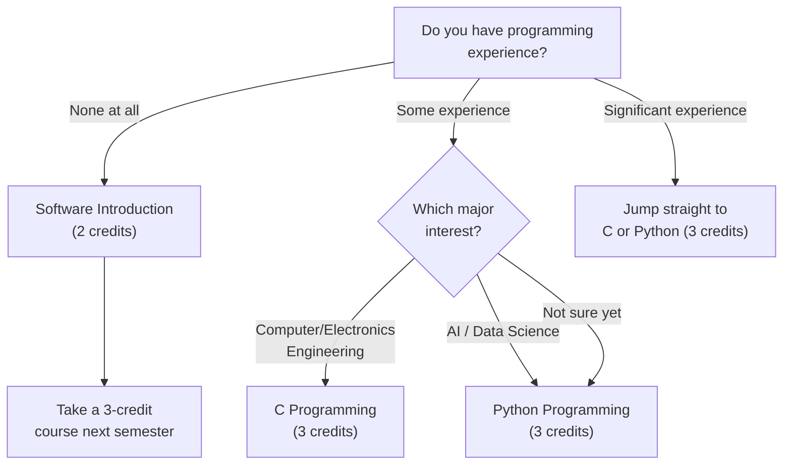

# 必修科目ガイド

目指す専攻がSTEMでも人文社会科学でも、国籍に関わらず、**全ての新入生が修了しなければならない**科目を解説しますね。まずこれらを時間割の軸に据えて、残りを埋めていきましょう。

---

## 重要日程

スケジュールを把握しておくことは非常に大切です。期限を逃すと、1学期分の計画が台無しになりかねません。以下が押さえておくべき完全なカレンダーです。

### 2月：入学と登録

| 日程 | イベント | 詳細 |
|------|-------|---------|
| 2/19 (Thu) ~ 2/24 (Tue) | **学費納入** | 学費を納入しないと履修登録ができません。他の全てより先に済ませてください。 |
| 2/23 (Mon) | **入学式** | 正式にHandong Global Universityの学生になる日です。 |
| 2/23 (Mon) ~ 2/27 (Fri) | **HanST（オリエンテーション）** | この期間中に**EPT（English Placement Test）**を受験します。英語科目のクラス分けはこのスコアで決まります。**絶対に欠席しないでください。** |
| **2/26 (Thu) 10:00~16:00** | **予備登録** | 「ショッピングカート」の段階です。詳しいルールは[[strategy|登録戦略ガイド]]をご覧ください。 |
| **2/27 (Fri) 10:00~12:00** | **本登録** | 先着順。たった2時間。これが本当の勝負です。 |
| 2/28 (Sat) 14:00 | **寮入居** | 学生寮のチェックイン。 |

### 3月：授業開始

| 日程 | イベント | 詳細 |
|------|-------|---------|
| 2/27 (Fri) 14:00 ~ 3/4 (Wed) 14:00 | **履修修正期間1** | 本登録直後に開始。空きが出た場合に科目の入れ替えや追加ができます。 |
| **3/2 (Mon)** | **授業開始日** | 学期が正式に始まります。 |
| **3/6 (Fri) 10:00 ~ 3/12 (Thu) 21:00** | **履修修正期間2（最終）** | 時間割を変更できる**最後のチャンス**です。この期限を過ぎると、学期全体の時間割が確定します。慎重に決断してください。 |

### 5月〜7月：試験と成績

| 日程 | イベント |
|------|-------|
| 5/4 (Mon) ~ 5/15 (Fri) | 中間試験 |
| 6/15 (Mon) ~ 6/19 (Fri) | 期末試験 |
| 7/6 (Mon) 16:00 | 成績発表 |

---

## Chapel 1（0単位、毎学期）

Chapelは0単位ですが、**毎学期必須**です。6学期にわたってChapel 1からChapel 6を修了する必要があり、これを終えないと卒業できません。

新入生がよくやるミスは、「登録しなくても出席すればいいだろう」と思い込むことなんですよね。**履修登録システムでChapelを登録しなければなりません。** 毎年、1学期間まじめにChapelに出席していたのに、最後になって登録していなかったと気づく学生がいます。そうなると出席はカウントされません。このミスを後から修正するのは極めて難しいです。

Chapelの出席は**QRコードタギングシステム**を使います。時間通りに到着してQRコードをスキャンしなければなりません。スキャンし損ねた場合、遡って修正するのはほぼ不可能です。遅刻しないようにしましょう。

> **2026年春学期：** Chapel 1 (GEK10001), Section 01 — Wed periods 4, 5, 6 (Hyoam Main Building) / 言語：韓国語（英語0%）

---

## Community Leadership Training 1（0.5単位、毎学期）

Chapelと同様、毎学期必修の科目です。寮のコミュニティの中でリーダーシップとチームワークを実践します。**ここでも同じ登録ミスが起きます** — 学期中毎週のチームミーティングに参加しながら、実はシステムで登録していなかった、という学生がいます。必ず登録してください。

> **2026年春学期：** Community Leadership Training 1 (GEK10008), Section 01 — 時間未定（後日発表）

---

## Handong Character Education（1単位、1回のみ）

Handong Global Universityの人格教育哲学の核となる科目です。複数のセクションが開講されています。**Section 01は100%英語で行われ**、留学生にとって理想的な選択です。

> **2026年春学期セクション：**

| Section | Professor | Time | English % | Note |
|---------|-----------|------|-----------|------|
| **01** | **Shushan Marie Richardson** | **Mon 5** | **100%** | **留学生におすすめ** |
| 02 | 이상산 | Wed 2 | 0% | Korean |
| 03 | 최희열 | Wed 2 | 0% | Korean |
| 04 | 손화철 | Wed 2 | 0% | Korean |
| 05 | 최혜봉 | Wed 2 | 0% | Korean |
| 06 | 윤상헌 | Wed 2 | 0% | Korean |

Section 02〜06はすべてWednesday period 2に開講されるため、教授だけが違います。韓国語に自信がある場合は、各教授の授業スタイルについて섬김이（先輩メンター）に聞いてから選びましょう。

---

## Christian Faith Foundation (CF1) — 2単位

このカテゴリーから1科目を修了する必要があります：Understanding the Bible、Bible and Life、またはBible and Spiritual Growth。これらは同等の科目として扱われるため、1科目だけ履修すれば大丈夫です。

### Understanding the Bible (GEK20058) — 15セクション

最も多く開講されている科目で15セクションあり、どんな時間割にも組み込みやすいです。

| Section | Professor | Time | English % | Note |
|---------|-----------|------|-----------|------|
| 01 | 김완진 | Mon 2, Thu 2 | 0% | |
| 02 | 김완진 | Mon 3, Thu 3 | 0% | |
| 03 | 김완진 | Mon 4, Thu 4 | 0% | |
| 04 | 이재현 | Tue 2, Fri 2 | 0% | |
| 05 | 이재현 | Tue 3, Fri 3 | 0% | |
| 06 | 이재현 | Tue 5, Fri 5 | 0% | |
| **07** | **Joshua Kim** | **Tue 1, Fri 1** | **100%** | **English section** |
| 08 | Joshua Kim | Tue 2, Fri 2 | 0% | |
| 09 | Joshua Kim | Tue 3, Fri 3 | 0% | |
| 10 | 최성호 | Tue 2, Fri 2 | 0% | |
| **11** | **최성호** | **Tue 3, Fri 3** | **100%** | **English section** |
| **12** | **최성호** | **Tue 5, Fri 5** | **100%** | **English section** |
| 13 | 한은선 | Mon 1, Thu 1 | 0% | |
| 14 | 한은선 | Mon 2, Thu 2 | 0% | |
| 15 | 한은선 | Mon 3, Thu 3 | 0% | |

**留学生向け：** Section 07 (Joshua Kim, 100% English)、Section 11 (최성호, 100% English)、またはSection 12 (최성호, 100% English) を選びましょう。英語セクションは人気が高く、予備登録ですぐに満員になる可能性があります。必ずバックアッププランを用意してください。

### Understanding Christianity (GEK20059)

| Section | Professor | Time | English % | Note |
|---------|-----------|------|-----------|------|
| **01** | **Gregory T. Brown** | **Mon 2, Thu 2** | **100%** | **English** |
| **02** | **Gregory T. Brown** | **Mon 3, Thu 3** | **100%** | **English** |

どちらのセクションも完全に英語で行われます。Understanding the Bibleの英語セクションが埋まっていた場合の優れた代替選択肢です。

---

## Worldview — 2単位

このカテゴリーから1科目を履修する必要があります：Creation and Evolution、Christians and Mission、またはChristian Worldview。それぞれ韓国語と英語のセクションがあります。

| Course | Section | Professor | Time | English % |
|--------|---------|-----------|------|-----------|
| Creation and Evolution (GEK10011) | 01 | 김광 et al. | Wed 2, 3 | 0% |
| **Creation and Evolution (GEK10011)** | **02** | **Holzapfel Wilhelm et al.** | **Wed 2, 3** | **100%** |
| Christians and Mission (GEK20069) | 01 | 조혜신 et al. | Mon 6, 7 | 0% |
| **Christians and Mission (GEK20069)** | **02** | **진기영** | **Wed 2, 3** | **100%** |
| Christian Worldview (GEK20011) | 01 | 최용준 | Mon 3, Thu 3 | 0% |
| **Christian Worldview (GEK20011)** | **02** | **최용준** | **Tue 2, Fri 2** | **100%** |

**時間の重複に注意：** いくつかの科目がWed 2〜3の時間帯に集中しています。Character Education Section 02〜06 (Wed 2) を履修する場合、Wed 2〜3のWorldview科目と同時には取れません。計画的に組みましょう。

---

## Social Service（1単位 × 合計2科目）

卒業までにSocial Service科目（Social Service 1〜4のうち）を2科目修了する必要があります。1学期に1科目ずつ取ることをおすすめします。

> **2026年春学期：** Social Service 1 (GEK10046) Section 01, Social Service 2 (GEK20046) Section 01 — 固定の授業時間なし（実習ベース）

---

## ICT要件（全学生必須7単位）

Handongの全学生は、専攻に関わらず、**ICT融合基礎7単位**を修了する必要があります：プログラミング5単位 + アプリケーション2単位。これはオプションではなく、人文社会科学の学生にも同様に適用されます。

### 留学生向け英語開講ICT科目（推奨）

| Course | Code | Credits | Section | Professor | Time | English % |
|--------|------|---------|---------|-----------|------|-----------|
| **Python Programming** | GCS10004 | 3 | **05** | 박지현 | Mon 5, Thu 5 | **100%** |
| **Frontend Introduction** | GCS10081 | 3 | **04** | 박지현 | Tue 6, Fri 6 | **100%** |

**知っておくと便利：** OIA（Office of International Admissions）が、プログラミング科目で留学生新入生向けに席を確保している場合があります。留学生の方は、OIAに問い合わせてみてください — 競争を避けられるかもしれません。

### どこから始めるか：C、Python、それともSoftware Introduction？

プログラミングの経験がなくて不安なら、Software Introduction (GCS10001, 2単位) が穏やかな出発点です。ただし、STEM系の専攻を本気で考えているなら、PythonかCに直接挑戦してください — 1学期分の時間が節約できます。

---

## 興味分野別おすすめ科目

### STEM志望の学生向け

工学、コンピュータサイエンス、AI、自然科学、数学を検討しているなら、以下の基礎科目を優先しましょう。英語セクションのある科目は留学生向けにハイライトしています。

#### Calculus 1 (GEK10095) — 3単位

CalculusはSTEMの共通言語です。これなしにはCalculus 2、Differential Equations、工学コア科目のどれにも進めません。科学的思考の「アルファベット」と考えてください — これなしには工学と科学の言語を一文たりとも読めないんです。

| Section | Professor | Time | English % | Note |
|---------|-----------|------|-----------|------|
| 01 | 이한진 | Mon 4, Thu 4 | 0% | Korean |
| 02 | 이한진 | Mon 6, Thu 6 | 0% | Korean, late time slot |
| **03** | **김민재** | **Mon 4, Thu 4** | **100%** | **English** |
| **04** | **조장환** | **Mon 1, Thu 1** | **100%** | **English, period 1 (early morning)** |

留学生にはSection 03 (김민재) またはSection 04 (조장환) が選択肢です。Section 04はperiod 1（午前9時）であることに注意してください。朝が苦手なら、period 4のSection 03の方がずっと楽です。

#### Calculus 2 (GEK10096) — 3単位

通常は2学期目に履修しますが、高校でCalculusの確かな基礎がある学生は、Calculus 1と2を同時に取って進度を加速させることも可能です。

| Section | Professor | Time | English % | Note |
|---------|-----------|------|-----------|------|
| **01** | **이한진** | **Mon 2, Thu 2** | **100%** | **English** |
| 02 | 김태희 | Mon 1, Thu 1 | 0% | Period 1 |
| 03 | 김태희 | Mon 2, Thu 2 | 0% | Korean |

#### Linear Algebra (GEK10082) — 3単位

Linear AlgebraはAIと機械学習の数学的基盤です。ベクトル、行列、固有値、線形変換は、現代のAIアルゴリズムのほぼ全ての構成要素です。コンピュータサイエンス、データサイエンス、工学に関連する分野を目指すなら、Calculus 1と並行して最初の学期にこの科目を取ってください。

| Section | Professor | Time | English % | Note |
|---------|-----------|------|-----------|------|
| **01** | **조장환** | **Mon 3, Thu 3** | **100%** | **English** |
| **02** | **조장환** | **Mon 5, Thu 5** | **100%** | **English** |
| 03 | 김현수 | Tue 2, Fri 2 | 0% | Korean |
| 04 | 김현수 | Tue 3, Fri 3 | 0% | Korean |

Section 01と02はどちらも조장환教授が100%英語で教えます。

#### Physics 1 (GEK10055) — 3単位

電子工学、機械工学、関連分野に不可欠です。力学、熱力学、基本的な力を扱います。

| Section | Professor | Time | English % | Note |
|---------|-----------|------|-----------|------|
| 01 | 조현지 | Mon 2, Thu 2 | 0% | Korean only |
| 02 | 조현지 | Mon 3, Thu 3 | 0% | Korean only |

**残念ながら、今学期Physics 1の英語セクションはありません。** Physicsが必要な留学生は、韓国語である程度ついていける必要がありますね。あるいは、英語セクションが開設される将来の学期まで待つことも検討してみてください。

#### General Chemistry (GEK10058) — 3単位

生命科学、化学、関連分野に必要です。

| Section | Professor | Time | English % | Note |
|---------|-----------|------|-----------|------|
| 01 | 김민경 | Thu 3, 4 (back-to-back) | 0% | Korean |
| **02** | **유태준** | **Mon 2, Thu 2** | **100%** | **English** |

Section 02が英語の選択肢です。

#### General Biology (GEK10057) — 3単位

| Section | Professor | Time | English % | Note |
|---------|-----------|------|-----------|------|
| 01 | 현창기 et al. | Mon 5, Thu 5 | 0% | Korean |
| **02** | **Holzapfel Wilhelm et al.** | **Mon 2, Thu 2** | **100%** | **English** |
| 03 | 현창기 et al. | Mon 6, Thu 6 | 0% | Korean |

**警告：General Biologyは競争が非常に激しいです。** セクションは3つしかなく、上級生や再履修の学生が先に席を埋めます。多くの新入生が最初の学期には登録が難しいと感じています。**この科目の登録に全戦略を賭けないでください。** 席が取れなかった場合は、Calculus、Linear Algebra、プログラミングを取り、2学期目に再挑戦しましょう。ここでの柔軟さは、意地を張るよりはるかに賢明です。

### 人文社会科学志望の学生向け

ビジネス、経済学、法学、国際関係、心理学、コミュニケーション、社会福祉を検討しているなら、以下の入門科目がそれらの分野の入り口になります。英語セクションはハイライトしています。

#### Economics Introduction (MEC10001) — 3単位

| Section | Professor | Time | English % |
|---------|-----------|------|-----------|
| **01** | **김선태** | **Mon 3, Thu 3** | **100%** |
| 02 | 안진원 | Tue 2, Fri 2 | 0% |

#### Business Introduction (MEC10002) — 3単位

| Section | Professor | Time | English % |
|---------|-----------|------|-----------|
| **01** | **이유진** | **Tue 3, Fri 3** | **100%** |
| 02 | 이혜규 | Mon 2, Thu 2 | 0% |
| 03 | 김은석 | Mon 5, Thu 5 | 0% |

#### Psychology Introduction (CSW10003) — 3単位

| Section | Professor | Time | English % |
|---------|-----------|------|-----------|
| 01 | 신성만 | Mon 3, Thu 3 | 0% |
| **02** | **지원근** | **Tue 2, Fri 2** | **100%** |
| 03 | 김윤희 | Mon 4, Thu 4 | 0% |

#### International Relations Introduction (ISE10052) — 3単位

| Section | Professor | Time | English % |
|---------|-----------|------|-----------|
| **01** | **정모니카** | **Tue 2, Fri 2** | **100%** |
| 02 | 김지현 | Tue 4, Fri 4 | 0% |

#### Philosophy Introduction (GEK10030) — 3単位

| Section | Professor | Time | English % |
|---------|-----------|------|-----------|
| **01** | **손화철** | **Mon 5, Thu 5** | **100%** |
| 02 | 김광현 | Thu 6, 7 | 0% |

#### Discussion and Presentation (GCS10013) — 3単位

| Section | Professor | Time | English % |
|---------|-----------|------|-----------|
| **01** | **Shushan Marie Richardson** | **Mon 4, Thu 4** | **100%** |

英語でのアカデミックディスカッションとプレゼンテーションスキルを磨くのに最適な科目です。Richardson教授は学生が積極的に参加できる授業スタイルで知られています。

#### Eastern History and Culture (GEK10087) — 3単位

| Section | Professor | Time | English % |
|---------|-----------|------|-----------|
| **01** | **신승엽** | **Mon 3, Thu 3** | **100%** |

#### Globalization and Korean Pop Culture (GEK10104) — 3単位

| Section | Professor | Time | English % |
|---------|-----------|------|-----------|
| **01** | **김창욱** | **Tue 2, Fri 2** | **100%** |

K-pop、韓国ドラマ、韓国映画、韓流現象のアカデミックな分析。完全に英語で行われ、文化研究に興味のある留学生にとってアクセスしやすく魅力的な科目です。

### GCS (Global Convergence Studies)

GCSでは、各学部の科目を組み合わせて**自分だけの専攻を設計**できます。例えば、International Relations + Economics + Data Analysisを組み合わせて「Global Policy Analysis」というカスタム専攻を作ることができます。

GCSに入るには、まず**"Vision, Work, and Calling"**（비전, 일, 소명）を履修する必要があります。この科目がGCSプログラムの前提条件です。

**GCSが留学生にとって優れている理由：** どの学部からでも英語開講科目を自由に組み合わせられるため、特定の学部の言語制限に縛られません。既存の学部が自分の興味にぴったりマッチしない場合、GCSはまさに自分が望むものを作り上げる自由を与えてくれます。

---

> ⚠️ This guide was translated by **Claude Opus 4.6**. Translations other than Korean and English may contain inaccuracies. If something seems off, please refer to the [English](/en) or [한국어](/ko) version.

*Last updated: 2026-02-21*
