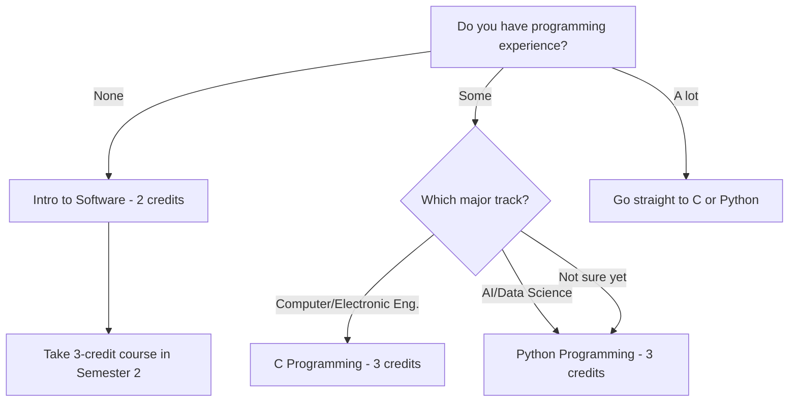
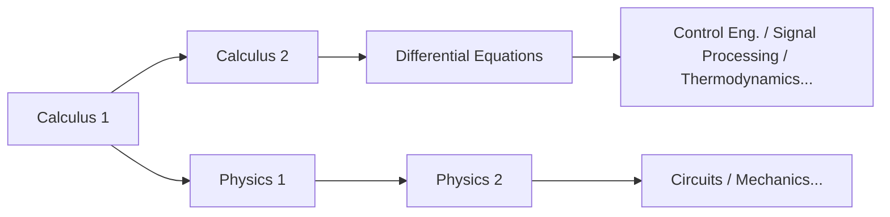

# STEM新入生履修ガイド

> 工学、コンピュータサイエンス、AI、自然科学に興味のある新入生のための履修戦略
> メインガイド：[[Spring 2026 Freshman Registration Guide]]

---

## 🎯 1. このガイドの対象者

このガイドは、以下の専攻を検討している**2026年度入学の新入生**を対象としています：

- **AI Computer & Electronic Engineering学部（CSEE）**：コンピュータ工学、電子工学、IT
- **Mechanical & Control Engineering**：機械工学、電子制御工学
- **Spatial Environment & Systems Engineering**：建設工学、都市環境工学
- **Life Sciences**：生命科学

「専攻はまだはっきり決まっていないけど、STEM系だと思う」という方にも、このガイドは役立ちますよ。Handongでは1年目に専攻を宣言しません。つまり、核心的な戦略は**最終的にどのSTEM専攻を選んでも役に立つ基礎科目で1年目を固める**ことです。

### 💡 なぜ1年目の基礎がこれほど重要なのか

STEM科目は**階段**のように積み上がっています。CalculusなしにDifferential Equationsは取れません。Differential Equationsなしに制御工学は理解できません。Linear Algebraを履修していなければ、機械学習の授業で行列演算が出てきても手が出ません。PhysicsなしにはKirchhoffの法則が回路理論でなぜそのような形になるのかを把握できません。

つまり、1年目に数学と科学の基礎を飛ばすと、2年目から専攻科目が**ドミノ倒しのように崩壊**します。STEMにおいて「後で取ろう」は「後で苦しもう」と同じ意味だと思ってください。

### 🏷️ 科目コードの読み方：見落とさないでください

Handongの科目コードには、見落としやすいけれど重要な情報が含まれています。例えば`GCS10058`の場合：

- **GCS**：学部/分野コード（GCS = Global Creative Software）
- **1**0058：先頭の数字が**学年レベル**を示す

なぜこれが重要か？ **1で始まる科目は1年生向け、3や4で始まる科目は上級生向けです。** 野心的な新入生が3xxxや4xxxの科目に登録しようとすることがありますが、それは基礎のない家を建てるようなものです。登録システムが弾かなくても、**1年目は1xxx科目にとどまってください。**

同様に、専攻が確定する前に高度な専攻科目を履修するのもリスクが伴います。まず**どの専攻でも使える科目** — Calculus、Physics、Programming、Linear Algebra — を固める方がはるかに賢明です。

---

## 📚 2. 1年目に履修すべき科目

### 🔢 2.1 Calculus 1 — 全STEMの出発点

Calculusは、工学、Physics、コンピュータサイエンス、経済学まで、ほぼ全ての分野の**共通言語**です。微分は「変化率」を、積分は「累積量」を扱います — この2つの概念なしには、高度なSTEM科目にアクセスすることはできません。

Calculusを外国語学習の**アルファベット**と考えてください。アルファベットなしには単語が読めず、単語なしには文が理解できません。高校で数学が得意だったかどうかは関係ありません — 大学のCalculusは根本的に深さのレベルが違うんです。イプシロン-デルタ定義から始まる厳密な数学的思考を鍛えていきます。

**理想的なロードマップ**：1学期目 Calculus 1 → 2学期目 Calculus 2 → 3学期目 Differential Equations。この順序が1学期でもずれると、専攻科目への進入が遅れますよ。

> **2026年春学期 — Calculus 1 (GEK10095) セクション：**

| Section | Professor | Time | English % | Notes |
|---------|-----------|------|-----------|-------|
| 01 | Lee Hanjin | Mon P4, Thu P4 | 0% | Korean instruction |
| 02 | Lee Hanjin | Mon P6, Thu P6 | 0% | Korean instruction, later time slot |
| **03** | **Kim Minjae** | **Mon P4, Thu P4** | **100%** | **English instruction** |
| **04** | **Cho Janghwan** | **Mon P1, Thu P1** | **100%** | **English instruction, Period 1** |

*時限制度：P1 = 9:00–10:00, P2 = 10:00–11:00, P3 = 11:00–12:00, P4 = 12:00–13:00, P5 = 13:00–14:00, P6 = 14:00–15:00, P7 = 15:00–16:00*

**セクションの選び方：**

- **韓国語で大丈夫な場合**：Section 01 (Lee Hanjin, Mon P4 / Thu P4) またはSection 02 (Lee Hanjin, Mon P6 / Thu P6)。同じ教授で時間帯が違うだけです。
- **英語での授業が必要な場合**：**Section 03 (Kim Minjae) またはSection 04 (Cho Janghwan)**。ただし、Section 04は**Period 1（午前9時）**です。まだ生活リズムを作っている最初の学期では、選択肢があるならPeriod 1は避けた方が無難です。

> **⚠️ 授業言語の落とし穴**：同じ教授でもセクションによって授業言語が異なる場合があります。韓国語が十分でない状態で韓国語セクションに入ってしまうと、数学と言語の二重の壁にぶつかります。登録前に必ず確認してください。

### 🔢 2.2 Calculus 2 — 可能なら1学期目に

通常Calculus 2は2学期目に履修しますが、高校でCalculusの確かな基礎がある場合、1学期目にCalculus 1と2を同時に履修することも可能です。これにより、2学期目には早くもDifferential Equationsに進め、専攻科目への参入を1学期分加速できます。

ただし、これは**数学に本当に自信がある場合にのみ推奨**します。1科目をしっかり仕上げる方が、無理して両方落とすよりずっと良いです。

> **2026年春学期 — Calculus 2 (GEK10096) セクション：**

| Section | Professor | Time | English % | Notes |
|---------|-----------|------|-----------|-------|
| **01** | **Lee Hanjin** | **Mon P2, Thu P2** | **100%** | **English instruction** |
| 02 | Kim Taehee | Mon P1, Thu P1 | 0% | Period 1 |
| 03 | Kim Taehee | Mon P2, Thu P2 | 0% | Korean instruction |

### ⚛️ 2.3 Physics — エンジニアの言語

工学系トラック（Computer & Electronic、Mechanical & Control、Spatial Environment）に進むなら、Physicsは**選択ではなく必須**です。Physics 1は力学と熱力学を扱い、力、エネルギー、運動量を数学的な厳密さで扱う方法を学びます。2学期目のPhysics 2（電磁気学）は電子工学の直接的な基盤です。

Physicsを**自然のプログラミング言語**と考えてください。エンジニアとして何かを設計するには自然の法則を理解する必要があり、その法則こそがPhysicsです。

> **2026年春学期 — Physics 1 (GEK10055)：**

| Section | Professor | Time | English % |
|---------|-----------|------|-----------|
| 01 | Cho Hyunji | Mon P2, Thu P2 | 0% |
| 02 | Cho Hyunji | Mon P3, Thu P3 | 0% |

**Physics 1 vs. Introduction to Physics**：コンピュータサイエンスやAIを検討している場合、「Introduction to Physics」（물리학 개론）という選択肢もあります。Physics 1より範囲は広く深さは浅いですが、工学的直感を養うには十分です。ただし、電子工学や機械工学を本気で考えているなら、**迷わずPhysics 1を取ってください。**

> **Introduction to Physics (GEK10090) — Physics 1の代替：**

| Section | Professor | Time | English % |
|---------|-----------|------|-----------|
| 01 | Cho Hyunji | Tue P2, Fri P2 | 0% |
| 02 | Cho Hyunji | Tue P3, Fri P3 | 0% |

### 📊 2.4 Linear Algebra — AI時代に欠かせない数学

Linear Algebraは、Calculusと並ぶSTEM数学の**二大柱**の一つです。ベクトル、行列、固有値、線形変換を扱い、AIと機械学習の**数学的心臓部**です。

なぜか？機械学習では、データは行列として表現され、モデルの学習は行列演算で行われます。ディープラーニングの逆伝播も、突き詰めれば行列の微分です。Linear Algebraなしには、AIの授業でなぜそう動くのかが理解できず — ただコードをコピーするだけの状態になります。

Calculus 1と並行して1学期目に取ることを強くおすすめします。きつく感じるかもしれませんが、両方を最初の学期で終えれば、2学期目以降の選択肢が**爆発的に広がります**。

> **2026年春学期 — Linear Algebra (GEK10082)：**

| Section | Professor | Time | English % | Notes |
|---------|-----------|------|-----------|-------|
| **01** | **Cho Janghwan** | **Mon P3, Thu P3** | **100%** | **English instruction** |
| **02** | **Cho Janghwan** | **Mon P5, Thu P5** | **100%** | **English instruction** |
| 03 | Kim Hyunsu | Tue P2, Fri P2 | 0% | Korean instruction |
| 04 | Kim Hyunsu | Tue P3, Fri P3 | 0% | Korean instruction |

### 💻 2.5 ICT Programming — コーディングの第一歩

Handongでは全学生が**ICT融合基礎7単位**を修了する必要があります：プログラミング5単位 + ICT応用2単位。STEM学生にとって、プログラミングは一般教養要件にとどまらず — **専攻のツール**です。

**1年目にプログラミングを終えるべき理由**：2年目から専攻科目のプログラミング課題が大量に課されます。その時点でまだ基礎プログラミング科目を履修中では、時間のロスが深刻です。理想的には、1学期目に3単位のプログラミング科目（Python/C）を取り、残りを2学期目に完了してください。

> **💡 OIA（Office of International Admissions）の確保席**：プログラミング科目には、**OIAが留学生新入生向けに特別に確保した席**がある場合があります。留学生の方はぜひ活用してください — 人気セクションへの登録チャンスが大幅に上がります。

#### 🌳 どこから始めるか

#### 💡 C vs. Python：どちらを先に？

Computer EngineeringやElectronic Engineeringを考えているなら、**Cが圧倒的に有利**です。Cはオペレーティングシステム、組込みシステム、ハードウェア制御の基盤であり、低レベルプログラミングの必須要素です。Cを先に学べば、Pythonは1週間もあれば習得できます。逆に、Pythonしか知らない状態でCを学ぼうとすると、メモリ管理やポインタで大きな壁にぶつかります。

AIやData Scienceがトラックなら、Pythonから始めるのは全く問題ありません。実務で最も広く使われており、参入障壁が低いのでプログラミングの楽しさをまず体験できます。

> **Intro to Software (GCS10001) — 2単位、完全な初心者向け：**

| Section | Professor | Time | English % |
|---------|-----------|------|-----------|
| 01 | Kim Heonju | Mon P1, Thu P1 | 0% |
| 02 | Lee Sanghun | Mon P5, Thu P5 | 0% |
| 03 | Lee Sanghun | Mon P6, Thu P6 | 0% |
| 04 | Kim Hyunsuk | Tue P2, Fri P2 | 0% |
| 05 | Kim Hyunsuk | Tue P4, Fri P4 | 0% |
| 06 | Kim Hyunsuk | Tue P6, Fri P6 | 0% |

> **C Programming (GCS10058) — 3単位、Computer/Electronic Eng.トラック向け：**

| Section | Professor | Time | English % |
|---------|-----------|------|-----------|
| 01 | Kim Kwang | Tue P2, Fri P2 | 0% |

⚠️ C Programmingは**1セクションのみ**です。競争が激しくなる可能性があるため、登録時は素早く動いてください。

> **Python Programming (GCS10004) — 3単位、AI/Data Scienceトラック向け：**

| Section | Professor | Time | English % |
|---------|-----------|------|-----------|
| 01 | Kim Kyungmi | Mon P2, Thu P2 | 0% |
| 02 | Kim Kyungmi | Tue P2, Fri P2 | 0% |
| 03 | Kim Kyungmi | Tue P3, Fri P3 | 0% |
| 04 | Park Jihyun | Mon P3, Thu P3 | 0% |
| **05** | **Park Jihyun** | **Mon P5, Thu P5** | **100%** |
| 06 | Yong Hwangi | Tue P3, Fri P3 | 0% |

> **Intro to Frontend (GCS10081) — 2単位、ウェブ開発に興味がある方向け：**

| Section | Professor | Time | English % |
|---------|-----------|------|-----------|
| 01 | Kim Guno | Mon P2, Thu P2 | 0% |
| 02 | Kim Guno | Mon P3, Thu P3 | 0% |
| 03 | Park Jihyun | Tue P5, Fri P5 | 0% |
| **04** | **Park Jihyun** | **Tue P6, Fri P6** | **100%** |
| 05 | Yang Jihye | Mon P3, Thu P3 | 0% |
| 06 | Yang Jihye | Mon P4, Thu P4 | 0% |

Intro to FrontendはHTML、CSS、JavaScriptを使ったウェブ開発の基礎を扱います。ICT応用2単位要件に算入できるほか、2単位のプログラミング科目として認定される場合もあります。ウェブ開発に興味があるなら取る価値があります。

### 🧪 2.6 General Chemistry — 生命科学/化学トラック必須

生命科学や化学関連の専攻を考えているなら、General Chemistryは必須です。原子構造、化学結合、反応速度論などの化学基礎をカバーし、BiochemistryやOrganic Chemistryの前提条件となります。

> **2026年春学期 — General Chemistry (GEK10058)：**

| Section | Professor | Time | English % | Notes |
|---------|-----------|------|-----------|-------|
| 01 | Kim Minkyung | Thu P3, P4 (consecutive) | 0% | 2 consecutive hours on Thursday |
| **02** | **Yu Taejun** | **Mon P2, Thu P2** | **100%** | **English instruction** |

### 🧬 2.7 General Biology — 正直なアドバイスが必要な科目

General Biologyは生命科学への入り口として必要ですが、知っておくべき**現実**があります。

**⚠️ General Biologyの競争は非常に激しいです。** セクション数が少なく、再履修の学生や上級生が先に席を埋めるため、**新入生が1学期目に登録するのは非常に難しい**です。「どうしても1学期目に取らなければ」と固執して他の重要科目の登録機会を逃すよりも、**はるかに賢明な戦略**は柔軟に対応すること：席が空いたら取り、空かなければ2学期目に延期しましょう。

1学期目には、Calculus、Linear Algebra、Programming — **どの専攻でも役に立つ科目** — の席を確保してください。General Biologyに全てを賭けないでください。2学期目にも開講されます。

> **2026年春学期 — General Biology (GEK10057)：**

| Section | Professor | Time | English % |
|---------|-----------|------|-----------|
| 01 | Hyun Changgi et al. 2 | Mon P5, Thu P5 | 0% |
| **02** | **Holzapfel Wilhelm et al.** | **Mon P2, Thu P2** | **100%** |
| 03 | Hyun Changgi et al. 2 | Mon P6, Thu P6 | 0% |

### 🤖 2.8 Introduction to AI, Computer & Electronic Engineering — 専攻の味見

AI Computer & Electronic Engineering学部（CSEE）に興味があるなら、この入門科目でその分野の全体像をつかめます。本格的な専攻科目に入る前に「自分に合っているか」を確認する絶好の機会です。

> **2026年春学期 — Intro to AI, Computer & Electronic Eng. (ECE10006)：**

| Section | Professor | Time | English % | Notes |
|---------|-----------|------|-----------|-------|
| 01 | Hwang Sungsu + 1 | Mon P6, P7 (consecutive) | 0% | Monday late time slot |

### 📐 2.9 Differential Equations and Applications — 数学が得意な場合

すでにCalculus 1 & 2を修了している場合、またはAP Calculus BCを高校で終えている場合、1学期目にDifferential Equationsを履修することも可能です。ただし、これは**数学の基礎が本当に確固たる場合にのみ推奨**します。

> **2026年春学期 — Differential Equations and Applications (GEK10053)：**

| Section | Professor | Time | English % |
|---------|-----------|------|-----------|
| 01 | Kim Taehee | Mon P3, Thu P3 | 0% |

---

## 🗓️ 3. おすすめ時間割

以下は実際の2026年春学期の開講科目に基づいた**時間割サンプル**です。参考例にすぎません — EPT（English Placement Test）の結果、興味、自分の体力に合わせて調整してください。

**基本原則：多めに登録して削る方が、少なく登録して後悔するよりずっといい。** 多めに登録し、最初の週の授業に出席してから、対応できないものを削ってください。逆 — 修正期間中に人気科目を追加しようとすること — は空き席がほとんどないため、ほぼ不可能です。

### 📋 Schedule A: Computer Science / AIトラック

**戦略**：Calculus + Linear Algebra + Pythonで、数学とコーディングの基礎を同時に構築

| Period | Mon | Tue | Wed | Thu | Fri |
|--------|-----|-----|-----|-----|-----|
| 1 | | | | | |
| 2 | | Python(Sec.02) | | | Python(Sec.02) |
| 3 | Linear Alg(Sec.01) | | | Linear Alg(Sec.01) | |
| 4 | Calc 1(Sec.01) | | Chapel | Calc 1(Sec.01) | |
| 5 | | | Chapel | | |
| 6 | | | Chapel | | |

| Course | Code | Credits | Professor | Notes |
|--------|------|---------|-----------|-------|
| Calculus 1 (Sec. 01) | GEK10095 | 3 | Lee Hanjin | Korean |
| Linear Algebra (Sec. 01) | GEK10082 | 3 | Cho Janghwan | **English 100%** |
| Python Programming (Sec. 02) | GCS10004 | 3 | Kim Kyungmi | Korean |
| Understanding the Bible | GEK20058 | 2 | Choose section | |
| Handong Character Education | GEK10015 | 1 | Choose section | |
| Chapel 1 | GEK10001 | 0 | Wed P4,5,6 | |
| Community Leadership Training 1 | GEK10008 | 0.5 | Separate schedule | |
| Social Service 1 | GEK10046 | 1 | Separate | |
| + English (per EPT result) | - | 3 | TBD | Likely placed on Tue/Fri |
| **Total** | | **16.5 + English 3** | | |

> **なぜこの組み合わせか？** CalculusとLinear Algebraを同時に取ることで数学的なシナジーが生まれます。ベクトルと行列の概念がCalculusの多変数関数と直接つながります。Pythonは火曜/金曜に配置して週のバランスをとります：月曜/木曜は数学、火曜/金曜はコーディング + 英語。このリズムが定着すれば、学習習慣が作りやすくなります。

### 📋 Schedule B: Electronic / Mechanical Engineeringトラック

**戦略**：Calculus + Physics + C Programmingで、盤石な工学基盤を構築

| Period | Mon | Tue | Wed | Thu | Fri |
|--------|-----|-----|-----|-----|-----|
| 1 | | | | | |
| 2 | Physics 1(Sec.01) | C Prog.(Sec.01) | | Physics 1(Sec.01) | C Prog.(Sec.01) |
| 3 | | | | | |
| 4 | Calc 1(Sec.01) | | Chapel | Calc 1(Sec.01) | |
| 5 | | | Chapel | | |
| 6 | | | Chapel | | |

| Course | Code | Credits | Professor | Notes |
|--------|------|---------|-----------|-------|
| Calculus 1 (Sec. 01) | GEK10095 | 3 | Lee Hanjin | Korean |
| Physics 1 (Sec. 01) | GEK10055 | 3 | Cho Hyunji | Korean |
| C Programming (Sec. 01) | GCS10058 | 3 | Kim Kwang | Korean, only section available |
| Understanding the Bible | GEK20058 | 2 | Choose section | |
| Handong Character Education | GEK10015 | 1 | Choose section | |
| Chapel 1 | GEK10001 | 0 | Wed P4,5,6 | |
| Community Leadership Training 1 | GEK10008 | 0.5 | Separate schedule | |
| Social Service 1 | GEK10046 | 1 | Separate | |
| + English (per EPT result) | - | 3 | TBD | Likely placed on Tue/Fri |
| **Total** | | **16.5 + English 3** | | |

> **なぜこの組み合わせか？** 電子工学と機械工学は物理の上に成り立っています。Calculus + Physicsを同時に取ると、Calculusで学んだ微分の概念がPhysicsの速度と加速度の問題にすぐ応用できます — 強力な**相互強化効果**です。C Programmingは組込みシステムとハードウェア制御の基盤であり、Electronic/Mechanical Engineering志望者に最適な選択です。

---

## ⚠️ 4. STEM学生がよくやらかすミス

### ❌ ミス1：「数学は後で取ろう」

これが**最も致命的なミス**です。STEMの科目構造はドミノとして理解するのが一番わかりやすいです：

Calculus 1を2学期目に延期 → Calculus 2が3学期目に → Differential Equationsが4学期目に → コア専攻科目にアクセスできるのは5学期目以降。卒業が丸1年遅れる可能性があります。**数学は1学期目から始めてください、例外なく。**

### ❌ ミス2：「コーディング未経験だから、Intro to Softwareでいいか」

Intro to Softwareは2単位のサンプラー科目です。Computer ScienceやAIを本気で考えているなら、飛ばしてPythonかCに直行してください。確かに難しくなりますが、困難を避けることは成長を避けることです。1学期目にIntro to Software、2学期目にPythonとなると、プログラミングの基礎だけで丸1年かかります。

### ❌ ミス3：General Biologyに全てを賭ける

前述の通り、General Biologyは再履修学生や上級生が先に席を埋めるため、**新入生が1学期目に取るのは非常に難しい**です。毎学期、General Biologyに固執してCalculusやProgrammingなどの重要科目を逃す学生がいます。柔軟に対応してください。

### ❌ ミス4：専攻が決まる前に高度な専攻科目を取ろうとする

「AIに興味があるから、Machine Learningでも取ってみようかな」 — この考えは危険です。高度な専攻科目（3xxx、4xxxコード）は**基礎を積んだ後**にのみ意味があります。Linear AlgebraなしにMachine Learningを取っても、講義の半分を理解できません。

1年目は**どの専攻にも通じる基礎科目**（Calculus、Physics、Linear Algebra、Programming）に集中してください。2年目からの専攻科目は全く遅くありません。

### ❌ ミス5：授業言語を確認しない

同じ科目、同じ教授でも、**セクションによって授業言語が違う場合があります。** 例えば、Cho Janghwan教授のCalculus 1は100%英語ですが、Lee Hanjin教授のセクションは韓国語です。登録前に各セクションの授業言語を必ず確認してください。

### ❌ ミス6：単位を少なく登録しすぎる

「難しそうだから15単位だけにしよう」 — この戦略は実は裏目に出ます。**多めに登録して削る方が、少なく登録して追加しようとするよりずっと簡単です。** 修正期間中に人気科目の空き席を取るのは、ほぼ奇跡です。18〜20単位で始め、最初の週の授業に出てから、対応できないものを削る。それが賢明なやり方です。

---

## 🔭 5. 2学期目を見据えて

上記の科目を1学期目に無事修了した場合、2学期目に検討すべき科目は以下の通りです：

| Course | Target | Why It Matters |
|--------|--------|----------------|
| **Calculus 2** | All STEM | Calculus 1の続き。級数、多変数Calculusをカバーし、Differential Equationsの前提条件 |
| **Physics 2** | Electronic/Mechanical tracks | 電磁気学をカバー — 電子工学の直接的な基盤 |
| **Data Structures** | Computer Science/AI tracks | 配列、リスト、木、グラフ — コアプログラミング概念であり、コーディング面接の定番 |
| **General Chemistry** | Life Sciences/Chemistry | 1学期目に取れなかった場合、2学期目は必須 |
| **General Biology** | Life Sciences | 1学期目に席を確保できなかった場合、2学期目に再挑戦 |
| **Differential Equations** | Calc 1 & 2修了者 | 工学専攻の核心的な数学ツール |

2学期目のカギは**1学期目に築いた基盤の上にもう一層積み上げること**です。Calculus 1を修了すれば、自然にCalculus 2に進みます。プログラミングの基礎を終えれば、Data Structuresに進みます。この流れを保つことが、大学4年間全体の軌道を決めます。

---

*このガイドは[[Spring 2026 Freshman Registration Guide]]のSTEM詳細資料です。*
*韓国語版については[[이공계 신입생 가이드]]をご覧ください。*
*参照：[[Registration Schedule]]*

*最終更新：2026-02-21*
