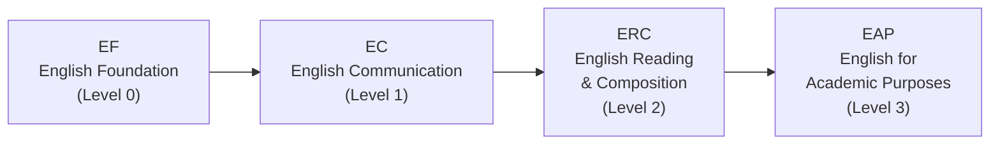

# 履修設計のコツ

適切な科目を選ぶことは課題の半分にすぎません。時間割の中でどう配置するか、何単位取るかも同様に重要です。このガイドでは、英語・韓国語科目トラックの選び方から、時間割の具体的な組み方まで解説します。

---

## 英語科目トラック (EPT)

HanSTオリエンテーション中に、全新入生が**EPT (English Placement Test)** を受験します。その結果に基づいて、英語科目シーケンスのどのレベルから始めるかが決まります。



EPTで上位レベルに合格すれば、下位レベルをスキップできます。また、TOEFL、IELTS、TOEICなどの標準テストのスコアがあれば、特定のレベルが免除される場合もあります。

**英語科目を後回しにしないでください。** 最近の学期では、教授が定員制限を厳格に運用しています。「来学期に取ろう」と延期する学生が、全ての席が埋まっていることに気づくケースが増えています。指定された英語レベルの科目は**最初の学期で直ちに**履修してください。席はすぐに埋まり、待つことに何のメリットもありません。

---

## 韓国語科目の要件

この要件は、**外国のパスポートを持つ学生**、および韓国語での授業に困難を感じる可能性のある**長期海外居住の韓国国籍者**に適用されます。Practical Koreanの科目シーケンスを修了する必要があります。オリエンテーション中に韓国語のプレイスメントテストを受験し、開始レベルが決まります。

**非常に重要なアドバイス：** より高いレベルに入ろうとして、プレイスメントテストで当て推量で回答しないでください。その理由は以下の通りです：

- **Korean 1**（最低レベル）から始めれば、確実な単位を簡単に獲得しながら、しっかりとした基礎を築けます。授業の負担は管理しやすく、自信がつきます。
- 当て推量で**Korean 3**に入ってしまうと、Korean 1とKorean 2で取得できたはずの単位を他の科目で埋めなければなりません。また、実際の能力を超えた難しい韓国語の授業に直面します。

**正直に回答してください。** 低いレベルから始めて着実にステップアップする方が、実際のレベル以上のクラスで苦しむよりも、長期的にはるかに有利です。これはプライドの問題ではなく、戦略の問題です。

---

## 時間割設計のコツ

### オーバーロード戦略：多めに登録し、後で削る

最大**22単位**まで登録できます（オーバーロード）。黄金律は：**多めに登録して最初の週の後に削る方が、少なめに登録して後から追加しようとするよりも常に良い。** 人気のある科目は修正期間中に空き席がありません。少なめに始めて後から競争の激しい科目を追加しようとしても、ほぼ確実に失敗します。

### 単位の目標

- **卒業要件**：8学期で130単位 ＝ 1学期あたり約16.25単位
- **推奨目標**：1学期あたり17-18単位で余裕のある計画
- **奨学生**：最低**15.5単位**を維持する必要があります。修正期間中に科目を削除する際、このしきい値を下回らないよう十分注意してください。

### 科目コードの読み方

韓東の科目コードの**最初の数字**は、推奨する学年レベルを示しています：

- **1**xxx：1年生レベルの科目（あなたが履修すべきもの）
- **2**xxx：2年生レベルの科目
- **3**xxx：3年生レベルの科目
- **4**xxx：4年生レベルの科目

新入生は**1xxx科目に集中**してください。3xxxや4xxxコードの科目には通常前提条件があり、システム上登録できたとしても、内容はあなたの準備レベルをはるかに超えています。基礎なしに上位科目に挑むことは勇敢ではなく、無謀です。

### 昼食の時間を確保する

Period 4（12:00-13:00）とPeriod 5（13:00-14:00）は昼食の時間帯にまたがっています。この時間帯に授業を入れると昼食を抜くことになります。1-2回なら耐えられますが、毎日続けるとエネルギーと集中力が失われます。**3コマ以上連続で授業を入れないでください。** セッション間に学んだことを消化するための休憩が必要です。

### 先輩に教授について聞く

同じ科目でも教授が違えば、まったく異なる体験になります — 課題の量、試験の難易度、成績評価のスタイル、教授法のすべてが。授業要覧にはこれらの情報は載っていません。**섬김이（学生メンター）や先輩に聞いてください**：「この科目を履修した人はいますか？どうでしたか？」これが最も信頼できる情報源です。

### セクションごとの授業言語を確認する

留学生にとって、これは何度強調しても足りません。**同じ教授が、あるセクションでは韓国語、別のセクションでは英語で教えることがあります。** 登録前に、各セクションの「English %」の欄を必ず確認してください。留学生が誤って韓国語セクションに登録してしまう — あるいはその逆 — というケースは毎学期発生しています。

---

## おすすめ時間割（留学生向け）

以下は**100%英語セクション**のみで構成された時間割のサンプルです。これらは参考例です — EPTの結果、興味、エネルギーレベルに応じて調整してください。黄金律を忘れないでください：必要以上に多くの科目を登録し、最初の週の後に削りましょう。

### Schedule A: 人文社会科学フォーカス（全英語）

```
Period | Mon            | Tue              | Wed        | Thu            | Fri
-------|----------------|------------------|------------|----------------|------------------
  1    |                | Bible (07)       |            |                | Bible (07)
  2    |                | Intl Relations   | CharEd*    |                | Intl Relations
  3    |                | Psychology       |            |                | Psychology
  4    | D&P            |                  | Chapel     | D&P            |
  5    | Python (05)    | Python (05)      | Chapel     | Python (05)    |
  6    |                |                  | Chapel     |                |
```

> **⚠️ CharEd conflict:** Character Education Sec 01 (Mon 5, English) はPython Sec 05 (Mon 5)と重複します。**解決策：** CharEd Sec 02-06 (Wed 2, Korean)を代わりに履修するか、Pythonを Mon 5以外のセクションに変更してください。

| Course | Code | Credits | Professor | Note |
|--------|------|---------|-----------|------|
| Understanding the Bible (07) | GEK20058 | 2 | Joshua Kim | Tue 1, Fri 1, 100% English |
| International Relations Intro (01) | ISE10052 | 3 | 정모니카 | Tue 2, Fri 2, 100% English |
| Psychology Intro (02) | CSW10003 | 3 | 지원근 | Tue 3, Fri 3, 100% English |
| Discussion & Presentation (01) | GCS10013 | 3 | Richardson | Mon 4, Thu 4, 100% English |
| Character Education (02-06) | GEK10015 | 1 | Various | **Wed 2, Korean** (Sec 01 Mon 5 conflicts with Python) |
| Python Programming (05) | GCS10004 | 3 | 박지현 | Mon 5, Thu 5, 100% English |
| Chapel 1 | GEK10001 | 0 | — | Wed 4, 5, 6 |
| Community Leadership Training 1 | GEK10008 | 0.5 | TBA | Time TBA |
| Social Service 1 | GEK10046 | 1 | — | Separate schedule |
| + Korean Language Course | — | 3 | TBA | Required for international students |
| **Total** | | **19.5 + Korean (3)** | | |

**この時間割が機能する理由：** 火曜日と金曜日に3つの連続した英語科目（Bible、International Relations、Psychology）が知的な中心を担い、月曜日と木曜日は午後の授業のみで軽めです。水曜日はChapelと自習時間に充てられます。まったく異なる2つの分野（国際関係と心理学）を探究しながら、プログラミングスキルと英語でのアカデミックプレゼンテーション能力を同時に身につけます。

**上記のCharEd重複の解決策：** Character Education Sec 01 (Mon 5) はPython Sec 05 (Mon 5) と重複します。この時間割ではCharEd Sec 02-06 (Wed 2, Korean)を使用して重複を回避しています。韓国語が十分でない場合は、代わりにPythonをMon 5以外のセクションに変更してください。

### Schedule B: STEMフォーカス（全英語）

```
Period | Mon              | Tue              | Wed        | Thu              | Fri
-------|------------------|------------------|------------|------------------|------------------
  1    |                  | Bible (07)       |            |                  | Bible (07)
  2    |                  | Worldview (02)   |            |                  | Worldview (02)
  3    | Linear Alg (01)  |                  |            | Linear Alg (01)  |
  4    | Calculus 1 (03)  |                  | Chapel     | Calculus 1 (03)  |
  5    | Python (05)      | Python (05)      | Chapel     | Python (05)      |
  6    |                  |                  | Chapel     |                  |
```

> **⚠️ CharEd conflict:** Character Education Sec 01 (Mon 5, English) はPython Sec 05 (Mon 5)と重複します。**解決策：** CharEd Sec 02-06 (Wed 2, Korean)を代わりに履修するか、Pythonを Mon 5以外のセクションに変更してください。

| Course | Code | Credits | Professor | Note |
|--------|------|---------|-----------|------|
| Understanding the Bible (07) | GEK20058 | 2 | Joshua Kim | Tue 1, Fri 1, 100% English |
| Christian Worldview (02) | GEK20011 | 2 | 최용준 | Tue 2, Fri 2, 100% English |
| Linear Algebra (01) | GEK10082 | 3 | 조장환 | Mon 3, Thu 3, 100% English |
| Calculus 1 (03) | GEK10095 | 3 | 김민재 | Mon 4, Thu 4, 100% English |
| Character Education (02-06) | GEK10015 | 1 | Various | **Wed 2, Korean** (Sec 01 Mon 5 conflicts with Python) |
| Python Programming (05) | GCS10004 | 3 | 박지현 | Mon 5, Thu 5, 100% English |
| Chapel 1 | GEK10001 | 0 | — | Wed 4, 5, 6 |
| Community Leadership Training 1 | GEK10008 | 0.5 | TBA | Time TBA |
| Social Service 1 | GEK10046 | 1 | — | Separate schedule |
| + Korean Language Course | — | 3 | TBA | Required for international students |
| **Total** | | **18.5 + Korean (3)** | | |

**この時間割が機能する理由：** Calculus 1とLinear Algebraを同時に履修することで強力なシナジーが生まれます — Linear Algebraのベクトルと行列の概念は、Calculusで出会う多変数のアイデアと直接つながります。Pythonがプログラミングの基盤を提供します。火曜日と金曜日は軽め（BibleとWorldviewのみ）で、数学の問題演習に取り組む時間が確保できます。

**上記のCharEd重複の解決策：** Character Education Sec 01 (Mon 5) はPython Sec 05 (Mon 5) と重複します。この時間割ではCharEd Sec 02-06 (Wed 2, Korean)を使用して重複を回避しています。韓国語が十分でない場合は、代わりにPythonをMon 5以外のセクションに変更してください。

---

*Last updated: 2026-02-21*
