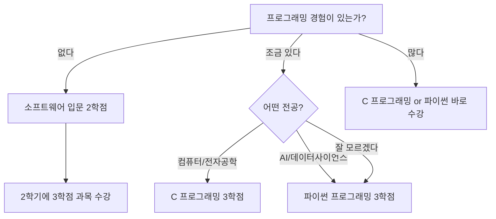
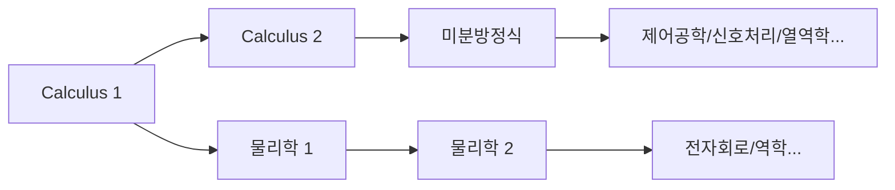

# 이공계 신입생 수강 가이드

> 공학, 컴퓨터, AI, 자연과학에 관심 있는 신입생을 위한 수강 전략
> 메인 가이드: [[2026-1 새내기 수강신청 가이드 Hub]]

---

## 🎯 1. 이 가이드의 대상

이 가이드는 다음과 같은 전공을 고려하고 있는 **2026학번 신입생**을 위해 작성되었습니다.

- **AI컴퓨터전자공학부**: 컴퓨터공학, 전자공학, IT
- **기계제어공학부**: 기계공학, 전자제어공학
- **공간환경시스템공학부**: 건설공학, 도시환경공학
- **생명과학부**: 생명과학

"아직 정확한 전공은 모르지만, 이과 쪽이 맞는 것 같다"는 분도 해당됩니다. 한동대는 1학년 때 전공을 정하지 않기 때문에, **어떤 이공계 전공을 선택하든 후회하지 않을 기초 과목**을 1학년 때 채워두는 것이 핵심 전략이에요.

### 💡 왜 1학년 기초가 이토록 중요한가

이공계의 전공 과목은 **계단식 구조**로 되어 있습니다. Calculus를 모르면 미분방정식을 들을 수 없고, 미분방정식을 모르면 제어공학을 이해할 수 없어요. 선형대수학을 모르면 머신러닝 수업에서 행렬 연산이 나올 때 멘붕이 옵니다. 물리학을 안 들으면 전자회로에서 키르히호프 법칙이 왜 그런 형태인지 감도 잡히지 않죠.

즉, 1학년 때 수학과 과학 기초를 빼먹으면 2학년부터 **도미노처럼** 전공 수업이 무너집니다. "나중에 들어야지"라는 말은 이공계에서는 "나중에 고생하겠다"와 같은 말이에요.

### 🏷️ 과목 코드 읽는 법: 절대 모르고 넘어가지 마세요

한동대 과목 코드에는 중요한 정보가 숨어 있습니다. 예를 들어 `GCS10058`에서:

- **GCS**: 학부/영역 코드
- **1**0058: 앞자리 숫자가 **학년 수준**을 나타냄

이것이 왜 중요하냐면, **과목 코드가 1로 시작하면 1학년용, 3이나 4로 시작하면 고학년용**입니다. 신입생이 3xxx, 4xxx 과목을 듣겠다고 욕심 부리는 경우가 있는데, 이는 기초 없이 건물을 짓는 것과 같아요. 수강신청 시스템이 막지 않더라도, **1학년 때는 1xxx 과목에 집중하세요.**

마찬가지로, 아직 전공이 확정되지 않은 상태에서 특정 전공의 심화 과목을 듣는 것도 위험합니다. 전공 기초(Calculus, 물리학, 프로그래밍, 선형대수학) 같은 **어디에나 통하는 과목**을 먼저 채우는 것이 현명한 선택입니다.

---

## 📚 2. 1학년 때 반드시 들어야 할 과목

### 🔢 2.1 Calculus 1 — 모든 이공계의 출발점

Calculus(미적분학)는 공학, 물리학, 컴퓨터과학, 경제학까지 거의 모든 분야의 **공통 언어**입니다. 미분은 "변화율"을 다루고, 적분은 "누적량"을 다루는데, 이 두 개념 없이는 이공계의 어떤 심화 과목도 이해할 수 없어요.

비유를 하자면, Calculus는 외국어를 배울 때의 **알파벳**과 같습니다. 알파벳을 모르면 단어를 읽을 수 없고, 단어를 모르면 문장을 이해할 수 없죠. 고등학교에서 수학을 잘했든 못했든 상관없습니다 — 대학 Calculus는 고등학교 미적분과 깊이 자체가 다릅니다. 엡실론-델타 정의부터 시작해서 엄밀한 수학적 사고를 훈련하게 돼요.

**이상적인 로드맵**: 1학기 Calculus 1 → 2학기 Calculus 2 → 3학기 미분방정식. 이 흐름이 1학기라도 밀리면 전공 진입 자체가 지연됩니다.

> **2026-1학기 Calculus 1 (GEK10095) 개설 분반(같은 과목의 서로 다른 반):**

| 분반 | 교수님 | 시간 | 영어강의 | 비고 |
|------|--------|------|----------|------|
| 01 | 이한진 | 월4, 목4 | 0% | 한국어 수업 |
| 02 | 이한진 | 월6, 목6 | 0% | 한국어 수업, 늦은 시간대 |
| 03 | 김민재 | 월4, 목4 | 100% | 영어 수업 |
| 04 | 조장환 | 월1, 목1 | 100% | 영어 수업, 1교시 |

**분반 선택 팁:**

- **한국어가 편한 학생**: 01분반(이한진, 월4목4) 또는 02분반(이한진, 월6목6) 추천. 같은 교수님이므로 시간대만 다릅니다.
- **영어 수업이 필요한 학생**: 03분반(김민재) 또는 04분반(조장환). 단, 04분반은 **1교시**입니다. 적응이 안 된 1학기에는 1교시를 피하는 것이 현명합니다. 물론 1교시밖에 없는 필수 과목이라면 어쩔 수 없지만, 선택의 여지가 있다면 2교시 이후로 배치하는 걸 추천드려요.

> **⚠️ "영어 강의" 함정 주의**: 같은 교수님이라도 분반에 따라 한국어/영어가 다를 수 있습니다. 반드시 분반별 강의언어를 확인하세요. 영어를 못하는데 영어 분반에 들어가면 수학 + 영어를 동시에 싸워야 하는 이중고가 됩니다.

### 🔢 2.2 Calculus 2 — 여유가 된다면 1학기에

보통 Calculus 2는 2학기에 듣지만, 고등학교에서 미적분 기초가 탄탄한 학생이라면 1학기에 Calculus 1과 2를 동시에 수강하는 것도 가능합니다. 이렇게 하면 2학기에 미분방정식을 바로 들을 수 있어서 전공 진입이 한 학기 빨라져요.

다만 이것은 **수학적 자신감이 확실한 경우에만** 추천합니다. 무리하게 두 과목을 듣다가 둘 다 놓치는 것보다, 하나를 확실히 하는 게 낫습니다.

> **2026-1학기 Calculus 2 (GEK10096) 개설 분반:**

| 분반 | 교수님 | 시간 | 영어강의 | 비고 |
|------|--------|------|----------|------|
| 01 | 이한진 | 월2, 목2 | 100% | 영어 수업 |
| 02 | 김태희 | 월1, 목1 | 0% | 1교시 |
| 03 | 김태희 | 월2, 목2 | 0% | 한국어 수업 |

### ⚛️ 2.3 물리학 — 공학도의 언어

공학 계열(전산전자, 기계제어, 공간환경)로 가려면 물리학은 **선택이 아니라 필수**입니다. 물리학 1은 역학과 열역학을 다루며, 힘, 에너지, 운동량 같은 개념을 수학적으로 엄밀하게 배웁니다. 이것이 2학기 물리학 2의 전자기학으로 이어지고, 전자공학의 기초가 됩니다.

비유하자면, 물리학은 **자연이 쓰는 프로그래밍 언어**와 같아요. 엔지니어가 무언가를 설계하려면 자연의 법칙을 이해해야 하고, 그 법칙이 바로 물리학입니다.

> **2026-1학기 물리학 1 (GEK10055):**

| 분반 | 교수님 | 시간 | 영어강의 |
|------|--------|------|----------|
| 01 | 조현지 | 월2, 목2 | 0% |
| 02 | 조현지 | 월3, 목3 | 0% |

**물리학 1 vs 물리학 개론**: 컴퓨터공학이나 AI 전공을 고려하는 학생이라면 "물리학 개론"으로 대체할 수도 있습니다. 물리학 개론은 물리학 1보다 범위가 넓지만 깊이가 얕아서, 공학적 직관을 키우기에는 충분합니다. 다만 전자공학이나 기계공학처럼 물리와 깊이 연계되는 전공을 고려한다면 **반드시 물리학 1**을 들으세요.

> **물리학 개론 (GEK10090) — 물리학 1 대신 선택 가능:**

| 분반 | 교수님 | 시간 | 영어강의 |
|------|--------|------|----------|
| 01 | 조현지 | 화2, 금2 | 0% |
| 02 | 조현지 | 화3, 금3 | 0% |

### 📊 2.4 선형대수학 — AI 시대의 필수 수학

선형대수학은 Calculus와 함께 이공계의 **양대 산맥**입니다. 벡터, 행렬, 고유값(Eigenvalue), 선형변환 등을 다루며, 특히 AI와 머신러닝의 **수학적 심장**이라고 할 수 있어요.

왜 그런가 하면, 머신러닝에서 데이터는 행렬로 표현되고, 모델의 학습은 행렬 연산으로 이루어집니다. 딥러닝의 역전파(Backpropagation)도 결국 행렬의 미분이에요. 선형대수학을 모르면 AI 수업에서 "왜 이렇게 되는지"를 이해할 수 없고, 그저 코드를 따라 치는 수준에 머물게 됩니다.

Calculus 1과 병행해서 1학기에 듣는 것을 강력 추천합니다. 부담이 될 수 있지만, 이 두 과목을 1학기에 끝내면 2학기부터의 선택지가 폭발적으로 넓어져요.

> **2026-1학기 선형대수학 (GEK10082):**

| 분반 | 교수님 | 시간 | 영어강의 | 비고 |
|------|--------|------|----------|------|
| 01 | 조장환 | 월3, 목3 | 100% | 영어 수업 |
| 02 | 조장환 | 월5, 목5 | 100% | 영어 수업 |
| 03 | 김현수 | 화2, 금2 | 0% | 한국어 수업 |
| 04 | 김현수 | 화3, 금3 | 0% | 한국어 수업 |

### 💻 2.5 ICT 프로그래밍 — 코딩의 첫걸음

한동대에서는 모든 학생이 **ICT 융합기초 7학점**을 이수해야 합니다. 이 중 프로그래밍 5학점 + 응용 2학점 구성이에요. 이공계 학생에게 프로그래밍은 단순한 교양이 아니라 **전공의 도구**입니다.

**프로그래밍을 1학년 때 반드시 끝내야 하는 이유**: 2학년부터 전공 수업에서 프로그래밍 과제가 쏟아집니다. 그때 프로그래밍 기초 수업을 듣고 있으면 시간 낭비가 심해요. 가능하면 1학기에 프로그래밍 3학점 과목(파이썬/C)을 듣고, 2학기에 나머지를 채우세요.

> **💡 OIA(국제입학처) 유보석 정보**: 프로그래밍 과목에는 OIA에서 외국인 신입생을 위한 자리를 별도로 확보해두는 경우가 있습니다. 외국인 학생이라면 이 점을 활용하세요.

#### 🌳 경로 선택: 어디서 시작할 것인가

#### 💡 C vs 파이썬, 어떤 것을 먼저?

컴퓨터공학이나 전자공학을 고려한다면 **C가 압도적으로 유리**합니다. C는 운영체제, 임베디드 시스템, 하드웨어 제어 등 저수준 프로그래밍의 기초가 되기 때문이에요. C를 먼저 배우면 파이썬은 나중에 일주일이면 익힙니다. 반대로 파이썬만 알면 C를 나중에 배울 때 메모리 관리, 포인터 같은 개념에서 큰 벽을 느끼게 돼요.

AI나 데이터사이언스 쪽이라면 파이썬부터 시작해도 괜찮습니다. 실무에서 가장 많이 쓰는 언어이고, 진입장벽도 낮아서 프로그래밍의 즐거움을 먼저 느낄 수 있거든요.

> **소프트웨어 입문 (GCS10001) — 2학점, 코딩 완전 초보용:**

| 분반 | 교수님 | 시간 | 영어강의 |
|------|--------|------|----------|
| 01 | 김헌주 | 월1, 목1 | 0% |
| 02 | 이상훈 | 월5, 목5 | 0% |
| 03 | 이상훈 | 월6, 목6 | 0% |
| 04 | 김현숙 | 화2, 금2 | 0% |
| 05 | 김현숙 | 화4, 금4 | 0% |
| 06 | 김현숙 | 화6, 금6 | 0% |

> **C 프로그래밍 (GCS10058) — 3학점, 컴퓨터/전자공학 지망:**

| 분반 | 교수님 | 시간 | 영어강의 |
|------|--------|------|----------|
| 01 | 김광 | 화2, 금2 | 0% |

⚠️ C 프로그래밍은 **단 1개 분반**입니다. 경쟁이 치열할 수 있으니 수강신청 때 빠르게 넣어야 해요.

> **파이썬 프로그래밍 (GCS10004) — 3학점, AI/데이터사이언스 지망:**

| 분반 | 교수님 | 시간 | 영어강의 |
|------|--------|------|----------|
| 01 | 김경미 | 월2, 목2 | 0% |
| 02 | 김경미 | 화2, 금2 | 0% |
| 03 | 김경미 | 화3, 금3 | 0% |
| 04 | 박지현 | 월3, 목3 | 0% |
| 05 | 박지현 | 월5, 목5 | 100% |
| 06 | 용환기 | 화3, 금3 | 0% |

> **프론트엔드입문 (GCS10081) — 2학점, 웹개발 관심자:**

| 분반 | 교수님 | 시간 | 영어강의 |
|------|--------|------|----------|
| 01 | 김군오 | 월2, 목2 | 0% |
| 02 | 김군오 | 월3, 목3 | 0% |
| 03 | 박지현 | 화5, 금5 | 0% |
| 04 | 박지현 | 화6, 금6 | 100% |
| 05 | 양지혜 | 월3, 목3 | 0% |
| 06 | 양지혜 | 월4, 목4 | 0% |

프론트엔드입문은 HTML, CSS, JavaScript 등 웹 개발의 기초를 다루는 2학점 과목입니다. 웹 개발에 관심이 있다면 고려해보세요.

### 🧪 2.6 일반화학 — 생명과학/화학 관련 전공 필수

생명과학부나 화학 관련 전공을 고려한다면 일반화학은 필수입니다. 원자 구조, 화학 결합, 반응 속도론 등 화학의 기초를 다루며, 생화학이나 유기화학의 선수 과목이에요.

> **2026-1학기 일반화학 (GEK10058):**

| 분반 | 교수님 | 시간 | 영어강의 | 비고 |
|------|--------|------|----------|------|
| 01 | 김민경 | 목3,4 (연강) | 0% | 목요일에 2시간 연속 |
| 02 | 유태준 | 월2, 목2 | 100% | 영어 수업 |

### 🧬 2.7 일반생물학 — 현실적 조언이 필요한 과목

일반생물학은 생명과학부 진입을 위해 필요하지만, 한 가지 **솔직한 현실**을 말씀드려야 합니다.

**일반생물학은 경쟁이 극심합니다.** 분반이 적고, 재수강생이나 상급생이 먼저 자리를 차지하는 경우가 많아서 **신입생이 1학기에 수강하기가 매우 어렵습니다.** "반드시 1학기에 들어야지"라고 고집하다가 다른 중요한 과목의 수강신청 타이밍을 놓치는 것보다, 일반생물학은 자리가 나면 듣고 안 나면 2학기로 미루는 **유연한 전략**이 훨씬 현명해요.

1학기에 일반생물학 대신 Calculus, 선형대수학, 프로그래밍 같은 **어디서든 유용한 과목**을 먼저 확보하세요. 일반생물학은 2학기에도 개설되니까요.

> **2026-1학기 일반생물학 (GEK10057):**

| 분반 | 교수님 | 시간 | 영어강의 |
|------|--------|------|----------|
| 01 | 현창기 외 2명 | 월5, 목5 | 0% |
| 02 | Holzapfel Wilhelm 외 1명 | 월2, 목2 | 100% |
| 03 | 현창기 외 2명 | 월6, 목6 | 0% |

### 🤖 2.8 AI컴퓨터및전자공학입문 — 전공 맛보기

AI컴퓨터전자공학부에 관심이 있다면 이 과목을 들어보는 것도 좋습니다. 전공의 전체적인 그림을 보여주는 입문 강좌로, 본격적인 전공 수업 전에 "이 분야가 나와 맞는지" 감을 잡을 수 있어요.

> **2026-1학기 AI컴퓨터및전자공학입문 (ECE10006):**

| 분반 | 교수님 | 시간 | 영어강의 | 비고 |
|------|--------|------|----------|------|
| 01 | 황성수 외 | 월6,7 (연강) | 0% | 월요일 늦은 시간대 |

### 📐 2.9 미분방정식과 응용 — 수학 자신감이 있다면

Calculus 1·2를 이미 이수했거나, 고교 때 AP Calculus BC를 마친 학생이라면 1학기에 미분방정식을 듣는 것도 가능합니다. 다만 이 경우는 **정말 수학 기초가 탄탄한 경우에만** 추천합니다.

> **2026-1학기 미분방정식과 응용 (GEK10053):**

| 분반 | 교수님 | 시간 | 영어강의 |
|------|--------|------|----------|
| 01 | 김태희 | 월3, 목3 | 0% |

---

## 🗓️ 3. 추천 시간표

> **교시 참고:** 1교시=09:00, 2교시=10:00, 3교시=11:00, 4교시=12:00, 5교시=13:00, 6교시=14:00, 7교시=15:00, 8교시=16:00 (각 교시 1시간)

아래는 실제 2026-1학기 개설 과목을 기반으로 구성한 **예시 시간표**입니다. 이것은 하나의 참고 자료일 뿐이며, EPT(영어배치고사) 결과, 관심 분야, 체력 등에 맞게 조정해야 합니다.

**핵심 원칙: 많이 넣고 빼는 것이 적게 넣고 후회하는 것보다 낫다.** 수강신청 때 여유 있게 과목을 넣어두고, 첫 주에 수업을 들어본 뒤 감당이 안 되면 드롭하는 전략이 현명합니다. 반대로 적게 넣으면 추가할 자리가 없어서 후회하게 돼요.

### 📋 시간표 A: 컴퓨터/AI 지망

**전략**: Calculus + 선형대수학 + 파이썬으로 수학·코딩 기초를 동시에 깔기

| 교시 | 월 | 화 | 수 | 목 | 금 |
|------|------|------|------|------|------|
| 1 | | | | | |
| 2 | | 파이썬(02) | | | 파이썬(02) |
| 3 | 선형대수(01) | | | 선형대수(01) | |
| 4 | Calc1(01) | | 채플 | Calc1(01) | |
| 5 | | | 채플 | | |
| 6 | | | 채플 | | |

| 과목 | 코드 | 학점 | 교수님 | 비고 |
|------|------|------|--------|------|
| Calculus 1 (01분반) | GEK10095 | 3 | 이한진 | 한국어 |
| 선형대수학 (01분반) | GEK10082 | 3 | 조장환 | 영어 100% |
| 파이썬 프로그래밍 (02분반) | GCS10004 | 3 | 김경미 | 한국어 |
| 성경의 이해 | GEK20058 | 2 | 분반 선택 | |
| 한동인성교육 | GEK10015 | 1 | 분반 선택 | |
| 채플 1 | GEK10001 | 0 | 수4,5,6 | |
| 공동체리더십훈련 1 | GEK10008 | 0.5 | 시간 별도 | |
| 사회봉사 1 | GEK10046 | 1 | 별도 | |
| + 영어 (EPT 결과) | - | 3 | TBD | 화금 시간대 배치 가능 |
| **합계** | | **16.5 + 영어 3** | | |

> **왜 이 조합인가?** Calculus와 선형대수학을 동시에 수강하면 수학적 사고력이 시너지를 냅니다. 벡터와 행렬 개념이 Calculus의 다변수 함수와 연결되거든요. 파이썬은 화금에 배치해서 주중 균형을 맞추었습니다. 월목은 수학, 화금은 코딩 + 영어 — 이런 리듬이 생기면 공부 습관 잡기가 수월해요.

### 📋 시간표 B: 전자/기계공학 지망

**전략**: Calculus + 물리학 + C 프로그래밍으로 공학 기초를 단단하게

| 교시 | 월 | 화 | 수 | 목 | 금 |
|------|------|------|------|------|------|
| 1 | | | | | |
| 2 | 물리학1(01) | C프로(01) | | 물리학1(01) | C프로(01) |
| 3 | | | | | |
| 4 | Calc1(01) | | 채플 | Calc1(01) | |
| 5 | | | 채플 | | |
| 6 | | | 채플 | | |

| 과목 | 코드 | 학점 | 교수님 | 비고 |
|------|------|------|--------|------|
| Calculus 1 (01분반) | GEK10095 | 3 | 이한진 | 한국어 |
| 물리학 1 (01분반) | GEK10055 | 3 | 조현지 | 한국어 |
| C 프로그래밍 (01분반) | GCS10058 | 3 | 김광 | 한국어, 유일한 분반 |
| 성경의 이해 | GEK20058 | 2 | 분반 선택 | |
| 한동인성교육 | GEK10015 | 1 | 분반 선택 | |
| 채플 1 | GEK10001 | 0 | 수4,5,6 | |
| 공동체리더십훈련 1 | GEK10008 | 0.5 | 시간 별도 | |
| 사회봉사 1 | GEK10046 | 1 | 별도 | |
| + 영어 (EPT 결과) | - | 3 | TBD | 화금 시간대 배치 가능 |
| **합계** | | **16.5 + 영어 3** | | |

> **왜 이 조합인가?** 전자공학이나 기계공학은 물리학 기반 위에 세워집니다. Calculus + 물리학을 동시에 들으면, Calculus에서 배운 미분 개념이 물리학의 속도·가속도 문제에서 바로 쓰여서 **상호 보강 효과**가 큽니다. C 프로그래밍은 임베디드 시스템과 하드웨어 제어의 기초이므로 전자/기계 지망생에게 최적이에요.

---

## ⚠️ 4. 이공계 학생이 자주 하는 실수

### ❌ 실수 1: "수학은 나중에 들어야지"

이것이 **가장 치명적인 실수**입니다. 이공계의 과목 구조를 도미노에 비유하면 이해가 쉽습니다:

Calculus 1을 2학기로 미루면 → Calculus 2가 3학기로 → 미분방정식이 4학기로 → 전공 핵심 과목은 5학기 이후에나 들을 수 있게 됩니다. 졸업이 1년 늦어질 수 있는 문제예요. **수학은 무조건 1학기에 시작하세요.**

### ❌ 실수 2: "프로그래밍 안 해봤으니 소프트웨어 입문만 듣자"

소프트웨어 입문은 2학점짜리 맛보기 과목입니다. 컴퓨터/AI 전공을 진지하게 고려한다면, 소프트웨어 입문 대신 바로 파이썬이나 C를 도전하는 것이 시간을 절약하는 길이에요. 어렵겠지만, 어려운 것을 피하면 성장도 없습니다. 1학기에 소프트웨어 입문, 2학기에 파이썬이면 프로그래밍 기초에만 1년이 소요됩니다.

### ❌ 실수 3: 일반생물학에 올인하기

앞서 말씀드렸지만, 일반생물학은 **신입생이 1학기에 수강하기 극히 어려운 과목**입니다. 재수강생과 상급생이 자리를 먼저 차지하기 때문이에요. 일반생물학 하나에 집착하다가 Calculus나 프로그래밍 같은 핵심 과목의 수강신청 타이밍을 놓치는 학생이 매 학기 나옵니다. 유연하게 대처하세요.

### ❌ 실수 4: 전공이 확정되지 않았는데 전공 심화 과목을 듣기

"AI에 관심 있으니까 머신러닝 들어볼까?" — 이런 생각은 위험합니다. 과목 코드가 3xxx, 4xxx인 전공 심화 과목은 **기초가 깔린 후에** 들어야 의미가 있어요. 선형대수학도 모르는데 머신러닝을 들으면, 수업 내용의 절반도 이해하지 못합니다.

1학년 때는 **어떤 전공을 선택하든 통용되는 기초 과목**(Calculus, 물리학, 선형대수학, 프로그래밍)에 집중하세요. 전공 특화 과목은 2학년부터 시작해도 전혀 늦지 않습니다.

### ❌ 실수 5: 영어 강의 여부를 확인하지 않기

같은 과목, 같은 교수님이라도 **분반에 따라 영어/한국어가 달라질 수 있습니다.** 예를 들어 조장환 교수님의 Calculus 1은 100% 영어이고, 이한진 교수님 분반은 한국어예요. 수강신청 전에 반드시 각 분반의 강의 언어를 확인하세요. 영어에 자신이 없는데 영어 분반에 들어가면 수학 + 영어를 동시에 감당해야 하는 이중고가 됩니다.

### ❌ 실수 6: 적게 넣기

"힘들까 봐 15학점만 넣을래요" — 이 전략은 오히려 손해입니다. **많이 넣고 드롭하는 것이 적게 넣고 추가하는 것보다 훨씬 쉽습니다.** 수강 정정 기간에 인기 과목에 빈자리가 나는 것은 기적에 가까워요. 처음에 여유 있게 18~20학점을 넣어두고, 첫 주에 수업을 들어본 뒤 감당이 안 되는 과목을 드롭하는 전략이 현명합니다.

---

## 🔭 5. 2학기 미리보기

1학기에 위 과목들을 잘 이수했다면, 2학기에는 다음과 같은 과목을 고려할 수 있습니다:

| 과목 | 대상 | 왜 중요한가 |
|------|------|-------------|
| **Calculus 2** | 모든 이공계 | Calculus 1의 연장. 급수, 다변수 미적분 등을 다루며, 미분방정식의 선수 과목 |
| **물리학 2** | 전자/기계 지망 | 전자기학을 다루며, 전자공학의 직접적 기초 |
| **데이터구조** | 컴퓨터/AI 지망 | 배열, 리스트, 트리, 그래프 등 프로그래밍의 핵심 개념. 코딩 면접의 단골 주제이기도 함 |
| **일반화학** | 생명과학/화학 | 1학기에 못 들었다면 2학기에 반드시 |
| **일반생물학** | 생명과학 | 1학기에 자리를 못 잡았다면 2학기에 재도전 |
| **미분방정식** | Calc 1·2 이수자 | 공학 전공의 핵심 수학 도구 |

2학기의 핵심은 **1학기에 쌓은 기초 위에 한 층을 더 올리는 것**입니다. 1학기에 Calculus 1을 잘 마쳤다면 자연스럽게 Calculus 2로 이어지고, 프로그래밍 기초를 끝냈다면 데이터구조로 넘어가는 거예요. 이 흐름을 깨지 않는 것이 4년간의 대학 생활을 좌우합니다.

---

*이 가이드는 [[2026-1 새내기 수강신청 가이드 Hub]]의 이공계 상세 문서입니다.*
*마지막 업데이트: 2026-02-21*