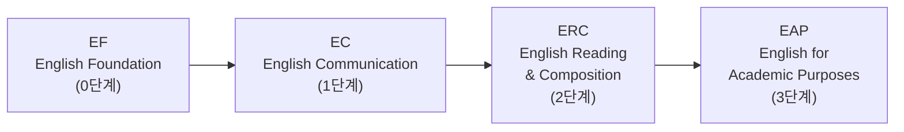

# 수업 설계 팁

> 시간표를 짤 때 과목 선택만큼 중요한 것이 **시간 배치와 학점 전략**입니다. 아무리 좋은 과목을 골라도 설계를 잘못하면 한 학기가 고통이 됩니다. 영어·한국어 과정 배치도 첫 학기에 반드시 확인해야 하는 항목입니다.

---

## 🎯 수업 설계의 기술

### 📊 학점은 넉넉하게, 빼는 건 나중에

수강신청 시 **최대 22학점**까지 신청할 수 있습니다. "많이 듣고 개강 첫 주에 빼는" 전략이 "적게 듣고 나중에 추가하는" 전략보다 훨씬 유리합니다. 인기 과목은 수강정정(수강신청 후 과목을 추가·삭제하는 기간) 기간에 자리가 나지 않기 때문입니다.

졸업에 필요한 학점은 **130학점**이고, 8학기로 나누면 한 학기 평균 **16.25학점**입니다. 여유를 두고 **매 학기 17~18학점** 정도를 목표로 잡으세요. 특히 **장학금 수혜자는 최소 15.5학점 이상**을 반드시 이수해야 하므로, 과목을 빼다가 15.5학점 아래로 떨어지지 않도록 주의하세요.

### 🔢 과목 코드를 읽는 법

한동대 과목 코드의 첫 번째 숫자는 **권장 학년**을 의미합니다.

- **1**xxx: 1학년용 (신입생이 들어야 할 과목)
- **2**xxx: 2학년용
- **3**xxx: 3학년용
- **4**xxx: 4학년용

신입생은 **1xxx 과목 위주로 수강**하세요. 3xxx, 4xxx 과목은 선수과목(prerequisite)이 요구되는 경우가 대부분이고, 설령 신청이 가능하더라도 수업 내용을 따라가기 어렵습니다. "도전 정신"으로 고학년 과목을 듣겠다는 것은 용감한 게 아니라 무모한 것입니다.

### 🎓 전공 과목은 확신이 있을 때만

아직 전공을 정하지 않았다면, **전공기초(입문) 과목**까지만 들으세요. 본격적인 전공 과목은 해당 전공으로 진입할 확신이 생긴 후에 수강하는 것이 맞습니다. 전공 과목에는 선수과목 요건이 있는 경우가 많으니, 수강편람에서 반드시 확인하세요.

### 🧩 학생설계융합전공을 생각하고 있다면

학생설계융합전공은 창의융합교육원 소속으로, 3개 이상의 전공/분야를 융합하여 자신만의 전공을 직접 설계하는 제도입니다. 제2전공(33학점)으로만 운영되며, 전체 평점 3.0 이상이어야 신청 가능합니다. 매 학기초 HISNet을 통해 신청 안내가 공지되니 참고하세요.

### 🕐 교시-시간 매핑

> **교시 참고:** 1교시=09:00, 2교시=10:00, 3교시=11:00, 4교시=12:00, 5교시=13:00, 6교시=14:00, 7교시=15:00, 8교시=16:00 (각 교시 1시간)

시간표에서 "월3,목3"이라고 적혀 있으면 월요일 3교시(11:00~12:00)와 목요일 3교시(11:00~12:00)라는 뜻입니다. 수강편람이나 이 가이드에서 교시 표기를 보고 실제 시간을 바로 파악할 수 있도록 위 매핑을 참고하세요.

### 🍱 점심시간을 반드시 비워두세요

4교시(12시~1시)와 5교시(1시~2시) 사이가 점심시간입니다. 이 시간대에 수업을 넣으면 점심을 건너뛰게 됩니다. 한 번은 괜찮지만 매일 반복되면 체력이 무너지고 집중력이 급격히 떨어집니다. **수업을 연속 3개 이상 붙이지 마세요.** 중간에 쉬는 시간이 있어야 수업 내용을 소화할 수 있습니다.

### ⏰ 1교시 수업은 각오하세요

솔직히 말씀드리면, 신입생은 1교시 수업을 피하기 어렵습니다. 인기 시간대의 분반은 고학년이 먼저 가져가기 때문에, 신입생에게는 이른 아침이나 늦은 오후 분반이 남는 경우가 많습니다. 1교시가 배정되더라도 좌절하지 마시고, 아침 루틴을 잘 만들어서 적응하세요.

### 👥 선배에게 물어보세요

같은 과목이라도 교수님에 따라 수업 방식, 과제량, 시험 난이도가 **완전히** 다릅니다. 수강편람에는 이런 정보가 없습니다. 선배와 섬김이에게 "이 과목 들어보신 분 있으세요? 어떠셨어요?"라고 물어보는 것이 최고의 정보원입니다.

### 🗣️ 영어 강의 여부를 반드시 확인하세요

같은 교수님이라도 분반에 따라 한국어 강의와 영어 강의가 다를 수 있습니다. 위 표에서 "영어강의" 열을 꼭 확인하세요. 영어가 부담스러운 학생이 실수로 영어 분반에 들어가거나, 반대로 영어 수업을 원하는 외국인 학생이 한국어 분반에 들어가는 일이 실제로 발생합니다.

---

## 🌍 영어·한국어 과정 안내

이 섹션은 **모든 신입생**에게 해당됩니다. 영어 과정은 전원 필수이고, 한국어 과정은 외국인 학생 또는 해외학생 전형으로 입학한 학생이 대상입니다.

### 🗣️ 영어 과정 (EPT 기반)

**모든** 신입생은 OT 기간 중 **EPT (English Placement Test)**를 **반드시** 응시해야 합니다. 이 시험 결과로 영어 과정이 결정됩니다.

EPT에서 Pass하면 해당 레벨을 건너뛸 수 있습니다. 공인영어성적(TOEFL, IELTS, TOEIC 등)으로도 면제가 가능합니다.

**영어 수업은 절대 미루지 마세요.** 최근 교수님들이 수강 인원을 엄격하게 관리하고 있어서, "나중에 들어야지"라고 미뤘다가 자리가 없어 한 학기를 허비하는 경우가 있습니다. 배정된 레벨의 영어 수업은 **1학년 때 바로 수강**하는 것을 강력히 권합니다.

### 🗣️ 한국어 과정 — 해당자 필수

**외국인 학생** 또는 **해외학생 전형(재외국민, 글로벌인재, 선교사자녀 등)으로 입학한 학생**은 실무한국어 과정을 반드시 이수해야 합니다. 대상 여부는 입학전형에 따라 결정되며, 한국어 사용이 어려운 학생 혹은 외국 국적 학생이 해당됩니다. OT 기간 한국어 능력시험 결과에 따라 수준별 배치됩니다.

**중요한 팁이 있습니다.** 한국어 배치시험에서 "찍어서" 높은 반에 배정받으면 오히려 손해입니다. 한국어 1부터 차근차근 시작하면 쉬운 학점을 안정적으로 받을 수 있지만, 한국어 3에 배정되면 한국어 1, 2에 해당하는 학점을 다른 과목으로 채워야 합니다. **모르는 문제는 절대 찍지 마세요.** 자신의 실력에 맞는 반에서 시작하는 것이 장기적으로 유리합니다.

---

*마지막 업데이트: 2026-02-21*
