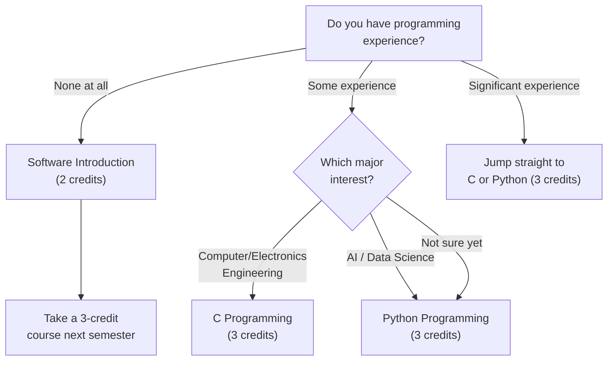

# Заавал авах хичээлүүд

Энэ хэсэгт Handong Global University-ийн бүх шинэ оюутанд заавал шаардагддаг хичээлүүд, мөн бүх оюутанд хамаарах ICT хичээлийн шаардлага, болон сонирхлоор сонгож болох хичээлүүдийн жагсаалтыг багтаасан. Эхлээд эдгээрийг хуваариандаа байрлуулаад, дараа нь бусдыг нэмээрэй. [[hub|Гарын авлагын эхлэл хуудас]] руу буцах.

---

## БҮХ шинэ оюутанд заавал авах хичээлүүд

Сонгож буй мэргэжлээс үл хамааран, STEM эсвэл хүмүүнлэгийн чиглэлд ч хамаагүй, ямар улсын иргэн ч байсан **бүх шинэ оюутан** дараах хичээлүүдийг дуусгах ёстой.

### Chapel 1 (0 кредит, улирал бүр)

Chapel нь тэг кредиттэй боловч **улирал бүр заавал** авдаг. Chapel 1-ээс Chapel 6 хүртэл зургаан улиралын туршид дуусгах ёстой бөгөөд үүнийг биелүүлэхгүй бол төгсөхгүй.

Chapel-тай холбоотой хамгийн түгээмэл алдаа: олон оюутан бүртгэлгүйгээр зүгээр суучихна гэж бодно. **Chapel-ийг course registration системд заавал бүртгүүлэх хэрэгтэй.** Жил бүр оюутнууд бүхэл улиралын туршид Chapel-д шударгаар ирж, улиралын эцэст транскриптаа шалгахад бүртгэгдээгүй байгааг олж мэддэг — тэгвэл ирц нь тооцогдохгүй. Энэ алдааг засах нь асар хэцүү.

Chapel-ийн ирц нь **QR код сканнердах тогтолцоо**гоор явагддаг. Цагтаа ирж QR код сканнердах ёстой. Хэрэв сканнердахыг алдвал дахин засварлах бараг боломжгүй. Хоцорч болохгүй.

> **2026 оны хавар:** Chapel 1 (GEK10001), Section 01 — Лхагва 4, 5, 6-р цаг (Hyoam Main Building) / Хэл: Солонгос (0% Англи)

### Community Leadership Training 1 (0.5 кредит, улирал бүр)

Chapel-тай адил энэ хичээлийг улирал бүр авна. Оршин суух нийгэмлэг доторх манлайлал, багийн ажлын чиглэлтэй. **Яг ижил бүртгэлийн алдаа энд ч тохиолддог** — оюутнууд долоо хоног бүрийн багийн уулзалтад бүхэл улиралын туршид оролцсон атлаа системд бүртгүүлээгүй байдаг. Заавал бүртгэл хий.

> **2026 оны хавар:** Community Leadership Training 1 (GEK10008), Section 01 — Цаг дараа зарлагдана

### Handong Character Education (1 кредит, нэг удаагийн шаардлага)

Энэ бол Handong-ийн үнэт зүйлс, зан төлөвийн философийн гол хичээл. Хэд хэдэн анги байна. **Section 01 нь 100% англи хэлээр** заадаг тул олон улсын оюутнуудад хамгийн тохиромжтой.

> **2026 оны хаврын ангиуд:**

| Section | Professor | Time | English % | Note |
|---------|-----------|------|-----------|------|
| **01** | **Shushan Marie Richardson** | **Mon 5** | **100%** | **Олон улсын оюутнуудад санал болгоно** |
| 02 | 이상산 | Wed 2 | 0% | Солонгос |
| 03 | 최희열 | Wed 2 | 0% | Солонгос |
| 04 | 손화철 | Wed 2 | 0% | Солонгос |
| 05 | 최혜봉 | Wed 2 | 0% | Солонгос |
| 06 | 윤상헌 | Wed 2 | 0% | Солонгос |

02-оос 06 хүртэлх ангиуд бүгд Лхагва 2-р цагт болдог тул зөвхөн багшаар ялгаатай. Хэрэв солонгос хэлээр суралцах чадвартай бол섬김이 (student mentor)-ийнхээ багш бүрийн заах арга барилын талаар асуугаарай.

### Christian Faith Foundation (CF1) — 2 кредит

Энэ ангиллаас нэг хичээлийг дуусгах ёстой: Understanding the Bible, Bible and Life, эсвэл Bible and Spiritual Growth. Эдгээр нь ижил түвшний хичээлүүд тул нэгийг л авах шаардлагатай.

#### Understanding the Bible (GEK20058) — 15 анги

Хамгийн олон ангитай хичээл бөгөөд 15 анги байгаа тул аль ч хуваарьт тохируулахад хамгийн хялбар.

| Section | Professor | Time | English % | Note |
|---------|-----------|------|-----------|------|
| 01 | 김완진 | Mon 2, Thu 2 | 0% | |
| 02 | 김완진 | Mon 3, Thu 3 | 0% | |
| 03 | 김완진 | Mon 4, Thu 4 | 0% | |
| 04 | 이재현 | Tue 2, Fri 2 | 0% | |
| 05 | 이재현 | Tue 3, Fri 3 | 0% | |
| 06 | 이재현 | Tue 5, Fri 5 | 0% | |
| **07** | **Joshua Kim** | **Tue 1, Fri 1** | **100%** | **Англи анги** |
| 08 | Joshua Kim | Tue 2, Fri 2 | 0% | |
| 09 | Joshua Kim | Tue 3, Fri 3 | 0% | |
| 10 | 최성호 | Tue 2, Fri 2 | 0% | |
| **11** | **최성호** | **Tue 3, Fri 3** | **100%** | **Англи анги** |
| **12** | **최성호** | **Tue 5, Fri 5** | **100%** | **Англи анги** |
| 13 | 한은선 | Mon 1, Thu 1 | 0% | |
| 14 | 한은선 | Mon 2, Thu 2 | 0% | |
| 15 | 한은선 | Mon 3, Thu 3 | 0% | |

**Олон улсын оюутнуудад**: Section 07 (Joshua Kim, 100% англи), Section 11 (최성호, 100% англи), эсвэл Section 12 (최성호, 100% англи)-г сонгоорой. Англи ангиуд алдартай тул урьдчилсан бүртгэлийн үед хурдан дүүрч болно — нөөц төлөвлөгөөтэй заавал байгаарай.

#### Understanding Christianity (GEK20059)

| Section | Professor | Time | English % | Note |
|---------|-----------|------|-----------|------|
| **01** | **Gregory T. Brown** | **Mon 2, Thu 2** | **100%** | **Англи** |
| **02** | **Gregory T. Brown** | **Mon 3, Thu 3** | **100%** | **Англи** |

Хоёр анги хоёулаа бүрэн англи хэлээр заагддаг. Understanding the Bible-ийн англи ангиуд дүүрсэн бол маш сайн хувилбар.

### Worldview — 2 кредит

Энэ ангиллаас нэг хичээл авах ёстой: Creation and Evolution, Christians and Mission, эсвэл Christian Worldview. Тус бүр солонгос болон англи ангитай.

| Course | Section | Professor | Time | English % |
|--------|---------|-----------|------|-----------|
| Creation and Evolution (GEK10011) | 01 | 김광 et al. | Wed 2, 3 | 0% |
| **Creation and Evolution (GEK10011)** | **02** | **Holzapfel Wilhelm et al.** | **Wed 2, 3** | **100%** |
| Christians and Mission (GEK20069) | 01 | 조혜신 et al. | Mon 6, 7 | 0% |
| **Christians and Mission (GEK20069)** | **02** | **진기영** | **Wed 2, 3** | **100%** |
| Christian Worldview (GEK20011) | 01 | 최용준 | Mon 3, Thu 3 | 0% |
| **Christian Worldview (GEK20011)** | **02** | **최용준** | **Tue 2, Fri 2** | **100%** |

**Цагийн давхцалд анхаараарай:** Хэд хэдэн хичээл Лхагва 2-3-р цагт давхцдаг. Хэрэв Character Education 02-06 анги (Лхагва 2) авч байгаа бол Worldview хичээлийг Лхагва 2-3-т авч чадахгүй. Урьдчилан төлөвлөөрэй.

### Social Service (1 кредит x нийт 2 хичээл)

Төгсөхөөс өмнө Social Service-ийн хоёр хичээлийг (Social Service 1-4-ийн дундаас) дуусгах ёстой. Улирал бүр нэгийг авахыг зөвлөж байна.

> **2026 оны хавар:** Social Service 1 (GEK10046) Section 01, Social Service 2 (GEK20046) Section 01 — Тогтмол хичээлийн цаггүй (практик хэлбэрийн)

---

## ICT шаардлага (БҮХ оюутанд 7 кредит)

Мэргэжлээс үл хамааран Handong-ийн бүх оюутан **ICT Convergence хичээлийн 7 кредит** дуусгах ёстой: 5 кредит програмчлал + 2 кредит хэрэглээ. Энэ нь сонголтот биш бөгөөд хүмүүнлэг, нийгмийн шинжлэх ухааны оюутнуудад ч адил хамаарна.

### Олон улсын оюутнуудад санал болгох англи хэлээр заадаг ICT хичээлүүд

| Course | Code | Credits | Section | Professor | Time | English % |
|--------|------|---------|---------|-----------|------|-----------|
| **Python Programming** | GCS10004 | 3 | **05** | 박지현 | Mon 5, Thu 5 | **100%** |
| **Frontend Introduction** | GCS10081 | 3 | **04** | 박지현 | Tue 6, Fri 6 | **100%** |

**Тэмдэглэл:** OIA (Office of International Admissions) заримдаа програмчлалын хичээлүүдэд олон улсын шинэ оюутнуудад зориулж тусгайлан суудал нөөцөлдөг. Олон улсын оюутан бол OIA-аас энэ талаар заавал асуугаарай — бүртгэлийн тулалдааныг хөнгөвчлөх болно.

### Замаа сонгох: C, Python, эсвэл Software Introduction?

Хэрэв кодлосон туршлагагүй бөгөөд айдас төрж байвал Software Introduction (GCS10001, 2 кредит) бол зөөлөн эхлэл. Гэхдээ ямар нэг STEM мэргэжлийг бодож байгаа бол Python эсвэл C-г шууд авахыг хичээгээрэй — бүхэл улирал хэмнэнэ.

---

## Сонирхлоор санал болгох хичээлүүд

### STEM-д сонирхолтой оюутнуудад

Хэрэв инженерчлэл, компьютерийн шинжлэх ухаан, AI, байгалийн шинжлэх ухаан, эсвэл математик бодож байгаа бол эдгээр нь тэргүүн ээлжинд тавих суурь хичээлүүд юм. Англи ангитай хичээлүүдийг тод тэмдэглэсэн.

#### Calculus 1 (GEK10095) — 3 кредит

Calculus бол STEM-ийн бүх нийтийн хэл. Үүнгүйгээр Calculus 2, Дифференциал тэгшитгэл, аль ч инженерийн гол хичээлд орох боломжгүй. Инженерчлэл, шинжлэх ухааны цагаан толгой гэж бод — үүнгүйгээр нэг ч өгүүлбэр уншиж чадахгүй.

| Section | Professor | Time | English % | Note |
|---------|-----------|------|-----------|------|
| 01 | 이한진 | Mon 4, Thu 4 | 0% | Солонгос |
| 02 | 이한진 | Mon 6, Thu 6 | 0% | Солонгос, оройн цаг |
| **03** | **김민재** | **Mon 4, Thu 4** | **100%** | **Англи** |
| **04** | **조장환** | **Mon 1, Thu 1** | **100%** | **Англи, 1-р цаг (өглөөний эрт)** |

Олон улсын оюутнуудад Section 03 (김민재) эсвэл Section 04 (조장환) байна. Section 04 нь 1-р цаг (9:00). Өглөөний хүн биш бол Section 03 нь 4-р цагт байдаг тул зохицуулахад хялбар.

#### Calculus 2 (GEK10096) — 3 кредит

Ихэвчлэн 2-р улиралд авдаг, гэхдээ ахлах сургуульд хүчтэй calculus-ын суурьтай оюутнууд Calculus 1, 2-ыг зэрэг авч дэвшлийг хурдасгаж болно.

| Section | Professor | Time | English % | Note |
|---------|-----------|------|-----------|------|
| **01** | **이한진** | **Mon 2, Thu 2** | **100%** | **Англи** |
| 02 | 김태희 | Mon 1, Thu 1 | 0% | 1-р цаг |
| 03 | 김태희 | Mon 2, Thu 2 | 0% | Солонгос |

#### Linear Algebra (GEK10082) — 3 кредит

Linear Algebra бол AI болон машин сургалтын математик зүрх. Вектор, матриц, eigenvalue, шугаман хувиргалт нь орчин үеийн AI алгоритмуудын суурийн блокууд юм. Компьютерийн шинжлэх ухаан, өгөгдлийн шинжлэх ухаан, эсвэл инженерчлэлтэй холбоотой зүйл судлахаар төлөвлөж байгаа бол энэ хичээлийг Calculus 1-тэй хамт эхний улиралдаа аваарай.

| Section | Professor | Time | English % | Note |
|---------|-----------|------|-----------|------|
| **01** | **조장환** | **Mon 3, Thu 3** | **100%** | **Англи** |
| **02** | **조장환** | **Mon 5, Thu 5** | **100%** | **Англи** |
| 03 | 김현수 | Tue 2, Fri 2 | 0% | Солонгос |
| 04 | 김현수 | Tue 3, Fri 3 | 0% | Солонгос |

Section 01, 02 хоёулаа 조장환 багшаар 100% англи хэлээр заагддаг.

#### Physics 1 (GEK10055) — 3 кредит

Цахилгаан инженерчлэл, механик инженерчлэл болон холбоотой чиглэлүүдэд зайлшгүй. Механик, термодинамик, суурь хүчнүүдийг хамарна.

| Section | Professor | Time | English % | Note |
|---------|-----------|------|-----------|------|
| 01 | 조현지 | Mon 2, Thu 2 | 0% | Зөвхөн солонгос |
| 02 | 조현지 | Mon 3, Thu 3 | 0% | Зөвхөн солонгос |

**Харамсалтай нь энэ улиралд Physics 1-ийн англи анги байхгүй.** Физик хэрэгтэй олон улсын оюутнууд солонгос хэлний хангалттай чадвартай байх хэрэгтэй, эсвэл англи анги гарах ирэх улиралд хойшлуулж болно.

#### General Chemistry (GEK10058) — 3 кредит

Амьдралын шинжлэх ухаан, хими болон холбоотой чиглэлүүдэд шаардлагатай.

| Section | Professor | Time | English % | Note |
|---------|-----------|------|-----------|------|
| 01 | 김민경 | Thu 3, 4 (дараалсан) | 0% | Солонгос |
| **02** | **유태준** | **Mon 2, Thu 2** | **100%** | **Англи** |

Section 02 нь таны англи хувилбар.

#### General Biology (GEK10057) — 3 кредит

| Section | Professor | Time | English % | Note |
|---------|-----------|------|-----------|------|
| 01 | 현창기 et al. | Mon 5, Thu 5 | 0% | Солонгос |
| **02** | **Holzapfel Wilhelm et al.** | **Mon 2, Thu 2** | **100%** | **Англи** |
| 03 | 현창기 et al. | Mon 6, Thu 6 | 0% | Солонгос |

**АНХААРУУЛГА: General Biology нь МАШ ӨРСӨЛДӨӨНТЭЙ.** Зөвхөн 3 анги байгаа бөгөөд ахмад оюутнууд болон дахин авч буй оюутнууд шинэ оюутнуудаас өмнө суудал эзэлдэг. Олон шинэ оюутан эхний улиралдаа бүртгүүлэх боломжгүй байдаг. **Бүхэл бүртгэлийн стратегиа энэ хичээлд бүү тулга.** Суудал аваагүй бол Calculus, Linear Algebra, эсвэл програмчлал авч, 2-р улиралд дахин оролдоорой. Уян хатан байх нь зоригтой байхаас хамаагүй ухаалаг.

### Хүмүүнлэг/Нийгмийн шинжлэх ухаанд сонирхолтой оюутнуудад

Хэрэв бизнес, эдийн засаг, хууль зүй, олон улсын харилцаа, сэтгэл зүй, харилцаа холбоо, эсвэл нийгмийн халамж бодож байгаа бол дараах оршил хичээлүүд нь эдгээр чиглэлийг судлахад тусална. Англи хэлээр заадаг ангиудыг тод тэмдэглэсэн.

#### Economics Introduction (MEC10001) — 3 кредит

| Section | Professor | Time | English % |
|---------|-----------|------|-----------|
| **01** | **김선태** | **Mon 3, Thu 3** | **100%** |
| 02 | 안진원 | Tue 2, Fri 2 | 0% |

#### Business Introduction (MEC10002) — 3 кредит

| Section | Professor | Time | English % |
|---------|-----------|------|-----------|
| **01** | **이유진** | **Tue 3, Fri 3** | **100%** |
| 02 | 이혜규 | Mon 2, Thu 2 | 0% |
| 03 | 김은석 | Mon 5, Thu 5 | 0% |

#### Psychology Introduction (CSW10003) — 3 кредит

| Section | Professor | Time | English % |
|---------|-----------|------|-----------|
| 01 | 신성만 | Mon 3, Thu 3 | 0% |
| **02** | **지원근** | **Tue 2, Fri 2** | **100%** |
| 03 | 김윤희 | Mon 4, Thu 4 | 0% |

#### International Relations Introduction (ISE10052) — 3 кредит

| Section | Professor | Time | English % |
|---------|-----------|------|-----------|
| **01** | **정모니카** | **Tue 2, Fri 2** | **100%** |
| 02 | 김지현 | Tue 4, Fri 4 | 0% |

#### Philosophy Introduction (GEK10030) — 3 кредит

| Section | Professor | Time | English % |
|---------|-----------|------|-----------|
| **01** | **손화철** | **Mon 5, Thu 5** | **100%** |
| 02 | 김광현 | Thu 6, 7 | 0% |

#### Discussion and Presentation (GCS10013) — 3 кредит

| Section | Professor | Time | English % |
|---------|-----------|------|-----------|
| **01** | **Shushan Marie Richardson** | **Mon 4, Thu 4** | **100%** |

Академик хэлэлцүүлэг, илтгэлийн ур чадвар хөгжүүлэхэд маш сайн хичээл. Richardson багш оюутнуудыг идэвхтэй оролцуулдаг.

#### Eastern History and Culture (GEK10087) — 3 кредит

| Section | Professor | Time | English % |
|---------|-----------|------|-----------|
| **01** | **신승엽** | **Mon 3, Thu 3** | **100%** |

#### Globalization and Korean Pop Culture (GEK10104) — 3 кредит

| Section | Professor | Time | English % |
|---------|-----------|------|-----------|
| **01** | **김창욱** | **Tue 2, Fri 2** | **100%** |

K-pop, K-drama, Солонгос кино, Солонгос давалгааны үзэгдлийг академик түвшинд судлах хичээл. Бүрэн англи хэлээр заадаг — соёл судлалд сонирхолтой олон улсын оюутнуудад хүртээмжтэй бөгөөд сонирхолтой.

### GCS (Global Convergence Studies)

GCS нь янз бүрийн тэнхмүүдийн хичээлүүдийг нэгтгэж **өөрийн мэргэжлийг өөрөө зохиох** боломжийг олгоно. Жишээлбэл, Олон улсын харилцаа + Эдийн засаг + Өгөгдлийн шинжилгээ хичээлүүдийг хослуулж "Дэлхийн бодлогын шинжилгээ" гэсэн өөрийн мэргэжил бүтээж болно.

GCS-д орохын тулд эхлээд **"Vision, Work, and Calling"** хичээлийг авах шаардлагатай. Энэ хичээл нь GCS хөтөлбөрийн урьдач шаардлага юм.

**GCS яагаад олон улсын оюутнуудад тохиромжтой вэ:** Аль ч тэнхмийн англи хэлээр заадаг хичээлүүдийг чөлөөтэй хослуулж болдог тул нэг тэнхмийн хэлний хязгаарлалтад баригдахгүй. Хэрэв ямар нэг тэнхим таны сонирхолд яг тохирохгүй бол GCS нь хүссэн зүйлээ бүтээх эрх чөлөө өгнө.

---

*Сүүлд шинэчилсэн: 2026-02-21*
