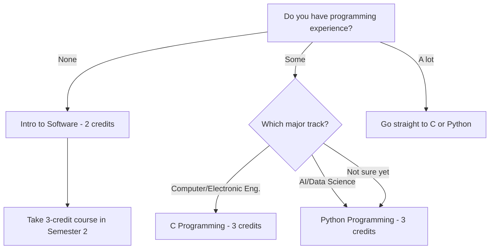
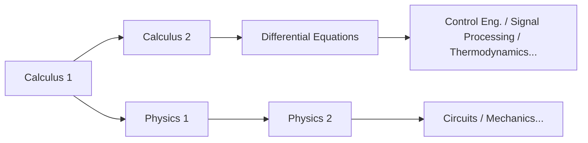

# STEM шинэ оюутны хичээлийн гарын авлага

> Инженерчлэл, Компьютерийн шинжлэх ухаан, AI, Байгалийн шинжлэх ухаанд сонирхолтой шинэ оюутнуудад зориулсан хичээлийн стратеги
> Үндсэн гарын авлага: [[Spring 2026 Freshman Registration Guide]]

---

## 1. Энэ гарын авлага хэнд зориулагдсан вэ?

Энэ гарын авлага нь дараах мэргэжлүүдийг бодож буй **2026 оны ангийн шинэ оюутнуудад** зориулагдсан:

- **AI Computer & Electronic Engineering тэнхим (CSEE)**: Компьютерийн инженерчлэл, Электроникийн инженерчлэл, IT
- **Mechanical & Control Engineering**: Механик инженерчлэл, Электрон удирдлагын инженерчлэл
- **Spatial Environment & Systems Engineering**: Барилгын инженерчлэл, Хот байгаль орчны инженерчлэл
- **Life Sciences**: Амьдралын шинжлэх ухаан

"Яг ямар мэргэжил гэдгээ мэдэхгүй ч STEM хүн гэдгээ мэднэ" гэж бодож байгаа ч бай — энэ гарын авлага яг чамд зориулагдсан. Санаа зовох хэрэггүй, бид бүгд ингэж эхэлсэн! Handong-д эхний жилдээ мэргэжлээ сонгодоггүй. Тийм учраас гол стратеги нь **эцэст нь аль STEM мэргэжлийг сонгосон ч хэрэг болох суурь хичээлүүдээр эхний жилээ дүүргэх** гэсэн үг.

### Яагаад эхний жилийн суурь ийм чухал вэ

STEM хичээлүүд нь **шатны** адил бүтэцтэй. Calculus-гүйгээр Differential Equations авч чадахгүй. Differential Equations-гүйгээр Удирдлагын инженерчлэлийг ойлгож чадахгүй. Linear Algebra аваагүй бол Machine Learning-ийн лекц дээр матрицын үйлдлүүд гарахад дагаж чадахгүй. Physics-гүйгээр хэлхээний онол дахь Кирхгоффын хуулиуд яагаад тийм хэлбэртэй болохыг ойлгохгүй.

Өөрөөр хэлбэл, 1-р жилд математик, шинжлэх ухааны суурийг алгасвал мэргэжлийн хичээлүүд 2-р жилээс эхлэн **домино шиг нурана**. Аймшигтай сонсогдож магадгүй, гэхдээ санаа зовох хэрэггүй — яг үүний тулд энэ гарын авлагыг бэлтгэсэн! Зөв дарааллаар явбал бүгд зохицно.

### Хичээлийн кодыг хэрхэн унших вэ: Алгасаж болохгүй

Handong-ийн хичээлийн кодууд нуугдмал боловч чухал мэдээлэл агуулдаг. Жишээлбэл, `GCS10058` дотор:

- **GCS**: Тэнхим/чиглэлийн код (GCS = Global Creative Software)
- **1**0058: Эхний цифр **курсын түвшинг** заана

Яагаад чухал вэ? **1-ээр эхэлсэн хичээлүүд 1-р курсынхонд зориулагдсан; 3 эсвэл 4-ээр эхэлсэн нь ахмад оюутнуудынх.** Зарим шинэ оюутан амбицтайгаар 3xxx, 4xxx хичээлд бүртгүүлэх гэж оролддог — энэ бол суурийг тавиагүйгээр байшин барьж байгаатай адил. Бүртгэлийн систем зогсоохгүй байлаа ч **эхний жилдээ 1xxx хичээлүүдэд бай.**

Мөн мэргэжлээ баталгаажуулахаас өмнө мэргэжлийн гүнзгий хичээлүүд авах нь эрсдэлтэй. Эхлээд Calculus, Physics, Програмчлал, Linear Algebra зэрэг **бүх нийтэд хэрэгтэй хичээлүүдийг** дүүргэх нь хавьгүй ухаалаг.

---

## 2. 1-р жилд заавал авах хичээлүүд

### 2.1 Calculus 1 — Бүх STEM-ийн эхлэлийн цэг

Calculus бол бараг бүх чиглэлийн **нийтлэг хэл**: инженерчлэл, physics, компьютерийн шинжлэх ухаан, бүр эдийн засаг ч. Дифференциалчлал нь "өөрчлөлтийн хурдтай", интеграл нь "хуримтлагдсан хэмжээтэй" холбоотой — эдгээр хоёр ойлголтгүйгээр ямар ч дэвшилтэт STEM хичээлд нэвтэрч чадахгүй.

Calculus-ийг гадаад хэл сурахын **цагаан толгой** гэж бод. Цагаан толгойгүйгээр үг уншиж чадахгүй, үггүйгээр өгүүлбэр ойлгож чадахгүй. Ахлах сургуульд математикдаа сайн байсан ч, муу байсан ч хамаагүй — их сургуулийн Calculus бол гүнзгийрлийн хувьд үндсээрээ өөр түвшин. Эпсилон-дельта тодорхойлолтоос эхлэн хатуу математик сэтгэлгээнд суралцана.

**Тохиромжтой дараалал**: 1-р улирал Calculus 1 → 2-р улирал Calculus 2 → 3-р улирал Differential Equations. Хэрэв энэ дараалал нэг улирал ч хойшлогдвол мэргэжлийн хичээлд орох хугацаа хоцорно.

> **2026 хавар — Calculus 1 (GEK10095) ангиуд:**

| Section | Professor | Time | English % | Notes |
|---------|-----------|------|-----------|-------|
| 01 | Lee Hanjin | Mon P4, Thu P4 | 0% | Солонгос |
| 02 | Lee Hanjin | Mon P6, Thu P6 | 0% | Солонгос, оройн цаг |
| **03** | **Kim Minjae** | **Mon P4, Thu P4** | **100%** | **Англи** |
| **04** | **Cho Janghwan** | **Mon P1, Thu P1** | **100%** | **Англи, Period 1** |

*Цагийн систем: P1 = 9:00–10:00, P2 = 10:00–11:00, P3 = 11:00–12:00, P4 = 12:00–13:00, P5 = 13:00–14:00, P6 = 14:00–15:00, P7 = 15:00–16:00*

**Ангиа хэрхэн сонгох вэ:**

- **Солонгосоор суралцах чадвартай бол**: Section 01 (Lee Hanjin, Mon P4 / Thu P4) эсвэл Section 02 (Lee Hanjin, Mon P6 / Thu P6). Ижил багш, зүгээр өөр цаг.
- **Англиар заалгах хэрэгтэй бол**: **Section 03 (Kim Minjae) эсвэл Section 04 (Cho Janghwan)**. Гэхдээ Section 04 нь **Period 1 (9:00 AM)**. Эхний улиралдаа дасан зохицож байх үед боломж байвал Period 1-ийг зайлсхийх нь ухаалаг. Мэдээж цорын ганц хувилбар бол авна — гэхдээ сонголт байвал Period 2 эсвэл түүнээс хойш хуваарилаарай.

> **⚠️ "Англи лекц" алдаа**: Ижил багшийн ч гэсэн өөр өөр ангиуд өөр хэлээр заагдаж болно. Анги бүрийн лекцийн хэлийг заавал шалгаарай. Солонгос хэл чинь хангалтгүй байхад солонгос ангид орвол математик болон хэлний саадтай зэрэг тэмцэх давхар ачаалалтай болно.

### 2.2 Calculus 2 — Чадвал 1-р улиралд аваарай

Ихэвчлэн Calculus 2-ийг 2-р улиралд авдаг, гэхдээ ахлах сургуулиас хүчтэй calculus-ын суурьтай бол 1-р улиралд Calculus 1, 2-ыг зэрэг авах боломжтой. Ингэснээр Differential Equations-ийг 2-р улирлаас авч, мэргэжлийн хичээлд орох хугацааг бүхэл улиралаар хурдасгаж болно.

Гэхдээ энэ нь **математикийн чадвардаа үнэхээр итгэлтэй бол л санал болгоно**. Нэг хичээлийг бат сайн суралцах нь хоёуланг нь хэт ачааллаж, хоёуланг нь алдахаас дээр.

> **2026 хавар — Calculus 2 (GEK10096) ангиуд:**

| Section | Professor | Time | English % | Notes |
|---------|-----------|------|-----------|-------|
| **01** | **Lee Hanjin** | **Mon P2, Thu P2** | **100%** | **Англи** |
| 02 | Kim Taehee | Mon P1, Thu P1 | 0% | Period 1 |
| 03 | Kim Taehee | Mon P2, Thu P2 | 0% | Солонгос |

### 2.3 Physics — Инженерүүдийн хэл

Хэрэв инженерчлэлийн чиглэл рүү (Computer & Electronic, Mechanical & Control, Spatial Environment) явахаар бол Physics бол **сонголтот биш — заавал**. Physics 1 нь механик, термодинамикийг хамарч, хүч, энерги, импульсийг математик нарийвчлалтай ажиллахад сургана. Энэ нь 2-р улирлын Physics 2 (цахилгаан соронзон)-д шууд суурь болж, Электроникийн инженерчлэлийн үндэс юм.

Physics-ийг **байгалийн програмчлалын хэл** гэж бод. Инженерийн хувьд юм зохион бүтээхийн тулд байгалийн хуулиудыг ойлгох хэрэгтэй — тэдгээр хуулиуд бол Physics. Хэцүү мэт санагдаж магадгүй, гэхдээ санаа зовох хэрэггүй — алхам алхмаар суралцвал чи заавал даван туулна!

> **2026 хавар — Physics 1 (GEK10055):**

| Section | Professor | Time | English % |
|---------|-----------|------|-----------|
| 01 | Cho Hyunji | Mon P2, Thu P2 | 0% |
| 02 | Cho Hyunji | Mon P3, Thu P3 | 0% |

**Physics 1 vs. Introduction to Physics**: Хэрэв Computer Science эсвэл AI бодож байгаа бол оронд нь "Introduction to Physics" авч болно. Physics 1-ийн хүрээг өргөнөөр хамарч, гэхдээ гүн бус — инженерийн мэдрэмж бий болгоход хангалттай. Гэхдээ Electronic Engineering эсвэл Mechanical Engineering-г бодож байгаа бол **Physics 1-ийг эргэлзэлгүй аваарай.**

> **Introduction to Physics (GEK10090) — Physics 1-ийн хувилбар:**

| Section | Professor | Time | English % |
|---------|-----------|------|-----------|
| 01 | Cho Hyunji | Tue P2, Fri P2 | 0% |
| 02 | Cho Hyunji | Tue P3, Fri P3 | 0% |

### 2.4 Linear Algebra — AI эрин үеийн зайлшгүй математик

Linear Algebra бол Calculus-тай зэрэгцэн STEM математикийн **хоёр том тулгуурын** нэг. Вектор, матриц, eigenvalue, шугаман хувиргалтыг хамарна — мөн AI, машин сургалтын **математик зүрх** юм.

Яагаад? Машин сургалтанд өгөгдлийг матрицаар илэрхийлж, загварын сургалтыг матрицын үйлдлээр гүйцэтгэдэг. Гүн сургалтын backpropagation ч эцэстээ матрицын дифференциалчлал юм. Linear Algebra-гүйгээр AI хичээлүүдэд яагаад зүйлс ажилладагийг ойлгохгүй — зүгээр л ойлгохгүйгээр код хуулна.

Calculus 1-тэй зэрэг 1-р улиралд авахыг хүчтэй санал болгоно. Хэцүү байна, гэхдээ хоёуланг нь эхний улиралд дуусгавал 2-р улирлаас эхлэн сонголтууд **тэсрэхийн адил өргөжинө**.

> **2026 хавар — Linear Algebra (GEK10082):**

| Section | Professor | Time | English % | Notes |
|---------|-----------|------|-----------|-------|
| **01** | **Cho Janghwan** | **Mon P3, Thu P3** | **100%** | **Англи** |
| **02** | **Cho Janghwan** | **Mon P5, Thu P5** | **100%** | **Англи** |
| 03 | Kim Hyunsu | Tue P2, Fri P2 | 0% | Солонгос |
| 04 | Kim Hyunsu | Tue P3, Fri P3 | 0% | Солонгос |

### 2.5 ICT Програмчлал — Кодлох эхний алхам

Handong-д бүх оюутан **ICT Convergence Fundamentals-ийн 7 кредит** дуусгах ёстой: 5 кредит програмчлал + 2 кредит хэрэглээний ICT. STEM оюутнуудын хувьд програмчлал бол зүгээр нэг ерөнхий боловсролын шаардлага биш — энэ бол **мэргэжлийн хэрэгсэл.**

**Яагаад 1-р жилд програмчлалыг дуусгах ёстой вэ**: 2-р жилээс мэргэжлийн хичээлүүдээс програмчлалын даалгаврууд ирэж эхэлнэ. Тэр үед суурь програмчлалын хичээл авч байвал цаг алдалт ноцтой байна. Тохиромжтой бол 1-р улиралд 3 кредитийн програмчлалын хичээл (Python/C) авч, үлдсэнийг 2-р улиралд дуусгах.

> **OIA (Office of International Admissions) нөөц суудлууд**: Програмчлалын хичээлүүдэд заримдаа **OIA-аас олон улсын шинэ оюутнуудад зориулж тусгайлан нөөцлөгдсөн суудлууд** байдаг. Олон улсын оюутан бол үүнийг заавал ашигла — алдартай ангид орох боломжийг мэдэгдэхүйц нэмэгдүүлнэ.

#### Замаа сонгох: Хаанаас эхлэх вэ

#### C vs. Python: Алийг нь эхэлж авах вэ?

Computer Engineering эсвэл Electronic Engineering бодож байгаа бол **C нь давуу**. C бол үйлдлийн систем, суулгасан систем, тоног төхөөрөмжийн удирдлагын суурь — доод түвшний програмчлалын зайлшгүй зүйлс. C сурсан бол Python-ийг ойролцоогоор нэг долоо хоногт сурч болно. Харин зөвхөн Python мэддэг бол дараа C сурах үед санах ойн удирдлага, заагчтай тулгарахад асар том хана бий болно.

AI эсвэл Data Science таны зам бол Python-оос эхлэх нь бүрэн зүгээр. Практикт хамгийн өргөн хэрэглэгддэг хэл бөгөөд бага зардлаар програмчлалын баяр мэдрэхэд хамгийн тохиромжтой.

> **Intro to Software (GCS10001) — 2 кредит, огт туршлагагүй хүмүүст:**

| Section | Professor | Time | English % |
|---------|-----------|------|-----------|
| 01 | Kim Heonju | Mon P1, Thu P1 | 0% |
| 02 | Lee Sanghun | Mon P5, Thu P5 | 0% |
| 03 | Lee Sanghun | Mon P6, Thu P6 | 0% |
| 04 | Kim Hyunsuk | Tue P2, Fri P2 | 0% |
| 05 | Kim Hyunsuk | Tue P4, Fri P4 | 0% |
| 06 | Kim Hyunsuk | Tue P6, Fri P6 | 0% |

> **C Programming (GCS10058) — 3 кредит, Computer/Electronic Eng. чиглэлд:**

| Section | Professor | Time | English % |
|---------|-----------|------|-----------|
| 01 | Kim Kwang | Tue P2, Fri P2 | 0% |

⚠️ C Programming нь **зөвхөн 1 анги** байна. Өрсөлдөөн хүчтэй байж болох тул бүртгэлийн үед хурдан бүртгүүлээрэй.

> **Python Programming (GCS10004) — 3 кредит, AI/Data Science чиглэлд:**

| Section | Professor | Time | English % |
|---------|-----------|------|-----------|
| 01 | Kim Kyungmi | Mon P2, Thu P2 | 0% |
| 02 | Kim Kyungmi | Tue P2, Fri P2 | 0% |
| 03 | Kim Kyungmi | Tue P3, Fri P3 | 0% |
| 04 | Park Jihyun | Mon P3, Thu P3 | 0% |
| **05** | **Park Jihyun** | **Mon P5, Thu P5** | **100%** |
| 06 | Yong Hwangi | Tue P3, Fri P3 | 0% |

> **Intro to Frontend (GCS10081) — 2 кредит, вэб хөгжүүлэлтэд сонирхолтой хүмүүст:**

| Section | Professor | Time | English % |
|---------|-----------|------|-----------|
| 01 | Kim Guno | Mon P2, Thu P2 | 0% |
| 02 | Kim Guno | Mon P3, Thu P3 | 0% |
| 03 | Park Jihyun | Tue P5, Fri P5 | 0% |
| **04** | **Park Jihyun** | **Tue P6, Fri P6** | **100%** |
| 05 | Yang Jihye | Mon P3, Thu P3 | 0% |
| 06 | Yang Jihye | Mon P4, Thu P4 | 0% |

Intro to Frontend нь вэб хөгжүүлэлтийн үндсийг хамарна — HTML, CSS, JavaScript. 2 кредитийн ICT хэрэглээний шаардлагад тооцогдох, эсвэл 2 кредитийн програмчлалын хичээл болж тооцогдох боломжтой. Вэб хөгжүүлэлтэд сонирхолтой бол авч болно.

### 2.6 General Chemistry — Амьдралын шинжлэх ухаан/Химийн чиглэлд заавал

Амьдралын шинжлэх ухаан эсвэл химитэй холбоотой мэргэжил бодож байгаа бол General Chemistry зайлшгүй. Атомын бүтэц, химийн холбоо, урвалын кинетик болон бусад химийн суурийг хамарч, Биохими болон Органик химийн урьдач шаардлага болно.

> **2026 хавар — General Chemistry (GEK10058):**

| Section | Professor | Time | English % | Notes |
|---------|-----------|------|-----------|-------|
| 01 | Kim Minkyung | Thu P3, P4 (дараалсан) | 0% | Пүрэв гарагт 2 дараалсан цаг |
| **02** | **Yu Taejun** | **Mon P2, Thu P2** | **100%** | **Англи** |

### 2.7 General Biology — Шударга зөвлөгөө хэрэгтэй хичээл

General Biology нь Life Sciences-д орохын тулд хэрэгтэй, гэхдээ нэг **чухал бодит байдлыг** мэдэх хэрэгтэй.

**⚠️ General Biology-ийн өрсөлдөөн маш хүчтэй.** Анги цөөн, дахин авч буй оюутнууд болон ахмад оюутнууд ихэвчлэн суудал эхлээд эзэлдэг тул **шинэ оюутнууд 1-р улиралд бүртгүүлэхэд маш хэцүү.** "1-р улиралд заавал авах ёстой" гэж зөрүүдлэн бусад чухал хичээлийн бүртгэлийн боломжийг алдахын оронд, **хавьгүй ухаалаг стратеги** бол уян хатан байх: суудал гарвал авч, гарахгүй бол 2-р улиралд хойшлуулах.

1-р улиралд Calculus, Linear Algebra, Програмчлал — **ямар ч мэргэжилд хэрэг болох хичээлүүд** — дээр суудлаа баталга. General Biology-д бүгдийг бүү тулга. 2-р улиралд ч байдаг.

> **2026 хавар — General Biology (GEK10057):**

| Section | Professor | Time | English % |
|---------|-----------|------|-----------|
| 01 | Hyun Changgi et al. 2 | Mon P5, Thu P5 | 0% |
| **02** | **Holzapfel Wilhelm et al.** | **Mon P2, Thu P2** | **100%** |
| 03 | Hyun Changgi et al. 2 | Mon P6, Thu P6 | 0% |

### 2.8 Introduction to AI, Computer & Electronic Engineering — Мэргэжлийн амт

AI Computer & Electronic Engineering тэнхимд (CSEE) сонирхолтой бол энэ оршил хичээл нь чиглэлийн ерөнхий дүр зургийг өгнө. "Энэ чиглэл надад тохирох уу" гэдгийг мэргэжлийн хичээлд бүрэн орохоос өмнө олж мэдэх сайн арга.

> **2026 хавар — Intro to AI, Computer & Electronic Eng. (ECE10006):**

| Section | Professor | Time | English % | Notes |
|---------|-----------|------|-----------|-------|
| 01 | Hwang Sungsu et al. | Mon P6, P7 (дараалсан) | 0% | Даваа оройн цаг |

### 2.9 Differential Equations and Applications — Математик чинь хүчтэй бол

Хэрэв Calculus 1 & 2-ыг аль хэдийн дуусгасан, эсвэл ахлах сургуульд AP Calculus BC дуусгасан бол 1-р улиралд Differential Equations авах боломжтой. Гэхдээ энэ нь **математикийн суурь чинь үнэхээр бат бол л санал болгоно.**

> **2026 хавар — Differential Equations and Applications (GEK10053):**

| Section | Professor | Time | English % |
|---------|-----------|------|-----------|
| 01 | Kim Taehee | Mon P3, Thu P3 | 0% |

---

## 3. Санал болгох хуваарь

Доорх нь 2026 хаврын бодит хичээлийн санал дээр суурилсан **жишиг хуваарь**. Эдгээр нь зөвхөн жишиг жишээнүүд — EPT үр дүн, сонирхлын чиглэл, тэсвэр тэвчээрт тохируулан өөрчлөөрэй.

**Гол зарчим: Илүү олон хичээлд бүртгүүлээд зарим нь хасах нь, цөөн хичээлд бүртгүүлээд харамсахаас дээр.** Бөөнөөр бүртгүүлж, эхний долоо хоногт хичээлд сууж, зохицуулж чадахгүйгээ хасаарай. Харин засах хугацаанд алдартай хичээл нэмэх гэх нь бараг боломжгүй, учир нь нээлттэй суудал ховор.

### Хуваарь A: Computer Science / AI чиглэл

**Стратеги**: Calculus + Linear Algebra + Python-оор математик, кодлолын суурийг зэрэг бүтээх

| Period | Mon | Tue | Wed | Thu | Fri |
|--------|-----|-----|-----|-----|-----|
| 1 | | | | | |
| 2 | | Python(Sec.02) | | | Python(Sec.02) |
| 3 | Linear Alg(Sec.01) | | | Linear Alg(Sec.01) | |
| 4 | Calc 1(Sec.01) | | Chapel | Calc 1(Sec.01) | |
| 5 | | | Chapel | | |
| 6 | | | Chapel | | |

| Course | Code | Credits | Professor | Notes |
|--------|------|---------|-----------|-------|
| Calculus 1 (Sec. 01) | GEK10095 | 3 | Lee Hanjin | Солонгос |
| Linear Algebra (Sec. 01) | GEK10082 | 3 | Cho Janghwan | **Англи 100%** |
| Python Programming (Sec. 02) | GCS10004 | 3 | Kim Kyungmi | Солонгос |
| Understanding the Bible | GEK20058 | 2 | Ангиа сонгох | |
| Handong Character Education | GEK10015 | 1 | Ангиа сонгох | |
| Chapel 1 | GEK10001 | 0 | Wed P4,5,6 | |
| Community Leadership Training 1 | GEK10008 | 0.5 | Тусдаа хуваарь | |
| Social Service 1 | GEK10046 | 1 | Тусдаа | |
| + English (EPT үр дүнгээр) | - | 3 | TBD | Мягмар/Баасан байрлана |
| **Нийт** | | **16.5 + Англи 3** | | |

> **Яагаад энэ хослол вэ?** Calculus болон Linear Algebra-г зэрэг авахад математик синерги бий болно. Linear Algebra-ийн вектор, матрицын ойлголтууд Calculus дахь олон хувьсагчийн функцтэй шууд холбогдоно. Python нь Мягмар/Баасан-д байрлуулснаар долоо хоногийг тэнцвэржүүлнэ: Даваа/Пүрэв математик, Мягмар/Баасан кодлол + англи хэл. Энэ хэмнэл бий болсон бол суралцах зуршил хялбар болно.

### Хуваарь B: Электроник / Механик инженерчлэл чиглэл

**Стратеги**: Calculus + Physics + C Programming-ээр бат бөх инженерийн суурь бүтээх

| Period | Mon | Tue | Wed | Thu | Fri |
|--------|-----|-----|-----|-----|-----|
| 1 | | | | | |
| 2 | Physics 1(Sec.01) | C Prog.(Sec.01) | | Physics 1(Sec.01) | C Prog.(Sec.01) |
| 3 | | | | | |
| 4 | Calc 1(Sec.01) | | Chapel | Calc 1(Sec.01) | |
| 5 | | | Chapel | | |
| 6 | | | Chapel | | |

| Course | Code | Credits | Professor | Notes |
|--------|------|---------|-----------|-------|
| Calculus 1 (Sec. 01) | GEK10095 | 3 | Lee Hanjin | Солонгос |
| Physics 1 (Sec. 01) | GEK10055 | 3 | Cho Hyunji | Солонгос |
| C Programming (Sec. 01) | GCS10058 | 3 | Kim Kwang | Солонгос, цор ганц анги |
| Understanding the Bible | GEK20058 | 2 | Ангиа сонгох | |
| Handong Character Education | GEK10015 | 1 | Ангиа сонгох | |
| Chapel 1 | GEK10001 | 0 | Wed P4,5,6 | |
| Community Leadership Training 1 | GEK10008 | 0.5 | Тусдаа хуваарь | |
| Social Service 1 | GEK10046 | 1 | Тусдаа | |
| + English (EPT үр дүнгээр) | - | 3 | TBD | Мягмар/Баасан байрлана |
| **Нийт** | | **16.5 + Англи 3** | | |

> **Яагаад энэ хослол вэ?** Electronic болон Mechanical Engineering нь Physics-ийн суурин дээр баригдсан. Calculus + Physics-ийг зэрэг авахад Calculus-д сурсан дифференциалчлалын ойлголтууд Physics-д хурд, хурдатгалын бодлогод шууд хэрэглэгддэг — хүчтэй **харилцан бэхжүүлэх үр нөлөө**. C Programming бол суулгасан систем, тоног төхөөрөмжийн удирдлагын суурь тул Electronic/Mechanical Engineering-д зорьж буй хүмүүст тохиромжтой.

---

## 4. STEM оюутнуудын нийтлэг алдаанууд

### Алдаа 1: "Математикийг дараа авъя"

Энэ бол **хамгийн аюултай алдаа**. STEM-ийн хичээлийн бүтцийг домино гэж ойлго:

Calculus 1-ийг 2-р улиралд хойшлуулбал → Calculus 2 3-р улиралд → Differential Equations 4-р улиралд → Мэргэжлийн гол хичээлүүд зөвхөн 5-р улирлаас хүртээмжтэй болно. Энэ нь төгсөлтийг бүхэл жилээр хойшлуулж болно. **Математикийг 1-р улиралд эхлүүл, ямар ч нөхцөлд.**

### Алдаа 2: "Кодлосон туршлагагүй тул Intro to Software-г авъя"

Intro to Software бол 2 кредитийн амталгааны хичээл. Хэрэв Computer Science эсвэл AI-г бодож байгаа бол алгасаж, шууд Python эсвэл C руу яв. Тийм, хэцүү байна — гэхдээ хэцүүрэгээс зайлсхийх нь өсөлтөөс зайлсхийхтэй адил. 1-р улиралд Intro to Software, 2-р улиралд Python авбал програмчлалын суурьд бүхэл жил зарцуулна.

### Алдаа 3: General Biology-д бүгдийг тулгах

Дээр дурдсанчлан, General Biology нь **шинэ оюутнууд 1-р улиралд бүртгүүлэхэд маш хэцүү** учир нь дахин авч буй оюутнууд болон ахмад оюутнууд суудал эхлээд эзэлдэг. Улирал бүр General Biology-д бүгдийг тулгаж, Calculus эсвэл Програмчлал зэрэг чухал хичээлүүдийн бүртгэлийн цонхыг алдсан оюутнууд байдаг. Уян хатан бай.

### Алдаа 4: Мэргэжлээ шийдэхээс өмнө мэргэжлийн дэвшилтэт хичээл авах

"AI-д сонирхолтой тул Machine Learning авъя" — энэ бодол аюултай. Мэргэжлийн дэвшилтэт хичээлүүд (3xxx, 4xxx кодтой) нь **суурь тавьсны дараа** л утга учиртай. Linear Algebra-гүйгээр Machine Learning авбал лекцийн тал хувийг ойлгохгүй.

1-р жилд **аль ч мэргэжилд хамааралтай суурь хичээлүүдэд** (Calculus, Physics, Linear Algebra, Programming) төвлөр. 2-р жилээс мэргэжлийн хичээл эхлүүлэх нь яг цагтаа.

### Алдаа 5: Лекцийн хэлийг шалгаагүй

Ижил хичээл, ижил багшийн хувьд ч **лекцийн хэл анги бүрт ялгаатай байж болно.** Жишээлбэл, Cho Janghwan багшийн Calculus 1 нь 100% англи, Lee Hanjin багшийн ангиуд солонгос. Бүртгүүлэхийн өмнө анги бүрийн хэлийг заавал шалгаарай. Солонгос хэл хангалтгүй байхад солонгос ангид орвол хичээл ба хэлний саадтай зэрэг тэмцэх давхар ачаалалтай болно.

### Алдаа 6: Хэтэрхий цөөн кредит бүртгүүлэх

"Хэцүү байхаас айгаад 15 кредит бүртгүүлье" — энэ стратеги хор болно. **Илүү бүртгүүлээд хасах нь, цөөхнийг бүртгүүлээд нэмэх гэхээс хавьгүй хялбар.** Засах хугацаанд алдартай хичээлд нээлттэй суудал авах нь гайхамшигтай ховор. 18-20 кредитээр эхлээд, эхний долоо хоногт хичээлд суугаад, зохицуулж чадахгүйгээ хасаарай. Энэ бол ухаалаг арга.

---

## 5. 2-р улирлад харах

Хэрэв дээрх хичээлүүдийг 1-р улиралд амжилттай дуусгавал, 2-р улиралд анхаарах зүйлс:

| Course | Target | Why It Matters |
|--------|--------|----------------|
| **Calculus 2** | Бүх STEM | Calculus 1-ийн үргэлжлэл. Цуваа, олон хувьсагчийн calculus-ыг хамарч, Differential Equations-ийн урьдач шаардлага |
| **Physics 2** | Electronic/Mechanical чиглэл | Цахилгаан соронзон хүчийг хамарна — Electronic Engineering-ийн шууд суурь |
| **Data Structures** | Computer Science/AI чиглэл | Массив, жагсаалт, мод, граф — гол програмчлалын ойлголтууд ба кодлолын ярилцлагын үргэлжийн дуртай сэдвүүд |
| **General Chemistry** | Life Sciences/Chemistry | 1-р улиралд авч чадаагүй бол 2-р улиралд заавал |
| **General Biology** | Life Sciences | 1-р улиралд суудал авч чадаагүй бол 2-р улиралд дахин оролдох |
| **Differential Equations** | Calculus 1 & 2 дуусгасан | Инженерчлэлийн мэргэжлүүдийн гол математик хэрэгсэл |

2-р улирлын гол зүйл бол **1-р улиралд тавьсан суурин дээр дахин нэг давхарга бүтээх.** Calculus 1-ийг сайн дуусгасан бол Calculus 2 руу аяндаа шилждэг. Програмчлалын суурийг дуусгасан бол Data Structures руу дэвшдэг. Энэ урсгалыг хадгалах нь их сургуулийн дөрвөн жилийн чинь бүхэл траекторийг тодорхойлно.

---

*Энэ гарын авлага нь [[Spring 2026 Freshman Registration Guide]]-ийн STEM дэлгэрэнгүй баримт бичиг юм.*
*Солонгос хувилбарыг [[이공계 신입생 가이드]]-аас үзнэ үү.*
*Мөн үзнэ үү: [[Registration Schedule]]*

*Сүүлд шинэчилсэн: 2026-02-21*
