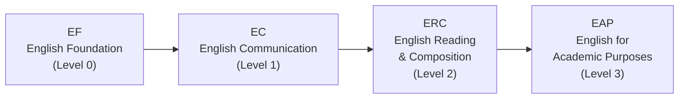

# Хичээлийн төлөвлөлтийн зөвлөмжүүд

Зөв хичээл сонгох нь зөвхөн тал нь. Хуваарьт хэрхэн зохион байрлуулах, хэдэн кредит зөөх нь адил чухал. Маш сайн хичээлийн сонголт хийсэн ч төлөвлөлт муу бол зовлонтой улирал болно. Энэ хэсэгт англи/солонгос хэлний зам, кредитийн стратеги, хуваарь зохион байгуулалтын зөвлөмж, болон жишиг хуваариудыг багтаасан. [[hub|Гарын авлагын эхлэл хуудас]] руу буцах.

---

## Англи хэлний хичээлийн зам (EPT)

HanST чиглүүлэх хөтөлбөрийн үеэр бүх шинэ оюутнууд **EPT (English Placement Test)** өгнө. Үр дүн нь англи хэлний хичээлийн аль түвшинд орохыг тодорхойлно.



Хэрэв EPT-д өндөр түвшинд тэнцвэл доод түвшнүүдийг алгасаж болно. TOEFL, IELTS, TOEIC зэрэг стандартчилсан шалгалтын хүрэлцэхүйц оноотой бол зарим түвшнүүдээс чөлөөлөгдөж болно.

**Англи хэлний хичээлүүдийг хойшлуулж БОЛОХГҮЙ.** Сүүлийн улирлуудад багш нар суудлын хязгаарыг хатуу мөрддөг болсон. "Дараа улиралд авъя" гэж бодсон оюутнууд бүх суудал дүүрсэнийг олж мэддэг. Тогтоосон англи хэлний түвшнээ **эхний улиралдаа шууд** аваарай. Суудал хурдан дүүрнэ, хүлээгээд юу ч олдохгүй.

---

## Солонгос хэлний шаардлага

Энэ шаардлага нь **гадаад паспорттой оюутнууд** болон **удаан хугацаагаар гадаадад амьдарсан Солонгос иргэд**-д хамаарна. Practical Korean хичээлийн цувралыг дуусгах ёстой. Чиглүүлэх хөтөлбөрийн үеэр солонгос хэлний түвшин тогтоох шалгалт өгөх бөгөөд энэ нь таны эхлэх түвшинг тодорхойлно.

**Маш чухал зөвлөгөө:** Түвшин тогтоох шалгалтанд өндөр түвшинд орохын тулд таамаглаж хариулж БОЛОХГҮЙ. Яагаад гэвэл:

- Хэрэв **Korean 1** (хамгийн доод түвшин)-ээс эхэлбэл, хялбар, найдвартай кредит олж, бат суурийг тавина. Даалгаврууд зохицуулж болох хэмжээнд байна, итгэлтэй болно.
- Хэрэв таамаглаж **Korean 3**-т орвол, Korean 1 болон Korean 2-оос авах байсан кредитийг бусад хичээлээр нөхөх хэрэгтэй болно. Мөн жинхэнэ чадвараасаа хэтэрсэн хэцүү солонгос хичээлтэй тулгарна.

**Шударгаар хариулаарай.** Доод түвшнээс эхлээд дээшлэх нь хэтэрхий хэцүү түвшинд зовж суухаас хамаагүй ашигтай. Энэ бол бахархлын асуудал биш — стратегийн асуудал.

---

## Хичээлийн төлөвлөлтийн зөвлөмжүүд

### Илүү бүртгүүлж, дараа нь хасах стратеги

Хамгийн ихдээ **22 кредит** (хэт ачаалал) бүртгүүлж болно. Алтан дүрэм: **илүү олон хичээлд бүртгүүлээд, эхний долоо хоногийн дараа хасах нь цөөн хичээлд бүртгүүлээд дараа нэмэхээс үргэлж дээр.** Алдартай хичээлүүдэд засах хугацаанд нээлттэй суудал байдаггүй. Хэрэв цөөн хичээлээр эхлээд дараа нь өрсөлдөөнтэй хичээл нэмэх гэвэл бараг л бүтэхгүй.

### Кредитийн зорилт

- **Төгсөлтийн шаардлага**: 8 улиралд 130 кредит = улирал бүр ойролцоогоор 16.25 кредит
- **Санал болгох зорилт**: Улирал бүр 17-18 кредит нь тохитой зай өгнө
- **Тэтгэлэгт оюутнууд**: Хамгийн багадаа **15.5 кредит** хадгалах ёстой. Засах хугацаанд хичээл хасахдаа энэ босгоноос доош буухгүй байхад маш анхаараарай.

### Хичээлийн кодыг хэрхэн унших вэ

Хандон-ы хичээлийн кодын **эхний цифр** нь зөвлөмжийн түвшинг заана:

- **1**xxx: Нэгдүгээр курсын хичээлүүд (та авах ёстой)
- **2**xxx: Хоёрдугаар курсын хичээлүүд
- **3**xxx: Гуравдугаар курсын хичээлүүд
- **4**xxx: Дөрөвдүгээр курсын хичээлүүд

Шинэ оюутан болохын хувьд **1xxx хичээлүүдэд төвлөр**. 3xxx эсвэл 4xxx кодтой хичээлүүд нь ихэвчлэн урьдач шаардлагатай бөгөөд систем бүртгүүлэхийг зөвшөөрсөн ч агуулга нь таны бэлтгэлээс хамаагүй хэтэрсэн байна. Суурийг тавиагүйгээр дээд түвшний хичээл авах нь зоригтой биш — хариуцлагагүй хэрэг.

### Үдийн хоолны завсарлагаа чөлөөтэй байлга

4-р цаг (12:00-13:00) болон 5-р цаг (13:00-14:00) нь үдийн хоолны цонхтой давхцдаг. Хэрэв энэ хугацаанд хичээл оруулбал үдийн хоол алдана. Нэг хоёр удаа тэвчиж болно, гэхдээ өдөр бүр ингэвэл эрч хүч, төвлөрөлтийг сүйтгэнэ. **Гурваас дээш дараалсан хичээл орохгүй бай.** Хичээл хоорондын завсарлага хэрэгтэй.

### Багш нарын талаар ахмад оюутнуудаас асуу

Ижил хичээлийг өөр өөр багш заахад бүрэн өөр туршлага болж болно — ажлын ачаалал, шалгалтын хэцүүрэг, дүнгийн хэв маяг, заах арга. Хичээлийн каталог эдгээрийг хэлж өгдөггүй. **섬김이 (оюутны зөвлөх) болон ахмад оюутнуудаас асуугаарай**: "Энэ хичээлийг хэн нэгэн авсан уу? Ямар байсан бэ?" Энэ бол таны хамгийн найдвартай мэдээллийн эх сурвалж.

### Анги бүрийн заах хэлийг шалга

Энэ нь олон улсын оюутнуудын хувьд хэтэрхий ч чухал. **Ижил багш нэг ангидаа солонгосоор, нөгөөд англиар зааж болно.** Бүртгүүлэхийн өмнө тухайн ангийн "English %" баганыг заавал шалгаарай. Олон улсын оюутан санамсаргүйгээр солонгос ангид, эсвэл Солонгос оюутан санамсаргүйгээр англи ангид бүртгүүлэх тохиолдол улирал бүр гардаг.

---

## Санал болгох хуваарь (Олон улсын оюутан)

Доорх бол **100% англи ангиуд**-аас бүтээсэн жишиг цагийн хуваарь юм. Эдгээр нь жишиг жишээнүүд — EPT үр дүн, сонирхол, эрч хүчний түвшинд тулгуурлан тохируулаарай. Алтан дүрмийг санаарай: хэрэгтэйгээсээ олон хичээлд бүртгүүлж, эхний долоо хоногийн дараа хасаарай.

### Хуваарь A: Хүмүүнлэг/Нийгмийн шинжлэх ухааны чиглэл (Бүгд англи)

```
Period | Mon            | Tue              | Wed        | Thu            | Fri
-------|----------------|------------------|------------|----------------|------------------
  1    |                | Bible (07)       |            |                | Bible (07)
  2    |                | Intl Relations   | CharEd*    |                | Intl Relations
  3    |                | Psychology       |            |                | Psychology
  4    | D&P            |                  | Chapel     | D&P            |
  5    | Python (05)    | Python (05)      | Chapel     | Python (05)    |
  6    |                |                  | Chapel     |                |
```

> **⚠️ CharEd давхцал:** Character Education Sec 01 (Mon 5, Англи) нь Python Sec 05 (Mon 5)-тай давхцдаг. **Шийдэл:** Оронд нь CharEd Sec 02-06 (Wed 2, Солонгос) авах, эсвэл Python-ийг Mon 5 биш ангид солих.

| Course | Code | Credits | Professor | Note |
|--------|------|---------|-----------|------|
| Understanding the Bible (07) | GEK20058 | 2 | Joshua Kim | Tue 1, Fri 1, 100% Англи |
| International Relations Intro (01) | ISE10052 | 3 | 정모니카 | Tue 2, Fri 2, 100% Англи |
| Psychology Intro (02) | CSW10003 | 3 | 지원근 | Tue 3, Fri 3, 100% Англи |
| Discussion & Presentation (01) | GCS10013 | 3 | Richardson | Mon 4, Thu 4, 100% Англи |
| Character Education (02-06) | GEK10015 | 1 | Various | **Wed 2, Солонгос** (Sec 01 Mon 5 Python-тай давхцдаг) |
| Python Programming (05) | GCS10004 | 3 | 박지현 | Mon 5, Thu 5, 100% Англи |
| Chapel 1 | GEK10001 | 0 | — | Wed 4, 5, 6 |
| Community Leadership Training 1 | GEK10008 | 0.5 | TBA | Time TBA |
| Social Service 1 | GEK10046 | 1 | — | Тусдаа хуваарь |
| + Korean Language Course | — | 3 | TBA | Олон улсын оюутнуудад заавал |
| **Нийт** | | **19.5 + Korean (3)** | | |

**Энэ хуваарь яагаад үр дүнтэй вэ:** Мягмар, Баасан гарагт гурван дараалсан англи хичээл (Bible, International Relations, Psychology)-тэй оюуны хүнд ачаалал ногддог бол Даваа, Пүрэв нь зөвхөн үдээс хойших хичээлтэй хөнгөн байна. Лхагва нь Chapel болон хувийн суралцах цагт зориулагдсан. Хоёр бүрэн ялгаатай чиглэлийг (олон улсын харилцаа, сэтгэл зүй) судалж, зэрэгцээ програмчлалын ур чадвар, англи академик илтгэлийн чадварыг бүтээнэ.

**CharEd давхцал дээр шийдсэн:** Character Education Sec 01 (Mon 5) нь Python Sec 05 (Mon 5)-тай давхцдаг. Энэ хуваарь давхцлыг зайлсхийхийн тулд CharEd Sec 02-06 (Wed 2, Солонгос) ашигладаг. Хэрэв солонгос хэл чинь хангалтгүй бол оронд нь Python-ийг Mon 5 биш ангид солиорой.

### Хуваарь B: STEM чиглэл (Бүгд англи)

```
Period | Mon              | Tue              | Wed        | Thu              | Fri
-------|------------------|------------------|------------|------------------|------------------
  1    |                  | Bible (07)       |            |                  | Bible (07)
  2    |                  | Worldview (02)   |            |                  | Worldview (02)
  3    | Linear Alg (01)  |                  |            | Linear Alg (01)  |
  4    | Calculus 1 (03)  |                  | Chapel     | Calculus 1 (03)  |
  5    | Python (05)      | Python (05)      | Chapel     | Python (05)      |
  6    |                  |                  | Chapel     |                  |
```

> **⚠️ CharEd давхцал:** Character Education Sec 01 (Mon 5, Англи) нь Python Sec 05 (Mon 5)-тай давхцдаг. **Шийдэл:** Оронд нь CharEd Sec 02-06 (Wed 2, Солонгос) авах, эсвэл Python-ийг Mon 5 биш ангид солих.

| Course | Code | Credits | Professor | Note |
|--------|------|---------|-----------|------|
| Understanding the Bible (07) | GEK20058 | 2 | Joshua Kim | Tue 1, Fri 1, 100% Англи |
| Christian Worldview (02) | GEK20011 | 2 | 최용준 | Tue 2, Fri 2, 100% Англи |
| Linear Algebra (01) | GEK10082 | 3 | 조장환 | Mon 3, Thu 3, 100% Англи |
| Calculus 1 (03) | GEK10095 | 3 | 김민재 | Mon 4, Thu 4, 100% Англи |
| Character Education (02-06) | GEK10015 | 1 | Various | **Wed 2, Солонгос** (Sec 01 Mon 5 Python-тай давхцдаг) |
| Python Programming (05) | GCS10004 | 3 | 박지현 | Mon 5, Thu 5, 100% Англи |
| Chapel 1 | GEK10001 | 0 | — | Wed 4, 5, 6 |
| Community Leadership Training 1 | GEK10008 | 0.5 | TBA | Time TBA |
| Social Service 1 | GEK10046 | 1 | — | Тусдаа хуваарь |
| + Korean Language Course | — | 3 | TBA | Олон улсын оюутнуудад заавал |
| **Нийт** | | **18.5 + Korean (3)** | | |

**Энэ хуваарь яагаад үр дүнтэй вэ:** Calculus 1 болон Linear Algebra-г зэрэг авахад хүчтэй синерги бий болно — Linear Algebra-ийн вектор, матрицын ойлголтууд Calculus-д тохиолдох олон хувьсагчийн санаатай шууд холбогдоно. Python програмчлалын суурийг тавина. Мягмар, Баасан нь хөнгөн өдрүүд (зөвхөн Bible + Worldview) байдаг тул математикийн дасгал ажил хийх цаг гарна.

**CharEd давхцал дээр шийдсэн:** Character Education Sec 01 (Mon 5) нь Python Sec 05 (Mon 5)-тай давхцдаг. Энэ хуваарь давхцлыг зайлсхийхийн тулд CharEd Sec 02-06 (Wed 2, Солонгос) ашигладаг. Хэрэв солонгос хэл чинь хангалтгүй бол оронд нь Python-ийг Mon 5 биш ангид солиорой.

---

*Сүүлд шинэчилсэн: 2026-02-21*
