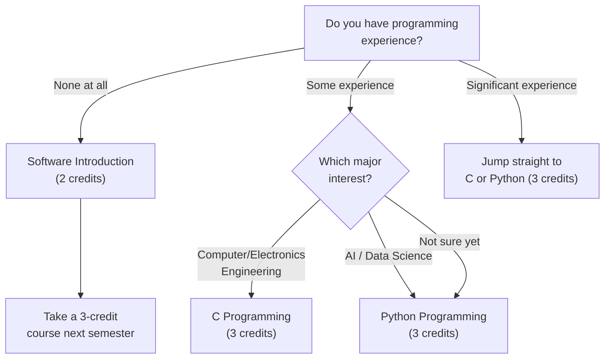

# अनिवार्य कोर्सहरू

> यो पृष्ठले Handong Global University मा हरेक नयाँ विद्यार्थीले पूरा गर्नुपर्ने अनिवार्य कोर्सहरूको पूर्ण विवरण प्रस्तुत गर्छ। तपाईंको इच्छित major, राष्ट्रियता, वा रुचि जे भए पनि — **यी कोर्सहरू सबैका लागि अनिवार्य छन्।** पहिले यी कोर्सहरूलाई केन्द्रमा राखेर आफ्नो तालिका बनाउनुहोस्, त्यसपछि बाँकी भर्नुहोस्।
> मूल गाइडमा फिर्ता जान: [[ne/hub|वसन्त २०२६ नयाँ विद्यार्थी दर्ता गाइड]]

---

## मुख्य मितिहरू

समयरेखा बुझ्नु महत्त्वपूर्ण छ। एउटा समयसीमा छुट्यो भने, तपाईंले पूरै semester को योजना गुमाउन सक्नुहुन्छ।

### फेब्रुअरी: भर्ना र दर्ता

| Date | Event | Details |
|------|-------|---------|
| 2/19 (Thu) ~ 2/24 (Tue) | **Tuition Payment** | शुल्क नतिरी course registration गर्न सकिँदैन। सबैभन्दा पहिले यो पूरा गर्नुहोस्। |
| 2/23 (Mon) | **Entrance Ceremony** | तपाईं आधिकारिक रूपमा Handong विद्यार्थी बन्ने दिन। |
| 2/23 (Mon) ~ 2/27 (Fri) | **HanST (Orientation)** | यस अवधिमा तपाईंले **EPT (English Placement Test)** दिनुहुनेछ, जसले तपाईंको अंग्रेजी कोर्सको स्तर निर्धारण गर्छ। **यो नछोड्नुहोस्।** |
| **2/26 (Thu) 10:00~16:00** | **Pre-registration** | "Shopping cart" चरण। तलका विस्तृत नियमहरू हेर्नुहोस्। |
| **2/27 (Fri) 10:00~12:00** | **Main Registration** | पहिले आउने-पहिले पाउने। केवल २ घण्टा। यो वास्तविक लडाइँ हो। |
| 2/28 (Sat) 14:00 | **Dormitory Move-in** | छात्रावास check-in। |

### मार्च: कक्षा शुरु

| Date | Event | Details |
|------|-------|---------|
| 2/27 (Fri) 14:00 ~ 3/4 (Wed) 14:00 | **Course Adjustment Period 1** | Main registration पछि तुरुन्तै सुरु हुन्छ। सिट खुलेमा कोर्स फेर्न वा थप्न सक्नुहुन्छ। |
| **3/2 (Mon)** | **First Day of Classes** | Semester आधिकारिक रूपमा सुरु हुन्छ। |
| **3/6 (Fri) 10:00 ~ 3/12 (Thu) 21:00** | **Course Adjustment Period 2 (FINAL)** | तपाईंको तालिका परिवर्तन गर्ने **अन्तिम अवसर**। यो समयसीमापछि, तपाईंको तालिका पूरै semester को लागि lock हुन्छ। सावधानीपूर्वक निर्णय गर्नुहोस्। |

### मे ~ जुलाई: परीक्षा र ग्रेड

| Date | Event |
|------|-------|
| 5/4 (Mon) ~ 5/15 (Fri) | Midterm Exams |
| 6/15 (Mon) ~ 6/19 (Fri) | Final Exams |
| 7/6 (Mon) 16:00 | Grades Released |

### Pre-registration नियमहरू (महत्त्वपूर्ण — ध्यानपूर्वक पढ्नुहोस्)

Pre-registration अनलाइन shopping cart जस्तो काम गर्छ। तपाईंले चाहेका कोर्सहरू cart मा राख्नुहुन्छ, तर **कोर्स cart मा थप्दैमा दर्ताको guarantee हुँदैन**। यो वास्तवमा कसरी काम गर्छ:

- **यदि आवेदकको संख्या कोर्स क्षमताभन्दा कम वा बराबर छ** → आवेदन गरेका सबैलाई **स्वचालित रूपमा पुष्टि** गरिन्छ। थप कार्य आवश्यक छैन।
- **यदि आवेदकको संख्या कोर्स क्षमताभन्दा बढी छ** → **कसैलाई पनि पुष्टि गरिँदैन**। कोर्स reset हुन्छ, र सबैले main registration मा पहिले आउने-पहिले पाउने आधारमा फेरि प्रतिस्पर्धा गर्नुपर्छ।

यो एक महत्त्वपूर्ण भिन्नता हो। धेरै नयाँ विद्यार्थीहरूले सोच्छन् कि pre-registration ले उनीहरूको सिट सुरक्षित गर्छ र त्यसपछि main registration दिन आफ्ना कोर्सहरू पुष्टि नभएको थाहा पाएर आत्तिन्छन्।

**Pre-registration समाप्त भएपछि, तपाईंले HISNet मा लग इन गरेर कुन कोर्सहरू पुष्टि भए जाँच गर्नैपर्छ।** पुष्टि नभएका कोर्सहरू main registration अवधिमा पुन: दर्ता गर्नुपर्छ। त्यसअनुसार तयारी गर्नुहोस्।

---

## Chapel 1 (0 credits, हरेक semester)

Chapel मा शून्य credit हुन्छ तर **हरेक semester अनिवार्य** छ। तपाईंले छ semester मा Chapel 1 देखि Chapel 6 सम्म पूरा गर्नुपर्छ, र यसो नगर्दा तपाईं स्नातक हुन सक्नुहुन्न।

Chapel सम्बन्धमा नयाँ विद्यार्थीहरूको सबैभन्दा सामान्य गल्ती यो हो: धेरै विद्यार्थीहरूले दर्ता नगरी सधैं उपस्थित हुन सक्छन् भन्ने सोच्छन्। **तपाईंले course registration प्रणालीमा Chapel दर्ता गर्नुपर्छ।** हरेक वर्ष, विद्यार्थीहरू पूरै semester विश्वासपूर्वक Chapel मा उपस्थित हुन्छन् तर अन्त्यमा थाहा हुन्छ कि उनीहरूले कहिल्यै दर्ता गरेका थिएनन् — र उनीहरूको उपस्थिति गनिँदैन। यो गल्ती सुधार्न अत्यन्त कठिन हुन्छ।

Chapel उपस्थिति **QR code scanning प्रणाली** प्रयोग गर्छ। तपाईंले समयमा आउनुपर्छ र QR code scan गर्नुपर्छ। Scan छुट्यो भने, पछाडिबाट सुधार गर्न लगभग असम्भव छ। ढिलो नहुनुहोस्।

> **Spring 2026:** Chapel 1 (GEK10001), Section 01 — Wed periods 4, 5, 6 (Hyoam Main Building) / Language: Korean (0% English)

---

## Community Leadership Training 1 (0.5 credits, हरेक semester)

Chapel जस्तै, यो कोर्स हरेक semester अनिवार्य छ। यो तपाईंको आवासीय समुदाय भित्र नेतृत्व र सामूहिक कार्यमा केन्द्रित छ। **यहाँ पनि उही दर्ता गल्ती हुन्छ** — विद्यार्थीहरू पूरै semester साप्ताहिक team बैठकमा सहभागी हुन्छन् तर वास्तवमा प्रणालीमा दर्ता गर्दैनन्। दर्ता गर्नुहोस्।

> **Spring 2026:** Community Leadership Training 1 (GEK10008), Section 01 — Time TBA (पछि घोषणा हुनेछ)

---

## Handong Character Education (1 credit, एक पटकको आवश्यकता)

यो Handong को character education दर्शनको मुख्य कोर्स हो। धेरै section हरू उपलब्ध छन्। **Section 01 100% अंग्रेजीमा पढाइन्छ**, जसले अन्तर्राष्ट्रिय विद्यार्थीहरूको लागि आदर्श विकल्प बनाउँछ।

> **Spring 2026 Sections:**

| Section | Professor | Time | English % | Note |
|---------|-----------|------|-----------|------|
| **01** | **Shushan Marie Richardson** | **Mon 5** | **100%** | **अन्तर्राष्ट्रिय विद्यार्थीहरूको लागि सिफारिस** |
| 02 | 이상산 | Wed 2 | 0% | Korean |
| 03 | 최희열 | Wed 2 | 0% | Korean |
| 04 | 손화철 | Wed 2 | 0% | Korean |
| 05 | 최혜봉 | Wed 2 | 0% | Korean |
| 06 | 윤상헌 | Wed 2 | 0% | Korean |

Section 02 देखि 06 सम्म सबै बुधबार अवधि 2 मा हुन्छन्, त्यसैले तिनीहरू प्राध्यापकमा मात्र भिन्न छन्। यदि तपाईं कोरियालीमा सहज हुनुहुन्छ भने, प्रत्येक प्राध्यापकको पढाउने शैलीबारे आफ्नो 섬김이 (student mentor) लाई सोध्नुहोस्।

---

## Christian Faith Foundation (CF1) — 2 credits

तपाईंले यस श्रेणीबाट एउटा कोर्स पूरा गर्नुपर्छ: Understanding the Bible, Bible and Life, वा Bible and Spiritual Growth। यी समकक्ष कोर्सको रूपमा मानिन्छन्, त्यसैले तपाईंले एउटा मात्र लिनुपर्छ।

### Understanding the Bible (GEK20058) — 15 Sections

यो सबैभन्दा धेरै section उपलब्ध भएको कोर्स हो — 15 वटा section, जसले जुनसुकै तालिकामा पनि मिलाउन सजिलो बनाउँछ।

| Section | Professor | Time | English % | Note |
|---------|-----------|------|-----------|------|
| 01 | 김완진 | Mon 2, Thu 2 | 0% | |
| 02 | 김완진 | Mon 3, Thu 3 | 0% | |
| 03 | 김완진 | Mon 4, Thu 4 | 0% | |
| 04 | 이재현 | Tue 2, Fri 2 | 0% | |
| 05 | 이재현 | Tue 3, Fri 3 | 0% | |
| 06 | 이재현 | Tue 5, Fri 5 | 0% | |
| **07** | **Joshua Kim** | **Tue 1, Fri 1** | **100%** | **English section** |
| 08 | Joshua Kim | Tue 2, Fri 2 | 0% | |
| 09 | Joshua Kim | Tue 3, Fri 3 | 0% | |
| 10 | 최성호 | Tue 2, Fri 2 | 0% | |
| **11** | **최성호** | **Tue 3, Fri 3** | **100%** | **English section** |
| **12** | **최성호** | **Tue 5, Fri 5** | **100%** | **English section** |
| 13 | 한은선 | Mon 1, Thu 1 | 0% | |
| 14 | 한은선 | Mon 2, Thu 2 | 0% | |
| 15 | 한은선 | Mon 3, Thu 3 | 0% | |

**अन्तर्राष्ट्रिय विद्यार्थीहरूको लागि**: Section 07 (Joshua Kim, 100% English), Section 11 (최성호, 100% English), वा Section 12 (최성호, 100% English) छान्नुहोस्। अंग्रेजी section हरू लोकप्रिय छन् र pre-registration मा चाँडो भरिन सक्छन् — सधैं backup योजना तयार राख्नुहोस्।

### Understanding Christianity (GEK20059)

| Section | Professor | Time | English % | Note |
|---------|-----------|------|-----------|------|
| **01** | **Gregory T. Brown** | **Mon 2, Thu 2** | **100%** | **English** |
| **02** | **Gregory T. Brown** | **Mon 3, Thu 3** | **100%** | **English** |

दुवै section पूर्ण रूपमा अंग्रेजीमा पढाइन्छ। Understanding the Bible का अंग्रेजी section हरू भरिएमा यो एक राम्रो विकल्प हो।

---

## Worldview — 2 credits

तपाईंले यस श्रेणीबाट एउटा कोर्स लिनुपर्छ: Creation and Evolution, Christians and Mission, वा Christian Worldview। प्रत्येकमा कोरियाली र अंग्रेजी दुवै section हरू उपलब्ध छन्।

| Course | Section | Professor | Time | English % |
|--------|---------|-----------|------|-----------|
| Creation and Evolution (GEK10011) | 01 | 김광 et al. | Wed 2, 3 | 0% |
| **Creation and Evolution (GEK10011)** | **02** | **Holzapfel Wilhelm et al.** | **Wed 2, 3** | **100%** |
| Christians and Mission (GEK20069) | 01 | 조혜신 et al. | Mon 6, 7 | 0% |
| **Christians and Mission (GEK20069)** | **02** | **진기영** | **Wed 2, 3** | **100%** |
| Christian Worldview (GEK20011) | 01 | 최용준 | Mon 3, Thu 3 | 0% |
| **Christian Worldview (GEK20011)** | **02** | **최용준** | **Tue 2, Fri 2** | **100%** |

**Time conflict मा ध्यान दिनुहोस्:** धेरै कोर्सहरू Wed 2-3 time slot मा एकैसाथ पर्छन्। यदि तपाईं Character Education sections 02-06 (Wed 2) लिँदै हुनुहुन्छ भने, Wed 2-3 मा Worldview कोर्स पनि लिन सक्नुहुन्न। त्यसअनुसार योजना बनाउनुहोस्।

---

## Social Service (1 credit x कुल 2 कोर्स)

स्नातक हुनुअघि तपाईंले दुईवटा Social Service कोर्सहरू (Social Service 1-4 मध्ये) पूरा गर्नुपर्छ। प्रति semester एउटा लिन सिफारिस गरिन्छ।

> **Spring 2026:** Social Service 1 (GEK10046) Section 01, Social Service 2 (GEK20046) Section 01 — कुनै निश्चित कक्षा समय छैन (practice-based)

---

## ICT आवश्यकता (सबै विद्यार्थीको लागि 7 credits)

प्रत्येक Handong विद्यार्थीले, major जे भए पनि, **7 credits ICT Convergence कोर्सहरू** पूरा गर्नुपर्छ: 5 credits Programming + 2 credits Application। यो ऐच्छिक होइन, र humanities तथा social science विद्यार्थीहरूलाई पनि समान रूपमा लागू हुन्छ।

### अन्तर्राष्ट्रिय विद्यार्थीहरूको लागि सिफारिस गरिएका अंग्रेजीमा पढाइने ICT कोर्सहरू

| Course | Code | Credits | Section | Professor | Time | English % |
|--------|------|---------|---------|-----------|------|-----------|
| **Python Programming** | GCS10004 | 3 | **05** | 박지현 | Mon 5, Thu 5 | **100%** |
| **Frontend Introduction** | GCS10081 | 3 | **04** | 박지현 | Tue 6, Fri 6 | **100%** |

**एउटा उपयोगी जानकारी:** OIA (Office of International Admissions) ले कहिलेकाहीं programming कोर्सहरूमा अन्तर्राष्ट्रिय नयाँ विद्यार्थीहरूको लागि विशेष सिटहरू सुरक्षित राख्छ। यदि तपाईं अन्तर्राष्ट्रिय विद्यार्थी हुनुहुन्छ भने, OIA लाई यसबारे सोध्नुहोस् — यसले तपाईंलाई registration को दौडबाट बचाउन सक्छ।

### आफ्नो बाटो छनोट: C, Python, वा Software Introduction?

यदि तपाईंसँग कुनै coding पृष्ठभूमि छैन र डर लागिरहेको छ भने, Software Introduction (GCS10001, 2 credits) एक सहज सुरुवात बिन्दु हो। तर, यदि तपाईं कुनै पनि STEM major को बारेमा गम्भीर हुनुहुन्छ भने, आफूलाई चुनौती दिनुहोस् र सिधै Python वा C लिनुहोस् — यसले तपाईंलाई पूरै एक semester बचत गर्छ।

---

*Last updated: 2026-02-21*
