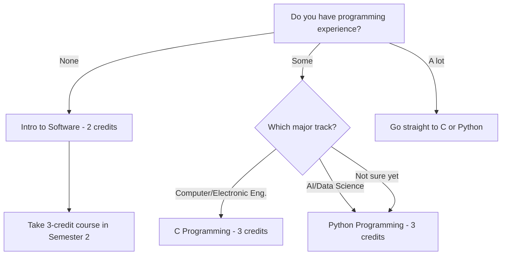
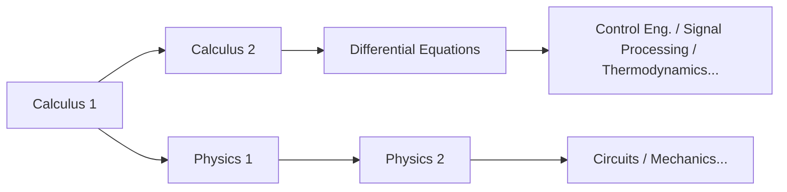

# STEM नयाँ विद्यार्थी कोर्स गाइड

> Engineering, Computer Science, AI, र Natural Sciences मा रुचि राख्ने नयाँ विद्यार्थीहरूको लागि कोर्स रणनीति
> मुख्य गाइड: [[Spring 2026 Freshman Registration Guide]]

---

## 1. यो गाइड कसको लागि हो?

यो गाइड निम्न major हरू विचार गर्दै गरेका **2026 बैचका नयाँ विद्यार्थीहरू** को लागि लेखिएको हो:

- **AI Computer & Electronic Engineering विभाग (CSEE)**: Computer Engineering, Electronic Engineering, AI, Software, Embedded Systems
- **Mechanical & Control Engineering**: Mechanical Engineering, Electronic Control Engineering, Energy Engineering
- **Spatial Environment & Systems Engineering**: Construction Engineering, Urban & Environmental Engineering
- **Life Sciences**: Life Science, Food Science

"मेरो ठ्याक्कै major निश्चित छैन, तर म STEM व्यक्ति हुँ भन्ने थाहा छ" भन्ने सोच्दै छौ भने पनि — यो गाइड तिम्रो लागि हो। अलिकति लामो छ, तर एकचोटि राम्रोसँग पढ — पक्कै काम लाग्छ! Handong मा, पहिलो वर्षमा major घोषणा गरिँदैन। यसको मतलब मुख्य रणनीति भनेको **तिमीले अन्ततः कुनै पनि STEM major रोजे पनि काम लाग्ने आधारभूत कोर्सहरूले पहिलो वर्ष भर्नु** हो।

### तिम्रो पहिलो-वर्षको आधार किन यत्रो महत्त्वपूर्ण छ

STEM कोर्सहरू **सिँढी** जस्तो बनेका हुन्छन्। Calculus बिना Differential Equations लिन सकिँदैन। Differential Equations बिना Control Engineering बुझ्न सकिँदैन। Linear Algebra नलिई Machine Learning lecture मा matrix operations आउँदा बुझ्न सकिँदैन। Physics बिना Circuit Theory मा Kirchhoff's laws किन त्यो रूपमा छन् भनेर बुझ्न सकिँदैन।

अर्को शब्दमा, यदि तिमीले वर्ष 1 मा mathematics र science आधारहरू छोड्यौ भने, वर्ष 2 बाट तिम्रा major कोर्सहरू **domino जस्तो खस्नेछन्**। STEM मा, "म पछि लिन्छु" भन्नु "म पछि दुःख पाउँछु" भन्नु जस्तै हो।

### कोर्स कोड कसरी पढ्ने: यो नछोड

Handong कोर्स code मा लुकेको तर महत्त्वपूर्ण जानकारी हुन्छ। उदाहरणका लागि, `GCS10058` मा:

- **GCS**: विभाग/क्षेत्र code (GCS = Global Creative Software)
- **1**0058: अगाडिको अंकले **वर्ष स्तर** जनाउँछ

यो किन महत्त्वपूर्ण? **1 बाट सुरु हुने कोर्सहरू पहिलो वर्षको लागि हुन्; 3 वा 4 बाट सुरु हुने कोर्सहरू senior विद्यार्थीहरूको लागि हुन्।** केही नयाँ विद्यार्थीहरू महत्वाकांक्षी भएर 3xxx वा 4xxx कोर्सहरू दर्ता गर्ने प्रयास गर्छन् — यो आधार बिना घर बनाउनु जस्तो हो। Registration प्रणालीले नरोके पनि, **पहिलो वर्षमा 1xxx कोर्सहरूमा अडिग रह।**

त्यसैगरी, तिम्रो major पुष्टि हुनुअघि advanced major-specific कोर्सहरू लिनु जोखिमपूर्ण छ। पहिले Calculus, Physics, Programming, र Linear Algebra जस्ता **सार्वभौमिक रूपमा लागू हुने कोर्सहरू** भर्नु धेरै बुद्धिमानी छ।

---

## 2. वर्ष 1 मा लिनैपर्ने कोर्सहरू

### 2.1 Calculus 1 — सबै STEM को सुरुवात बिन्दु

Calculus लगभग हरेक क्षेत्रको **साझा भाषा** हो: Engineering, Physics, Computer Science, Economics समेत। Differentiation ले "परिवर्तनको दर" सँग सम्बन्ध राख्छ, र integration ले "संचित मात्रा" सँग सम्बन्ध राख्छ — यी दुई अवधारणा बिना, कुनै पनि advanced STEM कोर्स पहुँचयोग्य छैन।

Calculus लाई विदेशी भाषा सिक्ने **वर्णमाला** सम्झ। वर्णमाला बिना शब्द पढ्न सकिँदैन, र शब्द बिना वाक्य बुझ्न सकिँदैन। हाई स्कुलमा mathematics राम्रो वा नराम्रो जे भएको भए पनि — विश्वविद्यालय Calculus मूलभूत रूपमा फरक गहिराइको हो। तिमीले epsilon-delta परिभाषाबाट सुरु गर्दै कठोर गणितीय सोचमा प्रशिक्षण पाउनेछौ।

**आदर्श roadmap**: Semester 1 Calculus 1 → Semester 2 Calculus 2 → Semester 3 Differential Equations। यो क्रम एक semester पनि ढिलो भयो भने, major कोर्सहरूमा प्रवेश ढिलो हुन्छ।

> **2026 Spring — Calculus 1 (GEK10095) Sections:**

| Section | Professor | Time | English % | Notes |
|---------|-----------|------|-----------|-------|
| 01 | Lee Hanjin | Mon P4, Thu P4 | 0% | Korean instruction |
| 02 | Lee Hanjin | Mon P6, Thu P6 | 0% | Korean instruction, later time slot |
| **03** | **Kim Minjae** | **Mon P4, Thu P4** | **100%** | **English instruction** |
| **04** | **Cho Janghwan** | **Mon P1, Thu P1** | **100%** | **English instruction, Period 1** |

*Period system: P1 = 9:00–10:00, P2 = 10:00–11:00, P3 = 11:00–12:00, P4 = 12:00–13:00, P5 = 13:00–14:00, P6 = 14:00–15:00, P7 = 15:00–16:00*

**Section कसरी छान्ने:**

- **यदि तिमी कोरियालीमा सहज हुन्छौ भने**: Section 01 (Lee Hanjin, Mon P4 / Thu P4) वा Section 02 (Lee Hanjin, Mon P6 / Thu P6)। उही प्राध्यापक, time slot मात्र फरक।
- **यदि तिमीलाई अंग्रेजी निर्देशन चाहिन्छ भने**: **Section 03 (Kim Minjae) वा Section 04 (Cho Janghwan)**। तर, Section 04 **Period 1 (9:00 AM)** मा छ। तिमीले अझै adjust गर्दै गरेको पहिलो semester मा, विकल्प भएमा Period 1 बेवास्ता गर्नु बुद्धिमानी हो। अवश्य पनि, यदि यो अनिवार्य कोर्सको एकमात्र विकल्प हो भने लिऊ — तर विकल्प हुँदा Period 2 वा पछि तालिका बनाउ।

> **⚠️ "अंग्रेजी lecture" जोखिम**: एउही प्राध्यापकको लागि पनि, फरक section हरू फरक भाषामा पढाइन सक्छ। प्रत्येक section को lecture भाषा सधैं प्रमाणित गर। यदि तिम्रो कोरियाली पर्याप्त बलियो छैन र कोरियाली section मा पुगेको छ भने, तिमीले mathematics र भाषा दुवै अवरोधसँग एकैसाथ लड्नुपर्नेछ। उल्टो पनि त्यस्तै लागू हुन्छ — दर्ता गर्नुअघि जाँच गर।

### 2.2 Calculus 2 — सक्छौ भने Semester 1 मा नै लिऊ

सामान्यतया Calculus 2 Semester 2 मा लिइन्छ, तर यदि तिमीसँग हाई स्कुलबाट बलियो calculus आधार छ भने, Semester 1 मा Calculus 1 र 2 एकैसाथ लिन सम्भव छ। यसले तिमीलाई Semester 2 मा नै Differential Equations लिन अनुमति दिन्छ, major कोर्सहरूमा प्रवेश पूरै एक semester ले तीव्र बनाउँदै।

तर, यो **तिम्रो mathematics सीपमा साँच्चै विश्वस्त हुन्छौ भने मात्र सिफारिस गरिन्छ**। एउटा कोर्स ठोस रूपमा सिद्ध्याउनु दुवैमा अति-विस्तार गरेर दुवै गुमाउनुभन्दा राम्रो हो।

> **2026 Spring — Calculus 2 (GEK10096) Sections:**

| Section | Professor | Time | English % | Notes |
|---------|-----------|------|-----------|-------|
| **01** | **Lee Hanjin** | **Mon P2, Thu P2** | **100%** | **English instruction** |
| 02 | Kim Taehee | Mon P1, Thu P1 | 0% | Period 1 |
| 03 | Kim Taehee | Mon P2, Thu P2 | 0% | Korean instruction |

### 2.3 Physics — Engineers को भाषा

यदि तिमी Engineering track (Computer & Electronic, Mechanical & Control, Spatial Environment) तर्फ जाँदै हुन्छौ भने, Physics **ऐच्छिक होइन — अनिवार्य हो**। Physics 1 ले mechanics र thermodynamics समेट्छ, तिमीलाई force, energy, र momentum गणितीय कठोरतासँग सम्हाल्न सिकाउँछ। यो Semester 2 मा Physics 2 (electromagnetism) मा जान्छ, जुन Electronic Engineering को प्रत्यक्ष आधार हो।

Physics लाई **प्रकृतिको programming language** सम्झ। Engineer को रूपमा कुनै पनि कुरा design गर्न, प्रकृतिका नियमहरू बुझ्नुपर्छ — र ती नियमहरू Physics हुन्।

> **2026 Spring — Physics 1 (GEK10055):**

| Section | Professor | Time | English % |
|---------|-----------|------|-----------|
| 01 | Cho Hyunji | Mon P2, Thu P2 | 0% |
| 02 | Cho Hyunji | Mon P3, Thu P3 | 0% |

**Physics 1 vs. Introduction to Physics**: यदि तिमी Computer Science वा AI विचार गर्दै हुन्छौ भने, "Introduction to Physics" लिन सक्छौ। यसले Physics 1 भन्दा फराकिलो दायरा तर उथलो गहिराइमा समेट्छ — Engineering अन्तर्ज्ञान बनाउन पर्याप्त। तर, यदि तिमी गम्भीर रूपमा Electronic Engineering वा Mechanical Engineering विचार गर्दै हुन्छौ, जहाँ physics major सँग गहिरो रूपमा जोडिएको छ, **बिना प्रश्न Physics 1 लिऊ।**

> **Introduction to Physics (GEK10090) — Physics 1 को विकल्प:**

| Section | Professor | Time | English % |
|---------|-----------|------|-----------|
| 01 | Cho Hyunji | Tue P2, Fri P2 | 0% |
| 02 | Cho Hyunji | Tue P3, Fri P3 | 0% |

### 2.4 Linear Algebra — AI युगको लागि आवश्यक Mathematics

Linear Algebra Calculus सँगै STEM Mathematics का **दुई ठूला स्तम्भ** मध्ये एक हो। यसले vectors, matrices, eigenvalues, र linear transformations समेट्छ — र यो AI र machine learning को **गणितीय हृदय** हो।

किन? Machine learning मा, data matrices को रूपमा प्रतिनिधित्व गरिन्छ, र model training matrix operations मार्फत सम्पन्न हुन्छ। Deep learning मा backpropagation समेत अन्ततः matrix differentiation हो। Linear Algebra बिना, AI कोर्सहरूमा कुराहरू *किन* काम गर्छन् भनेर बुझ्न सकिँदैन — तिमी बुझाइ बिना code मात्र नक्कल गर्दै हुनेछौ।

यो Semester 1 मा Calculus 1 सँगै लिन जोरदार सिफारिस गर्छु। यो demanding हुनेछ, तर दुवै पहिलो semester मा सिद्ध्याउनाले Semester 2 देखि तिम्रा विकल्पहरू **विस्फोटक रूपमा विस्तार** गर्नेछ।

> **2026 Spring — Linear Algebra (GEK10082):**

| Section | Professor | Time | English % | Notes |
|---------|-----------|------|-----------|-------|
| **01** | **Cho Janghwan** | **Mon P3, Thu P3** | **100%** | **English instruction** |
| **02** | **Cho Janghwan** | **Mon P5, Thu P5** | **100%** | **English instruction** |
| 03 | Kim Hyunsu | Tue P2, Fri P2 | 0% | Korean instruction |
| 04 | Kim Hyunsu | Tue P3, Fri P3 | 0% | Korean instruction |

### 2.5 ICT Programming — Coding मा तिम्रो पहिलो कदम

Handong मा, सबै विद्यार्थीहरूले **7 credits ICT Convergence Fundamentals** पूरा गर्नुपर्छ: 5 credits programming + 2 credits applied ICT। STEM विद्यार्थीहरूको लागि, programming केवल general education आवश्यकता होइन — यो **तिम्रो major को उपकरण** हो।

**किन वर्ष 1 मा programming सिद्ध्याउनुपर्छ**: वर्ष 2 देखि, तिम्रो major कोर्सहरूबाट programming assignments आउन थाल्छन्। यदि तिमी त्यस बेला अझै आधारभूत programming कोर्स लिँदै हुन्छौ भने, समयको बर्बादी गम्भीर हुन्छ। आदर्श रूपमा, Semester 1 मा 3-credit programming कोर्स (Python/C) लिऊ, र बाँकी Semester 2 मा पूरा गर।

> **OIA (Office of International Admissions) सुरक्षित सिटहरू**: Programming कोर्सहरूमा कहिलेकाहीं **OIA ले आगमन हुने अन्तर्राष्ट्रिय विद्यार्थीहरूको लागि विशेष सुरक्षित सिटहरू** राख्छ। यदि तिमी अन्तर्राष्ट्रिय विद्यार्थी हुन्छौ भने, यसको फाइदा अवश्य लिऊ — यसले लोकप्रिय section मा प्रवेश गर्ने सम्भावना उल्लेखनीय रूपमा बढाउँछ।

#### आफ्नो बाटो छनोट: कहाँबाट सुरु गर्ने

#### C vs. Python: कुन पहिले?

यदि तिमी Computer Engineering वा Electronic Engineering विचार गर्दै हुन्छौ भने, **C अत्यधिक फाइदाजनक हो**। C operating systems, embedded systems, र hardware control को आधार हो — low-level programming आवश्यकताहरू। यदि तिमीले C पहिले सिकेको छ भने, Python लगभग एक हप्तामा सिक्न सक्छौ। उल्टो, यदि तिमीलाई Python मात्र थाहा छ भने, C सिक्दा memory management र pointers मा ठूलो भित्ता ठोक्नेछौ।

यदि AI वा Data Science तिम्रो track हो भने, Python बाट सुरु गर्नु पूर्णतया ठीक छ। यो व्यवहारमा सबैभन्दा व्यापक रूपमा प्रयोग हुने भाषा हो, र कम प्रवेश barrier ले तिमीलाई पहिले programming को आनन्द अनुभव गर्न दिन्छ।

> **Intro to Software (GCS10001) — 2 credits, पूर्ण शुरुवातकर्ताहरूको लागि:**

| Section | Professor | Time | English % |
|---------|-----------|------|-----------|
| 01 | Kim Heonju | Mon P1, Thu P1 | 0% |
| 02 | Lee Sanghun | Mon P5, Thu P5 | 0% |
| 03 | Lee Sanghun | Mon P6, Thu P6 | 0% |
| 04 | Kim Hyunsuk | Tue P2, Fri P2 | 0% |
| 05 | Kim Hyunsuk | Tue P4, Fri P4 | 0% |
| 06 | Kim Hyunsuk | Tue P6, Fri P6 | 0% |

> **C Programming (GCS10058) — 3 credits, Computer/Electronic Eng. track को लागि:**

| Section | Professor | Time | English % |
|---------|-----------|------|-----------|
| 01 | Kim Kwang | Tue P2, Fri P2 | 0% |

⚠️ C Programming मा **केवल 1 section** छ। प्रतिस्पर्धा तीव्र हुन सक्छ, त्यसैले registration मा चाँडो दर्ता गर।

> **Python Programming (GCS10004) — 3 credits, AI/Data Science track को लागि:**

| Section | Professor | Time | English % |
|---------|-----------|------|-----------|
| 01 | Kim Kyungmi | Mon P2, Thu P2 | 0% |
| 02 | Kim Kyungmi | Tue P2, Fri P2 | 0% |
| 03 | Kim Kyungmi | Tue P3, Fri P3 | 0% |
| 04 | Park Jihyun | Mon P3, Thu P3 | 0% |
| **05** | **Park Jihyun** | **Mon P5, Thu P5** | **100%** |
| 06 | Yong Hwangi | Tue P3, Fri P3 | 0% |

> **Intro to Frontend (GCS10081) — 2 credits, Web Development मा रुचि राख्नेहरूको लागि:**

| Section | Professor | Time | English % |
|---------|-----------|------|-----------|
| 01 | Kim Guno | Mon P2, Thu P2 | 0% |
| 02 | Kim Guno | Mon P3, Thu P3 | 0% |
| 03 | Park Jihyun | Tue P5, Fri P5 | 0% |
| **04** | **Park Jihyun** | **Tue P6, Fri P6** | **100%** |
| 05 | Yang Jihye | Mon P3, Thu P3 | 0% |
| 06 | Yang Jihye | Mon P4, Thu P4 | 0% |

Intro to Frontend ले web development का आधारभूत कुराहरू — HTML, CSS, JavaScript समेट्छ। यो तिम्रो 2-credit ICT applied आवश्यकतामा गन्न सकिन्छ, वा यसलाई 2-credit programming कोर्सको रूपमा मान्यता दिन सकिन्छ। Web development मा रुचि छ भने विचार गर्न लायक छ।

### 2.6 General Chemistry — Life Sciences/Chemistry Track को लागि आवश्यक

यदि तिमी Life Sciences वा chemistry-सम्बन्धित major हरू विचार गर्दै हुन्छौ भने, General Chemistry आवश्यक छ। यसले atomic structure, chemical bonding, reaction kinetics, र अन्य chemistry आधारभूत कुराहरू समेट्छ, र Biochemistry र Organic Chemistry को prerequisite को रूपमा काम गर्छ।

> **2026 Spring — General Chemistry (GEK10058):**

| Section | Professor | Time | English % | Notes |
|---------|-----------|------|-----------|-------|
| 01 | Kim Minkyung | Thu P3, P4 (consecutive) | 0% | 2 consecutive hours on Thursday |
| **02** | **Yu Taejun** | **Mon P2, Thu P2** | **100%** | **English instruction** |

### 2.7 General Biology — इमानदार सल्लाह चाहिने कोर्स

General Biology Life Sciences मा प्रवेशको लागि आवश्यक छ, तर एउटा **इमानदार यथार्थता** तिमीले सुन्नु पर्छ।

**⚠️ General Biology प्रतिस्पर्धा अत्यन्त तीव्र छ।** Section हरू कम छन्, र कोर्स दोहोर्याउने विद्यार्थी र senior विद्यार्थीहरूले प्रायः सिट पहिले भर्छन्, जसले गर्दा **नयाँ विद्यार्थीहरूको लागि Semester 1 मा दर्ता गर्न अत्यन्त कठिन हुन्छ।** "मैले Semester 1 मा नै लिनैपर्छ" भनी जिद्दी भएर अन्य महत्त्वपूर्ण कोर्सहरूको दर्ता window गुमाउनुभन्दा, **धेरै बुद्धिमानी रणनीति** भनेको लचिलो हुनु हो: सिट खुल्यो भने लिऊ, र नखुल्दा Semester 2 मा सार।

Semester 1 मा, Calculus, Linear Algebra, र Programming — **जुन कोर्सहरू जे भए पनि उपयोगी छन्** — मा सिट सुरक्षित गर, General Biology मा सबैकुरा दाउमा राख्नुभन्दा। यो Semester 2 मा पनि प्रस्तावित हुन्छ।

> **2026 Spring — General Biology (GEK10057):**

| Section | Professor | Time | English % |
|---------|-----------|------|-----------|
| 01 | Hyun Changgi et al. | Mon P5, Thu P5 | 0% |
| **02** | **Holzapfel Wilhelm et al.** | **Mon P2, Thu P2** | **100%** |
| 03 | Hyun Changgi et al. | Mon P6, Thu P6 | 0% |

### 2.8 Introduction to AI, Computer & Electronic Engineering — Major को स्वाद

यदि तिमी AI Computer & Electronic Engineering विभाग (CSEE) मा रुचि राख्छौ भने, यो introductory कोर्सले तिमीलाई क्षेत्रको ठूलो तस्वीर दिन्छ। "यो क्षेत्र मेरो लागि ठीक हो कि होइन" भनेर पूर्ण major कोर्सहरूमा प्रतिबद्ध हुनुअघि पत्ता लगाउने राम्रो तरिका हो।

> **2026 Spring — Intro to AI, Computer & Electronic Eng. (ECE10006):**

| Section | Professor | Time | English % | Notes |
|---------|-----------|------|-----------|-------|
| 01 | Hwang Sungsu et al. | Mon P6, P7 (consecutive) | 0% | Monday late time slot |

### 2.9 Differential Equations and Applications — यदि तिम्रो Mathematics बलियो छ भने

यदि तिमीले पहिले नै Calculus 1 & 2 पूरा गरेको छ, वा हाई स्कुलमा AP Calculus BC सिद्ध्याउएको छ भने, Semester 1 मा Differential Equations लिन सम्भव छ। तर, यो **तिम्रो mathematics आधार साँच्चै ठोस भएमा मात्र सिफारिस गरिन्छ।**

> **2026 Spring — Differential Equations and Applications (GEK10053):**

| Section | Professor | Time | English % |
|---------|-----------|------|-----------|
| 01 | Kim Taehee | Mon P3, Thu P3 | 0% |

---

## 3. सिफारिस गरिएका तालिकाहरू

तल वास्तविक 2026 Spring कोर्स प्रस्तावहरूबाट बनाइएका **नमूना तालिकाहरू** छन्। यी reference उदाहरणहरू मात्र हुन् — तिम्रो EPT (English Placement Test) परिणाम, रुचिका क्षेत्र, र सहनशक्ति अनुसार समायोजन गर।

**मुख्य सिद्धान्त: बढी कोर्स दर्ता गरेर केही हटाउनु कम दर्ता गरेर पछुताउनुभन्दा राम्रो हो।** उदारतापूर्वक दर्ता गर, पहिलो हप्ता कक्षामा उपस्थित हुनू, र सम्हाल्न नसक्ने हटाउ। उल्टो — add/drop अवधिमा लोकप्रिय कोर्सहरू थप्ने प्रयास — लगभग असम्भव छ किनभने खुला सिटहरू दुर्लभ छन्।

### Schedule A: Computer Science / AI Track

**रणनीति**: Calculus + Linear Algebra + Python ले Mathematics र Coding आधार एकैसाथ बनाउने

| Period | Mon | Tue | Wed | Thu | Fri |
|--------|-----|-----|-----|-----|-----|
| 1 | | | | | |
| 2 | | Python(Sec.02) | | | Python(Sec.02) |
| 3 | Linear Alg(Sec.01) | | | Linear Alg(Sec.01) | |
| 4 | Calc 1(Sec.01) | | Chapel | Calc 1(Sec.01) | |
| 5 | | | Chapel | | |
| 6 | | | Chapel | | |

| Course | Code | Credits | Professor | Notes |
|--------|------|---------|-----------|-------|
| Calculus 1 (Sec. 01) | GEK10095 | 3 | Lee Hanjin | Korean |
| Linear Algebra (Sec. 01) | GEK10082 | 3 | Cho Janghwan | **English 100%** |
| Python Programming (Sec. 02) | GCS10004 | 3 | Kim Kyungmi | Korean |
| Understanding the Bible | GEK20058 | 2 | Choose section | |
| Handong Character Education | GEK10015 | 1 | Choose section | |
| Chapel 1 | GEK10001 | 0 | Wed P4,5,6 | |
| Community Leadership Training 1 | GEK10008 | 0.5 | Separate schedule | |
| Social Service 1 | GEK10046 | 1 | Separate | |
| + English (per EPT result) | - | 3 | TBD | Likely placed on Tue/Fri |
| **Total** | | **16.5 + English 3** | | |

> **किन यो संयोजन?** Calculus र Linear Algebra एकैसाथ लिँदा mathematical synergy सिर्जना हुन्छ। Vector र matrix अवधारणाहरू Calculus मा multivariable functions सँग प्रत्यक्ष जोडिन्छन्। Python लाई Tue/Fri मा राखिएको छ ताकि हप्ता सन्तुलित होस्: Mon/Thu mathematics को लागि, Tue/Fri Coding + English को लागि। यो rhythm बसेपछि, अध्ययन बानी बनाउनु धेरै सजिलो हुन्छ।

### Schedule B: Electronic / Mechanical Engineering Track

**रणनीति**: Calculus + Physics + C Programming ले ठोस Engineering आधार बनाउने

| Period | Mon | Tue | Wed | Thu | Fri |
|--------|-----|-----|-----|-----|-----|
| 1 | | | | | |
| 2 | Physics 1(Sec.01) | C Prog.(Sec.01) | | Physics 1(Sec.01) | C Prog.(Sec.01) |
| 3 | | | | | |
| 4 | Calc 1(Sec.01) | | Chapel | Calc 1(Sec.01) | |
| 5 | | | Chapel | | |
| 6 | | | Chapel | | |

| Course | Code | Credits | Professor | Notes |
|--------|------|---------|-----------|-------|
| Calculus 1 (Sec. 01) | GEK10095 | 3 | Lee Hanjin | Korean |
| Physics 1 (Sec. 01) | GEK10055 | 3 | Cho Hyunji | Korean |
| C Programming (Sec. 01) | GCS10058 | 3 | Kim Kwang | Korean, only section available |
| Understanding the Bible | GEK20058 | 2 | Choose section | |
| Handong Character Education | GEK10015 | 1 | Choose section | |
| Chapel 1 | GEK10001 | 0 | Wed P4,5,6 | |
| Community Leadership Training 1 | GEK10008 | 0.5 | Separate schedule | |
| Social Service 1 | GEK10046 | 1 | Separate | |
| + English (per EPT result) | - | 3 | TBD | Likely placed on Tue/Fri |
| **Total** | | **16.5 + English 3** | | |

> **किन यो संयोजन?** Electronic र Mechanical Engineering physics आधारमा बनेका छन्। Calculus + Physics एकैसाथ लिनु भनेको Calculus मा सिकेका differentiation अवधारणाहरू Physics मा velocity र acceleration समस्याहरूमा तुरुन्तै प्रयोग हुन्छन् — एक शक्तिशाली **पारस्परिक सुदृढीकरण प्रभाव**। C Programming embedded systems र hardware control को आधार हो, जसले Electronic/Mechanical Engineering लक्ष्य राख्नेहरूको लागि आदर्श विकल्प बनाउँछ।

---

## 4. STEM विद्यार्थीहरूले गर्ने सामान्य गल्तीहरू

### गल्ती 1: "म Mathematics पछि लिन्छु"

यो **सबैभन्दा घातक गल्ती** हो। STEM मा कोर्स संरचना domino जस्तो बुझ्नु राम्रो हुन्छ:

Calculus 1 Semester 2 मा सार → Calculus 2 Semester 3 मा सर्छ → Differential Equations Semester 4 मा → मुख्य major कोर्सहरू Semester 5 बाट मात्र पहुँचयोग्य। यसले तिम्रो graduation पूरै एक वर्षले ढिलो गर्न सक्छ। **Mathematics Semester 1 मा सुरु गर, कुनै अपवाद छैन।**

### गल्ती 2: "मैले कहिल्यै Code गरेको छैन, त्यसैले म Intro to Software मात्र लिन्छु"

Intro to Software 2-credit introductory कोर्स हो। यदि तिमी गम्भीर रूपमा Computer Science वा AI विचार गर्दै हुन्छौ भने, यो छोडेर सिधै Python वा C लिऊ। हो, यो कठिन हुनेछ — तर कठिनाइबाट बच्नु भनेको विकासबाट बच्नु हो। यदि तिमी Semester 1 मा Intro to Software र Semester 2 मा Python लिन्छौ भने, तिमीले पूरै एक वर्ष programming आधारमा मात्र बिताउँछौ।

### गल्ती 3: General Biology मा सबैकुरा लगाउनु

माथि उल्लेख गरिए अनुसार, General Biology **Semester 1 मा नयाँ विद्यार्थीहरूको लागि दर्ता गर्न अत्यन्त कठिन** छ किनभने कोर्स दोहोर्याउने विद्यार्थी र senior विद्यार्थीहरूले सिट पहिले लिन्छन्। हरेक Semester, General Biology मा मात्र केन्द्रित हुने विद्यार्थीहरूले Calculus वा Programming जस्ता महत्त्वपूर्ण कोर्सहरूको registration window गुमाउँछन्। लचिलो रह।

### गल्ती 4: Major निर्णय हुनुअघि Advanced Major कोर्सहरू लिनु

"मलाई AI मा रुचि छ, त्यसैले Machine Learning लिउँ" — यो सोच खतरनाक छ। Advanced major कोर्सहरू (3xxx, 4xxx codes) **आधारभूत कुरा बनाइसकेपछि मात्र** अर्थपूर्ण हुन्छन्। यदि तिमीले Linear Algebra बिना Machine Learning लिएको छ भने, आधा lecture बुझ्नेछौैन।

वर्ष 1 मा, **कुनै पनि major मा लागू हुने आधारभूत कोर्सहरू** (Calculus, Physics, Linear Algebra, Programming) मा ध्यान दिऊ। वर्ष 2 बाट major-specific कोर्सहरू सुरु गर्नु पूर्णतया समयमा छ।

### गल्ती 5: Lecture भाषा जाँच नगर्नु

एउही कोर्स र उही प्राध्यापकको लागि पनि, **section अनुसार lecture भाषा भिन्न हुन सक्छ।** उदाहरणका लागि, Professor Cho Janghwan को Calculus 1 100% English हो, जबकि Professor Lee Hanjin का section हरू कोरियालीमा छन्। दर्ता गर्नुअघि प्रत्येक section को lecture भाषा सधैं जाँच गर। तिम्रो कोरियाली बलियो छैन र कोरियाली section मा पुगेको छ भने, तिमीले विषय र भाषा दुवैसँग एकैसाथ लड्नुपर्नेछ — दोहोरो बोझ।

### गल्ती 6: धेरै कम Credit दर्ता गर्नु

"गाह्रो हुन्छ कि भनेर चिन्ता छ, त्यसैले 15 credit मात्र दर्ता गर्छु" — यो रणनीतिले वास्तवमा हानि पुर्‍याउँछ। **बढी दर्ता गरेर हटाउनु कम दर्ता गरेर थप्ने प्रयास गर्नुभन्दा धेरै सजिलो हो।** Add/drop अवधिमा लोकप्रिय कोर्समा खुला सिट पाउनु लगभग असम्भव छ। 18-20 credit बाट सुरु गर, पहिलो हप्ता कक्षामा उपस्थित हुनू, र सम्हाल्न नसक्ने हटाउ।

---

## 5. Semester 2 तर्फ हेर्दा

यदि तिमीले Semester 1 मा माथिका कोर्सहरू सफलतापूर्वक पूरा गरेको छ भने, Semester 2 मा विचार गर्नुपर्ने कुराहरू यस्ता छन्:

| Course | Target | Why It Matters |
|--------|--------|----------------|
| **Calculus 2** | All STEM | Calculus 1 को निरन्तरता। Series, multivariable calculus समेट्छ, र Differential Equations को prerequisite हो |
| **Physics 2** | Electronic/Mechanical tracks | Electromagnetism समेट्छ — Electronic Engineering को प्रत्यक्ष आधार |
| **Data Structures** | Computer Science/AI tracks | Arrays, lists, trees, graphs — मुख्य programming अवधारणाहरू |
| **General Chemistry** | Life Sciences/Chemistry | Semester 1 मा लिन नसकेमा, Semester 2 मा अनिवार्य |
| **General Biology** | Life Sciences | Semester 1 मा सिट पाउन नसकेमा, Semester 2 मा फेरि प्रयास |
| **Differential Equations** | Calc 1 & 2 completers | Engineering major हरूको लागि मुख्य mathematical उपकरण |

Semester 2 को कुञ्जी भनेको **Semester 1 मा बनाएको आधारमाथि एक तह थप्नु** हो। Calculus 1 राम्रोसँग पूरा गरेको छ भने, स्वाभाविक रूपमा Calculus 2 मा जान्छौ। Programming आधार सिद्ध्याएको छ भने, Data Structures मा अघि बढ्छौ। यो flow कायम राख्नुले नै तिम्रो विश्वविद्यालय चार वर्षको सम्पूर्ण दिशा निर्धारण गर्छ।

---

*यो गाइड [[Spring 2026 Freshman Registration Guide]] को STEM विस्तृत कागजात हो।*
*कोरियाली संस्करणको लागि, [[이공계 신입생 가이드]] हेर।*
*यो पनि हेर: [[Registration Schedule]]*
> ⚠️ This guide was translated by **Claude Opus 4.6**. Translations other than Korean and English may contain inaccuracies. If something seems off, please refer to the [English](/en) or [한국어](/ko) version.

*अन्तिम अपडेट: 2026-02-21*
