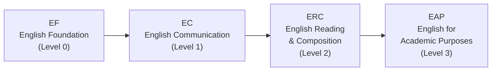

# कोर्स डिजाइन सुझाव

> यो पृष्ठले कोर्स छनोट रणनीति, अंग्रेजी र कोरियाली भाषा track हरू, credit व्यवस्थापन, र सिफारिस गरिएका तालिकाहरूको विस्तृत मार्गदर्शन प्रदान गर्छ। सही कोर्स छनोट गर्नु आधा मात्र काम हो — तपाईंले तालिकामा कसरी मिलाउनुहुन्छ र कति credit लिनुहुन्छ त्यो पनि त्यत्तिकै महत्त्वपूर्ण छ।
> मूल गाइडमा फिर्ता जान: [[ne/hub|वसन्त २०२६ नयाँ विद्यार्थी दर्ता गाइड]]

---

## English Course Track (EPT)

HanST orientation मा, सबै नयाँ विद्यार्थीहरूले **EPT (English Placement Test)** दिन्छन्। तपाईंको नतिजाले तपाईं अंग्रेजी कोर्स अनुक्रमको कुन स्तरमा प्रवेश गर्नुहुन्छ भनेर निर्धारण गर्छ।

यदि तपाईंले EPT मा उच्च स्तरमा उत्तीर्ण हुनुभयो भने, तपाईं तल्लो स्तरहरू छोड्न सक्नुहुन्छ। TOEFL, IELTS, वा TOEIC जस्ता standardized परीक्षामा योग्य score भएमा तपाईं निश्चित स्तरहरूबाट पनि छुट पाउन सक्नुहुन्छ।

**आफ्नो अंग्रेजी कोर्स ढिलो नगर्नुहोस्।** हालका semester हरूमा, प्राध्यापकहरूले क्षमता सीमा कडाइपूर्वक लागू गर्दै आएका छन्। "म अर्को semester मा लिन्छु" भनेर अंग्रेजी कोर्स सार्ने विद्यार्थीहरूले प्रायः सबै सिट भरिसकेको पाउँछन्। आफ्नो तोकिएको अंग्रेजी स्तर **तुरुन्तै पहिलो semester मा** लिनुहोस्। सिट चाँडो भरिन्छ, र पर्खँदा केही फाइदा हुँदैन।

---

## कोरियाली भाषा आवश्यकता

यो आवश्यकता **विदेशी passport भएका विद्यार्थीहरू** साथै **लामो समय विदेशमा बसेका कोरियाली नागरिकहरू** लाई लागू हुन्छ जसलाई कोरियाली-माध्यम कोर्सहरूमा कठिनाइ हुन सक्छ। तपाईंले Practical Korean कोर्स अनुक्रम पूरा गर्नुपर्छ। Orientation मा, तपाईंले कोरियाली भाषा placement test दिनुहुनेछ जसले तपाईंको सुरु स्तर निर्धारण गर्छ।

**एउटा अत्यन्त महत्त्वपूर्ण सुझाव:** उच्च स्तरमा राख्ने प्रयासमा placement test मा अनुमान नलगाउनुहोस्। किन:

- यदि तपाईं **Korean 1** (सबैभन्दा तल्लो स्तर) बाट सुरु गर्नुहुन्छ भने, तपाईंले बलियो आधार बनाउँदै सजिलो, सुरक्षित credit कमाउनुहुन्छ। Coursework व्यवस्थापनयोग्य छ, र तपाईंले आत्मविश्वास बनाउनुहुन्छ।
- यदि तपाईंले अनुमानबाट **Korean 3** मा स्थान पाउनुभयो भने, Korean 1 र Korean 2 ले दिने credit हरू अन्य कोर्सहरूले भर्नुपर्छ। तपाईंलाई वास्तविक क्षमताभन्दा माथिको अझ कठिन कोरियाली coursework को पनि सामना गर्नुपर्छ।

**इमानदारीपूर्वक जवाफ दिनुहोस्।** तल्लो स्तरबाट सुरु गरेर माथि बढ्नु दीर्घकालीन रूपमा आफ्नो वास्तविक दक्षताभन्दा माथिको स्तरमा संघर्ष गर्नुभन्दा धेरै फाइदाजनक छ। यो गर्वको कुरा होइन — यो रणनीतिको कुरा हो।

---

## कोर्स डिजाइन सुझावहरू

### Overload रणनीति: बढी दर्ता गर्नुहोस्, पछि हटाउनुहोस्

तपाईंले **22 credit** सम्म (overload) दर्ता गर्न सक्नुहुन्छ। सुनौलो नियम यो हो: **बढी कोर्सहरू दर्ता गरेर पहिलो हप्तापछि हटाउनु सधैं कम दर्ता गरेर पछि थप्ने प्रयास गर्नुभन्दा राम्रो हो।** लोकप्रिय कोर्सहरूमा adjustment अवधिमा खुला सिट हुँदैन। यदि तपाईं हल्का सुरु गरेर पछि प्रतिस्पर्धी कोर्स थप्ने प्रयास गर्नुहुन्छ भने, तपाईं लगभग निश्चित रूपमा असफल हुनुहुनेछ।

### Credit लक्ष्य

- **स्नातक आवश्यकता**: 8 semester मा 130 credit = लगभग प्रति semester 16.25 credit
- **सिफारिस लक्ष्य**: प्रति semester 17-18 credit ले तपाईंलाई आरामदायक margin दिन्छ
- **छात्रवृत्ति विद्यार्थीहरू**: तपाईंले न्यूनतम **15.5 credit** कायम राख्नुपर्छ। Adjustment अवधिमा कोर्स हटाउँदा यो सीमाभन्दा तल नझर्ने विशेष ध्यान दिनुहोस्।

### कोर्स कोड कसरी पढ्ने

Handong कोर्स कोडको **पहिलो अंक** ले सिफारिस गरिएको वर्ष स्तर जनाउँछ:

- **1**xxx: Freshman-स्तरका कोर्सहरू (तपाईंले लिनुपर्ने)
- **2**xxx: Sophomore-स्तरका कोर्सहरू
- **3**xxx: Junior-स्तरका कोर्सहरू
- **4**xxx: Senior-स्तरका कोर्सहरू

नयाँ विद्यार्थीको रूपमा, **1xxx कोर्सहरूमा ध्यान दिनुहोस्**। 3xxx वा 4xxx code भएका कोर्सहरूमा सामान्यतया prerequisites हुन्छन्, र प्रणालीले दर्ता गर्न दिए पनि, विषयवस्तु तपाईंको तयारीभन्दा धेरै माथि हुनेछ। आधार बिना माथिल्लो स्तरका कोर्सहरू लिने प्रयास साहसी होइन — यो लापरवाह हो।

### आफ्नो दिउँसोको खाना ब्रेक खाली राख्नुहोस्

Periods 4 (12:00-13:00) र 5 (13:00-14:00) ले दिउँसोको खाना समय समेट्छ। यदि तपाईंले यस block मा कक्षा तालिका बनाउनुहुन्छ भने, दिउँसोको खाना छुट्नेछ। एक-दुई पटक सहनयोग्य छ, तर दैनिक गर्दा तपाईंको ऊर्जा र एकाग्रता नष्ट हुनेछ। **लगातार तीनवटाभन्दा बढी कक्षा नराख्नुहोस्।** Session हरू बीचमा सिकेको कुरा प्रशोधन गर्न ब्रेक चाहिन्छ।

### प्राध्यापकहरूबारे seniors लाई सोध्नुहोस्

उही कोर्स फरक प्राध्यापकले पढाउँदा — कार्यभार, परीक्षा कठिनाइ, grading शैली, र पढाउने विधिमा — पूर्णतया फरक अनुभव हुन सक्छ। Course catalog ले यी कुरा बताउँदैन। **आफ्नो 섬김이 (student mentor) र seniors लाई सोध्नुहोस्**: "कसैले यो कोर्स लिएको छ? कस्तो थियो?" यो तपाईंको जानकारीको सबैभन्दा भरपर्दो स्रोत हो।

### प्रत्येक section को शिक्षण भाषा जाँच गर्नुहोस्

अन्तर्राष्ट्रिय विद्यार्थीहरूको लागि यो कुरा जति जोड दिए पनि कम हुन्छ। **एउही प्राध्यापकले एउटा section कोरियालीमा र अर्को अंग्रेजीमा पढाउन सक्छन्।** दर्ता गर्नुअघि प्रत्येक विशिष्ट section को "English %" column सधैं जाँच गर्नुहोस्। अन्तर्राष्ट्रिय विद्यार्थी गल्तिले कोरियाली-माध्यम section मा — वा कोरियाली विद्यार्थी गल्तिले अंग्रेजी section मा — दर्ता हुने कुरा हरेक semester हुन्छ।

---

## सिफारिस गरिएका तालिकाहरू (अन्तर्राष्ट्रिय विद्यार्थी)

तल **100% अंग्रेजी section हरू** बाट मात्र बनाइएका नमूना तालिकाहरू छन्। यी reference उदाहरणहरू हुन् — तपाईंको EPT परिणाम, रुचि, र ऊर्जा स्तर अनुसार मिलाउनुहोस्। सुनौलो नियम सम्झनुहोस्: तपाईंलाई चाहिनेभन्दा बढी कोर्सहरू दर्ता गर्नुहोस् र पहिलो हप्तापछि हटाउनुहोस्।

### Schedule A: Humanities/Social Science Focus (सबै अंग्रेजी)

| Period | Mon | Tue | Wed | Thu | Fri |
|--------|-----|-----|-----|-----|-----|
| 1 | | Bible (07) | | | Bible (07) |
| 2 | | Intl Relations | CharEd* | | Intl Relations |
| 3 | | Psychology | | | Psychology |
| 4 | D&P | | Chapel | D&P | |
| 5 | Python (05) | Python (05) | Chapel | Python (05) | |
| 6 | | | Chapel | | |

> **⚠️ CharEd conflict:** Character Education Sec 01 (Mon 5, English) Python Sec 05 (Mon 5) सँग बाझिन्छ। **समाधान:** CharEd Sec 02-06 (Wed 2, Korean) लिनुहोस्, वा Python लाई Mon 5 बाहेकको section मा सार्नुहोस्।

| Course | Code | Credits | Professor | Note |
|--------|------|---------|-----------|------|
| Understanding the Bible (07) | GEK20058 | 2 | Joshua Kim | Tue 1, Fri 1, 100% English |
| International Relations Intro (01) | ISE10052 | 3 | 정모니카 | Tue 2, Fri 2, 100% English |
| Psychology Intro (02) | CSW10003 | 3 | 지원근 | Tue 3, Fri 3, 100% English |
| Discussion & Presentation (01) | GCS10013 | 3 | Richardson | Mon 4, Thu 4, 100% English |
| Character Education (02-06) | GEK10015 | 1 | Various | **Wed 2, Korean** (Sec 01 Mon 5 conflicts with Python) |
| Python Programming (05) | GCS10004 | 3 | 박지현 | Mon 5, Thu 5, 100% English |
| Chapel 1 | GEK10001 | 0 | — | Wed 4, 5, 6 |
| Community Leadership Training 1 | GEK10008 | 0.5 | TBA | Time TBA |
| Social Service 1 | GEK10046 | 1 | — | Separate schedule |
| + Korean Language Course | — | 3 | TBA | Required for international students |
| **Total** | | **19.5 + Korean (3)** | | |

**यो तालिका किन काम गर्छ:** मंगलबार र शुक्रबारमा तीन लगातार अंग्रेजी कोर्सहरू (Bible, International Relations, Psychology) बौद्धिक रूपमा भारी छन्, जबकि सोमबार र बिहीबार दिउँसोका कोर्सहरू मात्र भएर हल्का छन्। बुधबार Chapel र व्यक्तिगत अध्ययन समयको लागि सुरक्षित छ। तपाईं एकैसाथ दुई पूर्णतया फरक क्षेत्रहरू (International Relations र Psychology) अन्वेषण गर्दै programming सीप र अंग्रेजी academic presentation क्षमता बनाउनुहुन्छ।

**CharEd conflict माथि समाधान गरिएको:** Character Education Sec 01 (Mon 5) Python Sec 05 (Mon 5) सँग बाझिन्छ। यो तालिकाले overlap हटाउन CharEd Sec 02-06 (Wed 2, Korean) प्रयोग गर्छ। यदि तपाईंको कोरियाली पर्याप्त छैन भने, बरु Python लाई Mon 5 बाहेकको section मा सार्नुहोस्।

### Schedule B: STEM Focus (सबै अंग्रेजी)

| Period | Mon | Tue | Wed | Thu | Fri |
|--------|-----|-----|-----|-----|-----|
| 1 | | Bible (07) | | | Bible (07) |
| 2 | | Worldview (02) | | | Worldview (02) |
| 3 | Linear Alg (01) | | | Linear Alg (01) | |
| 4 | Calculus 1 (03) | | Chapel | Calculus 1 (03) | |
| 5 | Python (05) | Python (05) | Chapel | Python (05) | |
| 6 | | | Chapel | | |

> **⚠️ CharEd conflict:** Character Education Sec 01 (Mon 5, English) Python Sec 05 (Mon 5) सँग बाझिन्छ। **समाधान:** CharEd Sec 02-06 (Wed 2, Korean) लिनुहोस्, वा Python लाई Mon 5 बाहेकको section मा सार्नुहोस्।

| Course | Code | Credits | Professor | Note |
|--------|------|---------|-----------|------|
| Understanding the Bible (07) | GEK20058 | 2 | Joshua Kim | Tue 1, Fri 1, 100% English |
| Christian Worldview (02) | GEK20011 | 2 | 최용준 | Tue 2, Fri 2, 100% English |
| Linear Algebra (01) | GEK10082 | 3 | 조장환 | Mon 3, Thu 3, 100% English |
| Calculus 1 (03) | GEK10095 | 3 | 김민재 | Mon 4, Thu 4, 100% English |
| Character Education (02-06) | GEK10015 | 1 | Various | **Wed 2, Korean** (Sec 01 Mon 5 conflicts with Python) |
| Python Programming (05) | GCS10004 | 3 | 박지현 | Mon 5, Thu 5, 100% English |
| Chapel 1 | GEK10001 | 0 | — | Wed 4, 5, 6 |
| Community Leadership Training 1 | GEK10008 | 0.5 | TBA | Time TBA |
| Social Service 1 | GEK10046 | 1 | — | Separate schedule |
| + Korean Language Course | — | 3 | TBA | Required for international students |
| **Total** | | **18.5 + Korean (3)** | | |

**यो तालिका किन काम गर्छ:** Calculus 1 र Linear Algebra एकैसाथ लिँदा शक्तिशाली तालमेल सिर्जना हुन्छ — Linear Algebra बाट vector र matrix अवधारणाहरू Calculus मा भेट्ने multivariable विचारहरूसँग प्रत्यक्ष जोडिन्छन्। Python ले तपाईंको programming आधार प्रदान गर्छ। मंगलबार र शुक्रबार हल्का दिनहरू हुन् (Bible + Worldview मात्र), तपाईंलाई mathematics problem sets मा काम गर्ने समय दिन्छ।

**CharEd conflict माथि समाधान गरिएको:** Character Education Sec 01 (Mon 5) Python Sec 05 (Mon 5) सँग बाझिन्छ। यो तालिकाले overlap हटाउन CharEd Sec 02-06 (Wed 2, Korean) प्रयोग गर्छ। यदि तपाईंको कोरियाली पर्याप्त छैन भने, बरु Python लाई Mon 5 बाहेकको section मा सार्नुहोस्।

---

*Last updated: 2026-02-21*
