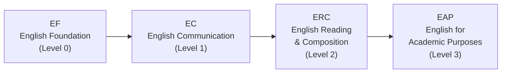
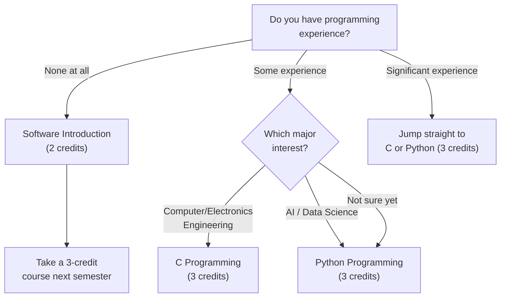

# Обязательные курсы для первокурсников

Независимо от предполагаемой специальности — STEM или гуманитарные науки — и независимо от гражданства, **каждый первокурсник обязан пройти** следующие курсы. Сначала выстрой расписание вокруг них, а уже потом заполняй остальное.

---

## Chapel 1 (0 кредитов, каждый семестр)

Chapel не даёт кредитов, но **обязателен каждый семестр**. Тебе нужно пройти Chapel 1 — Chapel 6 за шесть семестров: без этого диплом не получить.

Самая распространённая ошибка первокурсников: многие думают, что достаточно просто ходить на Chapel, не регистрируясь. **Нет — нужно зарегистрироваться на Chapel в системе регистрации курсов.** Каждый год находятся студенты, которые исправно посещали Chapel весь семестр, а в конце обнаруживали, что никогда не регистрировались — и их посещаемость не засчиталась. Исправить это крайне сложно.

Посещение Chapel фиксируется через **QR-коды**. Приходи вовремя и сканируй код. Если пропустишь сканирование, задним числом это практически не исправить. Не опаздывай.

> **Spring 2026:** Chapel 1 (GEK10001), Section 01 — Wed periods 4, 5, 6 (Hyoam Main Building) / Language: Korean (0% English)

---

## Community Leadership Training 1 (0.5 кредита, каждый семестр)

Как и Chapel, этот курс обязателен каждый семестр. Он посвящён лидерству и командной работе в жилом сообществе. **Та же ловушка с регистрацией актуальна и здесь** — студенты участвуют в еженедельных командных встречах весь семестр, так и не зарегистрировавшись в системе. Не повторяй эту ошибку.

> **Spring 2026:** Community Leadership Training 1 (GEK10008), Section 01 — Time TBA (announced later)

---

## Handong Character Education (1 кредит, однократное требование)

Это ключевой курс по философии воспитания характера в Handong. Доступно несколько секций. **Section 01 ведётся полностью на английском** — идеальный вариант для иностранных студентов.

> **Spring 2026 Sections:**

| Section | Professor | Time | English % | Note |
|---------|-----------|------|-----------|------|
| **01** | **Shushan Marie Richardson** | **Mon 5** | **100%** | **Recommended for international students** |
| 02 | 이상산 | Wed 2 | 0% | Korean |
| 03 | 최희열 | Wed 2 | 0% | Korean |
| 04 | 손화철 | Wed 2 | 0% | Korean |
| 05 | 최혜봉 | Wed 2 | 0% | Korean |
| 06 | 윤상헌 | Wed 2 | 0% | Korean |

Секции 02–06 проходят в среду во 2-й час, разница — только в преподавателе. Если ты хорошо владеешь корейским, спроси у своего섬김이 (студента-наставника) про стиль каждого преподавателя — это поможет сделать выбор.

---

## Christian Faith Foundation (CF1) — 2 кредита

Нужно пройти один курс из этой категории: Understanding the Bible, Bible and Life или Bible and Spiritual Growth. Они считаются эквивалентными, достаточно одного.

### Understanding the Bible (GEK20058) — 15 секций

Это самый массово предлагаемый курс: 15 секций, вписать в расписание легко.

| Section | Professor | Time | English % | Note |
|---------|-----------|------|-----------|------|
| 01 | 김완진 | Mon 2, Thu 2 | 0% | |
| 02 | 김완진 | Mon 3, Thu 3 | 0% | |
| 03 | 김완진 | Mon 4, Thu 4 | 0% | |
| 04 | 이재현 | Tue 2, Fri 2 | 0% | |
| 05 | 이재현 | Tue 3, Fri 3 | 0% | |
| 06 | 이재현 | Tue 5, Fri 5 | 0% | |
| **07** | **Joshua Kim** | **Tue 1, Fri 1** | **100%** | **English section** |
| 08 | Joshua Kim | Tue 2, Fri 2 | 0% | |
| 09 | Joshua Kim | Tue 3, Fri 3 | 0% | |
| 10 | 최성호 | Tue 2, Fri 2 | 0% | |
| **11** | **최성호** | **Tue 3, Fri 3** | **100%** | **English section** |
| **12** | **최성호** | **Tue 5, Fri 5** | **100%** | **English section** |
| 13 | 한은선 | Mon 1, Thu 1 | 0% | |
| 14 | 한은선 | Mon 2, Thu 2 | 0% | |
| 15 | 한은선 | Mon 3, Thu 3 | 0% | |

**Для иностранных студентов**: выбирай Section 07 (Joshua Kim, 100% English), Section 11 или Section 12 (최성호, 100% English). Имей в виду, что англоязычные секции популярны и могут быстро заполниться во время предварительной регистрации — всегда держи запасной вариант.

### Understanding Christianity (GEK20059)

| Section | Professor | Time | English % | Note |
|---------|-----------|------|-----------|------|
| **01** | **Gregory T. Brown** | **Mon 2, Thu 2** | **100%** | **English** |
| **02** | **Gregory T. Brown** | **Mon 3, Thu 3** | **100%** | **English** |

Обе секции полностью на английском — хорошая альтернатива, если англоязычные секции Understanding the Bible уже заняты.

---

## Worldview — 2 кредита

Нужно пройти один курс из этой категории: Creation and Evolution, Christians and Mission или Christian Worldview. В каждом есть как корейские, так и английские секции.

| Course | Section | Professor | Time | English % |
|--------|---------|-----------|------|-----------|
| Creation and Evolution (GEK10011) | 01 | 김광 et al. | Wed 2, 3 | 0% |
| **Creation and Evolution (GEK10011)** | **02** | **Holzapfel Wilhelm et al.** | **Wed 2, 3** | **100%** |
| Christians and Mission (GEK20069) | 01 | 조혜신 et al. | Mon 6, 7 | 0% |
| **Christians and Mission (GEK20069)** | **02** | **진기영** | **Wed 2, 3** | **100%** |
| Christian Worldview (GEK20011) | 01 | 최용준 | Mon 3, Thu 3 | 0% |
| **Christian Worldview (GEK20011)** | **02** | **최용준** | **Tue 2, Fri 2** | **100%** |

**Следи за пересечениями:** несколько курсов сгруппированы в слоте Wed 2-3. Если ты берёшь Character Education секции 02–06 (Wed 2), ты не сможешь одновременно взять курс Worldview на Wed 2-3. Планируй заранее.

---

## Social Service (1 кредит × 2 курса всего)

До выпуска нужно пройти два курса Social Service (из Social Service 1–4). Рекомендуется брать по одному в семестр.

> **Spring 2026:** Social Service 1 (GEK10046) Section 01, Social Service 2 (GEK20046) Section 01 — No fixed class time (practice-based)

---

## Курсы английского языка (EPT)

Во время ориентации HanST все первокурсники сдают **EPT (English Placement Test)**. Результат определяет, на какой уровень английского ты попадаешь.

Если ты сдал EPT на более высокий уровень, нижние можно пропустить. Также возможно освобождение при наличии достаточных баллов по TOEFL, IELTS или TOEIC.

**Не откладывай курсы английского.** В последние семестры преподаватели строго соблюдают ограничения по вместимости. Студенты, которые думают «возьму в следующем семестре», нередко обнаруживают, что все места уже заняты. Бери назначенный уровень **в первом же семестре**. Места заполняются быстро, а ожидание ничего не даёт.

---

## Требования по корейскому языку

Это требование касается **студентов с иностранным паспортом**, а также **граждан Кореи, долго проживавших за рубежом** и испытывающих трудности с обучением на корейском. Нужно пройти курс Practical Korean. Во время ориентации ты сдашь тест на определение уровня.

**Важный совет:** не угадывай ответы на тесте, чтобы попасть на уровень выше. Вот почему:

- Если начнёшь с **Korean 1** (самый низкий уровень), получишь лёгкие, надёжные кредиты и выстроишь прочную базу. Нагрузка управляема, ты обретаешь уверенность.
- Если угадаешь ответы и попадёшь на **Korean 3**, придётся восполнять кредиты Korean 1 и Korean 2 другими курсами. Плюс программа окажется сложнее твоих реальных возможностей.

**Отвечай честно.** Начать с нижнего уровня и планомерно двигаться выше — гораздо выгоднее в долгосрочной перспективе, чем мучиться на уровне, который тебе не по силам. Это не вопрос гордости — это вопрос стратегии.

---

## Требования ICT (7 кредитов для ВСЕХ студентов)

Каждый студент Handong, независимо от специальности, должен пройти **7 кредитов курсов ICT Convergence**: 5 кредитов программирования + 2 кредита прикладного ICT. Это не факультатив — требование в равной мере распространяется на студентов гуманитарных и социальных наук.

### Рекомендуемые курсы ICT на английском для иностранных студентов

| Course | Code | Credits | Section | Professor | Time | English % |
|--------|------|---------|---------|-----------|------|-----------|
| **Python Programming** | GCS10004 | 3 | **05** | 박지현 | Mon 5, Thu 5 | **100%** |
| **Frontend Introduction** | GCS10081 | 3 | **04** | 박지현 | Tue 6, Fri 6 | **100%** |

**Полезная информация:** OIA (Office of International Admissions) иногда резервирует места на курсах программирования специально для иностранных первокурсников. Если ты иностранный студент, уточни это в OIA — может избавить от борьбы за место в день регистрации.

### Выбор пути: C, Python или Software Introduction?

Если у тебя нет опыта программирования и это пугает, Software Introduction (GCS10001, 2 кредита) — мягкий старт. Но если ты серьёзно рассматриваешь любую STEM-специальность, брось себе вызов и возьми Python или C сразу. Сэкономишь целый семестр.

---

*Last updated: 2026-02-21*
