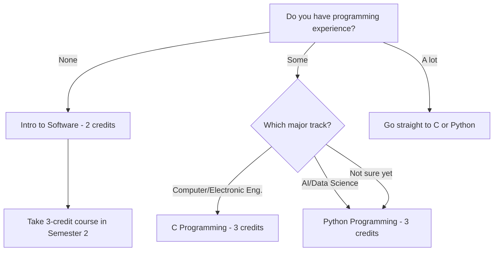
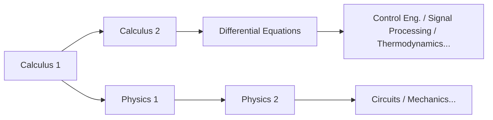

# Руководство по курсам STEM для первокурсников

> Стратегия выбора курсов для первокурсников, интересующихся инженерией, информатикой, ИИ и естественными науками
> Основное руководство: [[Spring 2026 Freshman Registration Guide]]

---

## 🎯 1. Для кого это руководство?

Это руководство написано для **первокурсников набора 2026 года**, рассматривающих следующие специальности:

- **AI & Computer Engineering**: Программная инженерия, Искусственный интеллект, Data Science, Кибербезопасность
- **Computer & Electronic Engineering**: Компьютерная инженерия, Электронная инженерия, Встраиваемые системы
- **Mechanical & Control Engineering**: Машиностроение, Робототехника, Системы управления
- **Spatial Environment & Systems Engineering**: Строительство, Экология, Градостроительство
- **Life Sciences**: Биология, Биотехнология, Биоинженерия

Даже если вы думаете «я ещё не знаю точную специальность, но точно STEM» — это руководство для вас. В Handong специальность не заявляется на первом курсе. Поэтому ключевая стратегия — **заполнить первый год фундаментальными курсами, которые пригодятся независимо от выбранной STEM-специальности.**

### 💡 Почему фундамент первого года так важен

Курсы STEM выстроены как **лестница**. Дифференциальные уравнения без математического анализа — невозможно. Теорию управления без дифуравнений — невозможно. Лекцию по машинному обучению с матричными операциями без линейной алгебры — непонятно. Законы Кирхгофа в теории цепей без физики — непонятно.

Иными словами, если пропустить математические и естественнонаучные основы на 1-м курсе, профильные курсы **рухнут как домино** начиная со 2-го. В STEM «сделаю позже» — это просто другой способ сказать «помучаюсь позже».

### 🏷️ Как читать коды курсов — не пропускайте

В коде курса Handong есть скрытая, но важная информация. Например, `GCS10058`:

- **GCS**: код факультета/области (GCS = Global Creative Software)
- **1**0058: первая цифра — это **год обучения**

Почему важно? **Курсы с 1 — для первокурсников; с 3 или 4 — для старшекурсников.** Некоторые первокурсники проявляют амбиции и пытаются взять курсы 3xxx или 4xxx — это как строить дом без фундамента. Даже если система регистрации не блокирует вас, **на первом курсе держитесь курсов 1xxx.**

Также рискованно брать продвинутые профильные курсы до того, как вы заявили специальность. Гораздо мудрее сначала набрать **универсально применимые курсы** — Calculus, Physics, Programming, Linear Algebra.

---

## 📚 2. Курсы, которые нужно пройти на 1-м курсе

### 🔢 2.1 Calculus 1 — Отправная точка всего STEM

Математический анализ — **общий язык** почти каждой дисциплины: инженерии, физики, информатики, даже экономики. Дифференцирование работает со «скоростями изменения», интегрирование — с «накопленными величинами»: без этих двух концепций ни один продвинутый STEM-курс недоступен.

Представьте матанализ как **алфавит** иностранного языка. Без алфавита нельзя читать слова, без слов — понимать предложения. Неважно, насколько хорошо вы разбирались в математике в школе — университетский матанализ — принципиально другой уровень глубины. Вы будете отрабатывать строгое математическое мышление, начиная с эпсилон-дельта определения.

**Идеальный маршрут**: Семестр 1 Calculus 1 → Семестр 2 Calculus 2 → Семестр 3 Differential Equations. Если эта цепочка сдвинется хоть на один семестр, доступ к профильным курсам задержится.

> **2026 Spring — Calculus 1 (GEK10095) Sections:**

| Section | Professor | Time | English % | Notes |
|---------|-----------|------|-----------|-------|
| 01 | Lee Hanjin | Mon P4, Thu P4 | 0% | Korean instruction |
| 02 | Lee Hanjin | Mon P6, Thu P6 | 0% | Korean instruction, later time slot |
| **03** | **Kim Minjae** | **Mon P4, Thu P4** | **100%** | **English instruction** |
| **04** | **Cho Janghwan** | **Mon P1, Thu P1** | **100%** | **English instruction, Period 1** |

*Система часов: P1 = 9:00–10:00, P2 = 10:00–11:00, P3 = 11:00–12:00, P4 = 12:00–13:00, P5 = 13:00–14:00, P6 = 14:00–15:00, P7 = 15:00–16:00*

**Как выбрать секцию:**

- **Если хорошо владеете корейским**: Section 01 (Lee Hanjin, Mon P4 / Thu P4) или Section 02 (Lee Hanjin, Mon P6 / Thu P6). Тот же преподаватель, разные временные слоты.
- **Если нужно преподавание на английском**: **Section 03 (Kim Minjae) или Section 04 (Cho Janghwan)**. Однако Section 04 — **Period 1 (9:00)**. В первом семестре, пока вы ещё адаптируетесь, лучше избегать Period 1, если есть выбор. Если это единственный вариант для обязательного курса — берите. Но когда есть альтернативы, предпочтительнее Period 2 и позже.

> **⚠️ Ловушка «английской лекции»**: Даже у одного и того же преподавателя разные секции могут вестись на разных языках. Всегда проверяйте язык лекции для каждой секции. Попасть на корейскую секцию при слабом корейском — значит бороться одновременно и с математикой, и с языковым барьером. Проверяйте перед регистрацией.

### 🔢 2.2 Calculus 2 — Берите в семестре 1, если можете

Обычно Calculus 2 проходят на 2-м семестре, но если у вас сильная база по матанализу из школы, можно взять Calculus 1 и 2 одновременно в 1-м семестре. Это позволит пройти Differential Equations уже на 2-м семестре, ускорив доступ к профильным курсам на целый семестр.

Однако это **рекомендуется только если вы действительно уверены в своих математических навыках**. Лучше отлично пройти один курс, чем надорваться и потерять оба.

> **2026 Spring — Calculus 2 (GEK10096) Sections:**

| Section | Professor | Time | English % | Notes |
|---------|-----------|------|-----------|-------|
| **01** | **Lee Hanjin** | **Mon P2, Thu P2** | **100%** | **English instruction** |
| 02 | Kim Taehee | Mon P1, Thu P1 | 0% | Period 1 |
| 03 | Kim Taehee | Mon P2, Thu P2 | 0% | Korean instruction |

### ⚛️ 2.3 Physics — Язык инженеров

Если вы движетесь к инженерным направлениям (Computer & Electronic, Mechanical & Control, Spatial Environment), физика — **не факультатив, а обязательный курс**. Physics 1 охватывает механику и термодинамику, обучая работать с силами, энергией и импульсом с математической строгостью. Он переходит в Physics 2 (электромагнетизм) на 2-м семестре — прямой фундамент для электронной инженерии.

Представьте физику как **язык программирования природы**. Чтобы что-то проектировать как инженер, нужно понимать законы природы — а эти законы и есть физика.

> **2026 Spring — Physics 1 (GEK10055):**

| Section | Professor | Time | English % |
|---------|-----------|------|-----------|
| 01 | Cho Hyunji | Mon P2, Thu P2 | 0% |
| 02 | Cho Hyunji | Mon P3, Thu P3 | 0% |

**Physics 1 vs. Introduction to Physics**: Если вы рассматриваете информатику или ИИ, можно заменить на "Introduction to Physics" (물리학 개론). Он охватывает более широкий спектр, чем Physics 1, но с меньшей глубиной — достаточной для формирования инженерной интуиции. Если же вы серьёзно рассматриваете электронную или механическую инженерию, где физика глубоко переплетена со специальностью, **берите Physics 1 без раздумий.**

> **Introduction to Physics (GEK10090) — Alternative to Physics 1:**

| Section | Professor | Time | English % |
|---------|-----------|------|-----------|
| 01 | Cho Hyunji | Tue P2, Fri P2 | 0% |
| 02 | Cho Hyunji | Tue P3, Fri P3 | 0% |

### 📊 2.4 Linear Algebra — Математика эпохи ИИ

Линейная алгебра — один из **двух великих столпов** математики STEM наряду с матанализом. Векторы, матрицы, собственные значения и линейные преобразования — это **математическое сердце** ИИ и машинного обучения.

Почему? В машинном обучении данные представлены в виде матриц, а обучение моделей реализуется через матричные операции. Даже обратное распространение ошибки в глубоком обучении — по сути матричное дифференцирование. Без линейной алгебры в курсах по ИИ вы не поймёте *почему* всё работает именно так — будете просто копировать код без понимания.

Настоятельно рекомендую брать её одновременно с Calculus 1 в 1-м семестре. Будет непросто, но завершение обоих в первом семестре **взрывным образом расширит** ваши возможности начиная со 2-го.

> **2026 Spring — Linear Algebra (GEK10082):**

| Section | Professor | Time | English % | Notes |
|---------|-----------|------|-----------|-------|
| **01** | **Cho Janghwan** | **Mon P3, Thu P3** | **100%** | **English instruction** |
| **02** | **Cho Janghwan** | **Mon P5, Thu P5** | **100%** | **English instruction** |
| 03 | Kim Hyunsu | Tue P2, Fri P2 | 0% | Korean instruction |
| 04 | Kim Hyunsu | Tue P3, Fri P3 | 0% | Korean instruction |

### 💻 2.5 ICT Programming — Первый шаг в программировании

В Handong все студенты должны пройти **7 кредитов ICT Convergence Fundamentals**: 5 кредитов программирования + 2 кредита прикладного ICT. Для студентов STEM программирование — не просто общеобразовательное требование, а **инструмент вашей специальности.**

**Почему нужно завершить программирование на 1-м курсе**: начиная со 2-го курса, задания из профильных курсов посыплются одно за другим. Если к тому времени вы всё ещё проходите базовый курс программирования, потери времени будут огромными. В идеале возьмите 3-кредитный курс (Python/C) в 1-м семестре и завершите остальное на 2-м.

> **💡 OIA (Office of International Admissions) — зарезервированные места**: На курсах программирования иногда есть **места, специально зарезервированные OIA для поступающих иностранных студентов.** Если вы иностранный студент, обязательно уточните это — шансы попасть на популярные секции существенно возрастут.

#### 🌳 Выбор пути: с чего начать



#### 💡 C vs. Python: что первым?

Если вы рассматриваете Computer Engineering или Electronic Engineering, **C — подавляющее преимущество**. C — фундамент операционных систем, встраиваемых систем и управления аппаратурой, основа низкоуровневого программирования. Освоив C, Python можно выучить примерно за неделю. В обратную сторону — если знаете только Python, столкнётесь с огромной стеной при работе с управлением памятью и указателями при изучении C.

Если ваш путь — ИИ или Data Science, начать с Python совершенно нормально. Это самый широко используемый язык на практике, а низкий порог входа позволяет быстро ощутить удовольствие от программирования.

> **Intro to Software (GCS10001) — 2 credits, для полных новичков:**

| Section | Professor | Time | English % |
|---------|-----------|------|-----------|
| 01 | Kim Heonju | Mon P1, Thu P1 | 0% |
| 02 | Lee Sanghun | Mon P5, Thu P5 | 0% |
| 03 | Lee Sanghun | Mon P6, Thu P6 | 0% |
| 04 | Kim Hyunsuk | Tue P2, Fri P2 | 0% |
| 05 | Kim Hyunsuk | Tue P4, Fri P4 | 0% |
| 06 | Kim Hyunsuk | Tue P6, Fri P6 | 0% |

> **C Programming (GCS10058) — 3 credits, для Computer/Electronic Eng. трека:**

| Section | Professor | Time | English % |
|---------|-----------|------|-----------|
| 01 | Kim Kwang | Tue P2, Fri P2 | 0% |

⚠️ C Programming предлагается **только в 1 секции**. Конкуренция может быть жёсткой — регистрируйтесь быстро.

> **Python Programming (GCS10004) — 3 credits, для AI/Data Science трека:**

| Section | Professor | Time | English % |
|---------|-----------|------|-----------|
| 01 | Kim Kyungmi | Mon P2, Thu P2 | 0% |
| 02 | Kim Kyungmi | Tue P2, Fri P2 | 0% |
| 03 | Kim Kyungmi | Tue P3, Fri P3 | 0% |
| 04 | Park Jihyun | Mon P3, Thu P3 | 0% |
| **05** | **Park Jihyun** | **Mon P5, Thu P5** | **100%** |
| 06 | Yong Hwangi | Tue P3, Fri P3 | 0% |

> **Intro to Frontend (GCS10081) — 3 credits, для интересующихся веб-разработкой:**

| Section | Professor | Time | English % |
|---------|-----------|------|-----------|
| 01 | Kim Guno | Mon P2, Thu P2 | 0% |
| 02 | Kim Guno | Mon P3, Thu P3 | 0% |
| 03 | Park Jihyun | Tue P5, Fri P5 | 0% |
| **04** | **Park Jihyun** | **Tue P6, Fri P6** | **100%** |
| 05 | Yang Jihye | Mon P3, Thu P3 | 0% |
| 06 | Yang Jihye | Mon P4, Thu P4 | 0% |

Intro to Frontend охватывает основы веб-разработки: HTML, CSS, JavaScript. Может засчитываться как 2-кредитное прикладное ICT требование или как 3-кредитный курс программирования. Стоит рассмотреть, если интересует веб-разработка.

### 🧪 2.6 General Chemistry — Обязателен для Life Sciences и химических направлений

Если вы рассматриваете Life Sciences или связанные с химией специальности, General Chemistry необходим. Он охватывает строение атома, химическую связь, кинетику реакций и другие основы химии, а также является пререквизитом для биохимии и органической химии.

> **2026 Spring — General Chemistry (GEK10058):**

| Section | Professor | Time | English % | Notes |
|---------|-----------|------|-----------|-------|
| 01 | Kim Minkyung | Thu P3, P4 (consecutive) | 0% | 2 consecutive hours on Thursday |
| **02** | **Yu Taejun** | **Mon P2, Thu P2** | **100%** | **English instruction** |

### 🧬 2.7 General Biology — Честный разговор о конкуренции

General Biology нужен для поступления на специальность Life Sciences, но есть одна **честная реальность**, которую нужно услышать.

**⚠️ Конкуренция за General Biology крайне высока.** Секций мало, и пересдающие студенты со старшекурсниками часто занимают места первыми — **первокурснику попасть на 1-м семестре очень трудно.** Вместо того чтобы упрямо настаивать «Я ОБЯЗАН взять его в 1-м семестре» и пропустить окно регистрации на другие важные курсы, **гораздо мудрее** быть гибким: возьмите, если место освободится, и перенесите на 2-й семестр, если нет.

В 1-м семестре обеспечьте себе места на Calculus, Linear Algebra и Programming — **курсах, полезных в любом случае** — вместо того чтобы ставить всё на General Biology. Он предлагается и на 2-м семестре.

> **2026 Spring — General Biology (GEK10057):**

| Section | Professor | Time | English % |
|---------|-----------|------|-----------|
| 01 | Hyun Changgi et al. | Mon P5, Thu P5 | 0% |
| **02** | **Holzapfel Wilhelm et al.** | **Mon P2, Thu P2** | **100%** |
| 03 | Hyun Changgi et al. | Mon P6, Thu P6 | 0% |

### 🤖 2.8 Introduction to AI, Computer & Electronic Engineering — Знакомство со специальностью

Если вас интересуют факультеты AI & Computer Engineering или Computer & Electronic Engineering, этот вводный курс даёт общую картину области. Отличный способ понять «моё это или нет» до перехода к полноценным профильным курсам.

> **2026 Spring — Intro to AI, Computer & Electronic Eng. (ECE10006):**

| Section | Professor | Time | English % | Notes |
|---------|-----------|------|-----------|-------|
| 01 | Hwang Sungsu et al. | Mon P6, P7 (consecutive) | 0% | Monday late time slot |

### 📐 2.9 Differential Equations and Applications — Если математика сильна

Если вы уже прошли Calculus 1 и 2 или завершили AP Calculus BC в школе, взять Differential Equations в 1-м семестре возможно. Однако это **рекомендуется только при действительно прочной математической базе.**

> **2026 Spring — Differential Equations and Applications (GEK10053):**

| Section | Professor | Time | English % |
|---------|-----------|------|-----------|
| 01 | Kim Taehee | Mon P3, Thu P3 | 0% |

---

## 🗓️ 3. Рекомендуемые расписания

Ниже — **примеры расписаний** из реальных курсов весны 2026. Это ориентировочные варианты — корректируйте под результаты EPT, интересы и уровень выносливости.

**Главный принцип: лучше зарегистрироваться на больше курсов и убрать часть, чем взять мало и пожалеть.** Берите с запасом, посетите занятия первой недели и уберите то, что не потянете. Добавить популярный курс в период корректировки — практически невозможно, свободных мест почти не бывает.

### 📋 Schedule A: Computer Science / AI Track

**Стратегия**: Calculus + Linear Algebra + Python — одновременное построение математической и программистской базы

```
Period │  Mon              │  Tue              │  Wed     │  Thu              │  Fri
──────┼───────────────────┼───────────────────┼──────────┼───────────────────┼───────────────────
  1   │                   │                   │          │                   │
  2   │                   │ Python(Sec.02)    │          │                   │ Python(Sec.02)
  3   │ Linear Alg(Sec.01)│                   │          │ Linear Alg(Sec.01)│
  4   │ Calc 1(Sec.01)    │                   │  Chapel  │ Calc 1(Sec.01)    │
  5   │                   │                   │  Chapel  │                   │
  6   │                   │                   │  Chapel  │                   │
```

| Course | Code | Credits | Professor | Notes |
|--------|------|---------|-----------|-------|
| Calculus 1 (Sec. 01) | GEK10095 | 3 | Lee Hanjin | Korean |
| Linear Algebra (Sec. 01) | GEK10082 | 3 | Cho Janghwan | **English 100%** |
| Python Programming (Sec. 02) | GCS10004 | 3 | Kim Kyungmi | Korean |
| Understanding the Bible | GEK20058 | 2 | Choose section | |
| Handong Character Education | GEK10015 | 1 | Choose section | |
| Chapel 1 | GEK10001 | 0 | Wed P4,5,6 | |
| Community Leadership Training 1 | GEK10008 | 0.5 | Separate schedule | |
| Social Service 1 | GEK10046 | 1 | Separate | |
| + English (per EPT result) | - | 3 | TBD | Likely placed on Tue/Fri |
| **Total** | | **16.5 + English 3** | | |

> **Почему именно эта комбинация?** Одновременное изучение Calculus и Linear Algebra создаёт математическую синергию. Матричные и векторные концепции напрямую связаны с многомерными функциями в матанализе. Python размещён на вт/пт для баланса: пн/чт — математика, вт/пт — программирование + английский. Когда этот ритм устоится, выработать учебные привычки станет куда легче.

### 📋 Schedule B: Electronic / Mechanical Engineering Track

**Стратегия**: Calculus + Physics + C Programming — железный инженерный фундамент

```
Period │  Mon              │  Tue              │  Wed     │  Thu              │  Fri
──────┼───────────────────┼───────────────────┼──────────┼───────────────────┼───────────────────
  1   │                   │                   │          │                   │
  2   │ Physics 1(Sec.01) │ C Prog.(Sec.01)   │          │ Physics 1(Sec.01) │ C Prog.(Sec.01)
  3   │                   │                   │          │                   │
  4   │ Calc 1(Sec.01)    │                   │  Chapel  │ Calc 1(Sec.01)    │
  5   │                   │                   │  Chapel  │                   │
  6   │                   │                   │  Chapel  │                   │
```

| Course | Code | Credits | Professor | Notes |
|--------|------|---------|-----------|-------|
| Calculus 1 (Sec. 01) | GEK10095 | 3 | Lee Hanjin | Korean |
| Physics 1 (Sec. 01) | GEK10055 | 3 | Cho Hyunji | Korean |
| C Programming (Sec. 01) | GCS10058 | 3 | Kim Kwang | Korean, only section available |
| Understanding the Bible | GEK20058 | 2 | Choose section | |
| Handong Character Education | GEK10015 | 1 | Choose section | |
| Chapel 1 | GEK10001 | 0 | Wed P4,5,6 | |
| Community Leadership Training 1 | GEK10008 | 0.5 | Separate schedule | |
| Social Service 1 | GEK10046 | 1 | Separate | |
| + English (per EPT result) | - | 3 | TBD | Likely placed on Tue/Fri |
| **Total** | | **16.5 + English 3** | | |

> **Почему именно эта комбинация?** Электронная и механическая инженерия строятся на фундаменте физики. Одновременное изучение Calculus + Physics означает, что концепции дифференцирования из матанализа сразу применяются к задачам скорости и ускорения в физике — мощный **эффект взаимного усиления**. C Programming — фундамент встраиваемых систем и управления аппаратурой, идеальный выбор для тех, кто движется к электронной/механической инженерии.

---

## ⚠️ 4. Распространённые ошибки студентов STEM

### ❌ Ошибка 1: «Математику возьму потом»

Это **самая фатальная ошибка**. Структура курсов в STEM — как домино:



Отложили Calculus 1 на 2-й семестр → Calculus 2 сдвигается на 3-й → Differential Equations на 4-й → Основные профильные курсы доступны только с 5-го семестра. Это может задержать выпуск на целый год. **Начинайте математику с 1-го семестра, без исключений.**

### ❌ Ошибка 2: «Я никогда не программировал, возьму просто Intro to Software»

Intro to Software — 2-кредитный обзорный курс. Если вы серьёзно рассматриваете информатику или ИИ, пропустите его и идите сразу на Python или C. Да, будет сложнее — но избегать трудностей значит избегать роста. Возьмёте Intro to Software в 1-м семестре, Python во 2-м — потратите целый год только на основы.

### ❌ Ошибка 3: Ставка всего на General Biology

Как уже говорилось, попасть на General Biology первокурснику в 1-м семестре **крайне сложно** — пересдающие и старшекурсники занимают места первыми. Каждый семестр есть студенты, которые так зациклены на General Biology, что пропускают окно регистрации на Calculus или Programming. Оставайтесь гибкими.

### ❌ Ошибка 4: Продвинутые профильные курсы до выбора специальности

«Мне интересен ИИ, может, попробую Machine Learning» — опасное мышление. Продвинутые курсы (коды 3xxx, 4xxx) имеют смысл **только после закладки фундамента.** Возьмёте Machine Learning без Linear Algebra — не поймёте половину лекции.

На 1-м курсе сосредоточьтесь на **фундаментальных курсах, применимых к любой специальности** (Calculus, Physics, Linear Algebra, Programming). Профильные курсы со 2-го курса — это совершенно нормально.

### ❌ Ошибка 5: Непроверка языка лекции

Даже у одного и того же курса и одного и того же преподавателя **язык лекции может различаться по секциям.** Например, Calculus 1 профессора Cho Janghwan — 100% English, тогда как секции профессора Lee Hanjin — на корейском. Всегда проверяйте язык секции перед регистрацией. При слабом корейском попасть на корейскую секцию — двойная нагрузка: и предмет, и язык.

### ❌ Ошибка 6: Слишком мало кредитов

«Боюсь не потянуть, возьму только 15 кредитов» — эта стратегия на самом деле вредит вам. **Зарегистрироваться на больше и убрать лишнее — гораздо проще, чем взять мало и пытаться добавить.** Получить свободное место на популярном курсе в период корректировки — практически чудо. Начните с 18–20 кредитов, посетите занятия первой недели и уберите то, что не потянете. Вот это — мудрый подход.

---

## 🔭 5. Взгляд на 2-й семестр

Если успешно завершите указанные курсы в 1-м семестре, вот что стоит рассмотреть на 2-м:

| Course | Target | Why It Matters |
|--------|--------|----------------|
| **Calculus 2** | All STEM | Продолжение Calculus 1. Охватывает ряды, многомерный анализ, является пререквизитом для Differential Equations |
| **Physics 2** | Electronic/Mechanical tracks | Охватывает электромагнетизм — прямой фундамент электронной инженерии |
| **Data Structures** | Computer Science/AI tracks | Массивы, списки, деревья, графы — ключевые концепции программирования и вечные фавориты на собеседованиях |
| **General Chemistry** | Life Sciences/Chemistry | Если не удалось взять в 1-м семестре, обязательно — во 2-м |
| **General Biology** | Life Sciences | Если не досталось место в 1-м семестре, попробуйте снова во 2-м |
| **Differential Equations** | Calc 1 & 2 completers | Основной математический инструмент для инженерных специальностей |

Ключ ко 2-му семестру — **надстроить ещё один слой поверх фундамента, заложенного в 1-м.** Хорошо прошли Calculus 1 — естественно переходите к Calculus 2. Завершили основы программирования — двигайтесь к Data Structures. Поддерживать этот поток — вот что определяет траекторию всех четырёх лет.

---

*Это руководство — подробный документ по STEM из [[Spring 2026 Freshman Registration Guide]].*
*Корейская версия: [[이공계 신입생 가이드]].*
*См. также: [[Registration Schedule]]*
*Last updated: 2026-02-21*
