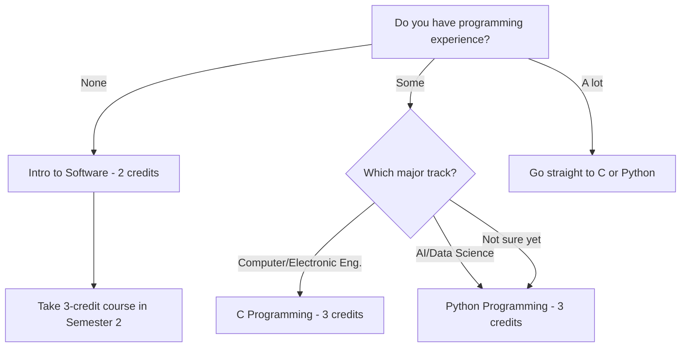
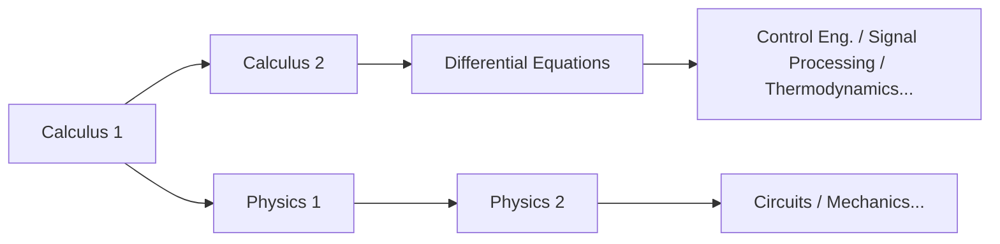

# 理工科新生选课指南

> 面向有志于工程、计算机科学、AI和自然科学方向新生的选课策略
> 主指南：[[Spring 2026 Freshman Registration Guide]]

---

## 🎯 1. 本指南适用于谁？

本指南专为考虑以下专业的 **2026届新生** 编写：

- **AI与计算机工程**：软件、人工智能、数据科学、网络安全
- **计算机与电子工程**：计算机工程、电子工程、嵌入式系统
- **机械与控制工程**：机械工程、机器人、控制系统
- **空间环境与系统工程**：建筑、环境、城市工程
- **生命科学**：生物学、生物技术、生物工程

就算你现在的想法是"我还不确定具体专业，但大方向是理工科"——这份指南同样适合你。在 Handong，大一不需要确定专业。这也意味着核心策略是：**用基础课程填满你的大一，无论你最终选择哪个理工方向，这些课程都能用得上。**

### 💡 为什么大一的基础这么重要

理工科的课程结构就像一座**阶梯**。你没学微积分就没法上微分方程，没学微分方程就没法理解控制工程，机器学习课里一涉及矩阵运算，没学过 Linear Algebra 你就跟不上，没学物理你就没法理解电路理论中基尔霍夫定律为什么是那种形式。

换句话说，如果你大一就跳过数学和科学基础，你的专业课程从大二开始就会**像多米诺骨牌一样一个接一个地倒**。在理工科，"我以后再学"不过是"我以后再受苦"的另一种说法。

### 🏷️ 如何看懂课程代码——请别跳过这部分

Handong 的课程代码里藏着重要信息。以 `GCS10058` 为例：

- **GCS**：学院/领域代码（GCS = Global Creative Software）
- **1**0058：第一位数字表示**目标年级**

这有什么用？**代码以1开头的课程是为大一设计的；以3或4开头的是为高年级学生设计的。** 有些新生雄心勃勃想注册3xxx或4xxx的课——这就像没打地基就盖房子。即使选课系统不拦你，**大一请坚持选1xxx课程。**

同样，在专业确定之前就选高级专业课也是在冒险。更明智的做法是先修 Calculus、Physics、Programming 和 Linear Algebra 等**各方向都通用的基础课程**。

---

## 📚 2. 大一必修课程

### 🔢 2.1 Calculus 1 — 所有理工科的起点

微积分是几乎所有领域的**通用语言**：工程、物理、计算机科学，甚至经济学。微分处理"变化率"，积分处理"累积量"——没有这两个概念，任何高级理工科课程都没法学。

把微积分想象成学外语时的**字母表**。没有字母表读不了单词，没有单词就理解不了句子。不管你高中数学成绩怎样——大学微积分是完全不同深度的东西。你将从 epsilon-delta 定义开始，训练严谨的数学思维。

**理想学习路线**：第1学期 Calculus 1 → 第2学期 Calculus 2 → 第3学期 Differential Equations。如果这个序列哪怕推后一个学期，你进入专业课程的时间就会相应延后。

> **2026 Spring — Calculus 1 (GEK10095) Sections:**

| Section | Professor | Time | English % | Notes |
|---------|-----------|------|-----------|-------|
| 01 | Lee Hanjin | Mon P4, Thu P4 | 0% | Korean instruction |
| 02 | Lee Hanjin | Mon P6, Thu P6 | 0% | Korean instruction, later time slot |
| **03** | **Kim Minjae** | **Mon P4, Thu P4** | **100%** | **English instruction** |
| **04** | **Cho Janghwan** | **Mon P1, Thu P1** | **100%** | **English instruction, Period 1** |

*教时参考：P1 = 9:00–10:00, P2 = 10:00–11:00, P3 = 11:00–12:00, P4 = 12:00–13:00, P5 = 13:00–14:00, P6 = 14:00–15:00, P7 = 15:00–16:00*

**怎么选分班：**

- **如果你的韩语够用**：Section 01（Lee Hanjin，Mon P4 / Thu P4）或 Section 02（Lee Hanjin，Mon P6 / Thu P6）。同一位教授，只是时间不同。
- **如果你需要英文授课**：选 **Section 03（Kim Minjae）或 Section 04（Cho Janghwan）**。但 Section 04 是**第1节课（上午9:00）**。大一第一学期还在适应期，如果有选择的话，尽量避开最早的时段。当然，如果那是你唯一的选项，就选——但有替代方案时，选第2节或更晚的时段会更好坚持。

> **⚠️ "英文授课"的坑**：即使是同一位教授，不同分班的授课语言也可能不同。一定要核实每个分班的授课语言。如果你韩语不够好却进了韩语分班，你就要同时和数学难度与语言障碍双重作战。

### 🔢 2.2 Calculus 2 — 如果可以的话，第一学期就选

通常 Calculus 2 在第二学期修，但如果你高中有扎实的微积分基础，可以第一学期同时选 Calculus 1 和 2。这样最早在第二学期就能学 Differential Equations，整整提前一个学期进入专业课程。

不过，这**只建议在你对自己的数学能力真正有把握时**才这样做。两门课都学得半生不熟，远不如扎扎实实学好一门。

> **2026 Spring — Calculus 2 (GEK10096) Sections:**

| Section | Professor | Time | English % | Notes |
|---------|-----------|------|-----------|-------|
| **01** | **Lee Hanjin** | **Mon P2, Thu P2** | **100%** | **English instruction** |
| 02 | Kim Taehee | Mon P1, Thu P1 | 0% | Period 1 |
| 03 | Kim Taehee | Mon P2, Thu P2 | 0% | Korean instruction |

### ⚛️ 2.3 Physics — 工程师的语言

如果你走工程方向（计算机与电子、机械与控制、空间环境），Physics **不是可选项——而是必修的**。Physics 1 涵盖力学和热力学，教你用数学的严密性来处理力、能量和动量。它衔接第二学期的 Physics 2（电磁学），而电磁学是电子工程的直接基础。

把 Physics 想象成**大自然的编程语言**。作为工程师，要设计任何东西，你都需要理解自然规律——而那些规律就是物理。

> **2026 Spring — Physics 1 (GEK10055):**

| Section | Professor | Time | English % |
|---------|-----------|------|-----------|
| 01 | Cho Hyunji | Mon P2, Thu P2 | 0% |
| 02 | Cho Hyunji | Mon P3, Thu P3 | 0% |

**Physics 1 vs. Introduction to Physics**：如果你考虑计算机科学或 AI，可以用"Introduction to Physics"替代。它覆盖范围更广但深度较浅——足以建立工程直觉。但如果你认真考虑电子工程或机械工程，物理与专业的联系非常深，**请毫不犹豫地选 Physics 1。**

> **Introduction to Physics (GEK10090) — Physics 1 的替代课程：**

| Section | Professor | Time | English % |
|---------|-----------|------|-----------|
| 01 | Cho Hyunji | Tue P2, Fri P2 | 0% |
| 02 | Cho Hyunji | Tue P3, Fri P3 | 0% |

### 📊 2.4 Linear Algebra — AI 时代的必备数学

Linear Algebra 是理工科数学的**两大支柱之一**（和 Calculus 并列）。它涵盖向量、矩阵、特征值和线性变换——是 AI 和机器学习的**数学核心**。

为什么这么说？在机器学习里，数据用矩阵表示，模型训练通过矩阵运算进行。甚至深度学习中的反向传播，本质上也是矩阵微分。没有 Linear Algebra，你学 AI 课程只能知其然不知其所以然——只是在不理解的情况下照着代码复制粘贴。

强烈建议第一学期和 Calculus 1 一起修。会有挑战，但第一学期就完成这两门，**会爆发性地拓展**你从第二学期开始的课程选择空间。

> **2026 Spring — Linear Algebra (GEK10082):**

| Section | Professor | Time | English % | Notes |
|---------|-----------|------|-----------|-------|
| **01** | **Cho Janghwan** | **Mon P3, Thu P3** | **100%** | **English instruction** |
| **02** | **Cho Janghwan** | **Mon P5, Thu P5** | **100%** | **English instruction** |
| 03 | Kim Hyunsu | Tue P2, Fri P2 | 0% | Korean instruction |
| 04 | Kim Hyunsu | Tue P3, Fri P3 | 0% | Korean instruction |

### 💻 2.5 ICT 编程 — 你的编程第一步

在 Handong，所有学生都必须完成 **7学分的 ICT 融合基础**：5学分编程 + 2学分应用ICT。对于理工科学生来说，编程不只是通识要求——它是**你专业方向的核心工具**。

**为什么必须在大一完成编程**：从大二开始，专业课里的编程作业会铺天盖地。如果那时候你还在上基础编程课，时间浪费会非常严重。理想情况是第一学期就选一门3学分编程课（Python/C），其余在第二学期完成。

> **💡 OIA（Office of International Admissions）预留名额**：编程课程有时有 **OIA 专门为国际新生预留的名额**。如果你是国际学生，务必利用这一点——能显著提高你进入热门分班的机会。

#### 🌳 选择你的路径：从哪里开始



#### 💡 C vs. Python：先学哪个？

如果你考虑计算机工程或电子工程，**C 有压倒性的优势**。C 是操作系统、嵌入式系统和硬件控制的基础——底层编程的精髓。先学了 C，大概一周就能上手 Python。反过来，如果你只会 Python，等你最终学 C 的时候，会在内存管理和指针上碰到巨大的墙。

如果方向是 AI 或数据科学，从 Python 开始完全没问题。它是实践中用得最广的语言，入门门槛低，可以让你更快地感受到编程的乐趣。

> **Intro to Software (GCS10001) — 2学分，面向零基础：**

| Section | Professor | Time | English % |
|---------|-----------|------|-----------|
| 01 | Kim Heonju | Mon P1, Thu P1 | 0% |
| 02 | Lee Sanghun | Mon P5, Thu P5 | 0% |
| 03 | Lee Sanghun | Mon P6, Thu P6 | 0% |
| 04 | Kim Hyunsuk | Tue P2, Fri P2 | 0% |
| 05 | Kim Hyunsuk | Tue P4, Fri P4 | 0% |
| 06 | Kim Hyunsuk | Tue P6, Fri P6 | 0% |

> **C Programming (GCS10058) — 3学分，面向计算机/电子工程方向：**

| Section | Professor | Time | English % |
|---------|-----------|------|-----------|
| 01 | Kim Kwang | Tue P2, Fri P2 | 0% |

⚠️ C Programming **只有1个分班**。竞争可能很激烈，选课时请尽快注册。

> **Python Programming (GCS10004) — 3学分，面向 AI/数据科学方向：**

| Section | Professor | Time | English % |
|---------|-----------|------|-----------|
| 01 | Kim Kyungmi | Mon P2, Thu P2 | 0% |
| 02 | Kim Kyungmi | Tue P2, Fri P2 | 0% |
| 03 | Kim Kyungmi | Tue P3, Fri P3 | 0% |
| 04 | Park Jihyun | Mon P3, Thu P3 | 0% |
| **05** | **Park Jihyun** | **Mon P5, Thu P5** | **100%** |
| 06 | Yong Hwangi | Tue P3, Fri P3 | 0% |

> **Intro to Frontend (GCS10081) — 3学分，面向对网页开发感兴趣的学生：**

| Section | Professor | Time | English % |
|---------|-----------|------|-----------|
| 01 | Kim Guno | Mon P2, Thu P2 | 0% |
| 02 | Kim Guno | Mon P3, Thu P3 | 0% |
| 03 | Park Jihyun | Tue P5, Fri P5 | 0% |
| **04** | **Park Jihyun** | **Tue P6, Fri P6** | **100%** |
| 05 | Yang Jihye | Mon P3, Thu P3 | 0% |
| 06 | Yang Jihye | Mon P4, Thu P4 | 0% |

Intro to Frontend 涵盖网页开发基础——HTML、CSS、JavaScript。它可以计入2学分 ICT 应用要求，也可以作为3学分编程课程被认可。如果你对网页开发感兴趣，值得认真考虑。

### 🧪 2.6 General Chemistry — 生命科学/化学方向必修

如果你考虑生命科学或化学相关专业，General Chemistry 必不可少。它涵盖原子结构、化学键、反应动力学等化学基础，是生物化学和有机化学的先修课程。

> **2026 Spring — General Chemistry (GEK10058):**

| Section | Professor | Time | English % | Notes |
|---------|-----------|------|-----------|-------|
| 01 | Kim Minkyung | Thu P3, P4 (consecutive) | 0% | 2 consecutive hours on Thursday |
| **02** | **Yu Taejun** | **Mon P2, Thu P2** | **100%** | **English instruction** |

### 🧬 2.7 General Biology — 需要提前了解的实际情况

General Biology 是进入生命科学的必修课，但有一个**你必须提前知道的现实**。

**⚠️ General Biology 的竞争极其激烈。** 分班少，重修学生和高年级学生往往先占满名额，导致**新生第一学期很难抢到位置。** 与其固执地坚持"我必须第一学期选到这门课"、结果错过其他关键课程的注册窗口，**更聪明的做法**是保持灵活：有空位就选，没有就推到第二学期。

第一学期最重要的是拿下 Calculus、Linear Algebra 和 Programming——**这些无论选什么专业都用得上**——而不是把一切都押在 General Biology 上。第二学期同样会开这门课。

> **2026 Spring — General Biology (GEK10057):**

| Section | Professor | Time | English % |
|---------|-----------|------|-----------|
| 01 | Hyun Changgi et al. | Mon P5, Thu P5 | 0% |
| **02** | **Holzapfel Wilhelm et al.** | **Mon P2, Thu P2** | **100%** |
| 03 | Hyun Changgi et al. | Mon P6, Thu P6 | 0% |

### 🤖 2.8 Introduction to AI, Computer & Electronic Engineering — 专业初体验

如果你对 AI 与计算机工程或计算机与电子工程感兴趣，这门入门课让你对该领域有一个全景了解。这是一个很好的方式来判断"这个方向是不是真的适合我"，然后再投入到完整的专业课程体系中。

> **2026 Spring — Intro to AI, Computer & Electronic Eng. (ECE10006):**

| Section | Professor | Time | English % | Notes |
|---------|-----------|------|-----------|-------|
| 01 | Hwang Sungsu et al. | Mon P6, P7 (consecutive) | 0% | Monday late time slot |

### 📐 2.9 Differential Equations and Applications — 数学基础足够扎实的话

如果你已经完成了 Calculus 1 和 2，或者高中修过 AP Calculus BC，第一学期选 Differential Equations 是可行的。但这**只建议数学基础真正扎实的学生**尝试。

> **2026 Spring — Differential Equations and Applications (GEK10053):**

| Section | Professor | Time | English % |
|---------|-----------|------|-----------|
| 01 | Kim Taehee | Mon P3, Thu P3 | 0% |

---

## 🗓️ 3. 推荐课表

以下是基于2026年春季实际开课数据构建的**示例课表**，仅供参考——请根据你的 EPT（English Placement Test）成绩、兴趣方向和体力状态来调整。

**核心原则：多选课程再退，比选少了之后后悔要好。** 多注册几门，第一周都去上课，把承受不了的退掉。反过来——想在调整期加选热门课——几乎不可能，因为空位极其稀少。

### 📋 Schedule A: 计算机科学 / AI 方向

**策略**：Calculus + Linear Algebra + Python 同时构建数学和编程基础

```
Period │  Mon              │  Tue              │  Wed     │  Thu              │  Fri
──────┼───────────────────┼───────────────────┼──────────┼───────────────────┼───────────────────
  1   │                   │                   │          │                   │
  2   │                   │ Python(Sec.02)    │          │                   │ Python(Sec.02)
  3   │ Linear Alg(Sec.01)│                   │          │ Linear Alg(Sec.01)│
  4   │ Calc 1(Sec.01)    │                   │  Chapel  │ Calc 1(Sec.01)    │
  5   │                   │                   │  Chapel  │                   │
  6   │                   │                   │  Chapel  │                   │
```

| Course | Code | Credits | Professor | Notes |
|--------|------|---------|-----------|-------|
| Calculus 1 (Sec. 01) | GEK10095 | 3 | Lee Hanjin | Korean |
| Linear Algebra (Sec. 01) | GEK10082 | 3 | Cho Janghwan | **English 100%** |
| Python Programming (Sec. 02) | GCS10004 | 3 | Kim Kyungmi | Korean |
| Understanding the Bible | GEK20058 | 2 | Choose section | |
| Handong Character Education | GEK10015 | 1 | Choose section | |
| Chapel 1 | GEK10001 | 0 | Wed P4,5,6 | |
| Community Leadership Training 1 | GEK10008 | 0.5 | Separate schedule | |
| Social Service 1 | GEK10046 | 1 | Separate | |
| + English (per EPT result) | - | 3 | TBD | Likely placed on Tue/Fri |
| **Total** | | **16.5 + English 3** | | |

> **为什么选这个组合？** 同时修 Calculus 和 Linear Algebra 会产生数学协同效应：向量和矩阵的概念直接联系到微积分中的多元函数。Python 排在周二/周五，平衡一周节奏——周一/周四学数学，周二/周五学编程和英语。一旦这个节奏建立起来，养成学习习惯就容易多了。

### 📋 Schedule B: 电子/机械工程方向

**策略**：Calculus + Physics + C Programming 构建坚实的工程基础

```
Period │  Mon              │  Tue              │  Wed     │  Thu              │  Fri
──────┼───────────────────┼───────────────────┼──────────┼───────────────────┼───────────────────
  1   │                   │                   │          │                   │
  2   │ Physics 1(Sec.01) │ C Prog.(Sec.01)   │          │ Physics 1(Sec.01) │ C Prog.(Sec.01)
  3   │                   │                   │          │                   │
  4   │ Calc 1(Sec.01)    │                   │  Chapel  │ Calc 1(Sec.01)    │
  5   │                   │                   │  Chapel  │                   │
  6   │                   │                   │  Chapel  │                   │
```

| Course | Code | Credits | Professor | Notes |
|--------|------|---------|-----------|-------|
| Calculus 1 (Sec. 01) | GEK10095 | 3 | Lee Hanjin | Korean |
| Physics 1 (Sec. 01) | GEK10055 | 3 | Cho Hyunji | Korean |
| C Programming (Sec. 01) | GCS10058 | 3 | Kim Kwang | Korean, only section available |
| Understanding the Bible | GEK20058 | 2 | Choose section | |
| Handong Character Education | GEK10015 | 1 | Choose section | |
| Chapel 1 | GEK10001 | 0 | Wed P4,5,6 | |
| Community Leadership Training 1 | GEK10008 | 0.5 | Separate schedule | |
| Social Service 1 | GEK10046 | 1 | Separate | |
| + English (per EPT result) | - | 3 | TBD | Likely placed on Tue/Fri |
| **Total** | | **16.5 + English 3** | | |

> **为什么选这个组合？** 电子和机械工程的根基在于物理。同时修 Calculus + Physics 意味着你在微积分里学到的微分概念，可以立刻应用到物理中的速度和加速度问题上——产生强大的**相互强化效应**。C Programming 是嵌入式系统和硬件控制的基础，是电子/机械方向的理想起点。

---

## ⚠️ 4. 理工科学生常犯的错误

### ❌ 错误1："数学以后再学"

这是**最致命的错误**。理工科课程结构就像多米诺骨牌：



把 Calculus 1 推到第二学期 → Calculus 2 推到第三学期 → Differential Equations 推到第四学期 → 核心专业课要到第五学期才能学。这可能让你延迟整整一年毕业。**第一学期就开始学数学，没有例外。**

### ❌ 错误2："我没写过代码，选 Intro to Software 就好了"

Intro to Software 只有2学分，是入门级课程。如果你认真考虑计算机科学或 AI，跳过它直接选 Python 或 C。是，会更难——但逃避困难就是逃避成长。如果第一学期选 Intro to Software，第二学期再选 Python，你就花了整整一年在编程基础上打转。

### ❌ 错误3：把一切都押在 General Biology 上

如上所述，General Biology **第一学期对新生来说极难抢到**，因为重修生和高年级学生会先占名额。每学期都有学生因为执着于 General Biology 而错过 Calculus 或 Programming 等关键课程的注册窗口。保持灵活，是更明智的选择。

### ❌ 错误4：专业未定就选高级专业课

"我对 AI 感兴趣，也许可以试试机器学习"——这种想法很危险。高级专业课（3xxx、4xxx代码）只有在**你打好基础之后**才有意义。没学 Linear Algebra 就去选 Machine Learning，课上一半的内容你都没法理解。

大一，专注于**适用于任何专业的基础课程**（Calculus、Physics、Linear Algebra、Programming）。大二再进入专业课程，完全来得及。

### ❌ 错误5：不核实授课语言

即使是同一门课、同一位教授，**不同分班的授课语言也可能完全不同**。比如 Cho Janghwan 教授的 Calculus 1 分班是100%英文，而 Lee Hanjin 教授的分班是韩语。注册前务必确认每个分班的授课语言。韩语不够好却进了韩语分班，你就要同时应对学科难度和语言障碍——双重压力。

### ❌ 错误6：选课学分太少

"怕太难，就选15学分吧"——这个策略实际上会害了你。**多选再退，远比少选再加要容易得多。** 调整期抢热门课的空位，基本是个奇迹。从18-20学分开始，第一周去上课，把承受不了的退掉——这才是正确的打法。

---

## 🔭 5. 展望第二学期

如果你第一学期成功完成了上述课程，以下是第二学期的参考方向：

| Course | Target | Why It Matters |
|--------|--------|----------------|
| **Calculus 2** | All STEM | Continuation of Calculus 1. Covers series, multivariable calculus, and is the prerequisite for Differential Equations |
| **Physics 2** | Electronic/Mechanical tracks | Covers electromagnetism — the direct foundation of Electronic Engineering |
| **Data Structures** | Computer Science/AI tracks | Arrays, lists, trees, graphs — core programming concepts and perennial coding interview favorites |
| **General Chemistry** | Life Sciences/Chemistry | If you couldn't take it in Semester 1, it's a must in Semester 2 |
| **General Biology** | Life Sciences | If you couldn't get a seat in Semester 1, try again in Semester 2 |
| **Differential Equations** | Calc 1 & 2 completers | A core mathematical tool for engineering majors |

第二学期的关键是**在第一学期的基础上再往上建一层**。学好了 Calculus 1，自然进入 Calculus 2；完成了编程基础，进入 Data Structures。保持这种连贯性，决定了你大学四年的整体走向。

---

*本指南是 [[Spring 2026 Freshman Registration Guide]] 的理工科详细文档。*
*韩语版本请参阅 [[이공계 신입생 가이드]]。*
*另请参阅：[[Registration Schedule]]*
*Last updated: 2026-02-21*
