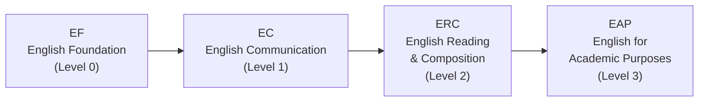
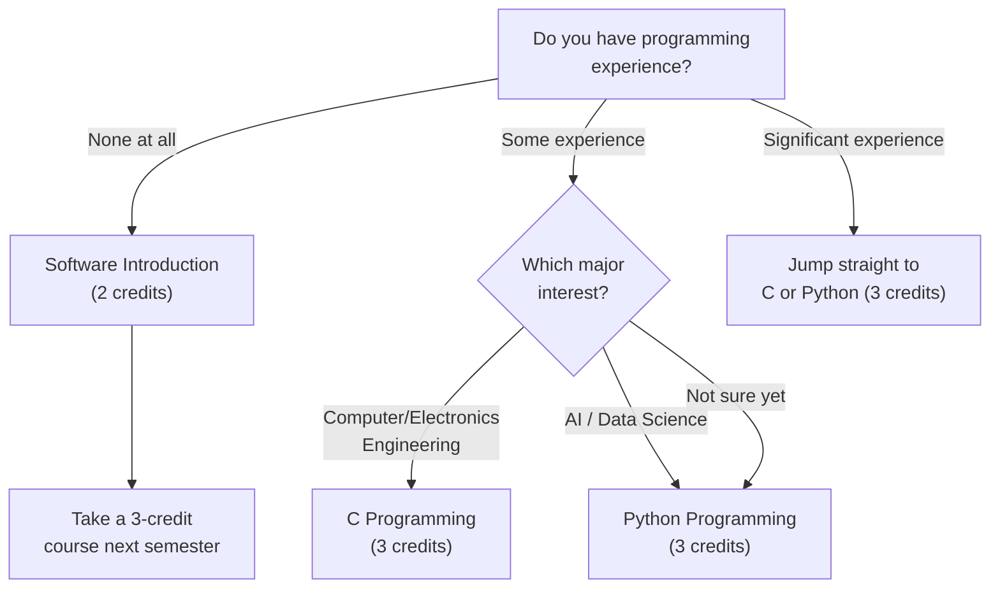

# 选课设计技巧与课程指南

选对课程只是挑战的一半。你如何在课表中安排它们、修多少学分、选哪个方向的课程——这些同样至关重要。即使课程选择很出色，如果设计不当也会导致一个痛苦的学期。

---

## 英语课程路径（EPT）

在 HanST 新生说明会期间，所有新生需参加 **EPT (English Placement Test)**。你的成绩决定你进入英语课程序列的级别。



如果你在 EPT 中达到较高级别，可以跳过较低级别。如果你拥有 TOEFL、IELTS 或 TOEIC 等标准化考试的合格分数，也可能免修某些级别。

**不要拖延英语课程。** 近几个学期，教授们对容量限制执行得越来越严格。那些想着"我下学期再选"的学生往往发现所有名额已满。请**在第一学期立即选修你被分配的英语级别**。名额很快就会满，等待没有任何好处。

---

## 韩语要求

此要求适用于**持外国护照的学生**以及**长期居住海外、可能在韩语授课中遇到困难的韩国籍学生**。你必须完成实用韩语课程序列。在新生说明会期间，你将参加韩语分级测试，该测试决定你的起始级别。

**一个至关重要的建议：** 不要在分级测试中猜题以试图进入更高级别。原因如下：

- 如果你从 **Korean 1**（最低级别）开始，你可以轻松获得稳定的学分，同时打下坚实的基础。课业量可控，你也能建立信心。
- 如果你猜题进入了 **Korean 3**，你现在必须用其他课程来填补 Korean 1 和 Korean 2 本应提供的学分。而且你还要面对可能超出你实际能力的更难的韩语课程。

**请如实作答。** 从较低级别开始并逐步提高，从长远来看比在超出实际水平的课程中挣扎要有利得多。这不是关于面子——而是关于策略。

---

## 选课设计技巧

### 超额选课策略：多选少退

你最多可以注册 **22学分**（超额选课）。黄金法则是：**多选课程、在第一周后退课，永远比少选课程、之后再加课要好。** 热门课程在调整期不会有空位。如果你一开始选得少、之后想加入竞争激烈的课程，你几乎肯定会失败。

### 学分目标

- **毕业要求**：8个学期修满130学分 = 每学期约16.25学分
- **建议目标**：每学期17-18学分，为你留出充足的余地
- **奖学金学生**：你必须保持最低 **15.5学分**。在调整期退课时要特别小心，不要低于此门槛。

### 如何解读课程代码

韩东课程代码的**第一位数字**表示建议的年级：

- **1**xxx：大一课程（你应该选修的）
- **2**xxx：大二课程
- **3**xxx：大三课程
- **4**xxx：大四课程

作为新生，**专注于1xxx课程**。代码为3xxx或4xxx的课程通常有先修要求，即使系统允许你注册，内容也会远超你的准备水平。在没有基础的情况下尝试高年级课程不是勇敢——而是鲁莽。

### 保留午休时间

第4节课（12:00-13:00）和第5节课（13:00-14:00）横跨午餐时间。如果你在这个时段安排课程，你会跳过午餐。偶尔一两次可以忍受，但每天这样会摧毁你的精力和注意力。**不要连续排超过三节课。** 你需要课间休息来消化所学内容。

### 向学长学姐打听教授信息

同一门课由不同教授讲授可能是完全不同的体验——在作业量、考试难度、评分风格和教学方法上都不同。课程目录不会告诉你这些。**问问你的섬김이（学生导师）和学长学姐**："有人上过这门课吗？感觉怎么样？"这是你最有价值的信息来源。

### 检查每个分班的授课语言

这一点对国际学生怎么强调都不过分。**同一位教授可能在一个分班用韩语授课，在另一个分班用英语授课。** 在注册前务必核实每个具体分班的"English %"栏。国际学生误选韩语授课分班——或韩国学生误选英语分班——每个学期都会发生。

---

## ICT 要求（所有学生7学分）

每位韩东学生，无论专业如何，都必须完成 **7学分的 ICT 融合课程**：5学分编程 + 2学分应用。这不是可选的，人文社科学生同样适用。

### 推荐给国际学生的英文授课 ICT 课程

| Course | Code | Credits | Section | Professor | Time | English % |
|--------|------|---------|---------|-----------|------|-----------|
| **Python Programming** | GCS10004 | 3 | **05** | 박지현 | Mon 5, Thu 5 | **100%** |
| **Frontend Introduction** | GCS10081 | 3 | **04** | 박지현 | Tue 6, Fri 6 | **100%** |

**小贴士：** OIA（Office of International Admissions）有时会在编程课程中专门为国际新生预留名额。如果你是国际学生，请向 OIA 咨询——这可能让你免于一场选课大战。

### 选择你的路径：C、Python还是软件概论？



如果你没有编程基础且感到紧张，Software Introduction (GCS10001, 2学分) 是一个温和的起点。但是，如果你认真考虑任何理工科专业，请挑战自己直接选 Python 或 C——这可以为你节省整整一个学期。

---

## 按兴趣推荐的课程

### 理工科方向

如果你正在考虑工程、计算机科学、AI、自然科学或数学，以下基础课程是你应该优先选择的。为国际学生标注了英文授课分班。

#### Calculus 1 (GEK10095) — 3学分

微积分是理工科的通用语言。没有它，你无法学习 Calculus 2、微分方程或任何工程核心课程。可以把它想象成科学思维的字母表——没有它，你在工程和科学的语言中连一个句子都读不了。

| Section | Professor | Time | English % | Note |
|---------|-----------|------|-----------|------|
| 01 | 이한진 | Mon 4, Thu 4 | 0% | Korean |
| 02 | 이한진 | Mon 6, Thu 6 | 0% | Korean, late time slot |
| **03** | **김민재** | **Mon 4, Thu 4** | **100%** | **English** |
| **04** | **조장환** | **Mon 1, Thu 1** | **100%** | **English, period 1 (early morning)** |

国际学生可选 Section 03（김민재）或 Section 04（조장환）。注意 Section 04 是第1节课（上午9:00）。如果你不是早起型的人，第4节的 Section 03 更容易坚持。

#### Calculus 2 (GEK10096) — 3学分

通常在第二学期选修，但高中微积分基础扎实的学生可以同时选修 Calculus 1 和 2 以加速进度。

| Section | Professor | Time | English % | Note |
|---------|-----------|------|-----------|------|
| **01** | **이한진** | **Mon 2, Thu 2** | **100%** | **English** |
| 02 | 김태희 | Mon 1, Thu 1 | 0% | Period 1 |
| 03 | 김태희 | Mon 2, Thu 2 | 0% | Korean |

#### Linear Algebra (GEK10082) — 3学分

线性代数是 AI 和机器学习的数学核心。向量、矩阵、特征值和线性变换是几乎所有现代 AI 算法的基础模块。如果你计划学习计算机科学、数据科学或工程相关专业，请在第一学期与 Calculus 1 一起选修。

| Section | Professor | Time | English % | Note |
|---------|-----------|------|-----------|------|
| **01** | **조장환** | **Mon 3, Thu 3** | **100%** | **English** |
| **02** | **조장환** | **Mon 5, Thu 5** | **100%** | **English** |
| 03 | 김현수 | Tue 2, Fri 2 | 0% | Korean |
| 04 | 김현수 | Tue 3, Fri 3 | 0% | Korean |

Section 01 和 02 均由조장환教授全英文授课。

#### Physics 1 (GEK10055) — 3学分

电气工程、机械工程及相关领域的必修课。涵盖力学、热力学和基本力。

| Section | Professor | Time | English % | Note |
|---------|-----------|------|-----------|------|
| 01 | 조현지 | Mon 2, Thu 2 | 0% | Korean only |
| 02 | 조현지 | Mon 3, Thu 3 | 0% | Korean only |

**遗憾的是，本学期 Physics 1 没有英文分班。** 需要物理课的国际学生需要具备足够的韩语能力，或者可以考虑推迟到未来学期（如果有英文分班开设的话）。

#### General Chemistry (GEK10058) — 3学分

生命科学、化学及相关领域必修。

| Section | Professor | Time | English % | Note |
|---------|-----------|------|-----------|------|
| 01 | 김민경 | Thu 3, 4 (back-to-back) | 0% | Korean |
| **02** | **유태준** | **Mon 2, Thu 2** | **100%** | **English** |

Section 02 是你的英文选项。

#### General Biology (GEK10057) — 3学分

| Section | Professor | Time | English % | Note |
|---------|-----------|------|-----------|------|
| 01 | 현창기 et al. | Mon 5, Thu 5 | 0% | Korean |
| **02** | **Holzapfel Wilhelm et al.** | **Mon 2, Thu 2** | **100%** | **English** |
| 03 | 현창기 et al. | Mon 6, Thu 6 | 0% | Korean |

**警告：General Biology 竞争**极其**激烈。** 仅有3个分班，高年级学生和重修学生会在新生之前占满名额。许多新生发现在第一学期根本无法选上。**不要把你的整个选课策略都押在这门课上。** 如果你拿不到名额，选 Calculus、Linear Algebra 或编程课代替，第二学期再试。灵活应对比固执坚持要明智得多。

---

### 人文社科方向

如果你正在考虑商科、经济学、法律、国际关系、心理学、传播学或社会福利，以下入门课程将帮助你探索这些领域。英文授课分班已标注。

#### Economics Introduction (MEC10001) — 3学分

| Section | Professor | Time | English % |
|---------|-----------|------|-----------|
| **01** | **김선태** | **Mon 3, Thu 3** | **100%** |
| 02 | 안진원 | Tue 2, Fri 2 | 0% |

#### Business Introduction (MEC10002) — 3学分

| Section | Professor | Time | English % |
|---------|-----------|------|-----------|
| **01** | **이유진** | **Tue 3, Fri 3** | **100%** |
| 02 | 이혜규 | Mon 2, Thu 2 | 0% |
| 03 | 김은석 | Mon 5, Thu 5 | 0% |

#### Psychology Introduction (CSW10003) — 3学分

| Section | Professor | Time | English % |
|---------|-----------|------|-----------|
| 01 | 신성만 | Mon 3, Thu 3 | 0% |
| **02** | **지원근** | **Tue 2, Fri 2** | **100%** |
| 03 | 김윤희 | Mon 4, Thu 4 | 0% |

#### International Relations Introduction (ISE10052) — 3学分

| Section | Professor | Time | English % |
|---------|-----------|------|-----------|
| **01** | **정모니카** | **Tue 2, Fri 2** | **100%** |
| 02 | 김지현 | Tue 4, Fri 4 | 0% |

#### Philosophy Introduction (GEK10030) — 3学分

| Section | Professor | Time | English % |
|---------|-----------|------|-----------|
| **01** | **손화철** | **Mon 5, Thu 5** | **100%** |
| 02 | 김광현 | Thu 6, 7 | 0% |

#### Discussion and Presentation (GCS10013) — 3学分

| Section | Professor | Time | English % |
|---------|-----------|------|-----------|
| **01** | **Shushan Marie Richardson** | **Mon 4, Thu 4** | **100%** |

一门培养英语学术讨论和演讲技能的优秀课程。Richardson教授以积极引导学生参与式学习而著称。

#### Eastern History and Culture (GEK10087) — 3学分

| Section | Professor | Time | English % |
|---------|-----------|------|-----------|
| **01** | **신승엽** | **Mon 3, Thu 3** | **100%** |

#### Globalization and Korean Pop Culture (GEK10104) — 3学分

| Section | Professor | Time | English % |
|---------|-----------|------|-----------|
| **01** | **김창욱** | **Tue 2, Fri 2** | **100%** |

对韩流——K-pop、韩剧、韩国电影和韩流现象的学术探索。全英文授课——对于有兴趣研究文化的国际学生来说，既容易接触又引人入胜。

---

### GCS (Global Convergence Studies)

GCS 允许你**设计自己的专业**，将不同学院的课程组合在一起。例如，你可以通过组合 International Relations + Economics + Data Analysis 课程来创建"全球政策分析"定制专业。

要进入 GCS，你必须先修 **"Vision, Work, and Calling"**（비전, 일, 소명）。这门课是 GCS 项目的先修课程。

**为什么 GCS 非常适合国际学生：** 你可以自由组合任何学院的英文授课课程，不受单一学院语言限制的约束。如果没有现有的学院完全符合你的兴趣，GCS 给你自由去构建你真正想要的。

---

## 推荐课表（国际学生）

以下是完全基于 **100% 英文分班**构建的示例课表。这些仅供参考——请根据你的 EPT 成绩、兴趣和精力水平进行调整。记住黄金法则：注册比你需要的更多课程，在第一周后退课。

### Schedule A: 人文社科方向（全英文）

```
Period | Mon            | Tue              | Wed        | Thu            | Fri
-------|----------------|------------------|------------|----------------|------------------
  1    |                | Bible (07)       |            |                | Bible (07)
  2    |                | Intl Relations   | CharEd*    |                | Intl Relations
  3    |                | Psychology       |            |                | Psychology
  4    | D&P            |                  | Chapel     | D&P            |
  5    | Python (05)    | Python (05)      | Chapel     | Python (05)    |
  6    |                |                  | Chapel     |                |
```

> **⚠️ CharEd 冲突：** Character Education Sec 01 (Mon 5, English) 与 Python Sec 05 (Mon 5) 冲突。**解决方案：** 改选 CharEd Sec 02-06 (Wed 2, Korean)，或将 Python 换到非 Mon 5 的分班。

| Course | Code | Credits | Professor | Note |
|--------|------|---------|-----------|------|
| Understanding the Bible (07) | GEK20058 | 2 | Joshua Kim | Tue 1, Fri 1, 100% English |
| International Relations Intro (01) | ISE10052 | 3 | 정모니카 | Tue 2, Fri 2, 100% English |
| Psychology Intro (02) | CSW10003 | 3 | 지원근 | Tue 3, Fri 3, 100% English |
| Discussion & Presentation (01) | GCS10013 | 3 | Richardson | Mon 4, Thu 4, 100% English |
| Character Education (02-06) | GEK10015 | 1 | Various | **Wed 2, Korean** (Sec 01 Mon 5 conflicts with Python) |
| Python Programming (05) | GCS10004 | 3 | 박지현 | Mon 5, Thu 5, 100% English |
| Chapel 1 | GEK10001 | 0 | — | Wed 4, 5, 6 |
| Community Leadership Training 1 | GEK10008 | 0.5 | TBA | Time TBA |
| Social Service 1 | GEK10046 | 1 | — | Separate schedule |
| + Korean Language Course | — | 3 | TBA | Required for international students |
| **Total** | | **19.5 + Korean (3)** | | |

**为什么这个课表有效：** 周二和周五承担主要的学习压力，连续三门英文课程（Bible、International Relations、Psychology），而周一和周四较轻，只有下午的课程。周三留给 Chapel 和自主学习。你同时探索两个完全不同的领域（国际关系和心理学），同时培养编程技能和英语学术演讲能力。

**CharEd 冲突已在上方解决：** Character Education Sec 01 (Mon 5) 与 Python Sec 05 (Mon 5) 冲突。本课表使用 CharEd Sec 02-06 (Wed 2, Korean) 来避免重叠。如果你的韩语水平不够，可以将 Python 换到非 Mon 5 的分班。

### Schedule B: 理工科方向（全英文）

```
Period | Mon              | Tue              | Wed        | Thu              | Fri
-------|------------------|------------------|------------|------------------|------------------
  1    |                  | Bible (07)       |            |                  | Bible (07)
  2    |                  | Worldview (02)   |            |                  | Worldview (02)
  3    | Linear Alg (01)  |                  |            | Linear Alg (01)  |
  4    | Calculus 1 (03)  |                  | Chapel     | Calculus 1 (03)  |
  5    | Python (05)      | Python (05)      | Chapel     | Python (05)      |
  6    |                  |                  | Chapel     |                  |
```

> **⚠️ CharEd 冲突：** Character Education Sec 01 (Mon 5, English) 与 Python Sec 05 (Mon 5) 冲突。**解决方案：** 改선 CharEd Sec 02-06 (Wed 2, Korean)，或将 Python 换到非 Mon 5 的分班。

| Course | Code | Credits | Professor | Note |
|--------|------|---------|-----------|------|
| Understanding the Bible (07) | GEK20058 | 2 | Joshua Kim | Tue 1, Fri 1, 100% English |
| Christian Worldview (02) | GEK20011 | 2 | 최용준 | Tue 2, Fri 2, 100% English |
| Linear Algebra (01) | GEK10082 | 3 | 조장환 | Mon 3, Thu 3, 100% English |
| Calculus 1 (03) | GEK10095 | 3 | 김민재 | Mon 4, Thu 4, 100% English |
| Character Education (02-06) | GEK10015 | 1 | Various | **Wed 2, Korean** (Sec 01 Mon 5 conflicts with Python) |
| Python Programming (05) | GCS10004 | 3 | 박지현 | Mon 5, Thu 5, 100% English |
| Chapel 1 | GEK10001 | 0 | — | Wed 4, 5, 6 |
| Community Leadership Training 1 | GEK10008 | 0.5 | TBA | Time TBA |
| Social Service 1 | GEK10046 | 1 | — | Separate schedule |
| + Korean Language Course | — | 3 | TBA | Required for international students |
| **Total** | | **18.5 + Korean (3)** | | |

**为什么这个课表有效：** 同时学习 Calculus 1 和 Linear Algebra 能产生强大的协同效应——Linear Algebra 中的向量和矩阵概念直接联系到 Calculus 中的多元变量概念。Python 提供编程基础。周二和周五课程较轻（仅有 Bible + Worldview），给你时间做数学习题。

**CharEd 冲突已在上方解决：** Character Education Sec 01 (Mon 5) 与 Python Sec 05 (Mon 5) 冲突。本课表使用 CharEd Sec 02-06 (Wed 2, Korean) 来避免重叠。如果你的韩语水平不够，可以将 Python 换到非 Mon 5 的分班。

---

*Last updated: 2026-02-21*
