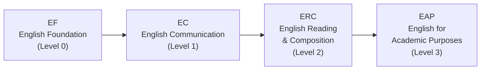
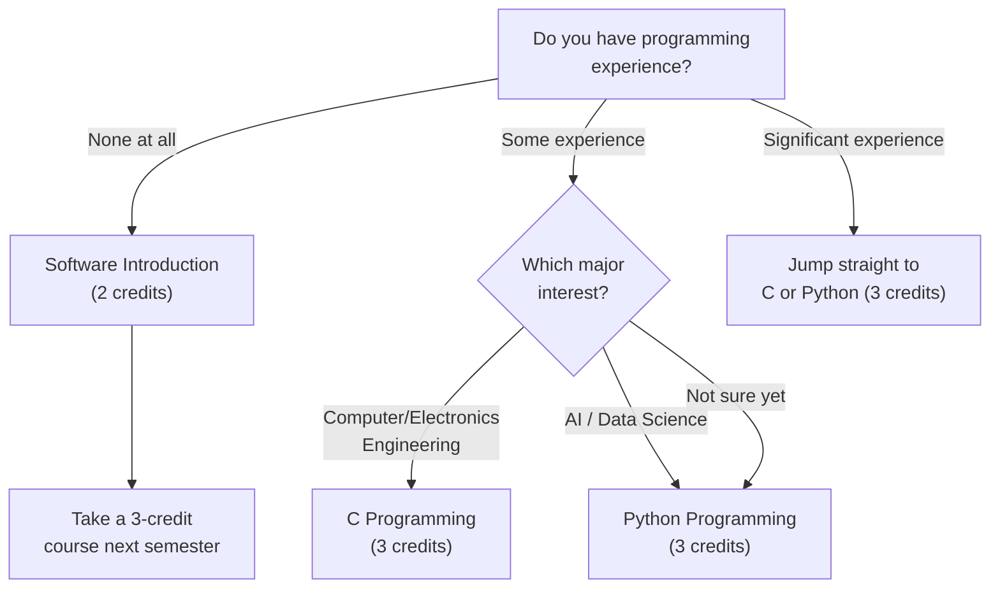

# 选课设计技巧与课程指南

选对课程只是第一步。怎么在课表里排好这些课、修多少学分、往哪个方向探索——同样至关重要。即使课程选得再好，如果安排不合理，也可能让你度过一个很痛苦的学期呀。

---

## 英语课程路径（EPT）

在 HanST 新生说明会期间，所有新生都要参加 **EPT (English Placement Test)**。你的成绩决定你从哪个级别开始修英语课。

如果你 EPT 成绩较高，可以跳过低级别直接进入更高级别。如果你有 TOEFL、IELTS 或 TOEIC 等标准化考试的合格分数，也可能免修某些级别。

**不要拖延英语课。** 近几个学期，教授们对人数上限的执行越来越严格。那些想着"下学期再选"的学生往往会发现所有名额已经满了。请**第一学期就选你被分配的英语级别**。名额很快会占满，等待只会让情况更糟啦。

---

## 韩语要求

这项要求适用于**持外国护照的学生**，以及**长期在海外生活、可能在韩语授课课程中遇到困难的韩国籍学生**。你需要完成实用韩语系列课程。新生说明会期间会有韩语分级测试，测试结果决定你的起始级别。

**一个非常重要的建议：** 不要在分级测试中故意猜题，试图进入更高级别。原因如下：

- 如果你从 **Korean 1**（最低级别）开始，可以轻松拿到稳定的学分，同时打下扎实的基础。课业量可控，你也能建立信心。
- 如果你猜题进了 **Korean 3**，你就得用其他课程来补 Korean 1 和 Korean 2 本应提供的学分——而且还要应对超出自己实际水平的韩语课程。

**如实作答。** 从真实水平开始稳步提升，从长远来看远比在超出能力范围的课上挣扎要划算嘛。这不是面子问题——是策略问题。

---

## 选课设计技巧

### 超额选课策略：多选少退

你最多可以注册 **22学分**（超额选课）。黄金法则是：**多报课、第一周之后再退，永远比少报课、之后再加要好。** 热门课程在调整期根本不会有空位。如果你一开始选得少、后来想加竞争激烈的课，几乎是不可能的呀。

### 学分目标

- **毕业要求**：8个学期修满130学分，即每学期约16.25学分
- **建议目标**：每学期17-18学分，留出足够的调整余地
- **奖学金学生**：你必须维持最低 **15.5学分**。在调整期退课时要特别小心，别掉到这条线以下哦。

### 如何看懂课程代码

Handong 课程代码的**第一位数字**代表建议年级：

- **1**xxx：大一课程（你现在应该选的）
- **2**xxx：大二课程
- **3**xxx：大三课程
- **4**xxx：大四课程

作为新生，**以选1xxx课程为主**。代码为3xxx或4xxx的课程通常有先修要求，即使系统允许你注册，内容也会远超你的准备水平。在没有基础的情况下硬上高年级课程不是勇敢——是莽撞。

### 留出午休时间

第4节课（12:00-13:00）和第5节课（13:00-14:00）横跨午饭时间。如果你把这个时段排满了课，基本就没时间吃饭了。偶尔一两次可以忍，但天天这样会严重消耗你的精力和注意力。**不要把超过三节课连排在一起。** 你需要课间休息来消化所学的内容嘛。

### 向学长学姐打听教授的情况

同一门课由不同教授来教，体验可能天差地别——作业量、考试难度、评分风格、教学方式都不一样，但这些信息在 course catalog 里是看不到的。**问问你的섬김이（学长导师）和学长学姐**："有人上过这门课吗？感觉怎么样？"这是你能得到的最有价值的信息来源啦。

### 务必确认每个分班的授课语言

这一点对国际学生来说怎么强调都不为过。**同一位教授可能在一个分班用韩语授课，在另一个分班用英语授课。** 注册前一定要核实每个具体分班的"English %"栏。国际学生误选韩语分班——或者韩国学生误选英语分班——每学期都会发生呀。

---

## ICT 要求（所有学生7学分）

Handong 每位学生，无论专业，都必须完成 **7学分的 ICT 融合课程**：5学分编程 + 2学分应用ICT。这不是可选项，人文社科学生同样适用哦。

### 推荐给国际学生的英文授课 ICT 课程

| Course | Code | Credits | Section | Professor | Time | English % |
|--------|------|---------|---------|-----------|------|-----------|
| **Python Programming** | GCS10004 | 3 | **05** | 박지현 | Mon 5, Thu 5 | **100%** |
| **Frontend Introduction** | GCS10081 | 3 | **04** | 박지현 | Tue 6, Fri 6 | **100%** |

**小提示：** OIA（Office of International Admissions）有时会在编程课程中专门为国际新生预留名额。如果你是国际学生，可以先问问 OIA——这可能帮你省去一场选课大战呢。

### 选择你的路径：C、Python 还是软件概论？

如果你没有任何编程基础、感到有些紧张，Software Introduction（GCS10001，2学分）是个温和的起点。但如果你认真考虑任何理工科专业，建议直接挑战 Python 或 C——这能给你节省整整一个学期的时间，加油！

---

## 按兴趣推荐的课程

### 理工科方向

如果你在考虑工程、计算机科学、AI、自然科学或数学，以下基础课程应该优先选修。英文授课分班已为国际学生标注。

#### Calculus 1 (GEK10095) — 3学分

Calculus 是理工科的通用语言。没有它，你没法学 Calculus 2、Differential Equations，也没法进入任何工程核心课程。可以把它理解成科学思维的字母表——没有字母表，你连工程和科学的语言都读不了嘛。

| Section | Professor | Time | English % | Note |
|---------|-----------|------|-----------|------|
| 01 | 이한진 | Mon 4, Thu 4 | 0% | Korean |
| 02 | 이한진 | Mon 6, Thu 6 | 0% | Korean, late time slot |
| **03** | **김민재** | **Mon 4, Thu 4** | **100%** | **English** |
| **04** | **조장환** | **Mon 1, Thu 1** | **100%** | **English, period 1 (early morning)** |

国际学生可选 Section 03（김민재）或 Section 04（조장환）。注意 Section 04 是第1节课（上午9:00）。如果你不是早起型，第4节的 Section 03 更容易坚持出勤啦。

#### Calculus 2 (GEK10096) — 3学分

通常在第二学期修，但高中 Calculus 基础扎实的学生可以考虑第一学期同时选 Calculus 1 和 2，提前推进进度。

| Section | Professor | Time | English % | Note |
|---------|-----------|------|-----------|------|
| **01** | **이한진** | **Mon 2, Thu 2** | **100%** | **English** |
| 02 | 김태희 | Mon 1, Thu 1 | 0% | Period 1 |
| 03 | 김태희 | Mon 2, Thu 2 | 0% | Korean |

#### Linear Algebra (GEK10082) — 3学分

Linear Algebra 是 AI 和机器学习的数学核心。向量、矩阵、特征值和线性变换是几乎所有现代 AI 算法的基础构件。如果你打算学计算机科学、数据科学或工程类专业，建议第一学期和 Calculus 1 一起修呀。

| Section | Professor | Time | English % | Note |
|---------|-----------|------|-----------|------|
| **01** | **조장환** | **Mon 3, Thu 3** | **100%** | **English** |
| **02** | **조장환** | **Mon 5, Thu 5** | **100%** | **English** |
| 03 | 김현수 | Tue 2, Fri 2 | 0% | Korean |
| 04 | 김현수 | Tue 3, Fri 3 | 0% | Korean |

Section 01 和 02 均由조장환教授全英文授课。

#### Physics 1 (GEK10055) — 3学分

电气工程、机械工程及相关领域的必修课，涵盖力学、热力学和基本力。

| Section | Professor | Time | English % | Note |
|---------|-----------|------|-----------|------|
| 01 | 조현지 | Mon 2, Thu 2 | 0% | Korean only |
| 02 | 조현지 | Mon 3, Thu 3 | 0% | Korean only |

**很遗憾，本学期 Physics 1 没有英文分班。** 需要 Physics 课的国际学生需要有足够的韩语能力，或者可以考虑推迟到之后的学期（如果届时有英文分班的话）。

#### General Chemistry (GEK10058) — 3学分

生命科学、化学及相关领域必修。

| Section | Professor | Time | English % | Note |
|---------|-----------|------|-----------|------|
| 01 | 김민경 | Thu 3, 4 (back-to-back) | 0% | Korean |
| **02** | **유태준** | **Mon 2, Thu 2** | **100%** | **English** |

Section 02 是英文选项。

#### General Biology (GEK10057) — 3学分

| Section | Professor | Time | English % | Note |
|---------|-----------|------|-----------|------|
| 01 | 현창기 et al. | Mon 5, Thu 5 | 0% | Korean |
| **02** | **Holzapfel Wilhelm et al.** | **Mon 2, Thu 2** | **100%** | **English** |
| 03 | 현창기 et al. | Mon 6, Thu 6 | 0% | Korean |

**警告：General Biology 的竞争极其激烈。** 只有3个分班，高年级学生和重修学生会在新生之前把名额占满。很多新生第一学期根本抢不到。**不要把整个选课计划都押在这门课上。** 如果抢不到，先选 Calculus、Linear Algebra 或编程课，第二学期再来试。灵活比固执明智得多嘛。

---

### 人文社科方向

如果你在考虑商科、经济学、法律、国际关系、心理学、传播学或社会福利，以下入门课程可以帮你探索这些领域。英文授课分班已标注。

#### Economics Introduction (MEC10001) — 3学分

| Section | Professor | Time | English % |
|---------|-----------|------|-----------|
| **01** | **김선태** | **Mon 3, Thu 3** | **100%** |
| 02 | 안진원 | Tue 2, Fri 2 | 0% |

#### Business Introduction (MEC10002) — 3学分

| Section | Professor | Time | English % |
|---------|-----------|------|-----------|
| **01** | **이유진** | **Tue 3, Fri 3** | **100%** |
| 02 | 이혜규 | Mon 2, Thu 2 | 0% |
| 03 | 김은석 | Mon 5, Thu 5 | 0% |

#### Psychology Introduction (CSW10003) — 3学分

| Section | Professor | Time | English % |
|---------|-----------|------|-----------|
| 01 | 신성만 | Mon 3, Thu 3 | 0% |
| **02** | **지원근** | **Tue 2, Fri 2** | **100%** |
| 03 | 김윤희 | Mon 4, Thu 4 | 0% |

#### International Relations Introduction (ISE10052) — 3学分

| Section | Professor | Time | English % |
|---------|-----------|------|-----------|
| **01** | **정모니카** | **Tue 2, Fri 2** | **100%** |
| 02 | 김지현 | Tue 4, Fri 4 | 0% |

#### Philosophy Introduction (GEK10030) — 3学分

| Section | Professor | Time | English % |
|---------|-----------|------|-----------|
| **01** | **손화철** | **Mon 5, Thu 5** | **100%** |
| 02 | 김광현 | Thu 6, 7 | 0% |

#### Discussion and Presentation (GCS10013) — 3学分

| Section | Professor | Time | English % |
|---------|-----------|------|-----------|
| **01** | **Shushan Marie Richardson** | **Mon 4, Thu 4** | **100%** |

这门课专门培养英语学术讨论和演讲能力。Richardson 教授以积极引导学生参与而著称，课堂互动性很强，非常推荐呀。

#### Eastern History and Culture (GEK10087) — 3学分

| Section | Professor | Time | English % |
|---------|-----------|------|-----------|
| **01** | **신승엽** | **Mon 3, Thu 3** | **100%** |

#### Globalization and Korean Pop Culture (GEK10104) — 3学分

| Section | Professor | Time | English % |
|---------|-----------|------|-----------|
| **01** | **김창욱** | **Tue 2, Fri 2** | **100%** |

对韩流——K-pop、韩剧、韩国电影和韩流现象的学术探讨。全英文授课，对有兴趣研究文化的国际学生来说既容易上手又很有意思啦。

---

### GCS (Global Convergence Studies)

GCS 允许你**自己设计专业**，把不同学院的课程组合在一起。比如，你可以把 International Relations + Economics + Data Analysis 组合起来，打造一个"全球政策分析"这样的定制专业。

要进入 GCS，必须先修 **"Vision, Work, and Calling"**（비전, 일, 소명）。这门课是进入 GCS 项目的先修要求。

**为什么 GCS 特别适合国际学生：** 你可以自由组合全校任何学院的英文授课课程，不受某一学院韩语课程比例的限制。如果现有的学院没有完全符合你兴趣的，GCS 给你自由去构建你真正想要的方向哦。

---

## 推荐课表（国际学生）

以下是完全基于 **100% 英文分班**构建的示例课表，仅供参考——请根据你的 EPT 成绩、兴趣方向和精力状态来调整。记住黄金法则：多报课，第一周之后再退，不要一开始就报得很少呀。

### Schedule A: 人文社科方向（全英文）

| Period | Mon | Tue | Wed | Thu | Fri |
|--------|-----|-----|-----|-----|-----|
| 1 | | Bible (07) | | | Bible (07) |
| 2 | | Intl Relations | CharEd* | | Intl Relations |
| 3 | | Psychology | | | Psychology |
| 4 | D&P | | Chapel | D&P | |
| 5 | Python (05) | Python (05) | Chapel | Python (05) | |
| 6 | | | Chapel | | |

> **⚠️ CharEd 冲突：** Character Education Sec 01（Mon 5，英文）与 Python Sec 05（Mon 5）时间重叠。**解决方案：** 改选 CharEd Sec 02-06（Wed 2，韩语），或把 Python 换到不在 Mon 5 的分班。

| Course | Code | Credits | Professor | Note |
|--------|------|---------|-----------|------|
| Understanding the Bible (07) | GEK20058 | 2 | Joshua Kim | Tue 1, Fri 1, 100% English |
| International Relations Intro (01) | ISE10052 | 3 | 정모니카 | Tue 2, Fri 2, 100% English |
| Psychology Intro (02) | CSW10003 | 3 | 지원근 | Tue 3, Fri 3, 100% English |
| Discussion & Presentation (01) | GCS10013 | 3 | Richardson | Mon 4, Thu 4, 100% English |
| Character Education (02-06) | GEK10015 | 1 | Various | **Wed 2, Korean** (Sec 01 Mon 5 与 Python 冲突) |
| Python Programming (05) | GCS10004 | 3 | 박지현 | Mon 5, Thu 5, 100% English |
| Chapel 1 | GEK10001 | 0 | — | Wed 4, 5, 6 |
| Community Leadership Training 1 | GEK10008 | 0.5 | TBA | Time TBA |
| Social Service 1 | GEK10046 | 1 | — | Separate schedule |
| + Korean Language Course | — | 3 | TBA | Required for international students |
| **Total** | | **19.5 + Korean (3)** | | |

**这个课表为什么合理：** 周二和周五承载主要学习压力，连续三门英文课（Bible、International Relations、Psychology），周一和周四只有下午的课，负担较轻。周三留给 Chapel 和自习。你同时探索两个完全不同的领域（国际关系和心理学），同时培养编程技能和英语学术演讲能力，非常充实呀。

**CharEd 冲突的解决方式：** Character Education Sec 01（Mon 5）与 Python Sec 05（Mon 5）重叠。本课表用 CharEd Sec 02-06（Wed 2，韩语）来避免冲突。如果你的韩语还不够用，可以把 Python 换到不在 Mon 5 的分班。

### Schedule B: 理工科方向（全英文）

| Period | Mon | Tue | Wed | Thu | Fri |
|--------|-----|-----|-----|-----|-----|
| 1 | | Bible (07) | | | Bible (07) |
| 2 | | Worldview (02) | | | Worldview (02) |
| 3 | Linear Alg (01) | | | Linear Alg (01) | |
| 4 | Calculus 1 (03) | | Chapel | Calculus 1 (03) | |
| 5 | Python (05) | Python (05) | Chapel | Python (05) | |
| 6 | | | Chapel | | |

> **⚠️ CharEd 冲突：** Character Education Sec 01（Mon 5，英文）与 Python Sec 05（Mon 5）时间重叠。**解决方案：** 改选 CharEd Sec 02-06（Wed 2，韩语），或把 Python 换到不在 Mon 5 的分班。

| Course | Code | Credits | Professor | Note |
|--------|------|---------|-----------|------|
| Understanding the Bible (07) | GEK20058 | 2 | Joshua Kim | Tue 1, Fri 1, 100% English |
| Christian Worldview (02) | GEK20011 | 2 | 최용준 | Tue 2, Fri 2, 100% English |
| Linear Algebra (01) | GEK10082 | 3 | 조장환 | Mon 3, Thu 3, 100% English |
| Calculus 1 (03) | GEK10095 | 3 | 김민재 | Mon 4, Thu 4, 100% English |
| Character Education (02-06) | GEK10015 | 1 | Various | **Wed 2, Korean** (Sec 01 Mon 5 与 Python 冲突) |
| Python Programming (05) | GCS10004 | 3 | 박지현 | Mon 5, Thu 5, 100% English |
| Chapel 1 | GEK10001 | 0 | — | Wed 4, 5, 6 |
| Community Leadership Training 1 | GEK10008 | 0.5 | TBA | Time TBA |
| Social Service 1 | GEK10046 | 1 | — | Separate schedule |
| + Korean Language Course | — | 3 | TBA | Required for international students |
| **Total** | | **18.5 + Korean (3)** | | |

**这个课表为什么合理：** 同时修 Calculus 1 和 Linear Algebra 会产生很强的协同效应——Linear Algebra 里的向量和矩阵概念直接联系到 Calculus 中的多元函数。Python 打下编程基础。周二和周五课程较轻（只有 Bible 和 Worldview），给你充足时间做数学练习题呢。

**CharEd 冲突的解决方式：** 同上，本课表用 CharEd Sec 02-06（Wed 2，韩语）来避免与 Python 重叠。如果韩语不够用，把 Python 换到不在 Mon 5 的分班即可。

---

> ⚠️ This guide was translated by **Claude Opus 4.6**. Translations other than Korean and English may contain inaccuracies. If something seems off, please refer to the [English](/en) or [한국어](/ko) version.

*Last updated: 2026-02-21*
